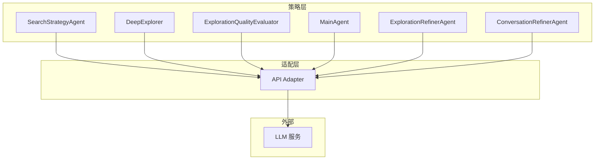
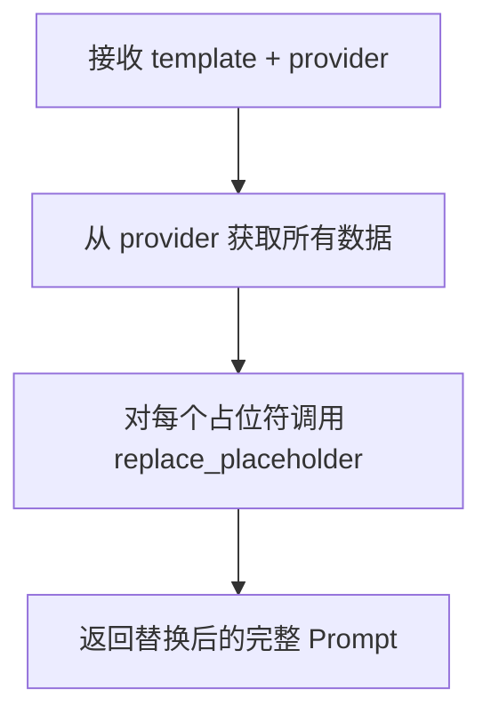
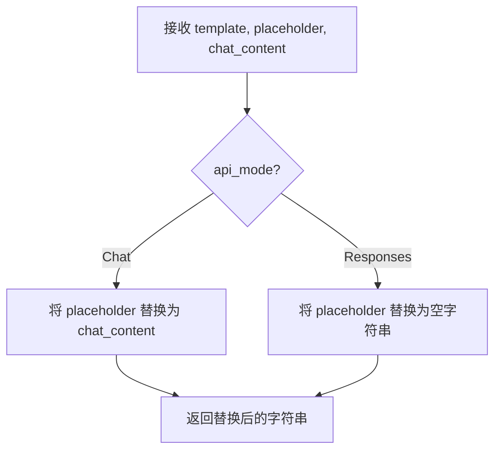

# Explore AI Agent - API Adapter 详细设计文档 v1.1

| 属性     | 值                                                                 |
| :------- | :----------------------------------------------------------------- |
| 文档版本 | v1.1                                                               |
| 创建日期 | 2026-04-27                                                         |
| 修订日期 | 2026-04-27                                                         |
| 涉及模块 | adapter/api_adapter                                                 |
| 技术栈   | Rust + async-trait                                                  |
| 关联文档 | [Explore AI Agent 架构设计文档 v1.1](Explore%20AI%20Agent架构设计文档v1.1.md) |

---

## 目录

- [1. 总体设计](#1-总体设计)
  - [1.1 模块定位](#11-模块定位)
  - [1.2 核心原则](#12-核心原则)
  - [1.3 架构位置](#13-架构位置)
- [2. 数据结构](#2-数据结构)
  - [2.1 ApiMode](#21-apimode)
  - [2.2 UnifiedResponse](#22-unifiedresponse)
  - [2.3 ToolCallInfo](#23-toolcallinfo)
  - [2.4 ToolDefinition](#24-tooldefinition)
  - [2.5 DataProvider Trait](#25-dataprovider-trait)
  - [2.6 类型别名](#26-类型别名)
- [3. ApiAdapter 方法详细设计](#3-apiadapter-方法详细设计)
  - [3.1 构造与配置](#31-构造与配置)
  - [3.2 assemble_prompt — Prompt 组装](#32-assemble_prompt--prompt-组装)
  - [3.3 replace_placeholder — 占位符替换](#33-replace_placeholder--占位符替换)
  - [3.4 parse_response — 响应解析](#34-parse_response--响应解析)
  - [3.5 build_tool_result_message — 工具结果消息构建](#35-build_tool_result_message--工具结果消息构建)
  - [3.6 build_structured_output_constraint — 结构化输出约束](#36-build_structured_output_constraint--结构化输出约束)
  - [3.7 build_retry_prompt — 重试提示构建](#37-build_retry_prompt--重试提示构建)
  - [3.8 call_llm_with_retry — 带重试的 LLM 调用](#38-call_llm_with_retry--带重试的-llm-调用)
- [4. 格式校验与重试机制](#4-格式校验与重试机制)
  - [4.1 触发条件](#41-触发条件)
  - [4.2 正则兜底匹配](#42-正则兜底匹配)
  - [4.3 重试流程](#43-重试流程)
- [5. 常量定义](#5-常量定义)
- [6. 自动化测试用例](#6-自动化测试用例)
- [7. 附录](#7-附录)

---

## 1. 总体设计

### 1.1 模块定位

API Adapter 是系统与外部 LLM 服务之间的**协议翻译层**。它不参与任何业务决策，仅负责：

1. 根据 `api_mode` 将内部 Prompt 模板中的占位符替换为具体内容，组装成 LLM 请求
2. 将 LLM 返回的原始响应解析为内部统一的 `UnifiedResponse` 结构
3. 将工具执行结果构建为对应 API 模式要求的消息格式
4. 构建结构化输出约束（JSON Schema），适配不同 API 的参数位置
5. 在响应格式异常时自动重试，最多 3 次

### 1.2 核心原则

| 原则 | 说明 |
|:---|:---|
| **协议透明** | 上层 Agent 不感知 Chat API 与 Responses API 的协议差异 |
| **纯文本替换** | Prompt 组装是纯字符串操作，不关心业务语义 |
| **容错不中断** | 解析失败时重试 3 次，耗尽后记录日志继续执行，不阻断流程 |
| **模式驱动** | 所有差异行为由 `api_mode` 字段统一控制 |

### 1.3 架构位置



所有需要调用 LLM 的 Agent 均通过 API Adapter 发起请求，不直接与 LLM 交互。

---

## 2. 数据结构

### 2.1 ApiMode

```rust
#[derive(Debug, Clone, PartialEq, Eq)]
pub enum ApiMode {
    Chat,
    Responses,
}
```

| 变体 | 说明 | 默认 |
|:---|:---|:---|
| `Chat` | OpenAI Chat Completions API | 是（`Default::default()`） |
| `Responses` | OpenAI Responses API | 否 |

### 2.2 UnifiedResponse

```rust
#[derive(Debug, Clone)]
pub struct UnifiedResponse {
    pub text: Option<String>,
    pub tool_calls: Vec<ToolCallInfo>,
}
```

| 字段 | 类型 | 说明 |
|:---|:---|:---|
| text | Option\<String> | LLM 返回的纯文本内容，无文本时为 None |
| tool_calls | Vec\<ToolCallInfo> | 工具调用列表，无工具调用时为空 |

**设计意图**：无论 Chat API 还是 Responses API，LLM 返回的响应均被归一化为此结构。上层 Agent 只需处理 `UnifiedResponse`，无需感知底层 API 协议。

### 2.3 ToolCallInfo

```rust
#[derive(Debug, Clone)]
pub struct ToolCallInfo {
    pub name: String,
    pub arguments: serde_json::Value,
}
```

| 字段 | 类型 | 说明 |
|:---|:---|:---|
| name | String | 工具名称，如 `"search_content"` |
| arguments | serde_json::Value | 工具参数，JSON 对象 |

### 2.4 ToolDefinition

```rust
#[derive(Debug, Clone, Serialize, Deserialize)]
pub struct ToolDefinition {
    pub name: String,
    pub description: String,
    pub parameters: serde_json::Value,
}
```

| 字段 | 类型 | 说明 |
|:---|:---|:---|
| name | String | 工具名称标识符 |
| description | String | 工具功能描述 |
| parameters | serde_json::Value | JSON Schema 格式的参数定义 |

### 2.5 DataProvider Trait

```rust
#[async_trait]
pub trait DataProvider: Send + Sync {
    fn get_question(&self) -> String;
    fn get_exploration_history(&self) -> ExplorationHistoryData;
    fn get_current_summary(&self) -> ExplorationSummary;
    fn get_tools(&self) -> Vec<ToolDefinition>;
    fn get_output_schema(&self) -> Option<OutputSchema>;
    fn get_loop_warning(&self) -> Option<String>;
}
```

| 方法 | 返回类型 | 说明 | 实现方 |
|:---|:---|:---|:---|
| `get_question()` | String | 用户原始问题 | 各 Agent（由调用方传入） |
| `get_exploration_history()` | ExplorationHistoryData | 本模块相关的历史探索记录 | SearchStrategyAgent / DeepExplorer |
| `get_current_summary()` | ExplorationSummary | 当前探索上下文摘要 | Orchestrator |
| `get_tools()` | Vec\<ToolDefinition> | 本模块可用的工具定义列表 | 各 Agent 代码层 |
| `get_output_schema()` | Option\<OutputSchema> | 模块输出的 JSON Schema（仅需结构化输出的模块提供） | ExplorationRefinerAgent / ExplorationQualityEvaluator 等 |
| `get_loop_warning()` | Option\<String> | 防循环警告文本，无警告时返回 None | DeepExplorer 代码层 |

### 2.6 类型别名

```rust
pub type OutputSchema = serde_json::Value;
pub type ExplorationHistoryData = serde_json::Value;
```

---

## 3. ApiAdapter 方法详细设计

### 3.1 构造与配置

```rust
pub fn new(api_mode: ApiMode) -> Self
```

| 参数 | 类型 | 说明 |
|:---|:---|:---|
| api_mode | ApiMode | API 模式，决定所有后续行为的协议差异 |

```rust
pub fn api_mode(&self) -> &ApiMode
```

返回当前 `api_mode` 的只读引用。

### 3.2 assemble_prompt — Prompt 组装

#### 3.2.1 函数签名

```rust
pub fn assemble_prompt(&self, template: &str, provider: &dyn DataProvider) -> String
```

#### 3.2.2 处理流程



#### 3.2.3 占位符替换数据来源

对 template 中的每个占位符，从 `provider` 获取对应数据，调用 `replace_placeholder` 进行替换：

| 占位符 | 数据来源 | replace_placeholder 的 chat_content 参数 |
|:---|:---|:---|
| `{question}` | `provider.get_question()` | `## 用户问题\n{问题原文}` |
| `{exploration_history}` | `provider.get_exploration_history()` | `## 历史探索记录\n{序列化 JSON}` |
| `{current_summary}` | `provider.get_current_summary()` | `## 已有探索线索\n{序列化 JSON}` |
| `{tools}` | `provider.get_tools()` | Chat 模式：`## 可用工具\n` + `format_tools_for_chat_prompt(tools)` 生成的格式说明文本；Responses 模式：空字符串 |
| `{loop_warning}` | `provider.get_loop_warning()` | 若有：`## ⚠️ 系统警告\n{警告文本}`；若无：空字符串 |

#### 3.2.4 替换顺序

占位符按 template 中出现的顺序逐一替换，无依赖关系。每个 `replace_placeholder` 调用独立执行，前一个替换的结果作为下一个替换的输入 template。

#### 3.2.5 format_tools_for_chat_prompt — 工具格式说明生成

当 `api_mode == Chat` 时，`{tools}` 占位符需要替换为包含工具调用格式说明的文本（如架构文档 4.2.2 节中的 `<tool_calls>` 标签示例），而非仅工具名称列表。此转换由适配层的内部方法完成。

```rust
fn format_tools_for_chat_prompt(&self, tools: &[ToolDefinition]) -> String
```

**职责归属说明**：
- `DataProvider::get_tools()` 返回**结构化**的 `Vec<ToolDefinition>`，这是 Agent 层的职责——Agent 知道有哪些工具可用
- `format_tools_for_chat_prompt()` 将结构化定义序列化为**Chat 模式特定的文本格式**，这是适配层的职责——只有适配层知道 Chat/Responses 的格式差异
- Responses 模式下，`Vec<ToolDefinition>` 直接序列化后放入 API 请求的 `tools` 参数，无需经过 `format_tools_for_chat_prompt`

> **后续版本补充**：`format_tools_for_chat_prompt` 的具体实现细节（如每个工具的 `<tool_calls>` 标签格式）在后续版本中与各 Agent 的 Prompt 模板一起确定。

### 3.3 replace_placeholder — 占位符替换

#### 3.3.1 函数签名

```rust
pub fn replace_placeholder(
    &self,
    template: &str,
    placeholder: &str,
    chat_content: &str,
) -> String
```

#### 3.3.2 替换规则



| api_mode | 行为 | 说明 |
|:---|:---|:---|
| `Chat` | `template.replace(placeholder, chat_content)` | Chat API 的 system/user message 中包含完整上下文 |
| `Responses` | `template.replace(placeholder, "")` | Responses API 的上下文通过 API 原生字段（如 `instructions`、`input`）传递，不放在 prompt 文本中 |

### 3.4 parse_response — 响应解析

#### 3.4.1 函数签名

```rust
pub fn parse_response(
    &self,
    raw_response: &serde_json::Value,
) -> Result<UnifiedResponse, String>
```

#### 3.4.2 处理流程

```mermaid
flowchart TD
    A[接收 raw_response JSON] --> B{api_mode?}
    B -- Chat --> C[从 choices[0].message 提取]
    C --> D{message 中是否有 tool_calls?}
    D -- 是 --> E[解析每个 tool_call 的<br/>function.name 和 function.arguments]
    D -- 否 --> F[提取 message.content 作为 text]
    E --> G[组装 UnifiedResponse]
    F --> G
    B -- Responses --> H[遍历 output 数组]
    H --> I{每个 output 条目}
    I -- type == function_call --> J[提取 name + arguments<br/>加入 tool_calls]
    I -- type == message --> K[提取 content[].text<br/>拼接为 text]
    J --> L[组装 UnifiedResponse]
    K --> L
    G --> M[返回 Ok(UnifiedResponse)]
    L --> M
```

#### 3.4.3 Chat API 响应解析

**输入 JSON 结构**：
```json
{
  "choices": [{
    "message": {
      "role": "assistant",
      "content": "文本回复（可选）",
      "tool_calls": [{
        "id": "call_abc",
        "type": "function",
        "function": {
          "name": "search_content",
          "arguments": "{\"pattern\": \"main\"}"
        }
      }]
    }
  }]
}
```

**解析步骤**：
1. 定位 `choices[0].message`
2. 若存在 `tool_calls` 数组：遍历每个元素，提取 `function.name` 作为 `ToolCallInfo.name`，将 `function.arguments`（JSON 字符串）反序列化为 `serde_json::Value` 作为 `ToolCallInfo.arguments`。若反序列化失败（非合法 JSON 字符串），记录警告日志并跳过该 tool_call 条目
3. 若不存在 `tool_calls` 但有 `content`：将 `content` 字符串作为 `UnifiedResponse.text`
4. 若 `content` 为 null 且无 `tool_calls`，text 为 None

#### 3.4.4 Responses API 响应解析

**输入 JSON 结构**：
```json
{
  "output": [
    {
      "type": "function_call",
      "call_id": "call_abc",
      "name": "search_content",
      "arguments": "{\"pattern\": \"main\"}"
    },
    {
      "type": "message",
      "content": [{
        "type": "output_text",
        "text": "文本回复"
      }]
    }
  ]
}
```

**解析步骤**：
1. 遍历 `output` 数组
2. `type == "function_call"` 的条目：提取 `name` 和 `arguments`（JSON 字符串 → `serde_json::Value`），加入 `tool_calls`。若反序列化失败（非合法 JSON 字符串），记录警告日志并跳过该条目
3. `type == "message"` 的条目：遍历 `content` 数组，提取所有 `type == "output_text"` 的 `text` 字段，用换行符拼接为 `text`

### 3.5 build_tool_result_message — 工具结果消息构建

#### 3.5.1 函数签名

```rust
pub fn build_tool_result_message(
    &self,
    tool_call_id: &str,
    content: &str,
) -> serde_json::Value
```

#### 3.5.2 构建规则

| api_mode | 输出 JSON 格式 |
|:---|:---|
| `Chat` | `{"role": "tool", "tool_call_id": "<tool_call_id>", "content": "<content>"}` |
| `Responses` | `{"type": "function_call_output", "call_id": "<tool_call_id>", "output": "<content>"}` |

**字段映射关系**：
- Chat API 使用 `role: "tool"` + `tool_call_id` + `content`
- Responses API 使用 `type: "function_call_output"` + `call_id` + `output`

### 3.6 build_structured_output_constraint — 结构化输出约束

#### 3.6.1 函数签名

```rust
pub fn build_structured_output_constraint(
    &self,
    schema: &serde_json::Value,
) -> serde_json::Value
```

#### 3.6.2 构建规则

**输入 schema 格式**：各 Agent 输出的 JSON Schema 常量为包含三个顶层字段的对象：

```json
{"name": "xxx", "strict": true, "schema": {...}}
```

| 字段 | 类型 | 说明 |
|:---|:---|:---|
| name | string | Schema 名称，如 `"exploration_refiner_response"` |
| strict | bool | 是否启用严格模式 |
| schema | object | 实际的 JSON Schema 定义 |

**构建逻辑**：

| api_mode | 构建逻辑 | API 参数位置 |
|:---|:---|:---|
| `Chat` | `{"type": "json_schema", "json_schema": {"name": schema.name, "strict": schema.strict, "schema": schema.schema}}` | 放入 `response_format` |
| `Responses` | `{"type": "json_schema", "name": schema.name, "strict": schema.strict, "schema": schema.schema}` | 放入 `text.format` |

**处理流程**：

```mermaid
flowchart TD
    A[接收 schema: {name, strict, schema}] --> B{api_mode?}
    B -- Chat --> C[构造 response_format 对象<br/>type=json_schema<br/>json_schema={name, strict, schema}]
    B -- Responses --> D[构造 text.format 对象<br/>type=json_schema<br/>name, strict, schema 平铺]
    C --> E[返回约束对象]
    D --> E
```

**关键要求**：`name`、`strict`、`schema` 三个字段必须完整传递到输出对象中，两种模式均不可遗漏 `strict` 字段。

> **注意**：架构文档 7.3 节仅说明 Chat 模式放入 `response_format`、Responses 模式放入 `text.format`。本设计细化了 `response_format` 和 `text.format` 内部的具体 JSON 结构，明确了 `strict` 字段在两种模式下的传递方式。

### 3.7 build_retry_prompt — 重试提示构建

#### 3.7.1 函数签名

```rust
pub fn build_retry_prompt(
    &self,
    previous_response: &str,
) -> String
```

#### 3.7.2 Prompt 模板

```
你的上一次回复格式不符合规范，未能正确识别其中的工具调用指令。请严格按照以下格式要求，重新生成你的回复。

## 正确的工具调用格式
{tool_call_format_description}

## 你的错误回复
{previous_response_content}

## 要求
请根据上述正确格式，将你原本想要执行的操作重新输出。如果原本没有打算调用工具，请明确表示你希望直接回复文本。
```

其中 `{tool_call_format_description}` 由 `get_tool_call_format_description()` 根据当前 `api_mode` 填充。

#### 3.7.3 get_tool_call_format_description

```rust
pub fn get_tool_call_format_description(&self) -> &str
```

| api_mode | 返回值 |
|:---|:---|
| `Chat` | `CHAT_TOOL_CALL_FORMAT` — 说明工具调用必须包含在 `choices[0].message.tool_calls` 数组中 |
| `Responses` | `RESPONSES_TOOL_CALL_FORMAT` — 说明工具调用必须在 `output` 数组中返回 |

### 3.8 call_llm_with_retry — 带重试的 LLM 调用

#### 3.8.1 函数签名

```rust
pub async fn call_llm_with_retry(
    &self,
    messages: &[serde_json::Value],
    provider: &dyn DataProvider,
) -> Result<UnifiedResponse, String>
```

#### 3.8.2 处理流程

```mermaid
flowchart TD
    A[接收 messages + provider] --> B[调用 LLM 发送 messages]
    B --> C[获取原始响应 raw_response]
    C --> D[调用 parse_response 解析]
    D --> E{解析成功?}
    E -- 成功 --> F[返回 Ok(UnifiedResponse)]
    E -- 失败 --> G{重试次数 < 3?}
    G -- 是 --> H[正则兜底匹配：<br/>扫描 raw_response 文本<br/>查找工具调用特征字符串]
    H --> I{匹配到特征?}
    I -- 是 --> J[调用 build_retry_prompt<br/>构造修正提示]
    J --> K[将修正提示追加到 messages<br/>重试次数 +1]
    K --> B
    I -- 否 --> L[记录错误日志<br/>返回 Err]
    G -- 否 --> L
    F --> M[返回结果]
    L --> M
```

#### 3.8.3 重试计数

内部维护 `retry_count`，从 0 开始，每次重试 +1。达到 `MAX_RETRIES`（3）时停止。`MAX_RETRIES` 为内部常量（见第 5 节），当前固定为 3，后续可扩展为构造函数参数。

#### 3.8.4 代码层调用说明

`call_llm_with_retry` 是**流程骨架**——它定义了重试循环的结构和错误处理路径。但其内部"调用 LLM 发送 messages"步骤当前为占位实现（直接返回 `Err("LLM client not configured")`），等待后续集成真实 HTTP 客户端。

> **设计决策**：将 HTTP 调用抽象为一个内部方法，使得在集成真实 LLM 客户端时只需替换该内部调用点，不影响重试逻辑和错误处理流程的正确性验证。

---

## 4. 格式校验与重试机制

### 4.1 触发条件

`parse_response` 返回 `Err` 时，进入重试判断逻辑。`parse_response` 的失败场景：

| 场景 | 说明 |
|:---|:---|
| JSON 结构不匹配 | `choices` 或 `output` 字段缺失 |
| 工具调用格式错误 | `function.name` 缺失、`arguments` 非合法 JSON |
| 空响应 | 无 text 且无 tool_calls |

### 4.2 正则兜底匹配

在启动重试之前，先对原始响应的文本内容进行正则匹配，判断是否存在"LLM 输出了工具调用但格式不正确"的情况。

**匹配规则**：

| api_mode | 正则模式 | 说明 |
|:---|:---|:---|
| `Chat` | `tool_call`（大小写不敏感） | 检测 LLM 是否尝试在非标准位置输出工具调用 |
| `Responses` | `function_call`（大小写不敏感） | 检测 LLM 是否尝试在非标准位置输出 function_call |

若正则匹配成功 → 说明 LLM 确实尝试调用工具但格式有误 → 触发重试。若匹配失败 → 说明 LLM 确实没有调用工具 → 不触发重试，直接返回当前结果。

### 4.3 重试流程

1. `parse_response` 返回 `Err(error_msg)`
2. 检查 `retry_count < 3`
3. 对 `raw_response` 的序列化文本执行正则兜底匹配
4. 若匹配成功：
   a. 调用 `build_retry_prompt(previous_response_text)` 构造修正提示
   b. 根据 api_mode 追加修正提示：

   | api_mode | 追加位置 |
   |:---|:---|
   | `Chat` | 作为 `role: "user"` 消息追加到 `messages` 数组末尾（修正提示本质是对 LLM 回复的反馈，`user` 比 `system` 更符合语义；且部分模型限制仅一条 system message） |
   | `Responses` | 追加到 `instructions` 字段末尾 |

   c. `retry_count += 1`
   d. 重新调用 LLM
5. 若匹配失败或重试耗尽：
   a. 记录错误日志（含原始响应内容和时间戳）
   b. 返回 `Err`

---

## 5. 常量定义

| 常量名 | 值 | 说明 |
|:---|:---|:---|
| `PLACEHOLDER_QUESTION` | `"{question}"` | 用户问题占位符 |
| `PLACEHOLDER_EXPLORATION_HISTORY` | `"{exploration_history}"` | 探索历史占位符 |
| `PLACEHOLDER_CURRENT_SUMMARY` | `"{current_summary}"` | 探索摘要占位符 |
| `PLACEHOLDER_TOOLS` | `"{tools}"` | 工具列表占位符 |
| `PLACEHOLDER_LOOP_WARNING` | `"{loop_warning}"` | 防循环警告占位符 |
| `CHAT_TOOL_CALL_FORMAT` | Chat API 工具调用格式说明文本 | `get_tool_call_format_description()` 在 Chat 模式下的返回值 |
| `RESPONSES_TOOL_CALL_FORMAT` | Responses API 工具调用格式说明文本 | `get_tool_call_format_description()` 在 Responses 模式下的返回值 |
| `MAX_RETRIES` | `3` | 最大重试次数（内部常量，对应 `_max_retries` 字段） |

---

## 6. 自动化测试用例

### 6.1 ApiMode 与构造测试

| 用例编号 | 测试场景 | 输入 | 预期结果 |
|:---|:---|:---|:---|
| AD-001 | ApiMode 默认值 | `ApiMode::default()` | 返回 `ApiMode::Chat` |
| AD-002 | 两种模式创建适配器 | `ApiAdapter::new(Chat)` / `ApiAdapter::new(Responses)` | `api_mode()` 返回对应模式 |

### 6.2 Prompt 组装测试

| 用例编号 | 测试场景 | 输入 | 预期结果 |
|:---|:---|:---|:---|
| AD-003 | Chat 模式替换 `{question}` | template 含 `{question}`，provider.get_question() = "What is X?" | 结果含 `## 用户问题` 和 `What is X?`，不含 `{question}` |
| AD-004 | Responses 模式清除 `{question}` | template 含 `{question}` | 结果不含 `## 用户问题`，不含 `{question}` |
| AD-005 | Chat 模式替换 `{exploration_history}` | provider.get_exploration_history() 返回含 "round" 的 JSON | 结果含 `## 历史探索记录` 和 `round` |
| AD-006 | Responses 模式清除 `{exploration_history}` | template 含 `{exploration_history}` | 结果不含 `## 历史探索记录`，不含 `{exploration_history}` |
| AD-007 | `format_tools_for_chat_prompt` 返回非空字符串（tools 非空时） | provider.get_tools() 返回至少 1 个 ToolDefinition | 替换后的 Prompt 含 `## 可用工具`，且该章节包含非空格式说明文本 |
| AD-007b | `format_tools_for_chat_prompt` 对空工具列表的处理 | provider.get_tools() 返回空 Vec | 替换后的 Prompt 含 `## 可用工具`，但该章节为空或仅含"无可用工具"提示 |
| AD-008 | Chat 模式替换 `{current_summary}` | provider.get_current_summary() 返回摘要 | 结果含 `## 已有探索线索` |
| AD-009 | Chat 模式 loop_warning 有值 | provider.get_loop_warning() 返回警告文本 | 结果含 `## ⚠️ 系统警告` |
| AD-010 | Chat 模式 loop_warning 为 None | provider.get_loop_warning() = None | 结果不含 `## ⚠️ 系统警告` |

### 6.3 响应解析测试

| 用例编号 | 测试场景 | 输入 | 预期结果 |
|:---|:---|:---|:---|
| AD-011 | 解析 Chat API tool_calls 响应 | Chat 格式 JSON（含 `choices[0].message.tool_calls`） | `tool_calls.len() == 1`，`name == "search_content"` |
| AD-012 | 解析 Responses API function_call | Responses 格式 JSON（`output[]` 含 `function_call`） | `tool_calls.len() == 1`，`name == "search_content"` |
| AD-013 | 解析纯文本 Chat 响应 | Chat 格式 JSON（`choices[0].message.content` = "The answer is 42."） | `tool_calls` 为空，`text` = "The answer is 42." |
| AD-014 | 解析纯文本 Responses 响应 | Responses 格式 JSON（`output[]` 含 `message` 类型） | `tool_calls` 为空，`text` 非空 |
| AD-015 | 解析空响应 | `{}` | 返回 `Err`（JSON 结构不匹配） |
| AD-016 | Chat 模式 arguments 含嵌套 JSON | `arguments = "{\"file\": \"src/main.rs\"}"` | 正确反序列化为 `serde_json::Value` 对象 |

### 6.4 工具结果消息构建测试

| 用例编号 | 测试场景 | 输入 | 预期结果 |
|:---|:---|:---|:---|
| AD-017 | Chat 模式构建工具结果 | api_mode=Chat, tool_call_id="call_abc", content="result" | `{"role":"tool","tool_call_id":"call_abc","content":"result"}` |
| AD-018 | Responses 模式构建工具结果 | api_mode=Responses, tool_call_id="call_abc", content="result" | `{"type":"function_call_output","call_id":"call_abc","output":"result"}` |

### 6.5 结构化输出约束测试

| 用例编号 | 测试场景 | 输入 | 预期结果 |
|:---|:---|:---|:---|
| AD-019 | Chat 模式构建约束 | api_mode=Chat, schema={`{name, strict, schema}`} | 结果含 `response_format` 字段，其内部包含 `{"type": "json_schema", "json_schema": {"name": ..., "strict": ..., "schema": ...}}` |
| AD-020 | Responses 模式构建约束 | api_mode=Responses, schema={`{name, strict, schema}`} | 结果含 `text` 字段，其内部包含 `{"format": {"type": "json_schema", "name": ..., "strict": ..., "schema": ...}}` |

### 6.6 重试提示测试

| 用例编号 | 测试场景 | 输入 | 预期结果 |
|:---|:---|:---|:---|
| AD-021 | 重试提示含格式说明 | previous_response="malformed content" | 结果含 `格式不符合规范`、`malformed content`、`正确的工具调用格式` |
| AD-022 | Chat 与 Responses 重试提示不同 | 分别以 Chat 和 Responses 模式调用 | `chat_prompt != resp_prompt` |

### 6.7 格式描述测试

| 用例编号 | 测试场景 | 输入 | 预期结果 |
|:---|:---|:---|:---|
| AD-023 | Chat 模式格式描述 | `get_tool_call_format_description()` | 含 `Chat API` |
| AD-024 | Responses 模式格式描述 | `get_tool_call_format_description()` | 含 `Responses API` |

### 6.8 数据结构序列化测试

| 用例编号 | 测试场景 | 输入 | 预期结果 |
|:---|:---|:---|:---|
| AD-025 | ToolDefinition 序列化往返 | `ToolDefinition { name: "search_content", ... }` | JSON 序列化后可无损反序列化 |
| AD-026 | UnifiedResponse 纯文本 | `text = Some("Hello")`, `tool_calls = []` | 字段值正确 |
| AD-027 | UnifiedResponse 含工具调用 | 2 个 `ToolCallInfo` | `tool_calls.len() == 2` |

### 6.9 重试流程测试

| 用例编号 | 测试场景 | 输入 | 预期结果 |
|:---|:---|:---|:---|
| AD-028 | 正则兜底匹配工具调用特征 | 含 `tool_call` 子串的非标准 JSON 响应 | 正则匹配成功 |
| AD-029 | 无工具调用特征不触发重试 | 纯文本响应 | 正则匹配失败，直接返回结果 |
| AD-030 | 重试 3 次后放弃 | 连续 3 次返回非标准 tool_call 格式 | 返回 `Err`，不触发第 4 次调用 |

---

## 7. 附录

### 7.1 Chat API 与 Responses API 协议差异对照表

| 维度 | Chat API | Responses API |
|:---|:---|:---|
| 上下文传递 | Prompt 文本中的 `## 用户问题` 等章节 | API 原生字段：`instructions`、`input` |
| 工具调用（请求→LLM） | `tools` 数组在请求顶层 | `tools` 数组在请求顶层（相同） |
| 工具调用（LLM→响应） | `choices[0].message.tool_calls[]` | `output[]` 中的 `type: "function_call"` |
| 工具结果（→LLM） | `{"role":"tool","tool_call_id":"...","content":"..."}` | `{"type":"function_call_output","call_id":"...","output":"..."}` |
| 结构化输出约束 | `response_format: {"type":"json_schema","json_schema":{...}}` | `text: {"format":{"type":"json_schema","schema":{...}}}` |
| 文本回复 | `choices[0].message.content` | `output[]` 中的 `type: "message"` → `content[].text` |

### 7.2 与架构文档的对应关系

| 架构文档章节 | 对应本模块 | 实现状态 |
|:---|:---|:---|
| 7.1 职责 | 1.1 节 | 本文档设计 |
| 7.2 核心功能 | 3.2-3.8 节 | 本文档详细设计 |
| 7.3 何时翻译 | 2.5 节 + 3.2.3 节 | 本文档补充 |
| 7.4 格式校验与重试 | 第 4 节 | 本文档详细设计 |
| 7.5 数据接口 | 2.5 节 DataProvider trait | 代码已定义 |
| 7.6 动态 Prompt 组装规则 | 3.2-3.3 节 | 本文档详细设计 |
| 7.7 配置 | 3.1 节 | 本文档设计 |

---

## 修订记录

| 版本 | 日期 | 修订人 | 变更说明 |
|:---|:---|:---|:---|
| v1.0 | 2026-04-26 | sdfang1053 | 初版：Chat/Responses API 统一适配层 |
| v1.1 | 2026-04-27 | sdfang1053 | 增加重试指数退避、JSON 格式化校验与修复 |
