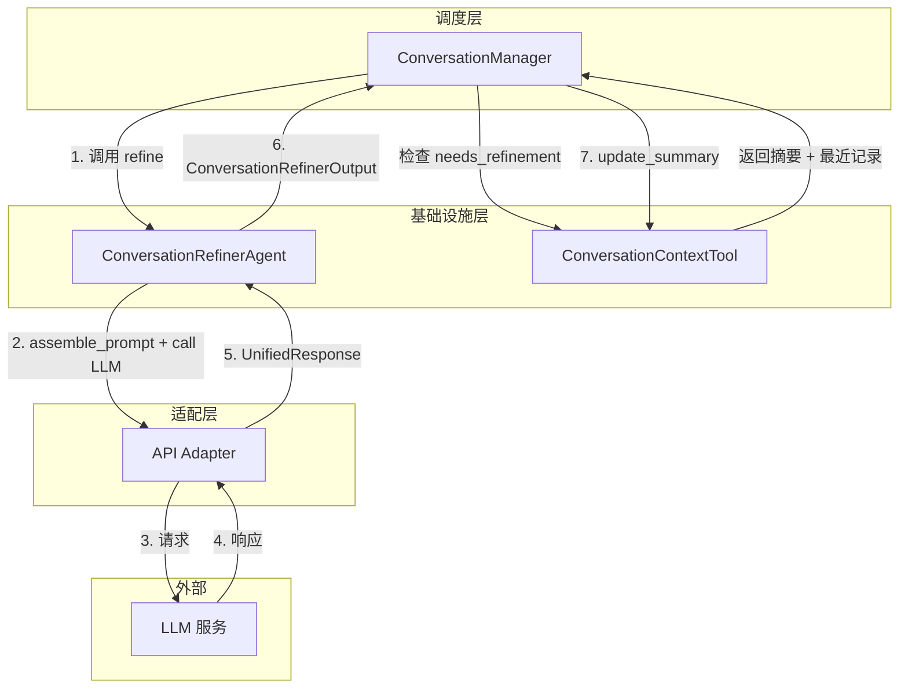
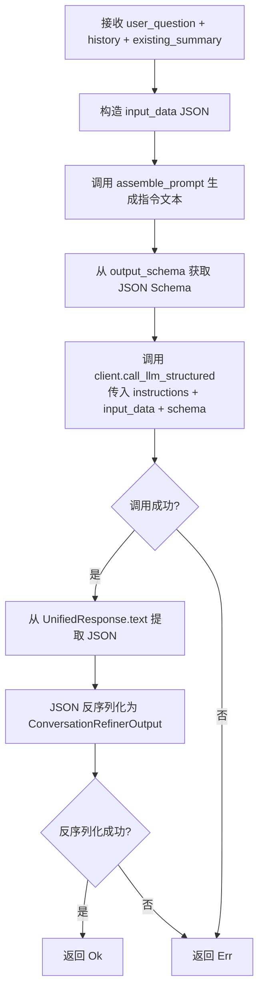
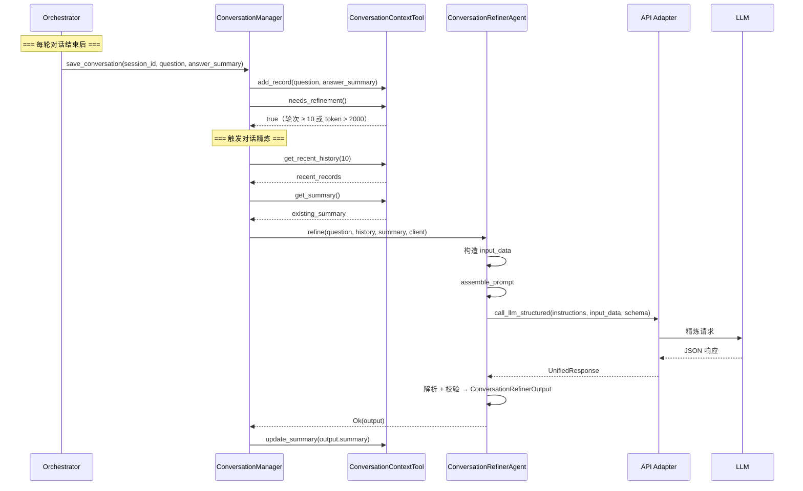

# Explore AI Agent - ConversationRefinerAgent 详细设计文档 v1.0

| 属性     | 值                                                                 |
| :------- | :----------------------------------------------------------------- |
| 文档版本 | v1.0                                                               |
| 创建日期 | 2026-04-30                                                         |
| 涉及模块 | agents/conversation_refiner                                         |
| 技术栈   | Rust + async-trait                                                  |
| 关联文档 | [Explore AI Agent 架构设计文档 v1.1](Explore%20AI%20Agent架构设计文档v1.1.md) |
| 关联文档 | [上下文管理工具详细设计文档 v1.1](上下文管理工具详细设计文档v1.1.md)   |

---

## 目录

- [1. 总体设计](#1-总体设计)
  - [1.1 模块定位](#11-模块定位)
  - [1.2 核心原则](#12-核心原则)
  - [1.3 架构位置](#13-架构位置)
- [2. 数据结构](#2-数据结构)
  - [2.1 ConversationRoundRecord](#21-conversationroundrecord)
  - [2.2 ConversationRefinerOutput](#22-conversationrefineroutput)
- [3. ConversationRefinerAgent 方法详细设计](#3-conversationrefineragent-方法详细设计)
  - [3.1 构造](#31-构造)
  - [3.2 refine — 执行精炼](#32-refine--执行精炼)
  - [3.3 assemble_prompt — Prompt 组装](#33-assemble_prompt--prompt-组装)
  - [3.4 output_schema — 输出 Schema](#34-output_schema--输出-schema)
- [4. Prompt 设计](#4-prompt-设计)
  - [4.1 Prompt 模板](#41-prompt-模板)
  - [4.2 变量说明](#42-变量说明)
  - [4.3 API 模式差异处理](#43-api-模式差异处理)
- [5. 结构化输出约束](#5-结构化输出约束)
- [6. 调用时机与上下文](#6-调用时机与上下文)
  - [6.1 触发条件](#61-触发条件)
  - [6.2 调用时序](#62-调用时序)
- [7. 错误处理](#7-错误处理)
- [8. 自动化测试用例](#8-自动化测试用例)
- [9. 附录](#9-附录)

---

## 1. 总体设计

### 1.1 模块定位

ConversationRefinerAgent 是系统基础设施层的**对话上下文精炼专家**。它将完整的多轮对话历史压缩为极简摘要，保留关键话题脉络和重要指代关系，防止多轮对话导致上下文超限。

与 ExplorationRefinerAgent 的关键区别：精炼对象是**对话上下文**（跨轮次），而非探索上下文（单次问题内）。

**核心职责**：

1. 将最近 10 轮完整对话压缩为一段摘要文本
2. 保留话题演变（用户先后讨论了哪些话题）
3. 保留指代关系（"它"、"这个"具体指代什么）
4. 去除寒暄、重复确认等冗余信息
5. 控制在 500 Token 以内

### 1.2 核心原则

| 原则 | 说明 |
|:---|:---|
| **极简压缩** | 只保留话题脉络和指代关系，丢弃细节 |
| **指代消解** | 明确指出当前问题中的指代词对应前文的哪个实体 |
| **结构化输出** | 通过 JSON Schema + `strict: true` 强制 LLM 输出合法 JSON |
| **无工具调用** | 精炼专家不调用任何工具，仅基于传入数据做分析 |
| **500 Token 硬上限** | 摘要 Token 数不得超过 500，由 Prompt 约束 |

### 1.3 架构位置



---

## 2. 数据结构

### 2.1 ConversationRoundRecord

```rust
#[derive(Debug, Clone, Serialize, Deserialize)]
pub struct ConversationRoundRecord {
    pub round: u32,
    pub user_question: String,
    pub answer_summary: String,
    pub topic: String,
}
```

| 字段 | 类型 | 说明 |
|:---|:---|:---|
| round | u32 | 对话轮次编号 |
| user_question | String | 用户在本轮提出的问题原文 |
| answer_summary | String | 系统在本轮给出的回答摘要 |
| topic | String | 本轮的讨论话题标签 |

此结构对应 `ConversationContextTool.conversation_history` 中的 `ConversationRecord`。在传入 Refiner 前由 ConversationManager 添加 `topic` 字段。

### 2.2 ConversationRefinerOutput

```rust
#[derive(Debug, Clone, Serialize, Deserialize)]
pub struct ConversationRefinerOutput {
    pub summary: String,
}
```

| 字段 | 类型 | 说明 |
|:---|:---|:---|
| summary | String | 压缩后的对话摘要，含话题脉络和指代关系 |

与 `ExplorationSummary`（4 字段）相比，对话精炼输出仅含一个 `summary` 字符串。对话上下文的本质就是一段连续叙述，不需要拆分为多个字段。

---

## 3. ConversationRefinerAgent 方法详细设计

### 3.1 构造

```rust
pub fn new() -> Self
```

无参数构造。精炼专家不持有任何内部状态。

```rust
pub fn output_schema() -> &'static str
```

返回 JSON Schema 常量 `CONVERSATION_REFINER_SCHEMA`（见第 5 节）。

### 3.2 refine — 执行精炼

#### 3.2.1 函数签名

```rust
pub async fn refine(
    &self,
    user_question: &str,
    recent_conversation_history: &[ConversationRoundRecord],
    existing_summary: &str,
    client: &dyn LlmStructuredClient,
) -> Result<ConversationRefinerOutput, String>
```

| 参数 | 类型 | 说明 |
|:---|:---|:---|
| user_question | &str | 用户当前问题（帮助 Refiner 理解当前语境） |
| recent_conversation_history | &[ConversationRoundRecord] | 最近 10 轮完整对话记录 |
| existing_summary | &str | 已有的历史对话摘要（首次为空字符串） |
| client | &dyn LlmStructuredClient | 适配层注入 |

**返回值**：成功返回 `ConversationRefinerOutput`；失败返回错误描述。

#### 3.2.2 处理流程



#### 3.2.3 处理步骤详述

**步骤 1：构造输入数据**

将三个输入包装为 JSON 对象：

```json
{
  "user_question": "...",
  "recent_conversation_history": [ ... ],
  "existing_summary": "..."
}
```

**步骤 2：组装 Prompt**

调用 `self.assemble_prompt()` 生成指令文本（见第 4 节）。对话精炼专家的 Prompt 在两种 API 模式下完全相同——所有数据通过 `input_data` 参数传入适配层。

**步骤 3：调用适配层**

调用 `client.call_llm_structured(&instructions, &input_data, Some(&schema))`。适配层处理 Chat/Responses 差异：Chat 模式系统消息拼接，Responses 模式拆分为 `instructions` + `input`。

**步骤 4：解析响应**

从 `UnifiedResponse.text` 提取 JSON，反序列化为 `ConversationRefinerOutput`。若 `text` 为 `None`，返回 `Err("Empty response from LLM")`。

### 3.3 assemble_prompt — Prompt 组装

#### 3.3.1 函数签名

```rust
pub fn assemble_prompt() -> String
```

#### 3.3.2 设计说明

返回核心指令文本（角色定义、精炼要求、输出格式）。Prompt 在两种 API 模式下完全相同——用户问题、对话历史和已有摘要通过 `input_data` 参数传入适配层。

### 3.4 output_schema — 输出 Schema

```rust
pub fn output_schema() -> &'static str
```

返回 `CONVERSATION_REFINER_SCHEMA` 常量，由 `evaluate()` 解析后传入 `call_llm_structured`。

---

## 4. Prompt 设计

### 4.1 Prompt 模板

此模板由 `assemble_prompt()` 返回。用户问题、对话历史和已有摘要通过 `input_data` 传入。

```
你是对话上下文精炼专家。将完整对话历史压缩为极简摘要，保留关键话题脉络和重要指代关系。

系统会以结构化数据的形式向你提供用户当前问题、最近对话记录和已有历史摘要，请基于这些内容完成精炼。

## 精炼要求
1. **保留话题演变**：清晰描述用户先后讨论了哪些话题，以及话题之间的关联。
2. **保留指代关系**：明确指出当前问题中的指代词（如"它"、"这个参数"）具体指代前文中的哪个概念或实体。
3. **去除冗余**：删除寒暄、重复确认、与话题无关的闲聊。
4. **长度控制**：输出摘要的总 Token 数必须控制在 500 以内。

## 输出格式（强制约束）
你必须**只输出一个合法的 JSON 对象**，不要包裹任何标记、不要添加任何解释文字。

- `summary`：字符串，压缩后的对话摘要。

**示例输出**：
{
  "summary": "第1-2轮讨论了 BooleanValidator 的基本用法，第3-4轮追问了它的参数配置。当前问题中的'它'指代 BooleanValidator，用户想了解 required 参数的默认值。"
}

**警告**：如果你输出的不是合法 JSON，或者缺少 `summary` 字段，系统将拒绝你的输出并要求你重新生成。
```

### 4.2 变量说明

| 变量 | 传递方式 | 说明 |
|:---|:---|:---|
| 用户当前问题 | `input_data.user_question` | 帮助 Refiner 理解当前对话语境 |
| 最近对话记录 | `input_data.recent_conversation_history` | 最近 10 轮 `ConversationRoundRecord` 数组 |
| 已有历史摘要 | `input_data.existing_summary` | 之前已压缩的对话摘要（首次精炼时为空字符串） |

### 4.3 API 模式差异处理

| 维度 | Chat API | Responses API |
|:---|:---|:---|
| Prompt 内容 | 完全相同 | 完全相同 |
| Prompt 放置 | 适配层作为 system message 内容 | 适配层放入 `instructions` 字段 |
| input_data 放置 | 拼接到 system message 末尾 | 放入 `input` 字段 |
| 结构化输出约束 | `response_format` | `text.format` |

Refiner 代码层不感知 API 模式。

---

## 5. 结构化输出约束

### 5.1 JSON Schema 定义

```json
{
  "name": "conversation_refiner_response",
  "strict": true,
  "schema": {
    "type": "object",
    "properties": {
      "summary": {
        "type": "string",
        "description": "压缩后的对话摘要"
      }
    },
    "required": ["summary"],
    "additionalProperties": false
  }
}
```

| 约束项 | 说明 |
|:---|:---|
| `strict: true` | 启用 API 严格模式 |
| `required: ["summary"]` | 仅有 1 个必填字段 |
| `additionalProperties: false` | 拒绝额外字段 |

> 与 ExplorationRefinerAgent（4 个 required 字段）和 QE（6 个 required 字段）相比，对话精炼的 Schema 最简单。

### 5.2 两种 API 模式的约束构建

由 `ApiAdapter::build_structured_output_constraint` 根据 `api_mode` 构建，与其余 Agent 逻辑一致。

---

## 6. 调用时机与上下文

### 6.1 触发条件

ConversationRefinerAgent 由 **ConversationManager**（非 Orchestrator）调用。触发条件有两个，满足其一即触发：

| 条件 | 阈值 | 说明 |
|:---|:---|:---|
| **轮次触发** | 对话轮次 ≥ 10 轮 | `ConversationContextTool.metadata.total_rounds >= 10` |
| **Token 触发** | 对话上下文总 token > 2000 | 估算值为 `(conversation_history JSON 字节数 + conversation_summary 字节数) / 4` |

触发后，ConversationManager 调用 `ConversationRefinerAgent::refine()`，将返回的摘要写入 `ConversationContextTool.conversation_summary`。

### 6.2 调用时序



---

## 7. 错误处理

| 场景 | 处理方式 | 是否中断流程 |
|:---|:---|:---|
| input_data 序列化失败 | 返回 `Err("Failed to serialize refinement input: {details}")` | 是 |
| LLM 调用失败（含 3 次重试耗尽） | 透传适配层错误 | 是 |
| LLM 返回空响应（text = None） | 返回 `Err("Empty response from LLM")` | 是 |
| JSON 反序列化失败 | 返回 `Err("Failed to parse refinement JSON: {details}")` | 是 |

---

## 8. 自动化测试用例

### 8.1 测试夹具

- 构造标准 `ConversationRoundRecord` 测试数据（覆盖 1 条和多条记录、含指代词场景）
- 构造标准 `ConversationRefinerOutput` 测试数据
- `refine()` 的集成测试通过 mock `LlmStructuredClient` 隔离真实 LLM
- 所有测试不依赖真实 LLM 调用

> **编号规则**：用例按子章节分组——数据结构 (CR-001~002)、构造与 Schema (CR-003~007)、Prompt (CR-008~010)、集成 (CR-011~014)。与其余 Agent 保持一致风格。

### 8.2 数据结构测试

| 用例编号 | 测试场景 | 输入 | 预期结果 |
|:---|:---|:---|:---|
| CR-001 | ConversationRoundRecord 序列化往返 | `ConversationRoundRecord { round: 3, user_question: "它有哪些参数？", answer_summary: "说明了 required 和 defaultValue。", topic: "参数配置" }` | JSON 序列化后可无损反序列化，所有字段值一致 |
| CR-002 | ConversationRefinerOutput 序列化往返 | `ConversationRefinerOutput { summary: "第1-2轮讨论了基本用法，第3轮追问了参数配置。" }` | JSON 往返后 summary 一致 |

### 8.3 构造与 Schema 测试

| 用例编号 | 测试场景 | 输入 | 预期结果 |
|:---|:---|:---|:---|
| CR-003 | 构造精炼专家 | `ConversationRefinerAgent::new()` | 返回实例，不 panic |
| CR-004 | output_schema 返回合法 JSON | `output_schema()` | 返回值可解析为 JSON，含 `name`、`strict`、`schema` 三个顶层字段 |
| CR-005 | output_schema 的 name 字段 | `output_schema()` | `name` = `"conversation_refiner_response"` |
| CR-006 | output_schema 含唯一 required 字段 summary | 解析 `output_schema()` → `schema.required` | `required` = `["summary"]`，长度为 1 |
| CR-007 | output_schema 的 strict 为 true | 解析 `output_schema()` | `strict` = `true` |

### 8.4 Prompt 组装测试

| 用例编号 | 测试场景 | 输入 | 预期结果 |
|:---|:---|:---|:---|
| CR-008 | 指令文本含角色定义 | 调用 `assemble_prompt()` | 结果含 `对话上下文精炼专家` |
| CR-009 | 指令文本含四类精炼要求 | 调用 `assemble_prompt()` | 结果含 `保留话题演变`、`保留指代关系`、`去除冗余`、`长度控制` |
| CR-010 | 指令文本含输出格式与示例 | 调用 `assemble_prompt()` | 结果含 `"summary"` 字段名说明；含 `示例输出` 章节和样例 JSON |

### 8.5 集成测试

所有集成测试调用 `refine()`（设计文档 3.2.1 定义的公开入口）。MockLlmClient 注入预设响应，验证完整流程"构造输入→组装指令→调适配层→解析→校验"。

| 用例编号 | 测试场景 | 输入 | 预期结果 |
|:---|:---|:---|:---|
| CR-011 | 正常精炼流程（含指代关系消解） | user_question=`"它的默认值是什么？"` + 3 条 records + existing_summary 非空，mock 返回 text=`{"summary":"第1-2轮讨论了BooleanValidator用法，第3轮追问参数。当前'它'指代required参数。"}` | `refine()` 返回 `Ok`；`output.summary` 含 `指代` |
| CR-012 | 空历史摘要（首次精炼） | user_question + 3 条 records + existing_summary = `""`，mock 返回预设 JSON | `refine()` 返回 `Ok`；`output.summary` 非空 |
| CR-013 | 空响应错误 | mock 返回 `UnifiedResponse { text: None, tool_calls: [] }` | `refine()` 返回 `Err`，错误信息含 `"Empty response"` |
| CR-014 | LLM 返回非法 JSON | mock 返回 text=`"not valid json"` | `refine()` 返回 `Err`，错误信息含 `"Failed to parse"` |

---

## 9. 附录

### 9.1 与架构文档的对应关系

| 架构文档章节 | 对应本模块 | 实现状态 |
|:---|:---|:---|
| 4.5 ConversationRefinerAgent Prompt | 第 4 节 | 本文档设计 |
| 4.5 变量说明 | 第 4.2 节 | 本文档细化 |
| 4.5 输出格式的强制保证 | 第 5 节 | 本文档设计 |
| 4.5 触发机制 | 第 6.1 节 | 本文档设计 |
| 5.2 ConversationContextTool | — | 上下文管理工具文档 |

### 9.2 与其他模块的接口

| 调用方 | 调用方法 | 说明 |
|:---|:---|:---|
| ConversationManager | `refine(user_question, history, existing_summary, client)` | 唯一调用入口 |
| ApiAdapter | `call_llm_structured(instructions, input_data, schema)` | 通过 `&dyn LlmStructuredClient` 注入 |

### 9.3 不变式与约束

| 约束 | 说明 |
|:---|:---|
| **无状态** | 不持有任何可变状态 |
| **无工具** | 不暴露任何工具 |
| **500 Token 硬上限** | Prompt 中约束，无代码层兜底 |
| **唯一字段** | 仅输出 `summary` 一个字段，Schema 最简单 |

### 9.4 与 ExplorationRefinerAgent 的对比

| 维度 | ConversationRefinerAgent | ExplorationRefinerAgent |
|:---|:---|:---|
| 管理对象 | 对话上下文 | 探索上下文 |
| 输出字段 | 1 个（`summary`） | 4 个 |
| Token 上限 | 硬编码 500 | 可配置（默认 1200） |
| 调用方 | ConversationManager | Orchestrator |
| 触发条件 | 轮次 ≥ 10 或 token > 2000 | 探索上下文 token > 12000 |
| 调用次数 | 每 10 轮一次 | 每次 token 超阈值 |

---

## 修订记录

| 版本 | 日期 | 修订人 | 变更说明 |
|:---|:---|:---|:---|
| v1.0 | 2026-04-30 | sdfang1053 | 初版：对话历史语义压缩 Agent |
