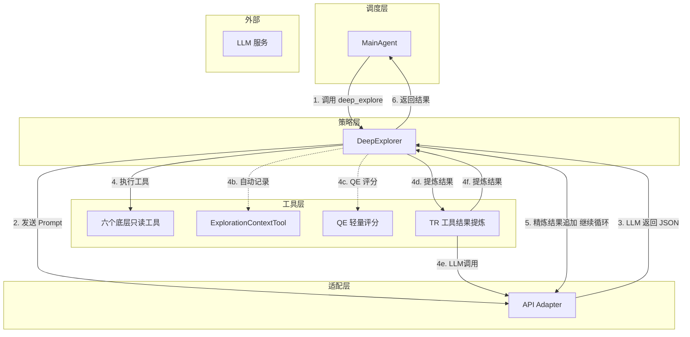
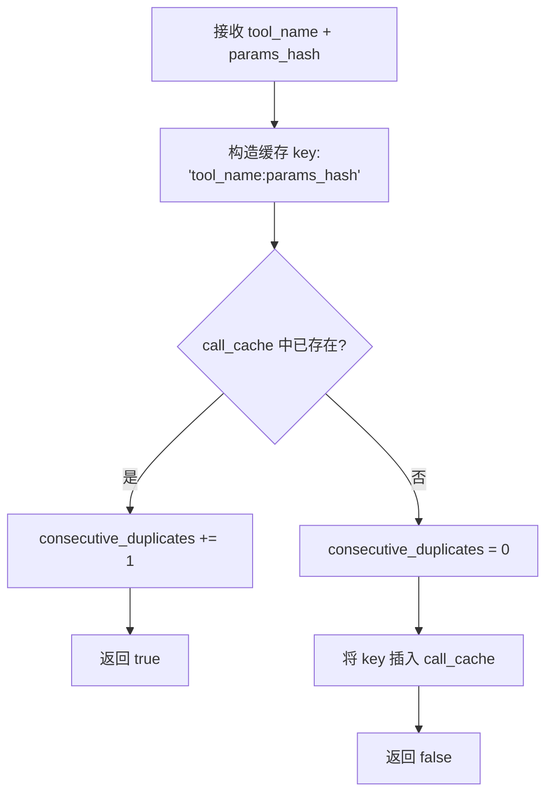
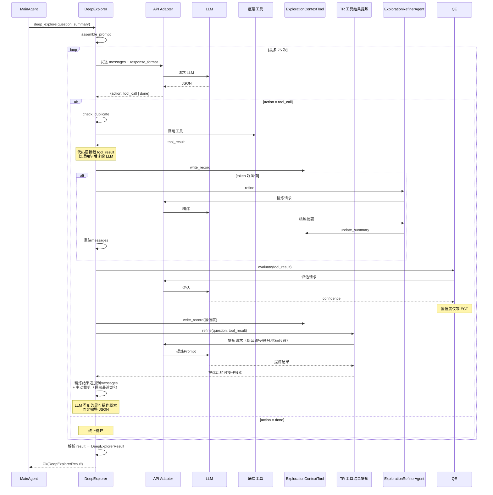

# Explore AI Agent - DeepExplorer 详细设计文档 v1.0

| 属性     | 值                                                                 |
| :------- | :----------------------------------------------------------------- |
| 文档版本 | v1.3                                                               |
| 创建日期 | 2026-04-30                                                         |
| 修订日期 | 2026-05-09                                                         |
| 涉及模块 | agents/deep_explorer                                                |
| 技术栈   | Rust + async-trait                                                  |
| 关联文档 | [Explore AI Agent 架构设计文档 v1.3](Explore%20AI%20Agent架构设计文档v1.1.md) |
| 关联文档 | [底层只读工具详细设计文档 v1.1](底层工具详细设计文档v1.1.md)         |
| 关联文档 | [ExplorationQualityEvaluator 详细设计文档 v1.2](ExplorationQualityEvaluator详细设计文档v1.2.md) |
| 关联文档 | [ToolResultRefinerAgent 详细设计文档 v1.0](ToolResultRefinerAgent详细设计文档v1.0.md) |

> **v1.3 变更说明**：新增 ToolResultRefinerAgent（TR）——每次底层工具调用后，代码层调 TR 对单条工具结果进行精炼去噪，保留文件路径、关键符号、代码片段等可操作信息，替代完整 JSON 传入 DE 的 LLM 上下文。QE 输出仅写入 ECT，不再反馈给 DE。消息追加后主动裁剪——保留 system prompt + 最近 2 轮对话。

---

## 目录

- [Explore AI Agent - DeepExplorer 详细设计文档 v1.0](#explore-ai-agent---deepexplorer-详细设计文档-v10)
  - [目录](#目录)
  - [1. 总体设计](#1-总体设计)
    - [1.1 模块定位](#11-模块定位)
    - [1.2 核心原则](#12-核心原则)
    - [1.3 架构位置](#13-架构位置)
    - [1.4 与 fast\_explore 的关键区别](#14-与-fast_explore-的关键区别)
  - [2. 数据结构](#2-数据结构)
    - [2.1 CollectedEvidence](#21-collectedevidence)
    - [2.2 DeepExplorerResult](#22-deepexplorerresult)
    - [2.3 DeepExplorer 结构体](#23-deepexplorer-结构体)
  - [3. DeepExplorer 方法详细设计](#3-deepexplorer-方法详细设计)
    - [3.1 构造](#31-构造)
    - [3.2 execute — 执行深度探索](#32-execute--执行深度探索)
      - [3.2.1 函数签名](#321-函数签名)
      - [3.2.2 处理流程](#322-处理流程)
      - [3.2.3 处理步骤详述](#323-处理步骤详述)
      - [3.2.4 JSON Schema（response\_format 约束）](#324-json-schemaresponse_format-约束)
    - [3.3 assemble\_prompt — Prompt 组装](#33-assemble_prompt--prompt-组装)
      - [3.3.1 函数签名](#331-函数签名)
      - [3.3.2 处理逻辑](#332-处理逻辑)
    - [3.4 check\_duplicate — 重复调用检测](#34-check_duplicate--重复调用检测)
      - [3.4.1 函数签名](#341-函数签名)
      - [3.4.2 处理逻辑](#342-处理逻辑)
    - [3.5 generate\_loop\_warning — 循环警告生成](#35-generate_loop_warning--循环警告生成)
      - [3.5.1 函数签名](#351-函数签名)
      - [3.5.2 处理逻辑](#352-处理逻辑)
  - [4. Prompt 设计](#4-prompt-设计)
    - [4.1 Prompt 模板](#41-prompt-模板)
    - [4.2 变量说明](#42-变量说明)
    - [4.3 API 模式差异处理](#43-api-模式差异处理)
  - [5. 工具定义](#5-工具定义)
  - [6. 调用时机与上下文](#6-调用时机与上下文)
    - [6.1 触发条件](#61-触发条件)
    - [6.2 内部状态管理](#62-内部状态管理)
    - [6.3 调用时序](#63-调用时序)
  - [7. 错误处理](#7-错误处理)
  - [8. 自动化测试用例](#8-自动化测试用例)
    - [8.1 测试夹具](#81-测试夹具)
    - [8.2 数据结构测试](#82-数据结构测试)
    - [8.3 构造与常量测试](#83-构造与常量测试)
    - [8.4 重复检测测试](#84-重复检测测试)
    - [8.5 循环警告测试](#85-循环警告测试)
    - [8.6 Prompt 组装测试](#86-prompt-组装测试)
    - [8.7 集成测试](#87-集成测试)
      - [8.7.1 v1.2 新增: DE 内部 QE 评分](#871-v12-新增-de-内部-qe-评分)
    - [8.8 手工测试用例](#88-手工测试用例)
  - [9. 附录](#9-附录)
    - [9.1 与架构文档的对应关系](#91-与架构文档的对应关系)
    - [9.2 与其他模块的接口](#92-与其他模块的接口)
    - [9.3 不变式与约束](#93-不变式与约束)
    - [9.4 与 fast\_explore 的对比](#94-与-fast_explore-的对比)
    - [9.5 未解决问题](#95-未解决问题)

---

## 1. 总体设计

### 1.1 模块定位

DeepExplorer 是系统的**深度代码探索工具**。它作为 MainAgent 的 function calling 工具，在被调用后自主执行 6 个底层只读工具（search_content、search_files、read_file、list_dir、file_info、execute_shell），深入代码库收集与用户问题相关的原始代码证据。单次任务最多调用 75 次工具。每次工具调用后，代码层自动调用 ToolResultRefinerAgent 对结果进行精炼去噪，提炼后的可操作线索投入 messages 供 LLM 下一步决策参考。QE 评分仅写入 ECT。

**核心职责**：

1. 基于已有探索线索，自主规划探索路径
2. 收集原始代码证据（文件路径、行号、代码片段、关联说明）
3. 在信息充足或穷尽路径后适时终止探索
4. 交付收集到的原始证据，不做全局质量判断（由 QE 负责）

> **v1.1 变更说明**：v1.0 要求 LLM 每次调用底层工具后**必须**再调用 `exploration_context_tool` 记录发现。经 fast_explore 实测，DeepSeek 对此类"元工具"调用容易困惑。v1.1 改为代码层自动记录——每当 LLM 调用任何底层探索工具，代码执行后自动将结果写入 `exploration_context_tool`。LLM 的 Prompt 和工具列表中不再出现 `exploration_context_tool`，专注探索本身。
>
> **v1.2 变更说明**：v1.1 LLM 通过 OpenAI 兼容的 API `tool_calls` 字段调用 6 个底层工具。经实测，DeepSeek（含 `deepseek-chat`、`deepseek-reasoner`、`deepseek-v4-pro`）在复杂多工具长 Prompt 场景下，倾向在 `content` 中以文本（XML/Anthropic 格式）描述工具调用，而非使用 API 的 `tool_calls` 通道。v1.2 改为**JSON 通信协议**——LLM 通过 `response_format` 约束输出 JSON，格式为 `{"action":"tool_call"|"done", ...}`。代码解析 JSON 决定执行工具还是终止探索。LLM 的自主探索能力完全保留，只更改通信方式。

### 1.2 核心原则

| 原则 | 说明 |
|:---|:---|
| **自主探索** | AI 自主决定下一步调用哪个工具，不受代码层干预 |
| **JSON 通信** | LLM 通过 JSON（`response_format` 约束）告知代码下一步操作，不依赖 API `tool_calls` 通道 |
| **自动记录** | 代码层在每次底层工具调用后自动将结果写入 exploration_context_tool，LLM 不感知 |
| **避免重复** | 代码层缓存 (工具名, 参数哈希)，完全相同调用直接返回缓存结果 |
| **循环警告** | 连续相同调用触发 `{loop_warning}` 注入，提示 AI 调整方向 |
| **上限终止** | 75 次工具调用上限由代码层强制，AI 无需感知 |
| **仅交付证据** | 不评估全局信息是否足够（由 QE 负责），仅交付原始代码证据 |
| **精炼反馈** | 工具结果经 TR 提炼后投入 messages，LLM 看到的是可操作线索而非完整 JSON |

### 1.3 架构位置



### 1.4 与 fast_explore 的关键区别

| 维度 | DeepExplorer | fast_explore |
|:---|:---|:---|
| 通信方式 | **JSON**（`response_format` 约束） | —（纯代码执行，无 LLM） |
| 调用上限 | **75 次** | 1 次 FastExplorer |
| 内部状态 | **有状态**（调用缓存、重复计数器） | 无状态 |
| LLM 交互 | 是（自主探索决策） | 否 |
| QE 评分 | 每次工具调用后 1 次 | FastExplorer 执行后 1 次 |
| 输出 | `DeepExplorerResult`（原始证据） | `{matches, key_findings, critical_files, confidence}` |

---

## 2. 数据结构

### 2.1 CollectedEvidence

```rust
#[derive(Debug, Clone, Serialize, Deserialize)]
pub struct CollectedEvidence {
    pub file: String,
    pub line: String,
    pub code_snippet: String,
    pub relevance: String,
}
```

| 字段 | 类型 | 说明 |
|:---|:---|:---|
| file | String | 文件相对路径 |
| line | String | 行号范围，格式 `"42"` 或 `"42-47"` |
| code_snippet | String | 相关代码片段 |
| relevance | String | 该证据与用户问题的关联说明 |

此结构由 DeepExplorer 在终止时输出，作为收集到的原始证据交付给 Orchestrator。后续由 ExplorationQualityEvaluator 评估这些证据的全局质量。

### 2.2 DeepExplorerResult

```rust
#[derive(Debug, Clone, Serialize, Deserialize)]
pub struct DeepExplorerResult {
    pub critical_files: Vec<CriticalFileRef>,
    pub collected_evidence: Vec<CollectedEvidence>,
    pub missing_info: String,
}
```

| 字段 | 类型 | 说明 |
|:---|:---|:---|
| critical_files | Vec\<CriticalFileRef> | 探索过的最相关文件列表，使用 `summary` 字段（与 fast_explore 一致） |
| collected_evidence | Vec\<CollectedEvidence> | 具体的代码证据数组 |
| missing_info | String | 本应存在但未能找到的信息说明，如无则为 `"无"` |

> **注意**：DeepExplorer 只负责交付原始证据，`critical_files` 的 `summary` 与 `QualityCriticalFile.one_sentence_summary` 的字段映射由 Orchestrator 在构造 `QualityEvaluatorInput` 时执行。

### 2.3 DeepExplorer 结构体

```rust
pub struct DeepExplorer {
    pub max_tool_calls: usize,
    token_threshold: usize,               // context overflow trigger (from config)
    token_target_ratio: f64,              // Refiner target ratio (from config)
    call_cache: HashSet<String>,          // (tool_name, params_hash) 的缓存
    consecutive_duplicates: usize,        // 连续完全重复调用的次数
}
```

| 字段 | 类型 | 说明 |
|:---|:---|:---|
| max_tool_calls | usize | 工具调用总上限，默认 75，可在系统配置文件中覆盖 |
| token_threshold | usize | 上下文溢出触发阈值，默认 12000（从 config 读取） |
| token_target_ratio | f64 | 精炼目标比例，默认 0.40（从 config 读取） |
| call_cache | HashSet\<String> | 已执行调用的 `"tool_name:params_hash"` 集合 |
| consecutive_duplicates | usize | 连续检测到完全重复的次数，用于触发 `{loop_warning}` |

**状态说明**：DeepExplorer 是项目中唯一持有可变状态的 Agent。`call_cache` 和 `consecutive_duplicates` 在单次 `execute()` 调用期间累积，调用结束后状态的生命周期也随之结束（由 Orchestrator 决定保留或丢弃）。

---

## 3. DeepExplorer 方法详细设计

### 3.1 构造

```rust
pub fn new() -> Self
```

无参数构造。内部状态（`call_cache`、`consecutive_duplicates`）初始为空。

```rust
pub fn max_tool_calls(&self) -> usize
```

返回 `max_tool_calls` 值（默认 75）。

### 3.2 execute — 执行深度探索

#### 3.2.1 函数签名

```rust
pub async fn execute(
    &mut self,
    question: &str,
    current_summary: &ExplorationSummary,
    adapter: &ApiAdapter,
    tool_registry: &ToolRegistry,
) -> Result<DeepExplorerResult, String>
```

| 参数 | 类型 | 说明 |
|:---|:---|:---|
| question | &str | 用户原始问题 |
| current_summary | &ExplorationSummary | 当前探索上下文摘要（来自 fast_explore 或 ExplorationRefinerAgent） |
| adapter | &ApiAdapter | 适配层，用于调用 LLM |
| tool_registry | &ToolRegistry | 工具注册表，用于执行 LLM 请求的工具调用 |

**返回值**：成功时返回 `DeepExplorerResult`；失败时返回错误描述字符串。

> **`&mut self`**：因 `execute()` 期间会更新 `call_cache` 和 `consecutive_duplicates`。

#### 3.2.2 处理流程

```mermaid
flowchart TD
    A[接收 question + current_summary] --> B[调用 assemble_prompt 生成 Prompt]
    B --> C[构造 messages + response_format 约束]
    C --> D[调用 adapter 发送 messages]
    D --> E[获取 UnifiedResponse.text]
    E --> F[JSON 解析: {action, ...}]
    F --> F1{解析成功?}
    F1 -- 否 --> F2{重试次数 < 2?}
    F2 -- 是 --> F3[追加 user message 提示<br/>重试计数 +1]
    F3 --> D
    F2 -- 否 --> F4[返回 Err:<br/>JSON parse retry exhausted]
    F1 -- 是 --> G{action == tool_call?}
    G -- 是 --> H[tool_call_count += 1]
    H --> I{达上限 75?}
    I -- 是 --> J[兜底提取 DeepExplorerResult]
    I -- 否 --> K{check_duplicate?}
    K -- 重复 --> L[返回缓存结果<br/>consecutive_duplicates += 1]
    K -- 否 --> M[执行工具 + 自动记录 ECT]
    M --> M2[QE 评估 + 置信度写入 ECT]
    M2 --> M3[TR 提炼工具结果]
    M3 --> N[精炼结果追加到 messages<br/>+ 主动裁剪: 保留最近2轮]
    N --> O{generate_loop_warning?}
    O -- 是 --> P[注入警告]
    O -- 否 --> Q[继续]
    P --> D
    Q --> D
    L --> D
    G -- 否: action == done --> R[提取 result 字段]
    R --> S[反序列化 DeepExplorerResult]
```

#### 3.2.3 处理步骤详述

**步骤 1：组装 Prompt**

调用 `self.assemble_prompt(question, current_summary)` 生成完整 Prompt 文本。Prompt 中列出 6 个工具的用途和参数格式，LLM 通过 JSON 告知代码下一步操作。Prompt 模板见第 4 节。

**步骤 2：构造初始消息 + response_format**

构造 `messages` 数组（system role = Prompt），并构造 `response_format` 约束 JSON Schema（见 3.2.4）。LLM 必须输出符合 Schema 的 JSON——`action` 字段为 `"tool_call"` 或 `"done"`。

**步骤 3：JSON 通信循环**

进入循环（上限 75 次工具调用）：

1. 将 `messages` 发送给 LLM（通过 `call_llm_with_retry`，**不发送 `tools` 参数**）
2. 从 `UnifiedResponse.text` 解析 JSON：
   - 若 `action == "tool_call"`：
     a. 提取 `tool`（工具名）、`params`（参数）、`reasoning`（思考过程，可选字符串）
     b. 检查 `check_duplicate(tool_name, params_hash)`
        - 完全重复：返回缓存结果，`consecutive_duplicates += 1`
        - 非重复：`consecutive_duplicates = 0`，执行工具
     c. 执行工具，代码自动调用 `exploration_context_tool.write()` 记录结果
     d. **v1.2 新增**：代码层调用 `QE.evaluate(question, 本次工具返回数据)` → 置信度写入 ECT（为后续精炼排序做准备）
	     e. 检查上下文精炼阈值 → 必要时调 Refiner（在数据回传 LLM 之前）
	     f. **v1.3 新增**：调用 `ToolResultRefinerAgent.refine(question, tool_result)` → 提炼后的可操作线索（路径、符号、代码片段）
	     g. 将提炼结果以 user message 形式追加到 `messages`，随即主动裁剪：保留 system prompt + 最近 4 条非系统消息（约 2 轮）
	     h. 若 `generate_loop_warning()` 返回 Some，在下一轮 LLM 请求的 system prompt 中注入警告
	     i. 继续循环
3. JSON 解析失败时，追加一条 user message 提示 LLM 按正确格式重试，最多 2 次；耗尽后返回 `Err`

> **v1.2 设计说明**：v1.1 依赖 API `tool_calls` 通道，深陷模型兼容性问题。v1.2 将通信协议改为 `response_format` 约束的 JSON——LLM 的自主探索能力完全保留（它仍自主决定每步调什么工具），仅通信方式从 API 通道改为 JSON 文本。`reasoning` 字段保留思考过程，供后续前端展示。

**步骤 4：解析终止输出**

从 `action == "done"` 的 JSON 中提取 `result` 字段，反序列化为 `DeepExplorerResult`。

**步骤 5：强制终止时的兜底**

若达到 `max_tool_calls` 上限而 LLM 尚未输出 `action: "done"`，代码层从已记录的 exploration_context_tool 数据中提取 `collected_evidence` 和 `critical_files`，构造一个基础的 `DeepExplorerResult` 返回（`missing_info` 标记为 "探索达到上限被强制终止"）。

#### 3.2.4 JSON Schema（response_format 约束）

见第 4.4 节。

### 3.3 assemble_prompt — Prompt 组装

#### 3.3.1 函数签名

```rust
fn assemble_prompt(
    &self,
    question: &str,
    current_summary: &ExplorationSummary,
) -> String
```

#### 3.3.2 处理逻辑

将 Prompt 模板（见 4.1 节）中的占位符替换为实际内容：

| 占位符 | 替换内容 |
|:---|:---|
| `{question}` | `## 用户问题\n{问题原文}` |
| `{current_summary}` | `## 已有探索线索\n{序列化 JSON}` |
| `{loop_warning}` | 若有：`## ⚠️ 系统警告\n{警告文本}`；若无：空字符串 |

Chat 模式下所有占位符均替换为章节标题 + 内容。Responses 模式下 `{question}`、`{current_summary}` 替换为空字符串（数据通过 API 原生字段传递），但 `{loop_warning}` 始终填充（因为它是代码层生成的运行时警告，必须送达 LLM）。

### 3.4 check_duplicate — 重复调用检测

#### 3.4.1 函数签名

```rust
pub fn check_duplicate(&mut self, tool_name: &str, params_hash: &str) -> bool
```

#### 3.4.2 处理逻辑



**params_hash 生成**：对工具参数的 JSON 字符串做哈希（如 SHA256 前 16 位），确保相同参数产生相同哈希。

### 3.5 generate_loop_warning — 循环警告生成

#### 3.5.1 函数签名

```rust
pub fn generate_loop_warning(&self) -> Option<String>
```

#### 3.5.2 处理逻辑

| 条件 | 返回值 |
|:---|:---|
| `consecutive_duplicates < 3` | `None` |
| `consecutive_duplicates >= 3` | `Some("## ⚠️ 系统警告\n你已连续多次执行完全相同的操作。请立即调整探索方向，尝试不同的工具、搜索词或文件路径。")` |

阈值设为 3 次——连续 3 次完全相同的调用后触发警告，给予 AI 足够的容错空间。

---

## 4. Prompt 设计

### 4.1 Prompt 模板

```
你是代码库深度探索专家。你的职责是基于已有的探索线索，深入代码库，自主调用底层只读工具，收集与用户问题相关的原始代码证据。不需要你总结答案，你只需要判断代码证据和用户问题的相关性，当你认为收集的证据足够分析回答用户问题的时候，请停止探索，按照通信协议规范，返回你探索到的证据数据。

{question}
{current_summary}
{loop_warning}

## 工作原则

- **聚焦探索**：你的职责是深入代码库收集原始证据。系统会自动记录你的每次工具调用结果和关键发现，无需你手动记录。
- **避免短期重复**：不要在短时间内重复执行完全相同的操作（如同一文件的相同行范围、仅同义词替换的搜索）。
- **适时终止**：当你认为已收集到足够丰富的原始证据，必须立刻终止探索，避免浪费算力资源。

## 可用工具

你可以调用以下 6 个只读工具。系统会通过 JSON 告知你调用结果：

| 工具 | 用途 | 输入 | 输出 |
|:---|:---|:---|:---|
| `search_content` | 搜索文件内容，支持正则和 OR 匹配 | `pattern`（正则）、`file_pattern`（可选，文件过滤）、`exclude_paths`（可选） | 匹配列表：`file`、`line`、`content` |
| `search_files` | 按文件名模式查找文件 | `pattern`（glob 模式） | 文件路径列表 |
| `read_file` | 读取文件内容 | `file`（路径）、`lines`（可选，行范围如 `{"ranges":[[1,20]]}`） | `content`（文件内容字符串） |
| `list_dir` | 列出目录内容 | `path`（目录路径） | `items`（文件/子目录列表，含 `name`、`is_dir`、`size`） |
| `file_info` | 获取文件元信息和代码统计 | `file`（路径） | `type`、`size`、`lines`、`stats`（代码行数/注释行数/函数数等） |
| `execute_shell` | 执行只读 Shell 命令（兜底），当上述其他工具不可用时使用 | `command`（Shell 命令） | `output`（命令输出） |

注：
execute_shell 只允许执行以下只读命令：`cat`、`head`、`tail`、`less`、`grep`、`egrep`、`fgrep`、`find`、`ls`、`tree`、`wc`、`sort`、`uniq`、`cut`、`tr`、`awk`、`sed`、`file`、`stat`、`echo`。严禁 `>`、`>>` 等写入重定向，严禁 `tee`、`rm`、`mv` 等修改命令

## 通信协议

你与系统之间通过 JSON 通信。每次回复必须是合法的 JSON 对象：

**调用工具时**：
{
  "action": "tool_call",
  "tool": "search_content",
  "params": {"pattern": "backtest", "file_pattern": "*.py"},
  "reasoning": "搜索回测相关的 Python 文件"
}


**终止探索时**：
{
  "action": "done",
  "result": {
    "critical_files": [
      {"path": "src/backtest/engine.py", "summary": "回测引擎核心实现"}
    ],
    "collected_evidence": [
      {
        "file": "src/backtest/engine.py",
        "line": "142-158",
        "code_snippet": "def run_backtest(self, start_date, end_date):\n    ...",
        "relevance": "回测主循环，按交易日遍历并执行决策"
      }
    ],
    "missing_info": "无"
  },
  "reasoning": "已收集到足够的代码证据"
}


注意：只输出 JSON，不要包裹任何标记或解释文字。

## 终止探索时的输出内容

终止探索时，你需要输出你收集到的所有关键原始证据，包含以下字段：

- **critical_files**：数组，列出你探索过的最相关文件，每个文件附带一句话说明你为什么认为它相关。
- **collected_evidence**：数组，列举具体的代码证据，例如：
  - `file`：文件路径
  - `line`：行号范围
  - `code_snippet`：相关代码片段
  - `relevance`：该证据与用户问题的关联说明
- **missing_info**：字符串，如果你认为某些信息本应存在但未能找到，请说明。如无，写"无"。

注意：你的回复必须遵守通信协议，否则系统将强制要求你重新回答。这是浪费资源的行为，应该严禁发生！
```

### 4.2 变量说明

| 变量名 | 类型 | 用途 | 来源 |
|:---|:---|:---|:---|
| `{question}` | string | 用户原始问题 | 用户输入 |
| `{current_summary}` | object | 当前探索上下文摘要 | ExplorationContextTool（来自 fast_explore 或 ExplorationRefinerAgent） |
| `{loop_warning}` | string | 连续重复调用时的警告文本 | DeepExplorer 代码层，由 `generate_loop_warning()` 生成 |

> **v1.2**：`{tools}` 占位符已移除。工具列表改为硬编码在 Prompt 模板中（6 个工具的用途和参数格式），不再通过代码层注入。

### 4.3 API 模式差异处理

| 模式 | `{question}` | `{current_summary}` | `{loop_warning}` | 最终 Prompt 形态 |
|:---|:---|:---|:---|:---|
| **Chat API** | `## 用户问题\n{原文}` | `## 已有探索线索\n{JSON}` | 有警告时填充 | 核心指令 + 三个章节 |
| **Responses API** | 空字符串 | 空字符串 | **始终填充** | 仅核心指令 + 可能的 loop_warning |

---

## 5. 工具定义

DeepExplorer 向 LLM 暴露 6 个工具（底层只读工具）：

| 工具 | 描述 | 来源 |
|:---|:---|:---|
| `search_content` | 在文件中搜索文本，支持正则和多关键字 OR 搜索 | 底层工具 |
| `search_files` | 按文件名模式查找文件，支持 glob | 底层工具 |
| `read_file` | 读取文件内容，支持行范围 | 底层工具 |
| `list_dir` | 列出目录内容 | 底层工具 |
| `file_info` | 获取文件元信息 | 底层工具 |
| `execute_shell` | 兜底工具，执行受限的只读 Shell 命令 | 底层工具 |

> **设计说明**：工具定义（ToolDefinition）从 `ToolRegistry` 中动态获取——DeepExplorer 不硬编码工具描述，而是调用 `tool_registry` 中每个工具的 `name()` 和 `description()` 方法生成参数定义。Chat 模式下的 `<tool_calls>` XML 格式说明由适配层生成。
>
> **v1.1**：`exploration_context_tool` 不再暴露给 LLM。代码层在每次执行完 LLM 请求的底层工具后，自动调用 `exploration_context_tool.write()` 记录结果，LLM 不感知此步骤。

---

## 6. 调用时机与上下文

### 6.1 触发条件

DeepExplorer 由 **MainAgent 通过 function calling** 调用。MainAgent 判断需要深入阅读代码时，输出 `{"action":"tool_call","tool":"deep_explore",...}`，代码层将其分发到 DE。

### 6.2 内部状态管理

| 状态 | 生命周期 | 说明 |
|:---|:---|:---|
| `call_cache` | 单次 `execute()` 期间 | 已执行调用的 `"tool_name:params_hash"` 集合，防止完全重复执行 |
| `consecutive_duplicates` | 单次 `execute()` 期间 | 连续重复计数，≥3 时触发 `{loop_warning}` |
| `tool_call_count` | 单次 `execute()` 期间（局部变量） | 当前已执行工具调用次数，达到 `max_tool_calls` 时强制终止 |

状态在每次 `execute()` 调用开始时初始化，调用结束后随 `&mut self` 引用的释放而自然结束。

### 6.3 调用时序



---

## 7. 错误处理

> **v1.2**：新增 JSON 解析失败重试（最多 2 次）和 `action == "tool_call"` 字段缺失重试。

| 场景 | 处理方式 | 是否中断流程 |
|:---|:---|:---|
| 适配层调用失败（含 3 次重试耗尽） | 透传适配层错误 | 是 |
| JSON 解析失败（非 tool_call 非 done 格式） | 追加 user message 提示 LLM，重试 ≤ 2 次；耗尽后返回 Err | 是（耗尽后） |
| `action == "tool_call"` 但 tool/params 缺失 | 追加提示，重试逻辑同上 | 否（首次） |
| 工具执行失败（如文件不存在） | 将错误信息作为工具结果返回给 LLM | 否 |
| 达到 `max_tool_calls` 上限 | 兜底提取 `DeepExplorerResult`，标记 "探索达到上限" | 是 |
| LLM 返回空响应 | 返回 `Err("Empty response from LLM")` | 是 |
| `action == "done"` 但 result 解析失败 | 返回 `Err("Failed to parse exploration result")` | 是 |

---

## 8. 自动化测试用例

> **v1.2 变更总览**：因通信协议从 API `tool_calls` 改为 JSON（`response_format` 约束），以下测试用例变更：
> - **沿用**（13 个）：DE-001~005（数据结构）、DE-006~009（重复检测）、DE-010~012（循环警告）、DE-016（loop_warning）
> - **修改**（6 个）：DE-013~015（Prompt 更新为 JSON 通信格式）、DE-015b（不含 ECT）、DE-017~020（集成测试：mock 返回 JSON 而非 tool_calls）
> - **新增**（4 个）：DE-022（代码自动记录）、DE-023（JSON 解析失败重试成功）、DE-024（tool_call 字段缺失重试）、DE-025（v1.2 response_format 验证 Schema 正确性）
>
> **v1.3 变更（DE 上下文精炼 + QE 评分 + TR 提炼）**：DE 接入 ExplorationRefinerAgent 替换原始截断，新增 QE 每工具调用评分，新增 TR 工具结果提炼。新增 12 条自动化测试 + 1 条手工测试：
> - **精炼**（4 条自动化）：DE-026~029
> - **QE 评分**（5 条自动化）：DE-030~034、DE-035
> - **TR 提炼**（3 条自动化）：DE-036~038
> - **手工**（1 条）：DE-M01
>
> **v1.1 变更总览**（已纳入 v1.2）：因 `exploration_context_tool` 改为代码层自动记录：
> - **沿用**（17 个）：数据结构、构造、重复检测、循环警告、Prompt 大部分
> - **修改**（2 个）：DE-015（断言文字）、DE-017（注释）
> - **新增**（1 个）：DE-022（验证代码层自动记录）

### 8.1 测试夹具

- 构造标准 `ExplorationSummary` 测试数据
- 构造标准工具调用模拟数据（覆盖 6 个底层工具）
- `execute()` 的集成测试通过 mock 适配层 + mock ToolRegistry 隔离真实 LLM 和文件系统
- 所有单元测试不依赖真实 LLM 调用
- v1.1：验证代码层在每次底层工具调用后自动调用了 exploration_context_tool

### 8.2 数据结构测试

| 用例编号 | 测试场景 | 输入 | 预期结果 |
|:---|:---|:---|:---|
| DE-001 | CollectedEvidence 序列化往返 | 构造完整 `CollectedEvidence` | JSON 序列化后可无损反序列化，所有字段值一致 |
| DE-002 | DeepExplorerResult 序列化往返 | 构造含 2 条 evidence 的结果 | JSON 往返后字段值一致 |
| DE-003 | DeepExplorerResult 反序列化（空 evidence） | `collected_evidence: []` | 反序列化成功，数组为空 |

### 8.3 构造与常量测试

| 用例编号 | 测试场景 | 输入 | 预期结果 |
|:---|:---|:---|:---|
| DE-004 | 构造 DeepExplorer | `DeepExplorer::new()` | 返回实例，`max_tool_calls` = 75 |
| DE-005 | max_tool_calls 默认值 | 默认构造 | `max_tool_calls` = 75 |

### 8.4 重复检测测试

| 用例编号 | 测试场景 | 输入 | 预期结果 |
|:---|:---|:---|:---|
| DE-006 | 首次调用不重复 | `check_duplicate("read_file", "hash1")` | 返回 `false` |
| DE-007 | 相同调用检测为重复 | 先调用 `check_duplicate("read_file", "hash1")` → 再次同参数调用 | 首次 `false`，第二次 `true` |
| DE-008 | 不同工具不重复 | `check_duplicate("read_file", "hash1")` → `check_duplicate("search_content", "hash1")` | 均返回 `false` |
| DE-009 | 不同参数不重复 | `check_duplicate("read_file", "hash1")` → `check_duplicate("read_file", "hash2")` | 均返回 `false` |

### 8.5 循环警告测试

| 用例编号 | 测试场景 | 输入 | 预期结果 |
|:---|:---|:---|:---|
| DE-010 | consecutive_duplicates < 3 不触发警告 | `consecutive_duplicates = 2` | `generate_loop_warning()` 返回 `None` |
| DE-011 | consecutive_duplicates = 3 触发警告 | `consecutive_duplicates = 3` | 返回 `Some`，含 "⚠️" 和 "连续多次执行完全相同" |
| DE-012 | consecutive_duplicates > 3 持续警告 | `consecutive_duplicates = 5` | 返回 `Some` |

### 8.6 Prompt 组装测试

| 用例编号 | 测试场景 | 输入 | 预期结果 |
|:---|:---|:---|:---|
| DE-013 | Prompt 含用户问题 | question = "What is X?" | 结果含 `## 用户问题` 和 `What is X?` |
| DE-014 | Prompt 含探索线索 | current_summary 含 key_findings | 结果含 `## 已有探索线索` 和序列化 JSON |
| DE-015 | Prompt 含工作原则和终止输出说明 | 组装后的 Prompt | 结果含 `系统会自动记录`（v1.1）、`避免短期重复`、`适时终止`、`终止探索时的输出内容` |
| DE-015b | Prompt 不含 exploration_context_tool | 组装后的 Prompt | 结果**不**含 `exploration_context_tool`（v1.1 LLM 不感知此工具） |
| DE-016 | Prompt 含 loop_warning（有警告时） | 调用 `assemble_prompt` 前注入警告文本 | 结果含 `## ⚠️ 系统警告` |

### 8.7 集成测试

| 用例编号 | 测试场景 | 输入 | 预期结果 |
|:---|:---|:---|:---|
| DE-017 | 正常探索流程（含自动记录） | mock 依次返回 read_file tool_call → search_content tool_call → 终止 text | `execute()` 返回 `Ok(DeepExplorerResult)`，含 evidence。验证代码层在每次底层工具调用后自动调用了 exploration_context_tool（共 2 次） |
| DE-018 | 达到上限强制终止 | mock 持续返回 tool_calls（超过 75 次） | `execute()` 返回 `Ok`（兜底提取），结果含 `missing_info` = "探索达到上限被强制终止" |
| DE-019 | 重复调用检测生效 | mock 返回 3 次相同 tool_call | 第 2、3 次返回缓存结果，第 3 次后 `generate_loop_warning()` 返回 `Some` |
| DE-020 | 工具执行失败后 LLM 调整 | mock 返回 read_file tool_call（文件不存在）→ LLM 收到错误 → 改用 search_files → 成功 | `execute()` 返回 `Ok` |
| DE-021 | 终止输出解析失败 | mock 返回非法格式 text | `execute()` 返回 `Err`，含 "Failed to parse" |
| DE-022 | 代码自动记录 exploration_context_tool | mock 依次返回 read_file tool_call → search_content tool_call → 终止 text | 验证代码层在每次底层工具执行后自动调用了 `exploration_context_tool.write()`（共 2 次），LLM 消息中无 exploration_context_tool 的 tool_call |
| DE-026 | DE messages 超限触发上下文精炼 | mock 依次返回 search_content tool_call（返回 40K+ 字符的结果）→ read_file tool_call → 终止。第一次工具调用后 messages 总 token 超过 `MAX_CONTEXT_TOKENS`（8000） | DE 检测到超限 → 从 ECT 读取 `current_summary` 和 `exploration_history` 尾部 15 条 → 调用 `ExplorationRefinerAgent::refine()` → 精炼成功。验证：(1) Refiner 被调用且输入数据来自 ECT；(2) 旧的原始截断代码路径**不被触发** |
| DE-027 | 精炼后 messages 从 ECT 重建 | 紧接 DE-026，精炼成功 | DE 将 Refiner 返回的摘要写入 ECT（`update_summary`）→ 从 ECT 重新读取 `current_summary` 和最近 2 条原始记录 → 重建 `messages`：[system prompt（含精炼摘要）] + [最近 2 条原始工具结果]。验证：(1) `messages` 总 token 降至 8000 以下；(2) `messages[0]` 的 system prompt 含精炼后的 `key_findings`；(3) `messages` 尾部保留最近 2 条原始工具结果 |
| DE-028 | 精炼失败降级截断 | mock Refiner（`LlmStructuredClient`）返回 `Err`。messages 总 token 超过 8000 | DE 调用 Refiner 失败 → 降级为原始截断（保留 messages 最后 10 条消息，丢弃旧的）→ `degradation_count += 1` → 继续循环。验证：(1) `execute()` 不中断；(2) `degradation_count` 递增；(3) ECT 的 `current_summary` 未被修改 |
| DE-029 | degradation_count 达上限终止循环 | mock Refiner 连续返回 `Err` 3 次。messages 每次精炼失败后通过降级截断暂时缩小，继续探索后又重新膨胀到超限 | 第 1、2 次降级截断后继续；第 3 次降级时 `degradation_count >= MAX_DEGRADATION`（3）→ DE 主动终止循环，返回当前已收集的证据，`missing_info` 标记为 "上下文精炼连续失败，探索被强制终止"。验证：(1) `execute()` 返回 `Ok`（兜底）；(2) `missing_info` 含终止原因；(3) 实际工具调用次数 < 75（提前终止） |

> **DE-026~029 设计说明**：这四个用例对应 ExplorationRefinerAgent v1.1 设计文档中规定的 DE 上下文精炼流程。DE 原有的原始截断代码被替换为基于 Refiner 的语义压缩。四个用例均通过 mock LLM + mock Refiner 实现自动化，不依赖真实 LLM。

#### 8.7.1 v1.2 新增: DE 内部 QE 评分

| 用例编号 | 测试场景 | 输入 | 预期结果 |
|:---|:---|:---|:---|
| DE-030 | 每次 tool_call 后触发 QE | mock LLM 依次返回 3 次 tool_call → done | QE 被调用 3 次（每次 tool_call 后 1 次，done 不触发） |
| DE-031 | 置信度写入 ECT | mock LLM 返回 1 次 tool_call → done。Mock QE 返回 `confidence: 0.75` | ECT 中对应的 ToolCall 记录的 `confidence` = 0.75（不再是写死的 0.5） |
| DE-032 | QE 失败不阻塞 DE 循环 | mock LLM 返回 3 次 tool_call → done。Mock QE 在第 2 次时返回 `Err` | DE 循环不中断；第 2 次 QE 失败后继续执行第 3 次 tool_call；最终 `execute()` 返回 `Ok` |
| DE-033 | QE 收到截断后的数据 | mock LLM 返回 search_content tool_call，工具返回 40K+ chars 的搜索结果 | 代码层调 QE 时传入的 exploration_data 被截断至 ≤ 2500 chars；QE 传入的数据含 top_matches（≤ 10 条）和统计信息，不含完整原始匹配 |
| DE-034 | 代码层处理顺序正确 | mock LLM 返回 1 次 tool_call → done。在 mock 中记录各操作的调用时间戳 | 调用顺序为：write_record(ECT) → refine检查 → QE.evaluate → write_record(置信度) → TR.refine → 提炼结果追加到messages。QE、TR 均在 tool_result 回传 LLM 之前触发 |
| DE-035 | done 不触发 QE | mock LLM 直接返回 `{"action":"done","result":{...}}` | QE 被调用 0 次；`execute()` 返回 `Ok` |
| DE-036 | 每次 tool_call 后触发 TR 提炼 | mock LLM 依次返回 3 次 tool_call → done | TR 被调用 3 次（每次 tool_call 后 1 次，done 不触发）；messages 中 tool_result 为提炼后的可操作线索而非完整 JSON |
| DE-037 | TR 提炼失败降级截断 | mock TR 返回 `Err` | DE 降级为原始工具结果的前 500 字符截断；`execute()` 不中断 |
| DE-038 | 消息主动裁剪 | mock LLM 返回 5 次 tool_call → done | 每次 tool_result 追加后 messages 非系统消息 ≤ 4 条（最近 2 轮）；system prompt 始终在首位 |

### 8.8 手工测试用例

| 用例编号 | 测试场景 | 前提条件 | 测试步骤 | 预期结果 |
|:---|:---|:---|:---|:---|
| DE-M01 | 真实 LLM 端到端验证 TR 提炼 + 上下文精炼 | LLM 服务正常；目标代码库存在（搜索可返回大量匹配）；使用默认配置 | 1. 启动 CLI：`cargo run` 2. 提问一个需要深度探索的开放性问题（如 `"列出所有和交易相关的模块"`） 3. 观察 stderr：DE 循环中每次工具调用后应看到 TR 提炼的 trace 4. 观察 📏日志：messages 总 token 基本稳定，不随轮次持续增长 5. 记录 DE 总耗时：相比旧版大幅下降 | DE 循环中 tool_result 为提炼后的可操作线索；token 数保持稳定（≤1500）；无连续 HTTP timeout |

---

## 9. 附录

### 9.1 与架构文档的对应关系

| 架构文档章节 | 对应本模块 | 实现状态 |
|:---|:---|:---|
| 4.2 DeepExplorer Prompt | 第 4 节 | 本文档设计 |
| 4.2.2 变量说明 | 第 4.2 节 | 本文档细化 |
| 4.2.3 API 模式差异处理 | 第 4.3 节 | 本文档设计 |
| 4.2.4 代码层控制说明 | 第 3.4/3.5 节 + 第 6.2 节 | 本文档详细设计 |
| 2.2 模块职责（DeepExplorer） | 第 1.1 节 | 本文档设计 |

### 9.2 与其他模块的接口

| 调用方/被调用方 | 调用方法 | 说明 |
|:---|:---|:---|
| Orchestrator → DeepExplorer | `execute(question, summary, adapter, registry)` | 唯一调用入口 |
| DeepExplorer → ApiAdapter | `call_llm_with_retry(messages)` | 在工具调用循环中多次调用 |
| DeepExplorer → ToolRegistry | `execute(tool_name, params)` | 执行 LLM 请求的 6 个底层工具 |
| DeepExplorer → ToolResultRefinerAgent | `refine(question, tool_result)` | 每次工具执行后调 TR 精炼结果，提炼后的线索投入 messages |

### 9.3 不变式与约束

| 约束 | 说明 |
|:---|:---|
| **有状态** | 调用缓存和重复计数器在单次 `execute()` 期间累积，调用结束后释放 |
| **JSON 通信** | LLM 输出 `response_format` 约束的 JSON（`action: tool_call|done`），代码解析后执行工具或终止 |
| **自动记录** | 每次底层工具调用后，代码自动将结果写入 exploration_context_tool，LLM 不感知 |
| **上限终止** | 默认 75 次硬上限（可配置），达到后强制终止并从已记录数据兜底提取结果 |
| **完全重复拦截** | `(工具名, 参数哈希)` 缓存，完全相同调用直接返回缓存结果 |
| **循环警告** | 连续 3 次完全相同调用触发 loop_warning 注入 |
| **TR 提炼** | 每次工具调用后调 TR 精炼，提炼结果投入 messages；完整数据保留在 ECT |
| **消息裁剪** | 追加 result_feedback 后，主动裁剪 messages：保留 system prompt + 最近 4 条非系统消息（约 2 轮） |

### 9.4 与 fast_explore 的对比

| 维度 | DeepExplorer | fast_explore |
|:---|:---|:---|
| 工具数量 | 6 个（底层只读工具） | 无（v1.1 代码编排） |
| 调用上限 | 75 次 | 2 次 LLM 请求/轮 |
| 内部状态 | 有（缓存、重复计数） | 无 |
| 自动记录 | 每次底层工具调用后（代码层） | 代码层自动记录 |
| 重复处理 | 缓存拦截 + 循环警告 | 无 |
| 终止方式 | AI 自主终止 + 上限强制终止 | 评估 JSON 输出后自然终止 |
| 输出 | 原始证据 | 评估结果 |
| `&mut self` | 是 | 否 |

### 9.5 未解决问题

| 问题 | 说明 |
|:---|:---|
| `params_hash` 的哈希算法 | 具体使用 SHA256 还是更轻量的哈希（如 SipHash），在实现时确定。设计要求：相同参数必须产生相同哈希 |
| 循环警告的具体措辞 | 当前为示意文本，实现时可根据项目风格调整 |

---

## 修订记录

| 版本 | 日期 | 修订人 | 变更说明 |
|:---|:---|:---|:---|
| v1.0 | 2026-04-30 | sdfang1053 | 初版：DE 由 Orchestrator 条件调用 |
| v1.1 | 2026-05-05 | sdfang1053 | 上下文精炼重构：旧截断替换为 Refiner 语义压缩 |
| v1.2 | 2026-05-08 | sdfang1053 | 转为 MainAgent function calling 工具，新增 QE 评分步骤 |
| v1.3 | 2026-05-09 | sdfang1053 | 新增 TR 提炼工具结果、QE 仅写 ECT、消息级主动裁剪、token_threshold/token_target_ratio 从 config 读取 |
