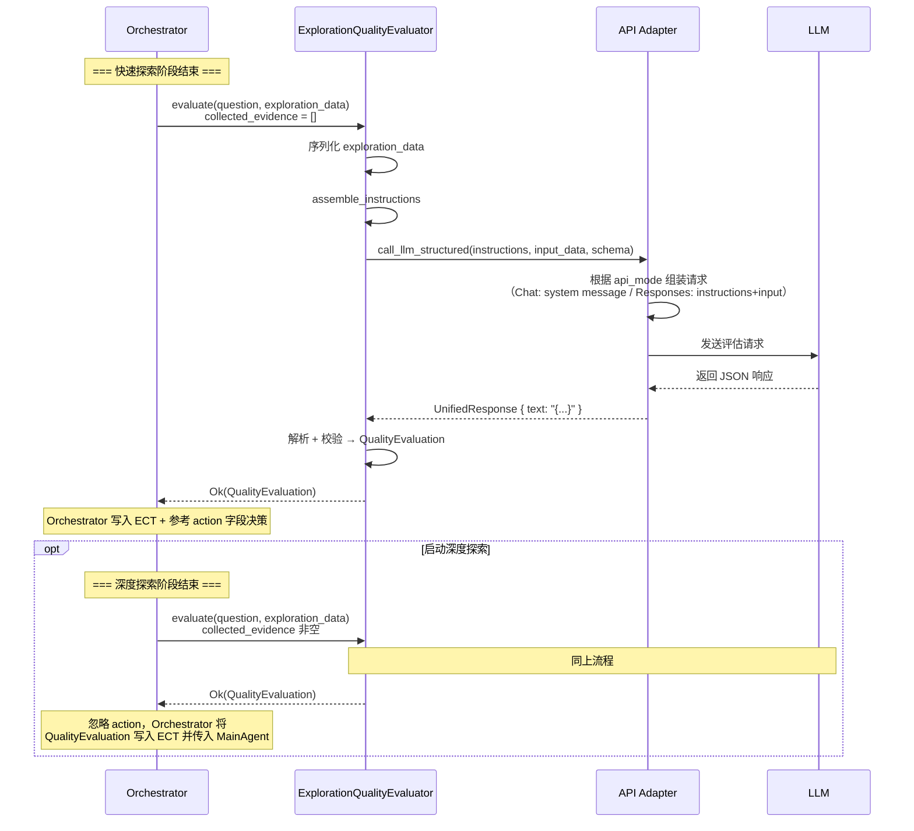

# Explore AI Agent - ExplorationQualityEvaluator 详细设计文档 v1.2

| 属性     | 值                                                                 |
| :------- | :----------------------------------------------------------------- |
| 文档版本 | v1.2                                                               |
| 创建日期 | 2026-04-29                                                         |
| 修订日期 | 2026-04-29                                                         |
| 涉及模块 | agents/quality_evaluator                                           |
| 技术栈   | Rust + async-trait                                                  |
| 关联文档 | [Explore AI Agent 架构设计文档 v1.1](Explore%20AI%20Agent架构设计文档v1.1.md) |
| 关联文档 | [API Adapter 详细设计文档 v1.1](API%20Adapter详细设计文档v1.1.md)   |

---

## 目录

- [1. 总体设计](#1-总体设计)
  - [1.1 模块定位](#11-模块定位)
  - [1.2 核心原则](#12-核心原则)
  - [1.3 架构位置](#13-架构位置)
- [2. 数据结构](#2-数据结构)
  - [2.1 ExplorationAction](#21-explorationaction)
  - [2.2 QualityCriticalFile](#22-qualitycriticalfile)
  - [2.3 QualityEvaluatorInput](#23-qualityevaluatorinput)
  - [2.4 QualityEvaluation](#24-qualityevaluation)
  - [2.5 CollectedEvidence（引用）](#25-collectedevidence引用)
  - [2.6 ExplorationSummary（引用）](#26-explorationsummary引用)
- [3. ExplorationQualityEvaluator 方法详细设计](#3-explorationqualityevaluator-方法详细设计)
  - [3.1 构造](#31-构造)
  - [3.2 evaluate — 执行评估](#32-evaluate--执行评估)
  - [3.3 assemble_instructions — 指令文本生成](#33-assemble_instructions--指令文本生成)
  - [3.4 output_schema — 输出 Schema](#34-output_schema--输出-schema)
  - [3.5 适配层接口：`call_llm_structured`](#35-适配层接口call_llm_structured)
- [4. Prompt 设计](#4-prompt-设计)
  - [4.1 Prompt 模板](#41-prompt-模板)
  - [4.2 变量说明](#42-变量说明)
  - [4.3 API 模式差异处理](#43-api-模式差异处理)
- [5. 结构化输出约束](#5-结构化输出约束)
  - [5.1 JSON Schema 定义](#51-json-schema-定义)
  - [5.2 两种 API 模式的约束构建](#52-两种-api-模式的约束构建)
- [6. 调用时机与上下文](#6-调用时机与上下文)
  - [6.1 快速探索后评估](#61-快速探索后评估)
  - [6.2 深度探索后评估](#62-深度探索后评估)
  - [6.3 调用时序](#63-调用时序)
- [7. 错误处理](#7-错误处理)
- [8. 自动化测试用例](#8-自动化测试用例)
- [9. 附录](#9-附录)

---

## 1. 总体设计

### 1.1 模块定位

ExplorationQualityEvaluator 是系统策略层的**评估决策专家**。它不参与具体的代码搜索或文件读取，而是在探索阶段的关键节点对已有探索数据进行全局评估，输出结构化的质量评估结果供代码 Orchestrator 做流程决策。

**核心职责**：

1. 分析探索数据与用户问题的相关性
2. 判断现有数据是否足以回答用户问题
3. 给出置信度评分和行动建议（回答或继续深度探索）
4. 为 MainAgent 生成精准的探索摘要

### 1.2 核心原则

| 原则 | 说明 |
|:---|:---|
| **全局视角** | 不只看单轮搜索结果，而是综合全部探索数据进行整体判断 |
| **决策建议** | 通过 `action` 字段给出明确的下一步建议，但最终决策权在 Orchestrator |
| **结构化输出** | 通过 JSON Schema + `strict: true` 强制 LLM 输出合法 JSON |
| **无工具调用** | 评估专家不调用任何代码库探索工具，仅基于传入的数据做分析 |
| **协议透明** | 通过 API Adapter 调用 LLM，不感知 Chat/Responses API 差异 |

### 1.3 架构位置

```mermaid
graph TB
    subgraph 调度层
        O[代码 Orchestrator]
    end

    subgraph 策略层
        QE[ExplorationQualityEvaluator]
    end

    subgraph 适配层
        AD[API Adapter]
    end

    subgraph 外部
        LLM[LLM 服务]
    end

    O -->|1. 调用 evaluate| QE
    QE -->|2. call_llm_structured<br/>(instructions, input_data, schema)| AD
    AD -->|3. 请求<br/>(Chat: messages / Responses: instructions+input)| LLM
    LLM -->|4. 响应| AD
    AD -->|5. UnifiedResponse| QE
    QE -->|6. QualityEvaluation| O
```

评估专家仅被 Orchestrator 调用，不与其他 Agent 直接交互。两次调用时机由 Orchestrator 控制：
- **快速探索结束后**：评估三轮关键词搜索的全局结果
- **深度探索结束后**：评估深度探索收集的全部证据

---

## 2. 数据结构

### 2.1 ExplorationAction

```rust
#[derive(Debug, Clone, PartialEq, Eq, Serialize, Deserialize)]
#[serde(rename_all = "snake_case")]
pub enum ExplorationAction {
    Answer,
    DeepExplore,
}
```

| 变体 | JSON 值 | 说明 |
|:---|:---|:---|
| `Answer` | `"answer"` | 当前数据足以回答用户问题，建议进入回答阶段 |
| `DeepExplore` | `"deep_explore"` | 当前数据不足，建议启动深度探索 |

**使用约束**：
- 快速探索后评估时，此字段由 LLM 根据数据完整性决定，Orchestrator 以此为参考判断是否启动深度探索
- 深度探索后评估时，Orchestrator 忽略此字段——深度探索是流程的最后一级，不应再循环。LLM 侧对此无感知（Prompt 和 JSON Schema 在两种场景下相同），LLM 仍可能输出 `"deep_explore"`，但 Orchestrator **不解析、不判断**该字段，直接将 `QualityEvaluation` 整体作为探索摘要传入 MainAgent

> **设计说明**：同一结构体在两种场景下的语义差异由**调用方（Orchestrator）**负责解释，而非在 QE 的数据模型中区分。这样保持了 QE 的无状态纯函数特性——它总是执行相同的"评估探索数据质量"任务，输出相同的 6 字段结构，对输出字段的消费方式不感知。

### 2.2 QualityCriticalFile

```rust
#[derive(Debug, Clone, Serialize, Deserialize)]
pub struct QualityCriticalFile {
    pub path: String,
    pub one_sentence_summary: String,
}
```

| 字段 | 类型 | 说明 |
|:---|:---|:---|
| path | String | 文件相对路径 |
| one_sentence_summary | String | 一句话说明该文件如何帮助回答问题 |

与 `ExplorationSummary` 中的 `CriticalFile`（字段 `summary`）的区别：此结构使用 `one_sentence_summary` 字段名，与架构文档 4.6 节的 JSON Schema 定义严格一致。

### 2.3 QualityEvaluatorInput

```rust
#[derive(Debug, Clone, Serialize, Deserialize)]
pub struct QualityEvaluatorInput {
    pub current_summary: ExplorationSummary,
    #[serde(default)]
    pub collected_evidence: Vec<CollectedEvidence>,
}
```

| 字段 | 类型 | 说明 |
|:---|:---|:---|
| current_summary | ExplorationSummary | 当前探索上下文摘要。快速探索后评估时来自 SearchStrategyAgent 各轮记录的精炼结果；深度探索后评估时来自先前 QE 评估或精炼专家的输出 |
| collected_evidence | Vec\<CollectedEvidence> | 收集到的原始代码证据。快速探索后评估时为空数组（快速探索仅产生摘要，不产生 evidence 结构）；深度探索后评估时为 DeepExplorer 交付的全部原始证据 |

### 2.4 QualityEvaluation

```rust
#[derive(Debug, Clone, Serialize, Deserialize)]
pub struct QualityEvaluation {
    pub key_findings: String,
    pub critical_files: Vec<QualityCriticalFile>,
    pub missing_info: String,
    pub confidence: f64,
    pub action: ExplorationAction,
    pub reason: String,
}
```

| 字段 | 类型 | 说明 |
|:---|:---|:---|
| key_findings | String | 探索数据的核心发现总结（使用用户的语言），1-3 条 |
| critical_files | Vec\<QualityCriticalFile> | 对回答问题最有帮助的 1-3 个文件 |
| missing_info | String | 仍缺失的关键信息。数据已足够时为空字符串 `""` |
| confidence | f64 | 置信度评分，范围 [0.0, 1.0] |
| action | ExplorationAction | 行动建议：`"answer"` 或 `"deep_explore"` |
| reason | String | 给出该评分和建议的简要理由 |

**confidence 评分参考**：

| 情况 | 建议置信度 |
|:---|:---|
| 数据直接包含答案，可完整回答 | 0.8 - 1.0 |
| 数据高度相关，但需少量推理或补充 | 0.5 - 0.7 |
| 仅部分相关或仅有文件名，大量信息缺失 | 0.2 - 0.4 |
| 完全不相关或无有效数据 | 0.0 - 0.1 |

### 2.5 CollectedEvidence（引用）

```rust
// 定义于 agents/deep_explorer.rs
pub struct CollectedEvidence {
    pub file: String,
    pub line: String,
    pub code_snippet: String,
    pub relevance: String,
}
```

此结构由 DeepExplorer 产出，评估专家仅读取使用，不负责构造。

### 2.6 ExplorationSummary（引用）

```rust
// 定义于 context/exploration.rs
pub struct ExplorationSummary {
    pub key_findings: String,
    pub critical_files: Vec<CriticalFile>,
    pub missing_info: String,
    pub confidence: f64,
}
```

注意：`CriticalFile` 的 `summary` 字段与 `QualityCriticalFile` 的 `one_sentence_summary` 字段语义相同但字段名不同，在构造 `QualityEvaluatorInput` 时由 Orchestrator 做字段映射：

```
CriticalFile { path, summary }  →  QualityCriticalFile { path, one_sentence_summary }
```

即 `path` 直接复制，`summary` 映射为 `one_sentence_summary`。Orchestrator 是唯一同时持有两种数据结构的模块，此映射归属 Orchestrator 符合单一数据源原则。

---

## 3. ExplorationQualityEvaluator 方法详细设计

### 3.1 构造

```rust
pub fn new() -> Self
```

无参数构造。评估专家不持有任何内部状态，每次 `evaluate()` 调用完全独立。

```rust
pub fn output_schema() -> &'static str
```

返回 JSON Schema 常量 `QUALITY_EVALUATOR_SCHEMA`（见第 5 节），供 API Adapter 构建结构化输出约束。

### 3.2 evaluate — 执行评估

#### 3.2.1 函数签名

```rust
pub async fn evaluate(
    &self,
    question: &str,
    exploration_data: &QualityEvaluatorInput,
) -> Result<QualityEvaluation, String>
```

| 参数 | 类型 | 说明 |
|:---|:---|:---|
| question | &str | 用户原始问题 |
| exploration_data | &QualityEvaluatorInput | 待评估的探索数据（当前摘要 + 可选证据） |

**返回值**：成功时返回 `QualityEvaluation`；失败时返回错误描述字符串。

#### 3.2.2 处理流程

```mermaid
flowchart TD
    A[接收 question + exploration_data] --> B[序列化 exploration_data 为 JSON Value]
    B --> C{序列化成功?}
    C -- 否 --> Q[返回 Err]
    C -- 是 --> D[调用 assemble_instructions 生成核心指令文本]
    D --> E[从 output_schema 获取 JSON Schema Value]
    E --> F[调用 adapter.call_llm_structured<br/>传入 instructions + input_data + schema]
    F --> G{调用成功?}
    G -- 是 --> H[从 UnifiedResponse.text 提取 JSON 字符串]
    H --> I[JSON 反序列化为 QualityEvaluation]
    I --> J{反序列化成功?}
    J -- 是 --> K[校验 confidence 范围]
    K --> L{0.0 ≤ confidence ≤ 1.0?}
    L -- 是 --> M[校验 action 枚举值]
    M --> N{action 合法?}
    N -- 是 --> O[返回 Ok(QualityEvaluation)]
    N -- 否 --> P[返回 Err]
    L -- 否 --> P
    J -- 否 --> P
    G -- 否 --> P
```

#### 3.2.3 处理步骤详述

**步骤 1：序列化输入数据**

将 `exploration_data: &QualityEvaluatorInput` 序列化为 `serde_json::Value`。若序列化失败，`evaluate()` 直接返回 `Err("Failed to serialize exploration data")`。

**步骤 2：组装指令文本**

调用 `self.assemble_instructions()` 生成核心指令文本（角色定义、工作流程、置信度评分参考、输出格式）。指令文本不含用户问题和探索数据——这两者作为 `input_data` 参数传入适配层（见 3.3 节）。

**步骤 3：调用适配层**

调用 `adapter.call_llm_structured(instructions, input_data, Some(&schema))`（见 3.5 节）。适配层根据 `api_mode` 自动处理 Chat/Responses 的协议差异：
- Chat 模式：指令与数据拼接为 system message，Schema 放入 `response_format`
- Responses 模式：指令放入 `instructions` 字段，数据放入 `input` 字段，Schema 放入 `text.format`

重试逻辑由适配层统一处理（最多 3 次，含正则兜底匹配）。QE 不感知 API 模式差异。

**步骤 4：解析响应**

从 `UnifiedResponse.text` 中提取 JSON 字符串，反序列化为 `QualityEvaluation`。若 `text` 为 `None`，返回 `Err("Empty response from LLM")`。

> **注意**：`UnifiedResponse` 中 `text` 和 `tool_calls` 互斥。评估专家不应触发工具调用，若收到的响应中 `tool_calls` 非空而 `text` 为 `None`，视为异常，返回 `Err("Unexpected tool calls in evaluation response: {tool_names}")`，其中 `tool_names` 为所有 `tool_call.name` 以逗号拼接，便于排查 LLM 异常行为。

**步骤 5：校验**

| 校验项 | 规则 | 失败处理 |
|:---|:---|:---|
| confidence | 0.0 ≤ confidence ≤ 1.0 | 返回 `Err("confidence out of range")` |
| action | 必须为 `"answer"` 或 `"deep_explore"` | 由 serde 反序列化自动校验（未知值反序列化失败） |
| key_findings | 必填，非空字符串 | 由 JSON Schema `strict: true` 在 LLM 侧保证 |
| critical_files | 必填，数组类型 | 由 JSON Schema `strict: true` 保证 |
| missing_info | 必填，字符串类型 | 由 JSON Schema `strict: true` 保证 |
| reason | 必填，非空字符串 | 由 JSON Schema `strict: true` 保证 |

### 3.3 assemble_instructions — 指令文本生成

#### 3.3.1 函数签名

```rust
fn assemble_instructions() -> String
```

#### 3.3.2 设计说明

`assemble_instructions` 返回核心指令文本（角色定义、工作流程、置信度评分参考、输出格式说明与示例）。指令文本**不包含**用户问题和探索数据——这两者由 `evaluate()` 方法序列化为 `serde_json::Value` 后作为 `input_data` 参数传入 `adapter.call_llm_structured()`。

指令模板内容见第 4 节。

#### 3.3.3 与适配层的分工

| 职责 | 负责方 |
|:---|:---|
| 提供核心指令文本（角色、工作流程、输出格式） | QE — `assemble_instructions()` |
| 提供待评估数据（question + exploration_data） | QE — `evaluate()` 中序列化 `QualityEvaluatorInput` |
| 将指令和数据组装为 API 请求（Chat 模式合并为 system message；Responses 模式分别放入 `instructions` / `input` 字段） | 适配层 — `call_llm_structured()` |
| 构建结构化输出约束（JSON Schema） | 适配层 — `build_structured_output_constraint()` |
| 发送请求 + 重试 + 解析响应 | 适配层 — `call_llm_with_retry()`（由 `call_llm_structured` 内部调用） |

QE 不感知 `api_mode`，不调用 `adapter.api_mode()` 或 `adapter.replace_placeholder()`。

### 3.4 output_schema — 输出 Schema

```rust
pub fn output_schema() -> &'static str
```

返回 `QUALITY_EVALUATOR_SCHEMA` 常量，该常量为一个合法的 JSON 字符串，包含 `name`、`strict`、`schema` 三个顶层字段（见第 5 节）。

### 3.5 适配层接口：`call_llm_structured`

评估专家不实现 `DataProvider` trait——它不需要适配层的 `assemble_prompt`（占位符体系不匹配），也不进行工具调用。评估专家直接使用适配层为无工具 Agent 提供的专用方法：

```rust
// 适配层方法（定义于 adapter/api_adapter.rs）
pub async fn call_llm_structured(
    &self,
    instructions: &str,
    input_data: &serde_json::Value,
    output_schema: Option<&serde_json::Value>,
) -> Result<UnifiedResponse, String>
```

| 参数 | 类型 | 说明 |
|:---|:---|:---|
| instructions | &str | QE 的核心指令文本（角色定义、工作流程、置信度表、输出格式说明）。不含用户问题和探索数据 |
| input_data | &serde_json::Value | 待评估的数据，即序列化后的 `QualityEvaluatorInput`（含 `current_summary` 和 `collected_evidence`） |
| output_schema | Option\<&serde_json::Value> | QE 的 JSON Schema 约束，传入 `QUALITY_EVALUATOR_SCHEMA` 解析后的值 |

**适配层内部行为**（模式差异完全由适配层处理，QE 不感知）：

| | Chat 模式 | Responses 模式 |
|:---|:---|:---|
| instructions | 与 input_data 拼接后放入 `messages[0].content`（role=system） | 放入 HTTP 请求体的 `instructions` 字段 |
| input_data | 序列化为 JSON 字符串，嵌入 Prompt 文本 | 序列化为 JSON，放入 HTTP 请求体的 `input` 字段 |
| output_schema | 通过 `build_structured_output_constraint` 放入 `response_format` | 通过 `build_structured_output_constraint` 放入 `text.format` |
| 重试逻辑 | 内部调用 `call_llm_with_retry`，最多 3 次 | 同左 |

**设计说明**：`call_llm_structured` 是 `call_llm_with_retry` 的上层封装。它将"组装 Chat/Responses 请求"的差异逻辑从各 Agent 收拢到适配层，Agent 只需提供指令文本和输入数据，不感知 API 模式。

---

## 4. Prompt 设计

### 4.1 指令模板

此模板由 `assemble_instructions()` 返回，作为 `call_llm_structured` 的 `instructions` 参数。用户问题和探索数据通过 `input_data` 参数传入，不在指令文本中。

```
你是探索质量评估专家。你的职责是分析已有探索数据与用户问题的相关性，判断这些数据是否足以回答用户问题，并生成可供回答使用的精准摘要。

系统会以结构化数据的形式向你提供用户问题和待评估的探索数据，请基于这些内容完成评估。

## 工作流程

1. **分析相关性**：逐一审查探索数据中的每条证据，判断其与用户问题的相关程度。
2. **提炼关键发现**：将分散的证据归纳为 1-3 条核心发现。必须基于实际探索到的数据，不要编造未发现的信息。
3. **识别核心文件**：列出对回答问题最有帮助的 1-3 个文件，并说明理由。
4. **指出缺失信息**：如果现有数据仍不足以完整回答问题，明确说明还缺少什么信息。
5. **给出置信度评分和行动建议**：基于现有数据的完整性和相关性，给出 0.0 到 1.0 的评分及 `action` 建议。

**置信度评分参考**：

| 情况 | 建议置信度 |
| :--- | :--- |
| 数据直接包含答案，可完整回答 | 0.8 - 1.0 |
| 数据高度相关，但需少量推理或补充 | 0.5 - 0.7 |
| 仅部分相关或仅有文件名，大量信息缺失 | 0.2 - 0.4 |
| 完全不相关或无有效数据 | 0.0 - 0.1 |

## 输出格式（强制约束）

你必须只输出一个合法的 JSON 对象，不要包裹任何标记、不要添加任何解释文字。JSON 对象必须包含以下字段：

- `key_findings`：字符串，探索数据的核心发现总结（使用用户的语言）。
- `critical_files`：数组，每个元素为 `{"path": "文件路径", "one_sentence_summary": "一句话说明该文件如何帮助回答问题"}`。如无相关文件则为空数组 `[]`。
- `missing_info`：字符串，仍缺失的关键信息。如数据已足够回答则为空字符串 `""`。
- `confidence`：数字，0.0 到 1.0 之间的置信度评分。
- `action`：字符串，`"answer"` 或 `"deep_explore"`。当置信度达标或问题与代码库无关时建议 `"answer"`；当信息不足需要进一步深入探索时建议 `"deep_explore"`。
- `reason`：字符串，简要说明给出该评分和建议的理由。

**示例输出**：
{
  "key_findings": "找到 BooleanValidator.java 和 BooleanParam 注解定义。探明 validate 方法通过 checkRequired 和 checkDefaultValue 实现校验，但 defaultValue 的默认值装载机制尚未找到。",
  "critical_files": [
    {"path": "core/validation/BooleanValidator.java", "one_sentence_summary": "包含 BooleanValidator 类及完整校验逻辑"},
    {"path": "annotation/BooleanParam.java", "one_sentence_summary": "定义 required 和 defaultValue 两个配置属性"}
  ],
  "missing_info": "defaultValue 的默认值装载机制尚未找到，可能位于配置解析模块。",
  "confidence": 0.85,
  "action": "answer",
  "reason": "核心校验逻辑已查明，整体信息已足够回答用户主要问题。"
}

**警告**：如果你输出的不是合法 JSON，或者缺少上述六个字段中的任何一个，系统将拒绝你的输出并要求你重新生成。
```

### 4.2 数据接口

评估专家通过两个渠道向适配层传递数据：

| 数据 | 传递方式 | 说明 |
|:---|:---|:---|
| 指令文本 | `call_llm_structured` 的 `instructions` 参数 | 核心指令（4.1 节模板），由 `assemble_instructions()` 返回 |
| 待评估数据 | `call_llm_structured` 的 `input_data` 参数 | `QualityEvaluatorInput` 序列化后的 JSON Value，包含 `current_summary` 和 `collected_evidence` |

**`input_data` 示例**（即 `QualityEvaluatorInput` 序列化结果）：

```json
{
  "current_summary": {
    "key_findings": "找到 BooleanValidator.java 和 BooleanParam 注解定义，但缺少 validate 方法的具体实现细节",
    "critical_files": [
      {"path": "core/validation/BooleanValidator.java", "one_sentence_summary": "包含 BooleanValidator 类及 validate 方法签名"}
    ],
    "missing_info": "validate 方法的内部校验逻辑、是否依赖其他配置",
    "confidence": 0.6
  },
  "collected_evidence": [
    {
      "file": "core/validation/BooleanValidator.java",
      "line": "42-47",
      "code_snippet": "if (required && value == null) { throw new ValidationException(...); }",
      "relevance": "required=true 时的校验逻辑"
    }
  ]
}
```

### 4.3 API 模式透明

评估专家的指令模板和数据接口与 API 模式无关。Chat 和 Responses 的协议差异由适配层的 `call_llm_structured` 统一处理（见 3.5 节）：

| 模式 | `instructions` 去向 | `input_data` 去向 | Schema 去向 |
|:---|:---|:---|:---|
| **Chat API** | 与 input_data 拼接后放入 `messages[0].content`（role=system） | 序列化为 JSON 字符串嵌入 Prompt | `response_format` |
| **Responses API** | HTTP 请求体的 `instructions` 字段 | HTTP 请求体的 `input` 字段 | `text.format` |

QE 代码层不调用 `adapter.api_mode()` 或 `adapter.replace_placeholder()`，不持有任何 API 模式相关的条件分支。

---

## 5. 结构化输出约束

### 5.1 JSON Schema 定义

```json
{
  "name": "exploration_quality_evaluator_response",
  "strict": true,
  "schema": {
    "type": "object",
    "properties": {
      "key_findings": { "type": "string" },
      "critical_files": {
        "type": "array",
        "items": {
          "type": "object",
          "properties": {
            "path": { "type": "string" },
            "one_sentence_summary": { "type": "string" }
          },
          "required": ["path", "one_sentence_summary"],
          "additionalProperties": false
        }
      },
      "missing_info": { "type": "string" },
      "confidence": { "type": "number" },
      "action": { "type": "string", "enum": ["answer", "deep_explore"] },
      "reason": { "type": "string" }
    },
    "required": ["key_findings", "critical_files", "missing_info", "confidence", "action", "reason"],
    "additionalProperties": false
  }
}
```

| 约束项 | 说明 |
|:---|:---|
| `strict: true` | 启用 API 的严格模式，LLM 必须严格遵守 Schema，不允许额外字段 |
| `additionalProperties: false` | 拒绝任何未在 Schema 中定义的字段 |
| `enum` 约束 | `action` 字段限定为 `"answer"` 或 `"deep_explore"`，从协议层面杜绝非法值 |
| 全部字段 required | 六个字段均为必填，LLM 不得遗漏任何字段 |

### 5.2 两种 API 模式的约束构建

由 `ApiAdapter::build_structured_output_constraint` 方法根据 `api_mode` 自动构建：

| api_mode | 构建逻辑 |
|:---|:---|
| `Chat` | `{"type": "json_schema", "json_schema": {"name": "exploration_quality_evaluator_response", "strict": true, "schema": {...}}}` → 放入 `response_format` |
| `Responses` | `{"type": "json_schema", "name": "exploration_quality_evaluator_response", "strict": true, "schema": {...}}` → 放入 `text.format` |

两种模式下 Schema 的定义完全相同，仅外层参数名由适配层根据 `api_mode` 选择。评估专家代码层无需感知差异，只需将 Schema 常量传给适配层即可。

---

## 6. 调用时机与上下文

### 6.1 快速探索后评估

| 维度 | 说明 |
|:---|:---|
| **调用节点** | 快速探索 5 轮结束后（或提前终止后） |
| **输入数据** | `current_summary` = 三轮快速探索的精炼摘要（可能经 ExplorationRefinerAgent 压缩）；`collected_evidence` = 空数组 `[]` |
| **action 用途** | Orchestrator **参考**此字段决定是否启动深度探索。`"answer"` → 跳过深度探索，进入回答阶段；`"deep_explore"` → 启动 DeepExplorer |
| **输出处理** | 评估结果返回给 Orchestrator。**Orchestrator** 负责将结果写入 ExplorationContextTool（`type: "summary"`, `source: "ExplorationQualityEvaluator"`），受白名单保护。QE 不直接操作 ECT |

**决策逻辑**（由 Orchestrator 执行，不在本模块范围内）：

```mermaid
flowchart TD
    A[接收 QualityEvaluation] --> B{action == "deep_explore"?}
    B -- 是 --> C{问题与代码库相关?}
    C -- 是 --> D[启动 DeepExplorer]
    C -- 否 --> E[跳过深度探索<br/>直接进入回答阶段]
    B -- 否 --> E
```

### 6.2 深度探索后评估

| 维度 | 说明 |
|:---|:---|
| **调用节点** | DeepExplorer 完成探索后（达到 75 次上限或自行终止） |
| **输入数据** | `current_summary` = 快速探索后 QE 评估摘要（或 ExplorationRefinerAgent 精炼后的版本）；`collected_evidence` = DeepExplorer 交付的全部原始证据（非空） |
| **action 用途** | `action` 字段固定为 `"answer"`（深度探索后不再循环）。Orchestrator **忽略**此字段 |
| **输出处理** | 评估结果作为精准探索摘要传入 MainAgent，供其生成最终答案。Orchestrator 同时将结果写入 ExplorationContextTool（覆盖 `current_summary`） |

### 6.3 调用时序



---

## 7. 错误处理

| 场景 | 处理方式 | 是否中断流程 |
|:---|:---|:---|
| exploration_data 序列化失败 | `evaluate()` 返回 `Err("Failed to serialize exploration data: {details}")` | 是（输入数据不合法，无法继续） |
| LLM 调用失败（含 3 次重试耗尽） | 透传适配层错误，`evaluate()` 返回 `Err` | 是 |
| LLM 返回空响应（text = None） | 返回 `Err("Empty response from LLM")` | 是 |
| JSON 反序列化失败 | 返回 `Err("Failed to parse evaluation JSON: {details}")` | 是（不在本模块做兜底处理；适配层已重试 3 次，若仍非法则上报 Orchestrator） |
| confidence 超出 [0.0, 1.0] | 返回 `Err("confidence out of range [0.0, 1.0]: {value}")` | 是 |
| action 非法值 | 由 serde 反序列化自动拦截（JSON Schema `enum` 约束在 LLM 侧已保证）；若仍出现，返回 `Err` | 是 |

**设计原则**：评估专家的校验是防御性的最后一道关卡。正常情况下，JSON Schema `strict: true` + `enum` 约束已在 LLM 输出侧保证了字段合法性。评估专家的校验主要防范以下极端情况：
- LLM 忽略了 Schema 约束（API 实现 bug）
- 适配层解析异常导致字段值被篡改
- confidence 浮点数超出范围（JSON Schema 的 `type: "number"` 无法约束取值范围）

---

## 8. 自动化测试用例

### 8.1 测试夹具

- 构造标准 `QualityEvaluatorInput` 测试数据（含 `current_summary` 和可选的 `collected_evidence`）
- 构造标准 `QualityEvaluation` 测试数据，覆盖 `action: Answer` 和 `action: DeepExplore` 两种取值
- `evaluate()` 的集成测试通过 mock 适配层（`call_llm_structured` 返回预设的 `UnifiedResponse`）隔离真实 LLM 调用
- 所有单元测试不依赖真实 LLM 调用

### 8.2 数据结构测试

| 用例编号 | 测试场景 | 输入 | 预期结果 |
|:---|:---|:---|:---|
| QE-001 | QualityEvaluation 序列化往返 | 构造完整的 `QualityEvaluation`（含 `action: Answer`） | JSON 序列化后可无损反序列化，所有字段值一致 |
| QE-002 | ExplorationAction 枚举序列化 | `ExplorationAction::Answer` 和 `ExplorationAction::DeepExplore` | 分别序列化为 `"answer"` 和 `"deep_explore"` |
| QE-003 | ExplorationAction 枚举反序列化 | JSON 字符串 `"answer"` 和 `"deep_explore"` | 正确反序列化为对应枚举值 |
| QE-004 | ExplorationAction 非法值反序列化 | JSON 字符串 `"invalid_action"` | 反序列化失败 |
| QE-004b | QualityCriticalFile 序列化往返 | `QualityCriticalFile { path: "src/main.rs", one_sentence_summary: "包含主函数" }` | JSON 序列化后可无损反序列化，`path` 和 `one_sentence_summary` 值一致 |
| QE-004c | QualityEvaluatorInput 序列化往返（含证据） | `current_summary` 非空 + `collected_evidence` 含 2 条证据 | 序列化后反序列化，`current_summary` 和 `collected_evidence` 所有字段值一致 |
| QE-004d | QualityEvaluatorInput 序列化往返（空证据） | `current_summary` 非空 + `collected_evidence: []` | 序列化后反序列化，`collected_evidence` 为空数组，`current_summary` 字段完整 |

### 8.3 构造与 Schema 测试

| 用例编号 | 测试场景 | 输入 | 预期结果 |
|:---|:---|:---|:---|
| QE-007 | 构造评估专家 | `ExplorationQualityEvaluator::new()` | 返回实例，不 panic |
| QE-008 | output_schema 返回合法 JSON | `output_schema()` | 返回值可解析为 JSON，含 `name`、`strict`、`schema` 三个字段 |
| QE-009 | output_schema 的 name 字段 | `output_schema()` | `name` = `"exploration_quality_evaluator_response"` |
| QE-010 | output_schema 含全部 6 个 required 字段 | 解析 `output_schema()` → `schema.required` | 包含 `key_findings`, `critical_files`, `missing_info`, `confidence`, `action`, `reason` |
| QE-011 | output_schema 含 action 的 enum 约束 | 解析 `output_schema()` → `schema.properties.action` | `enum` = `["answer", "deep_explore"]` |
| QE-012 | output_schema 的 strict 为 true | 解析 `output_schema()` | `strict` = `true` |

### 8.5 Prompt 组装测试

| 用例编号 | 测试场景 | 输入 | 预期结果 |
|:---|:---|:---|:---|
| QE-013 | assemble_instructions 返回非空字符串 | 调用 `assemble_instructions()` | 返回值包含 `探索质量评估专家` 和 `工作流程` |
| QE-014 | 指令文本包含置信度评分参考表 | 调用 `assemble_instructions()` | 结果含置信度评分参考表的关键内容 |
| QE-015 | 指令文本包含示例输出 | 调用 `assemble_instructions()` | 结果含 `示例输出` 章节和样例 JSON |

### 8.6 校验逻辑测试

| 用例编号 | 测试场景 | 输入 | 预期结果 |
|:---|:---|:---|:---|
| QE-026 | confidence = 0.0 合法 | QualityEvaluation.confidence = 0.0 | 校验通过 |
| QE-027 | confidence = 1.0 合法 | QualityEvaluation.confidence = 1.0 | 校验通过 |
| QE-028 | confidence = 0.5 合法 | QualityEvaluation.confidence = 0.5 | 校验通过 |
| QE-029 | confidence < 0.0 非法 | QualityEvaluation.confidence = -0.1 | 校验失败，返回 Err |
| QE-030 | confidence > 1.0 非法 | QualityEvaluation.confidence = 1.5 | 校验失败，返回 Err |
| QE-031 | action = "answer" 合法 | QualityEvaluation.action = Answer | JSON 反序列化成功 |
| QE-032 | action = "deep_explore" 合法 | QualityEvaluation.action = DeepExplore | JSON 反序列化成功 |

### 8.7 集成测试

| 用例编号 | 测试场景 | 输入 | 预期结果 |
|:---|:---|:---|:---|
| QE-033 | 快速探索后评估场景 | collected_evidence = [] | 传入 `call_llm_structured` 的 input_data 中 `collected_evidence` 为空数组 |
| QE-034 | 深度探索后评估场景 | collected_evidence 含 3 条证据 | 传入 `call_llm_structured` 的 input_data 中 `collected_evidence` 含 3 条 |
| QE-035 | evaluate 在序列化失败时返回 Err | QualityEvaluatorInput 中包含无法序列化的字段 | `evaluate()` 返回 `Err`，错误信息含 "serialize" |

---

## 9. 附录

### 9.1 与架构文档的对应关系

| 架构文档章节 | 对应本模块 | 实现状态 |
|:---|:---|:---|
| 4.6 ExplorationQualityEvaluator Prompt | 第 4 节 | 本文档设计 |
| 4.6 变量说明 | 第 4.2 节 | 本文档细化 |
| 4.6 输出格式的强制保证 | 第 5 节 | 本文档设计 |
| 4.6 调用时机与用途 | 第 6 节 | 本文档设计 |
| 4.6 action 枚举定义 | 第 2.1 节 | 代码已定义 |
| 4.6 QualityEvaluatorInput 结构 | 第 2.3 节 | 代码已定义 |

### 9.2 与其他模块的接口

| 调用方 | 调用方法 | 说明 |
|:---|:---|:---|
| Orchestrator | `evaluate(question, exploration_data)` | 唯一调用入口。Orchestrator 负责在正确的时机（快速探索后、深度探索后）调用，并将返回的 `QualityEvaluation` 写入 ExplorationContextTool（`type: "summary"`, `source: "ExplorationQualityEvaluator"`），同时将 `QualityCriticalFile.one_sentence_summary` 映射为 `CriticalFile.one_sentence_summary` |
| ApiAdapter | `call_llm_structured(instructions, input_data, schema)` | QE 的唯一适配层入口。适配层内部处理 Chat/Responses 协议差异、结构化输出约束构建和重试 |
| ApiAdapter | `output_schema()` | 返回 `QUALITY_EVALUATOR_SCHEMA` 常量，由 `evaluate()` 解析后传入 `call_llm_structured` |

### 9.3 不变式与约束

| 约束 | 说明 |
|:---|:---|
| **无状态** | 评估专家不持有任何可变状态，每次 `evaluate()` 调用完全独立 |
| **无工具调用** | 评估专家不向适配层注册任何工具（`call_llm_structured` 不传递工具定义），Prompt 中明确不提供任何工具 |
| **置信度范围** | `confidence` 必须满足 0.0 ≤ confidence ≤ 1.0 |
| **action 取值** | 仅允许 `"answer"` 和 `"deep_explore"` 两个值 |
| **两次调用独立** | 快速探索后的评估和深度探索后的评估使用完全相同的 `evaluate()` 方法，差异仅在于 `exploration_data` 的内容（`collected_evidence` 是否为空） |

### 9.4 扩展方向（后续版本）

| 方向 | 说明 |
|:---|:---|
| **多轮评估** | 当前每次调用生成一次评估。后续可支持"评估 → 补充探索 → 再评估"的循环 |
| **评估质量反馈** | 记录评估建议与实际回答质量的对比，用于优化 Prompt |
| **评估结果缓存** | 对相同 `exploration_data` 的重复评估返回缓存结果 |

---

## 修订记录

| 版本 | 日期 | 修订人 | 变更说明 |
|:---|:---|:---|:---|
| v1.0 | 2026-04-28 | sdfang1053 | 初版：流程决策模块 |
| v1.1 | 2026-04-29 | sdfang1053 | 增加测试审计报告、完善 schema |
| v1.2 | 2026-05-08 | sdfang1053 | 废除：由新版 QE 文档替代 |
