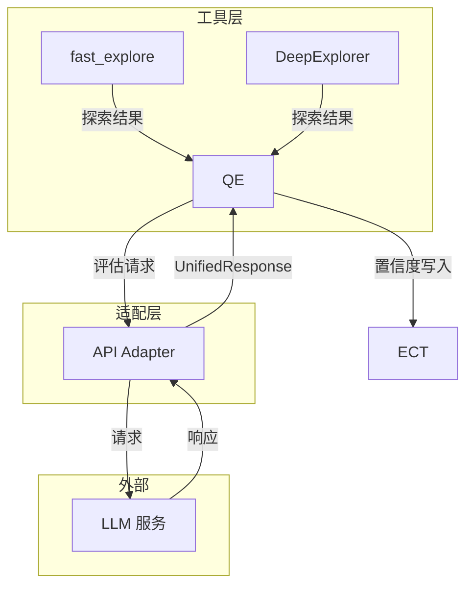
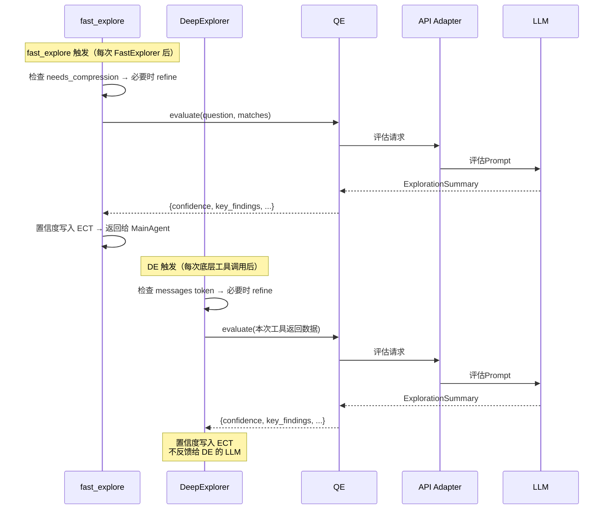

# Explore AI Agent - ExplorationQualityEvaluator 详细设计文档 v1.2

| 属性 | 值 |
|:---|:---|
| 文档版本 | v1.3 |
| 创建日期 | 2026-04-29 |
| 修订日期 | 2026-05-09 |
| 涉及模块 | agents/quality_evaluator |
| 技术栈 | Rust + async-trait |
| 关联文档 | [Explore AI Agent 架构设计文档 v1.3](Explore%20AI%20Agent架构设计文档v1.1.md) |
| 关联文档 | [ToolResultRefinerAgent 详细设计文档 v1.0](ToolResultRefinerAgent详细设计文档v1.0.md) |

> **v1.3 变更说明**：明确 QE 输出仅写入 ECT，不再反馈给 DE 的 LLM 上下文。DE 的 LLM 反馈职责由 ToolResultRefinerAgent 接管。QE 专注为后续上下文精炼提供置信度排序依据。

---

## 目录

- [1. 总体设计](#1-总体设计)
- [2. 数据结构](#2-数据结构)
- [3. 方法详细设计](#3-方法详细设计)
- [4. Prompt 设计](#4-prompt-设计)
- [5. 结构化输出约束](#5-结构化输出约束)
- [6. 调用时机与上下文](#6-调用时机与上下文)
- [7. 错误处理](#7-错误处理)
- [8. 测试设计](#8-测试设计)
- [9. 附录](#9-附录)

---

## 1. 总体设计

### 1.1 模块定位

ExplorationQualityEvaluator 是系统的**轻量评分工具**。它不参与代码探索或流程决策，只做一件事：对探索数据打分——评估探索结果与用户问题的相关性，输出置信度评分和简要摘要。

**调用方**：fast_explore（每次 FastExplorer 执行后）和 DE（每次底层工具调用后），代码层自动触发。**输出仅写入 ECT**，不为 DE 的 LLM 上下文提供反馈（该职责由 ToolResultRefinerAgent 负责）。

**核心职责**：

1. 分析探索数据与用户问题的相关性
2. 给出置信度评分（0.0~1.0），为后续上下文精炼做铺垫（低分内容优先丢弃）
3. 输出核心发现总结和关键文件列表
4. 标注仍缺失的信息

**与 v1.1 的关键区别**：

| | v1.1 | v1.2 |
|:---|:---|:---|
| 角色 | 流程决策专家（输出 `action`） | 轻量评分工具（仅打分） |
| 调用方 | Orchestrator | fast_explore / DE 代码层内部触发 |
| 输出 | `QualityEvaluation`（6 字段，含 action） | `ExplorationSummary`（4 字段，无 action） |
| 调用频率 | 每次问题最多 2 次 | fast_explore 每次执行后 1 次；DE 每次工具调用后 1 次 |

### 1.2 核心原则

| 原则 | 说明 |
|:---|:---|
| **仅打分** | 只输出置信度评分和摘要，不做流程决策 |
| **结构化输出** | 通过 JSON Schema + `strict: true` 强制 LLM 输出合法 JSON |
| **无工具调用** | 不调用任何代码库探索工具，仅基于传入数据做分析 |
| **调用方透明** | QE 不感知调用方是谁（fast_explore 或 DE），输入格式统一 |

### 1.3 架构位置



---

## 2. 数据结构

### 2.1 输入

QE 接收统一的探索数据，由调用方代码层组装：

| 字段 | 类型 | 说明 |
|:---|:---|:---|
| question | string | 用户原始问题 |
| exploration_data | object | 探索结果（代码层截断后）。fast_explore 时为 matches 摘要；DE 时为本次工具返回数据摘要 |

### 2.2 输入数据截断

探索数据可能非常大（如 search_content 返回 40K+ chars）。QE 本身是一次 LLM 调用，全量传入会超时。代码层在调 QE 之前必须做截断——QE 仅需代表性样本即可判断"本轮探索的质量"，评分写入 ECT 供后续精炼排序使用。

**截断策略**：

| 保留 | 丢弃 | 理由 |
|:---|:---|:---|
| 匹配总数、命中文件数 | — | 统计值，不占空间，反映覆盖面 |
| Top 5-10 条最相关匹配（含 file + line + 前后 2 行上下文） | 其余 90% 的匹配行 | Top 匹配是 FastExplorer 排序后的最优结果，代表质量 |
| 匹配到的文件列表（纯路径） | 每个文件的详细信息 | 文件列表反映搜索方向，纯路径列表足够 |
| — | 完整上下文内容 | 上下游代码由后续 DE deep_explore 处理 |

截断后目标：**1500-2500 chars**。QE 的评分标准（找到直接答案 → 0.8+、找到相关信息 → 0.5-0.7、只找到文件名 → 0.2-0.4）基于 Top 5 + 文件列表 + 统计数据完全可以做出判断。

```json
// exploration_data 截断后示例
{
  "total_matches": 142,
  "files_matched": 23,
  "top_matches": [
    {"file": "src/backtest/engine.py", "line": "142", "content": "def run_backtest(self, ...)"},
    {"file": "src/backtest/engine.py", "line": "215", "content": "results = self.calculate_metrics(...)"},
    // ... 最多 10 条
  ],
  "file_list": ["src/backtest/engine.py", "src/backtest/config.py", ...]
}
```

### 2.3 输出 — ExplorationSummary

```rust
pub struct ExplorationSummary {
    pub key_findings: String,
    pub critical_files: Vec<CriticalFile>,
    pub missing_info: String,
    pub confidence: f64,
}

pub struct CriticalFile {
    pub path: String,
    pub one_sentence_summary: String,
}
```

| 字段 | 类型 | 说明 |
|:---|:---|:---|
| key_findings | String | 核心发现总结（1-3 条） |
| critical_files | Vec\<CriticalFile> | 对回答问题有帮助的文件列表 |
| missing_info | String | 仍缺失的关键信息。如无则为空字符串 |
| confidence | f64 | 综合置信度评分，范围 [0.0, 1.0] |

> **v1.2 注意**：无 `action` 字段。流程决策由 MainAgent 负责。

### 2.4 JSON Schema（response_format 约束）

```json
{
  "name": "qe_evaluation",
  "strict": true,
  "schema": {
    "type": "object",
    "properties": {
      "key_findings": {"type": "string"},
      "critical_files": {
        "type": "array",
        "items": {
          "type": "object",
          "properties": {
            "path": {"type": "string"},
            "one_sentence_summary": {"type": "string"}
          },
          "required": ["path", "one_sentence_summary"],
          "additionalProperties": false
        }
      },
      "missing_info": {"type": "string"},
      "confidence": {"type": "number"}
    },
    "required": ["key_findings", "critical_files", "missing_info", "confidence"],
    "additionalProperties": false
  }
}
```

---

## 3. 方法详细设计

### 3.1 构造

```rust
pub fn new() -> Self
```

无参数构造。不持有任何内部状态。

### 3.2 evaluate — 执行评估

#### 3.2.1 函数签名

```rust
pub async fn evaluate(
    &self,
    question: &str,
    exploration_data: &serde_json::Value,
    client: &dyn LlmStructuredClient,
) -> Result<ExplorationSummary, String>
```

| 参数 | 类型 | 说明 |
|:---|:---|:---|
| question | &str | 用户原始问题 |
| exploration_data | &serde_json::Value | 探索结果数据（由调用方代码层组装） |
| client | &dyn LlmStructuredClient | LLM 客户端 |

#### 3.2.2 处理步骤

1. 组装评估 Prompt（含 question + exploration_data）
2. 调用 `client.call_llm_structured(instructions, input_data, schema)` 
3. 解析 JSON → `ExplorationSummary`
4. 校验 confidence ∈ [0.0, 1.0]
5. 返回结果

---

## 4. Prompt 设计

### 4.1 评估 Prompt

```
你是搜索质量评估专家。评估探索数据与用户问题的相关性，给出置信度评分。

{question}
{exploration_data}

## 评估标准

检查探索数据中的匹配内容是否包含直接回答用户问题的信息。

| 情况 | 建议置信度 |
|:---|:---|
| 找到直接答案（如相关代码片段、配置说明） | 0.8 - 1.0 |
| 找到相关信息，但需要进一步整合或确认 | 0.5 - 0.7 |
| 只找到文件名，没有实质内容 | 0.2 - 0.4 |
| 探索后确认项目不包含该功能 | 0.1 - 0.2 |
| 完全不相关或没有任何搜索结果 | 0.0 |

## 输出格式

只输出一个 JSON 对象：

{
  "key_findings": "核心发现总结",
  "critical_files": [{"path": "文件路径", "one_sentence_summary": "一句话说明为何相关"}],
  "missing_info": "仍缺失的关键信息。如无则写\"无\"",
  "confidence": 0.0~1.0
}
```

### 4.2 变量说明

| 变量 | 类型 | 说明 | 来源 |
|:---|:---|:---|:---|
| `{question}` | string | 用户原始问题 | 调用方传入 |
| `{exploration_data}` | object | 探索结果数据 | fast_explore 为 matches 摘要；DE 为 collected_evidence 摘要 |

---

## 5. 结构化输出约束

与 ExplorationRefinerAgent 共用同一套 `ExplorationSummary` 输出格式。JSON Schema 定义见 2.4 节。

### 5.1 输出合规保障（三层）

| 层次 | 机制 | 作用 | 失败行为 |
|:---|:---|:---|:---|
| 第一层 | `response_format: {"type": "json_object"}` | LLM 必须输出合法 JSON，不可能输出裸文本 | LLM 侧拒绝非 JSON 输出 |
| 第二层 | JSON Schema `strict: true` + `additionalProperties: false` + 4 字段 `required` | 字段名、类型、数量精确约束——少了 `confidence`、多了未定义字段都会被 LLM 侧拒绝 | LLM 必须重新生成 |
| 第三层 | 代码层 `serde_json::from_str` + confidence 范围校验 | 最终兜底。反序列化失败或 `confidence ∉ [0,1]` 返回 `Err` | 调用方收到 `Err`，使用默认置信度 0.5 |

### 5.2 两种 API 模式的约束构建

| api_mode | 构建逻辑 |
|:---|:---|
| Chat | `{"type": "json_schema", "json_schema": {"name": "qe_evaluation", "strict": true, "schema": {...}}}` → `response_format` |
| Responses | `{"type": "json_schema", "name": "qe_evaluation", "strict": true, "schema": {...}}` → `text.format` |

---

## 6. 调用时机与上下文

### 6.1 触发条件

| 触发方 | 触发时机 | 输入数据 |
|:---|:---|:---|
| fast_explore | FastExplorer 执行后，数据返回 MainAgent 之前 | `question` + `matches` 摘要 |
| DeepExplorer | DE 每次底层工具调用返回后 | `question` + 本次工具返回数据 |

> **核心**：QE 的唯一职责是为后续上下文精炼做铺垫——给探索数据打置信度分写入 ECT，精炼时低分内容优先丢弃。**QE 输出不反馈给 DE 的 LLM**（DE 的 LLM 上下文反馈由 ToolResultRefinerAgent 负责）。

### 6.2 调用时序



---

## 7. 错误处理

| 场景 | 处理方式 | 是否中断 |
|:---|:---|:---|
| LLM 返回非法 JSON | 透传适配层错误 | 是（调用方收到 Err） |
| confidence 超出 [0.0, 1.0] | 返回 `Err("confidence out of range")` | 是 |
| LLM 返回空响应 | 返回 `Err("Empty response")` | 是 |

> QE 失败不阻塞探索流程。调用方（fast_explore/DE）收到 Err 后继续，使用默认置信度 0.5。

---

## 8. 测试设计

### 8.1 测试策略

| 类型 | 数量 | 覆盖范围 | 依赖 |
|:---|:---|:---|:---|
| 自动化单元 | 6 | Schema 结构、Prompt 组装 | 无 |
| 自动化集成 | 20 | evaluate、截断、异常、边界、调用频率 | Mock LLM |
| 手工 | 1 | QE 评分与精炼联动 | 真实 LLM |

### 8.2 自动化单元测试

| 编号 | 测试场景 | 输入 | 断言 |
|:---|:---|:---|:---|
| QE-001 | Schema 返回合法 JSON | `output_schema()` | 可解析，含 `name`、`strict`、`schema` |
| QE-002 | Schema 的 required 含 4 字段 | `output_schema()` | 含 `key_findings`、`critical_files`、`missing_info`、`confidence` |
| QE-003 | Schema 不含 action 字段 | `output_schema()` | 不含 `action`、`reason` |
| QE-004 | Prompt 含评估标准表 | `assemble_instructions()` | 含置信度评分表（0.0 ~ 1.0 及对应情况） |
| QE-005 | Prompt 不含 action 引导 | `assemble_instructions()` | 不含 `"action"`、`"answer"`、`"deep_explore"` 等决策引导词 |
| QE-006 | Prompt 含截断数据占位符 | `assemble_instructions()` | 含 `{exploration_data}` 占位符 |

### 8.3 自动化集成测试

#### 8.3.1 正常评估

| 编号 | 测试场景 | Mock 配置 | 断言 |
|:---|:---|:---|:---|
| QE-010 | 正常评估流程 | Mock LLM 返回 `{"key_findings":"发现核心代码","critical_files":[{"path":"src/main.rs","one_sentence_summary":"入口"}],"missing_info":"","confidence":0.8}` | `evaluate()` 返回 `Ok`；`confidence=0.8`；`key_findings` 和 `critical_files` 与 Mock 一致 |
| QE-011 | 大数据输入被截断后评估 | exploration_data 包含 40K+ chars 的模拟搜索数据 | `evaluate()` 返回 `Ok`；传入 LLM 的 exploration_data 已被代码层截断至 2500 chars 以内 |
| QE-012 | 空探索数据 | exploration_data 为 `{"total_matches":0,"top_matches":[],"file_list":[]}` | `evaluate()` 返回 `Ok`；`confidence` 应为 0.0 或接近 0.0 |
| QE-013 | 仅匹配到文件名无实质内容 | exploration_data 含匹配但 top_matches 的 content 为空 | `evaluate()` 返回 `Ok`；`confidence` 在 0.2-0.4 范围内 |
| QE-014 | 找到直接答案 | exploration_data 的 top_matches 含明确代码片段 | `evaluate()` 返回 `Ok`；`confidence` 在 0.8-1.0 范围内 |

#### 8.3.2 异常处理

| 编号 | 测试场景 | Mock 配置 | 断言 |
|:---|:---|:---|:---|
| QE-020 | confidence 超范围（>1.0） | Mock LLM 返回 `confidence: 1.5` | `evaluate()` 返回 `Err`，含 "confidence out of range" |
| QE-021 | confidence 负数 | Mock LLM 返回 `confidence: -0.1` | `evaluate()` 返回 `Err`，含 "confidence out of range" |
| QE-022 | LLM 返回非法 JSON | Mock 返回纯文本 "not json" | `evaluate()` 返回 `Err` |
| QE-023 | LLM 返回空响应 | Mock 返回 `text: None` | `evaluate()` 返回 `Err`，含 "Empty response" |
| QE-024 | LLM 返回缺少 required 字段 | Mock 返回 `{"confidence": 0.5}`（缺 key_findings 等） | `evaluate()` 返回 `Err`（反序列化失败） |
| QE-025 | QE 失败后调用方使用默认置信度 | Mock LLM 返回 `Err` | 调用方代码层：收到 `Err` → 使用默认置信度 0.5 写入 ECT，流程不中断 |

#### 8.3.3 调用频率

| 编号 | 测试场景 | Mock 配置 | 断言 |
|:---|:---|:---|:---|
| QE-030 | DE 每次工具调用都触发 QE | DE 模拟循环：3 次 tool_call + 1 次 done | QE 被调用 3 次（每次 tool_call 后 1 次），done 不触发 |
| QE-031 | fast_explore 触发 QE | fast_explore 执行 FastExplorer 后 | QE 被调用 1 次，在结果显示返回 MainAgent 之前 |

#### 8.3.4 边界情况

| 编号 | 测试场景 | Mock 配置 | 断言 |
|:---|:---|:---|:---|
| QE-040 | key_findings 为空字符串 | Mock LLM 返回 `{"key_findings":"","critical_files":[],"missing_info":"","confidence":0.5}` | `evaluate()` 返回 `Ok`（空字符串是合法的 string 值） |
| QE-041 | critical_files 为空数组 | Mock LLM 返回 `{"key_findings":"无发现","critical_files":[],"missing_info":"全部缺失","confidence":0.1}` | `evaluate()` 返回 `Ok` |
| QE-042 | confidence 边界 0.0 | Mock LLM 返回 `confidence: 0.0` | `evaluate()` 返回 `Ok`；`confidence=0.0` |
| QE-043 | confidence 边界 1.0 | Mock LLM 返回 `confidence: 1.0` | `evaluate()` 返回 `Ok`；`confidence=1.0` |

### 8.4 手工测试

| 编号 | 场景 | 前提条件 | 步骤 | 预期 |
|:---|:---|:---|:---|:---|
| QE-M01 | QE 评分与精炼联动 | 真实 LLM，多轮探索后 ECT 积累了大量记录 | 1. 触发多轮探索使 ECT 超过精炼阈值 2. 观察精炼日志：低 QE 置信度的记录被优先删除 | 精炼后 ECT 中低分记录减少，高价值线索保留 |

---

## 9. 附录

### 9.1 与其他模块的接口

| 调用方 | 调用方法 | 说明 |
|:---|:---|:---|
| fast_explore 代码层 | `evaluate(question, matches, client)` | 每次 FastExplorer 执行后触发，置信度写入 ECT |
| DE 代码层 | `evaluate(question, collected_evidence, client)` | DE 每次工具调用返回后触发，置信度写入 ECT（不反馈给 DE LLM） |

### 9.2 不变式与约束

| 约束 | 说明 |
|:---|:---|
| **无状态** | 每次 `evaluate()` 调用完全独立 |
| **仅打分** | 不输出 `action`，不参与流程决策 |
| **仅写 ECT** | 输出仅写入 ECT，不反馈给 DE 或 fast_explore 的 LLM 上下文 |
| **无工具调用** | 不注册任何工具 |
| **confidence 范围** | 0.0 ≤ confidence ≤ 1.0 |

---

## 修订记录

| 版本 | 日期 | 修订人 | 变更说明 |
|:---|:---|:---|:---|
| v1.0 | 2026-04-28 | sdfang1053 | 初版：流程决策模块（输出 action: answer/deep_explore） |
| v1.1 | 2026-04-29 | sdfang1053 | 增加测试审计报告，完善 schema 定义 |
| v1.2 | 2026-05-08 | sdfang1053 | 改为轻量评分工具（仅输出置信度和摘要），流程决策移至 MainAgent |
| v1.3 | 2026-05-09 | sdfang1053 | 明确输出仅写 ECT 不反馈 DE LLM，DE 反馈职责移交 TR |
