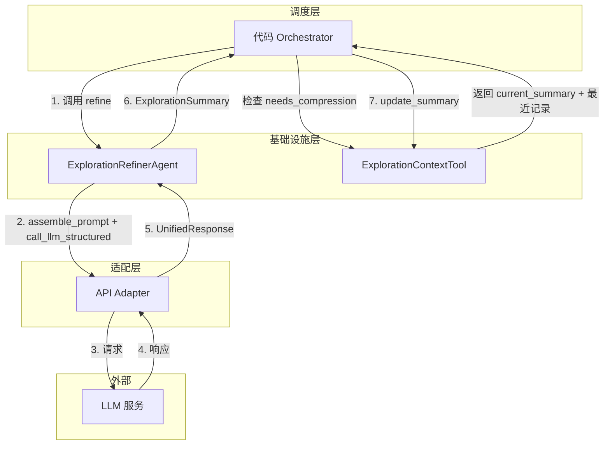
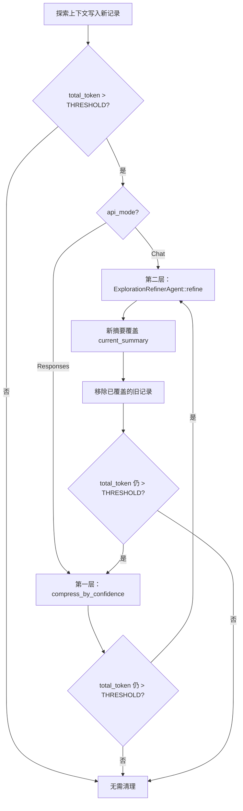
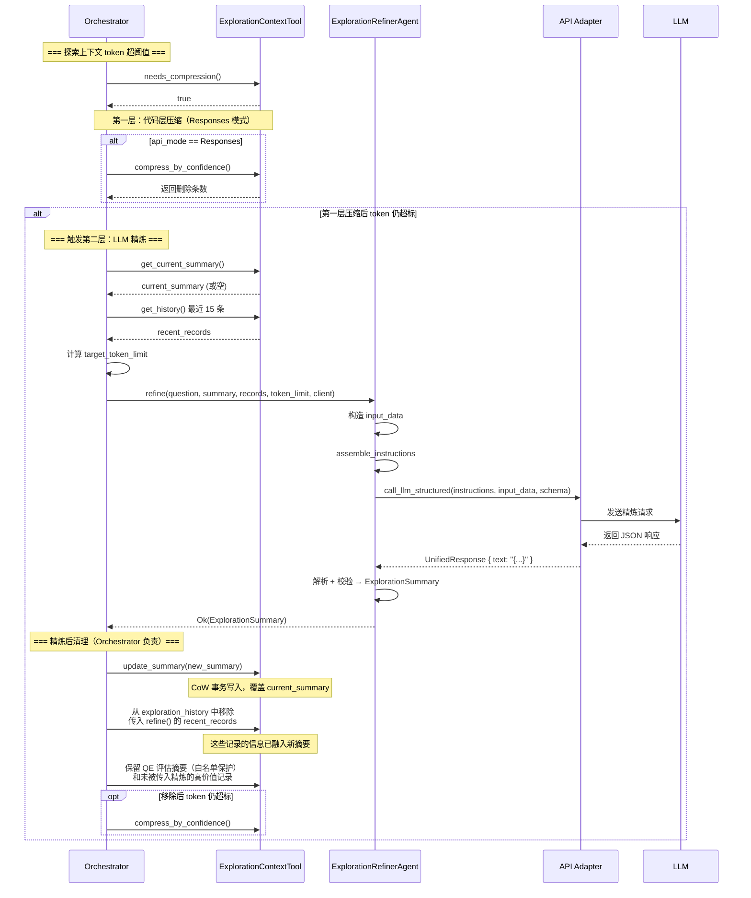

# Explore AI Agent - ExplorationRefinerAgent 详细设计文档 v1.0

| 属性     | 值                                                                 |
| :------- | :----------------------------------------------------------------- |
| 文档版本 | v1.0                                                               |
| 创建日期 | 2026-04-30                                                         |
| 涉及模块 | agents/exploration_refiner                                          |
| 技术栈   | Rust + async-trait                                                  |
| 关联文档 | [Explore AI Agent 架构设计文档 v1.1](Explore%20AI%20Agent架构设计文档v1.1.md) |
| 关联文档 | [上下文管理工具详细设计文档 v1.1](上下文管理工具详细设计文档v1.1.md)   |

---

## 目录

- [1. 总体设计](#1-总体设计)
  - [1.1 模块定位](#11-模块定位)
  - [1.2 核心原则](#12-核心原则)
  - [1.3 架构位置](#13-架构位置)
- [2. 数据结构](#2-数据结构)
  - [2.1 RefinerInput](#21-refinerinput)
  - [2.2 输出结构（引用 ExplorationSummary）](#22-输出结构引用-explorationsummary)
  - [2.3 相关类型](#23-相关类型)
- [3. ExplorationRefinerAgent 方法详细设计](#3-explorationrefineragent-方法详细设计)
  - [3.1 构造](#31-构造)
  - [3.2 refine — 执行精炼](#32-refine--执行精炼)
  - [3.3 assemble_prompt — Prompt 组装](#33-assemble_prompt--prompt-组装)
  - [3.4 output_schema — 输出 Schema](#34-output_schema--输出-schema)
- [4. Prompt 设计](#4-prompt-设计)
  - [4.1 Prompt 模板](#41-prompt-模板)
  - [4.2 变量说明](#42-变量说明)
  - [4.3 API 模式差异处理](#43-api-模式差异处理)
- [5. 结构化输出约束](#5-结构化输出约束)
  - [5.1 JSON Schema 定义](#51-json-schema-定义)
  - [5.2 两种 API 模式的约束构建](#52-两种-api-模式的约束构建)
- [6. 调用时机与上下文](#6-调用时机与上下文)
  - [6.1 触发条件](#61-触发条件)
  - [6.2 数据准备](#62-数据准备)
  - [6.3 调用时序](#63-调用时序)
- [7. 错误处理](#7-错误处理)
- [8. 自动化测试用例](#8-自动化测试用例)
- [9. 附录](#9-附录)

---

## 1. 总体设计

### 1.1 模块定位

ExplorationRefinerAgent 是系统基础设施层的**上下文精炼专家**。它不参与代码搜索或文件读取，而是在探索上下文 token 超过阈值时，对已有的探索摘要和最新探索记录进行增量融合，输出压缩后的高质量摘要，防止探索上下文在长流程中膨胀。

**核心职责**：

1. 以当前 `current_summary` 为基础，融入最近 N 条探索记录中的新增信息
2. 筛除重复信息、已证伪线索和无关数据
3. 在给定 token 预算内输出精炼摘要
4. 输出直接覆盖 ExplorationContextTool 的 `current_summary`

### 1.2 核心原则

| 原则 | 说明 |
|:---|:---|
| **增量精炼** | 以现有摘要为基础，只融入新增信息，不从零重新总结 |
| **信息筛选** | 优先保留代码片段位置和核心文件路径，丢弃重复和无关信息 |
| **结构化输出** | 通过 JSON Schema + `strict: true` 强制 LLM 输出合法 JSON |
| **无工具调用** | 精炼专家不调用任何代码库探索工具，仅基于传入的数据做分析 |
| **适配层注入** | 通过 `&dyn LlmStructuredClient` 调用 LLM，Chat/Responses 差异由适配层处理 |

### 1.3 架构位置



精炼专家仅被 Orchestrator 调用，不与其他 Agent 直接交互。调用发生在探索上下文 token 超阈值的节点。

---

## 2. 数据结构

### 2.1 RefinerInput

精炼专家接收 4 项输入，由 Orchestrator 从 ExplorationContextTool 中提取并传入：

| 字段 | 类型 | 来源 | 说明 |
|:---|:---|:---|:---|
| user_question | &str | 用户输入，由 Orchestrator 透传 | 用户原始问题，帮助精炼专家判断信息相关性 |
| current_summary | &ExplorationSummary | ExplorationContextTool.current_summary | 当前已精炼的探索摘要，精炼必须以它为基础 |
| recent_records | &[ExplorationRecord] | ExplorationContextTool.exploration_history 尾部 | 最近 15 条探索记录（滚动窗口），其中的新增信息将被融入摘要 |
| target_token_limit | usize | 代码层传入 | 精炼后摘要的目标 Token 数上限 |

### 2.2 输出结构（引用 ExplorationSummary）

精炼专家的输出复用 `ExplorationSummary` 结构（定义于 `context/exploration.rs`）：

```rust
pub struct ExplorationSummary {
    pub key_findings: String,
    pub critical_files: Vec<CriticalFile>,
    pub missing_info: String,
    pub confidence: f64,
}

pub struct CriticalFile {
    pub path: String,
    pub one_sentence_summary: String,
}
```

| 字段 | 类型 | 说明 |
|:---|:---|:---|
| key_findings | String | 精炼后的核心发现总结（1-3 条） |
| critical_files | Vec\<CriticalFile> | 对回答问题最有帮助的文件列表（1-3 个） |
| missing_info | String | 仍缺失的关键信息。如无则为空字符串 `""` |
| confidence | f64 | 综合置信度评分，范围 [0.0, 1.0] |

> **注意**：与 `QualityEvaluation`（6 字段）不同，`ExplorationSummary` 不含 `action` 和 `reason` 字段。精炼专家的输出是一个纯粹的信息摘要，不参与流程决策。

### 2.3 相关类型

**ExplorationRecord**（引用，定义于 `context/exploration.rs`）：

```rust
// #[serde(tag = "type")] 自动为每个变体生成 "type" 字段：
//   Summary  → "type": "summary"
//   ToolCall → "type": "tool_call"
// 该字段由 serde 在序列化/反序列化时自动处理，非结构体直接字段。
pub enum ExplorationRecord {
    Summary {
        source: String,
        data: ExplorationSummary,
        confidence: f64,
        timestamp: DateTime<Utc>,
    },
    ToolCall {
        source: String,
        tool: String,
        params: serde_json::Value,
        result_summary: String,
        confidence: f64,
        timestamp: DateTime<Utc>,
    },
}
```

精炼专家读取 `ToolCall` 变体的 `result_summary`、`tool`、`params` 字段来判断每条工具调用的信息价值，以及 `Summary` 变体的 `data` 字段获取历史摘要。

> **注意**：`ExplorationRecord` 的 `confidence` 字段用于代码层压缩排序，传入精炼专家前由 `refine()` 方法在构造 `input_data` 时主动剥离——`confidence` 的语义（代码层评分）与 LLM 判断（语义相关性）是两套体系，不应混入 Prompt 增加 AI 的理解负担。

---

## 3. ExplorationRefinerAgent 方法详细设计

### 3.1 构造

```rust
pub fn new() -> Self
```

无参数构造。精炼专家不持有任何内部状态，每次 `refine()` 调用完全独立。

```rust
pub fn output_schema() -> &'static str
```

返回 JSON Schema 常量（见第 5 节），供适配层构建结构化输出约束。

### 3.2 refine — 执行精炼

#### 3.2.1 函数签名

```rust
pub async fn refine(
    &self,
    user_question: &str,
    current_summary: &ExplorationSummary,
    recent_records: &[ExplorationRecord],
    target_token_limit: usize,
    client: &dyn LlmStructuredClient,
) -> Result<ExplorationSummary, String>
```

| 参数 | 类型 | 说明 |
|:---|:---|:---|
| user_question | &str | 用户原始问题 |
| current_summary | &ExplorationSummary | 当前已精炼摘要（精炼基础） |
| recent_records | &[ExplorationRecord] | 最近 15 条探索记录 |
| target_token_limit | usize | 目标 Token 上限 |
| client | &dyn LlmStructuredClient | 适配层注入，用于屏蔽 Chat/Responses 差异 |

**返回值**：成功时返回精炼后的 `ExplorationSummary`；失败时返回错误描述字符串。

#### 3.2.2 处理流程

```mermaid
flowchart TD
    A[接收 user_question + current_summary<br/>+ recent_records + target_token_limit] --> B[构造 input_data JSON]
    B --> C[调用 assemble_instructions 生成核心指令文本]
    C --> D[从 output_schema 获取 JSON Schema Value]
    D --> E[调用 client.call_llm_structured<br/>传入 instructions + input_data + schema]
    E --> F{调用成功?}
    F -- 是 --> G[从 UnifiedResponse.text 提取 JSON 字符串]
    G --> H[JSON 反序列化为 ExplorationSummary]
    H --> I{反序列化成功?}
    I -- 是 --> J[校验 confidence 范围]
    J --> K{0.0 ≤ confidence ≤ 1.0?}
    K -- 是 --> L[返回 Ok(ExplorationSummary)]
    K -- 否 --> M[返回 Err]
    I -- 否 --> M
    F -- 否 --> M
```

#### 3.2.3 处理步骤详述

**步骤 0：空数据提前返回**

若 `current_summary` 的关键字段全为空（`key_findings.is_empty() && critical_files.is_empty()`）**且** `recent_records` 也为空，说明没有可精炼的数据。此场景由 Orchestrator 在调用 `refine()` 前拦截，但 Refiner 内部也做一次防御性校验——若两个数据源均为空，直接返回 `Err("no data to refine: both current_summary and recent_records are empty")`。

**步骤 1：构造输入数据**

将 `user_question`、`current_summary`、`recent_records`、`target_token_limit` 序列化为一个 JSON 对象，作为 `call_llm_structured` 的 `input_data` 参数：

```json
{
  "user_question": "...",
  "current_summary": { ... },
  "recent_records": [ ... ],
  "target_token_limit": 1200
}
```

若序列化失败，`refine()` 直接返回 `Err("Failed to serialize refinement input: {details}")`。

**步骤 2：组装指令文本**

调用 `self.assemble_instructions()` 生成核心指令文本（角色定义、增量精炼要求、输出格式）。指令文本不含用户问题和探索数据——这两者作为 `input_data` 参数传入适配层（见 3.3 节）。

构造 `input_data` 时，从 `recent_records` 的每条记录中**剥离 `confidence` 字段**——`confidence` 是代码层压缩排序用的评分，与 LLM 的语义判断维度不同，传入只会增加噪声。

**步骤 3：调用适配层**

调用 `client.call_llm_structured(&instructions, &input_data, Some(&schema))`。适配层根据 `api_mode` 自动处理 Chat/Responses 的协议差异：
- Chat 模式：指令与数据拼接为 system message，Schema 放入 `response_format`
- Responses 模式：指令放入 `instructions` 字段，数据放入 `input` 字段，Schema 放入 `text.format`

重试逻辑由适配层统一处理（最多 3 次）。精炼专家不感知 API 模式差异。

**步骤 4：解析响应**

从 `UnifiedResponse.text` 中提取 JSON 字符串，反序列化为 `ExplorationSummary`。若 `text` 为 `None`，返回 `Err("Empty response from LLM")`。

> **注意**：精炼专家不应触发工具调用，若收到的响应中 `tool_calls` 非空而 `text` 为 `None`，视为异常，返回 `Err("Unexpected tool calls in refiner response: {tool_names}")`。

**步骤 5：校验**

| 校验项 | 规则 | 失败处理 |
|:---|:---|:---|
| confidence | 0.0 ≤ confidence ≤ 1.0 | 返回 `Err("confidence out of range [0.0, 1.0]: {value}")` |
| key_findings | 必填，非空字符串 | 由 JSON Schema `strict: true` 在 LLM 侧保证 |
| critical_files | 必填，数组类型 | 由 JSON Schema `strict: true` 保证 |
| missing_info | 必填，字符串类型 | 由 JSON Schema `strict: true` 保证 |

### 3.3 assemble_instructions — 指令文本生成

#### 3.3.1 函数签名

```rust
fn assemble_instructions() -> String
```

#### 3.3.2 设计说明

`assemble_instructions` 返回核心指令文本（角色定义、增量精炼要求、信息筛选原则、输出格式说明与示例）。指令文本**不包含**用户问题和探索数据——这两者由 `refine()` 方法序列化为 `serde_json::Value` 后作为 `input_data` 参数传入 `client.call_llm_structured()`。

指令模板内容见第 4 节。

#### 3.3.3 与适配层的分工

| 职责 | 负责方 |
|:---|:---|
| 提供核心指令文本（角色、精炼要求、输出格式） | Refiner — `assemble_instructions()` |
| 提供待精炼数据（user_question + current_summary + recent_records + target_token_limit） | Refiner — `refine()` 中序列化为 JSON |
| 将指令和数据组装为 API 请求（Chat 模式合并为 system message；Responses 模式分别放入 `instructions` / `input` 字段） | 适配层 — `call_llm_structured()` |
| 构建结构化输出约束（JSON Schema） | 适配层 — `build_structured_output_constraint()` |
| 发送请求 + 重试 + 解析响应 | 适配层 — `call_llm_with_retry()`（由 `call_llm_structured` 内部调用） |

Refiner 不感知 `api_mode`，不调用 `adapter.api_mode()` 或 `adapter.replace_placeholder()`。

### 3.4 output_schema — 输出 Schema

```rust
pub fn output_schema() -> &'static str
```

返回 `REFINER_SCHEMA` 常量，该常量为一个合法的 JSON 字符串，包含 `name`、`strict`、`schema` 三个顶层字段（见第 5 节）。

---

## 4. Prompt 设计

### 4.1 指令模板

此模板由 `assemble_instructions()` 返回，作为 `call_llm_structured` 的 `instructions` 参数。用户问题和探索数据通过 `input_data` 参数传入，不在指令文本中。

```
你是探索上下文精炼专家。对探索上下文进行增量精炼，输出极简、高质量的摘要。

系统会以结构化数据的形式向你提供用户问题、当前已精炼摘要、最近探索记录和目标 Token 上限，请基于这些内容完成精炼。

## 增量精炼要求

1. **增量融入**：必须以「当前已精炼摘要」为基础，只将「最近探索记录」中新增的重要信息融入。不要从零重新总结。如果当前摘要为空（首次精炼），则必须从探索记录中全新归纳总结，但所有信息筛选规则、关键文件处理规则、长度控制规则同等适用，不得因首次精炼而降低标准或跳步。
2. **信息筛选**：
   - 优先保留：直接回答用户问题的代码片段位置、核心文件路径、关键发现。
   - 坚决去除：重复信息、已证伪的线索、无关文件名、调试日志。
3. **关键文件处理规则**：
   - 优先保留在探索记录中已被实际读取并返回有效内容的文件（记录中 `result_summary` 非空或有代码片段返回）。
   - 丢弃仅在搜索中匹配到文件名、但从未被实际读取过的文件。
   - 如果对某条信息的可靠性存疑，在 `missing_info` 中注明。
4. **长度控制**：输出摘要的总 Token 数必须控制在系统给定的目标上限以内。

## 输出格式（强制约束）

你必须**只输出一个合法的 JSON 对象**，不要包裹任何标记、不要添加任何解释文字。JSON 对象必须包含以下四个字段，字段名不可更改：

- `key_findings`：字符串，精炼后的核心发现总结。
- `critical_files`：数组，每个元素为 `{"path": "文件路径", "one_sentence_summary": "一句话说明该文件的作用"}`。如无相关文件则为空数组 `[]`。
- `missing_info`：字符串，仍缺失的关键信息。如无则为空字符串 `""`。
- `confidence`：数字，综合置信度评分（0.0 到 1.0）。

**示例输出**：
{
  "key_findings": "找到 BooleanValidator.java 和 BooleanParam 注解定义，探明 validate 方法通过 checkRequired 和 checkDefaultValue 实现校验",
  "critical_files": [
    {"path": "core/validation/BooleanValidator.java", "one_sentence_summary": "包含 BooleanValidator 类，validate 方法实现了完整校验逻辑"},
    {"path": "annotation/BooleanParam.java", "one_sentence_summary": "定义 required 和 defaultValue 两个配置属性"}
  ],
  "missing_info": "defaultValue 的默认值装载机制尚未找到",
  "confidence": 0.85
}

**警告**：如果你输出的不是合法 JSON，或者缺少上述四个字段中的任何一个，系统将拒绝你的输出并要求你重新生成。
```

### 4.2 数据接口

精炼专家通过两个渠道向适配层传递数据：

| 数据 | 传递方式 | 说明 |
|:---|:---|:---|
| 指令文本 | `call_llm_structured` 的 `instructions` 参数 | 核心指令（4.1 节模板），由 `assemble_instructions()` 返回 |
| 待精炼数据 | `call_llm_structured` 的 `input_data` 参数 | 包含 `user_question`、`current_summary`、`recent_records`、`target_token_limit` 的 JSON 对象 |

**`input_data` 示例**：

```json
{
  "user_question": "BooleanValidator 有哪些配置参数？",
  "current_summary": {
    "key_findings": "找到 BooleanValidator.java 和 BooleanParam 注解定义，但缺少 validate 方法的具体实现细节",
    "critical_files": [
      {"path": "core/validation/BooleanValidator.java", "one_sentence_summary": "包含 BooleanValidator 类及 validate 方法签名"}
    ],
    "missing_info": "validate 方法的内部校验逻辑、是否依赖其他配置",
    "confidence": 0.6
  },
  "recent_records": [
    {
      "type": "tool_call",
      "source": "DeepExplorer",
      "tool": "search_content",
      "params": {"pattern": "required", "file_pattern": "*.java"},
      "result_summary": "在 BooleanValidator.java 第42行发现 required 参数校验逻辑",
      "timestamp": "2026-04-23T10:05:00Z"
    }
  ],
  "target_token_limit": 1200
}
```

### 4.3 API 模式透明

精炼专家的指令模板和数据接口与 API 模式无关。Chat 和 Responses 的协议差异由适配层的 `call_llm_structured` 统一处理：

| 模式 | `instructions` 去向 | `input_data` 去向 | Schema 去向 |
|:---|:---|:---|:---|
| **Chat API** | 与 input_data 拼接后放入 `messages[0].content`（role=system） | 序列化为 JSON 字符串嵌入 Prompt | `response_format` |
| **Responses API** | HTTP 请求体的 `instructions` 字段 | HTTP 请求体的 `input` 字段 | `text.format` |

Refiner 代码层不调用 `adapter.api_mode()` 或 `adapter.replace_placeholder()`，不持有任何 API 模式相关的条件分支。

---

## 5. 结构化输出约束

### 5.1 JSON Schema 定义

```json
{
  "name": "exploration_refiner_response",
  "strict": true,
  "schema": {
    "type": "object",
    "properties": {
      "key_findings": { "type": "string" },
      "critical_files": {
        "type": "array",
        "items": {
          "type": "object",
          "properties": {
            "path": { "type": "string" },
            "one_sentence_summary": { "type": "string" }
          },
          "required": ["path", "one_sentence_summary"],
          "additionalProperties": false
        }
      },
      "missing_info": { "type": "string" },
      "confidence": { "type": "number" }
    },
    "required": ["key_findings", "critical_files", "missing_info", "confidence"],
    "additionalProperties": false
  }
}
```

| 约束项 | 说明 |
|:---|:---|
| `strict: true` | 启用 API 的严格模式，LLM 必须严格遵守 Schema，不允许额外字段 |
| `additionalProperties: false` | 拒绝任何未在 Schema 中定义的字段 |
| 全部字段 required | 四个字段均为必填，LLM 不得遗漏任何字段 |
| `key_findings` / `missing_info` | `type: "string"`，允许空字符串 `""`（`missing_info` 在无缺失时为 `""`） |
| `confidence` | `type: "number"`，范围约束由代码层校验（JSON Schema 的 `type: "number"` 无法约束取值范围） |

### 5.2 两种 API 模式的约束构建

由 `ApiAdapter::build_structured_output_constraint` 方法根据 `api_mode` 自动构建：

| api_mode | 构建逻辑 |
|:---|:---|
| `Chat` | `{"type": "json_schema", "json_schema": {"name": "exploration_refiner_response", "strict": true, "schema": {...}}}` → 放入 `response_format` |
| `Responses` | `{"type": "json_schema", "name": "exploration_refiner_response", "strict": true, "schema": {...}}` → 放入 `text.format` |

两种模式下 Schema 的定义完全相同，仅外层参数名由适配层根据 `api_mode` 选择。精炼专家代码层无需感知差异。

---

## 6. 调用时机与上下文

### 6.1 触发条件

探索上下文 token 超过可配置阈值（默认 `EXPLORATION_TOKEN_THRESHOLD = 12000`，以 MiniMax M2.7 的 205K 上下文窗口为基准推导）时触发上下文清理。清理分两层，由 Orchestrator 统一调度：



**第一层（代码层，`ExplorationContextTool::compress_by_confidence`）**：

| 属性 | 说明 |
|:---|:---|
| 触发条件 | `total_token_count > THRESHOLD` 且 `api_mode == Responses` |
| 执行逻辑 | 将所有非白名单记录按 `confidence` 从低到高排序，逐条删除，直到总 token 降至 `THRESHOLD × EXPLORATION_TOKEN_TARGET_RATIO`（默认 4800）或剩余非保护记录不足 5 条 |
| 白名单保护 | `source == "ExplorationQualityEvaluator"` 的 Summary 记录永不删除 |

**第二层（LLM 层，`ExplorationRefinerAgent::refine`）**：

| 属性 | 说明 |
|:---|:---|
| 触发条件 | 第一层压缩后 `total_token_count` 仍 > `THRESHOLD`；或 Chat API 模式下直接触发 |
| 执行逻辑 | 将现有摘要 + 剩余记录传入 LLM，生成精炼摘要 |
| 输出处理 | 新摘要覆盖 `current_summary`；传入精炼的旧记录从 `exploration_history` 中移除 |

> **Token 阈值可配置**：`EXPLORATION_TOKEN_THRESHOLD` 默认值为 **12000**（以 MiniMax M2.7 的 205K 上下文窗口为基准：`205000 × 0.06 ≈ 12000`）。用户可在系统配置文件中覆盖（如 `exploration.token_threshold: 15000`），根据所用模型的上下文窗口自由调整。调整时参考公式：`阈值 ≈ 模型上下文 × 0.06`。

### 6.2 数据准备与 target_token_limit 计算

Orchestrator 在调用 `refine()` 前需准备以下输入数据：

| 步骤 | 操作 | 数据来源 |
|:---|:---|:---|
| 1 | 获取 `current_summary` | `ExplorationContextTool.get_current_summary()`；若为空则构造空 `ExplorationSummary`（所有字段为 `""` / `[]` / `0.0`） |
| 2 | 获取最近 15 条探索记录 | `ExplorationContextTool.get_history()` → 取尾部 15 条 |
| 3 | 计算 `target_token_limit` | 见下方公式 |
| 4 | 获取 `user_question` | Orchestrator 内部保存的用户原始问题 |

**`target_token_limit` 计算公式**：

```
REFINER_SUMMARY_TOKEN_RATIO = 0.10
target_token_limit = max(300, EXPLORATION_TOKEN_THRESHOLD × REFINER_SUMMARY_TOKEN_RATIO)
```

默认值下：`12000 × 0.10 = 1200`。`max(300, ...)` 保底确保摘要不会因阈值调得过低而失去意义。

此公式的推导逻辑：精炼摘要应比原始数据紧凑一个数量级（10%），确保精炼后 `current_summary` + 剩余受保护记录的总 token 能降到阈值以下。

### 6.3 调用时序与清理流程



**清理责任归属**：

| 模块 | 职责 | 边界 |
|:---|:---|:---|
| **ExplorationRefinerAgent** | 提供精炼能力：接收 `(question, summary, records, token_limit)` → 返回精炼 `ExplorationSummary` | **纯函数，无副作用**。不操作 ECT，不持有状态 |
| **Orchestrator** | 调度清理全流程：检查阈值 → 第一层压缩 → 调用 Refiner → 写入 ECT → 移除已覆盖记录 → 二次压缩 | 持有 ECT 和 Refiner 的引用，编排流程 |

**精炼后清理的 4 个步骤**（均由 Orchestrator 执行）：

1. `ECT.update_summary(new_summary)` — CoW 事务写入，覆盖 `current_summary`
2. 从 `exploration_history` 中移除传入 `refine()` 的 `recent_records` — 这些记录的信息已融入新摘要
3. 保留 QE 评估摘要（`source == "ExplorationQualityEvaluator"`）和未被传入精炼的记录
4. 如果移除后 `total_token_count` 仍 > `THRESHOLD`，再次调用 `compress_by_confidence()`

---

## 7. 错误处理

| 场景 | 处理方式 | 是否中断流程 |
|:---|:---|:---|
| input_data 序列化失败 | `refine()` 返回 `Err("Failed to serialize refinement input: {details}")` | 是 |
| LLM 调用失败（含 3 次重试耗尽） | 透传适配层错误，`refine()` 返回 `Err` | 是 |
| LLM 返回空响应（text = None） | 返回 `Err("Empty response from LLM")` | 是 |
| JSON 反序列化失败 | 返回 `Err("Failed to parse refinement JSON: {details}")` | 是 |
| tool_calls 非空且 text 为 None | 返回 `Err("Unexpected tool calls in refiner response: {tool_names}")` | 是 |
| confidence 超出 [0.0, 1.0] | 返回 `Err("confidence out of range [0.0, 1.0]: {value}")` | 是 |

**设计原则**：与 ExplorationQualityEvaluator 一致——精炼专家的校验是防御性的最后一道关卡。正常情况下 JSON Schema `strict: true` 已在 LLM 输出侧保证了字段合法性。校验主要防范 API 实现 bug、适配层解析异常和 confidence 浮点数越界。

---

## 8. 自动化测试用例

### 8.1 测试夹具

- 构造标准 `ExplorationSummary` 测试数据（含 `key_findings`、`critical_files`、`missing_info`、`confidence`）
- 构造标准 `ExplorationRecord` 测试数据，覆盖 `ToolCall` 和 `Summary` 两种变体
- `refine()` 的集成测试通过 mock 适配层（`call_llm_structured` 返回预设的 `UnifiedResponse`）隔离真实 LLM 调用
- 所有单元测试不依赖真实 LLM 调用

> **编号规则**：用例按子章节分组编号——数据结构 (ER-001~003)、构造与 Schema (ER-005~010)、Prompt (ER-011~014b)、校验 (ER-017~020)、集成 (ER-021~025)。各组首位数字与对应子章节对齐，便于定位。

### 8.2 数据结构测试

| 用例编号 | 测试场景 | 输入 | 预期结果 |
|:---|:---|:---|:---|
| ER-001 | ExplorationSummary 序列化往返 | 构造完整的 `ExplorationSummary` | JSON 序列化后可无损反序列化，所有字段值一致 |
| ER-002 | ExplorationSummary 反序列化（含 critical_files） | JSON 字符串含 2 个 `CriticalFile` | `critical_files.len() == 2`，`one_sentence_summary` 正确 |
| ER-003 | ExplorationSummary 反序列化（空 critical_files） | JSON 字符串**显式包含** `"critical_files": []` 字段 | 反序列化成功，`critical_files` 是长度为零的空 Vec |

> ER-004（RefinerInput 序列化）已合并到 ER-021（正常精炼流程）中——实现后通过 Mock inspect `input_data` 参数验证四个顶层字段齐全。

### 8.3 构造与 Schema 测试

| 用例编号 | 测试场景 | 输入 | 预期结果 |
|:---|:---|:---|:---|
| ER-005 | 构造精炼专家 | `ExplorationRefinerAgent::new()` | 返回实例，不 panic |
| ER-006 | output_schema 返回合法 JSON | `output_schema()` | 返回值可解析为 JSON，含 `name`、`strict`、`schema` 三个字段 |
| ER-007 | output_schema 的 name 字段 | `output_schema()` | `name` = `"exploration_refiner_response"` |
| ER-008 | output_schema 含全部 4 个 required 字段 | 解析 `output_schema()` → `schema.required` | 包含 `key_findings`, `critical_files`, `missing_info`, `confidence` |
| ER-009 | output_schema 的 strict 为 true | 解析 `output_schema()` | `strict` = `true` |
| ER-010 | output_schema 仅有 4 个字段（不含 action/reason） | 解析 `output_schema()` → `schema.required` | `required` 数组长度 = 4，不含 `action` 和 `reason` |

### 8.4 Prompt 组装测试

| 用例编号 | 测试场景 | 输入 | 预期结果 |
|:---|:---|:---|:---|
| ER-011 | 指令文本含角色定义 | 调用 `assemble_instructions()` | 结果含 `探索上下文精炼专家` |
| ER-012 | 指令文本含增量精炼要求 | 调用 `assemble_instructions()` | 结果含 `增量融入`、`信息筛选`、`关键文件处理规则`、`长度控制` |
| ER-013 | 指令文本含输出格式说明 | 调用 `assemble_instructions()` | 结果含 `key_findings`、`critical_files`、`missing_info`、`confidence` |
| ER-014 | 指令文本含示例输出 | 调用 `assemble_instructions()` | 结果含 `示例输出` 章节和样例 JSON |
| ER-014b | 指令文本含空数组边界约束 | 调用 `assemble_instructions()` | 结果含 `空数组` 或 `"critical_files": []` 字样，确保 AI 知道无相关文件时可返回空列表 |

### 8.5 校验逻辑测试

| 用例编号 | 测试场景 | 输入 | 预期结果 |
|:---|:---|:---|:---|
| ER-017 | confidence = 0.0 合法 | ExplorationSummary.confidence = 0.0 | 校验通过 |
| ER-018 | confidence = 1.0 合法 | ExplorationSummary.confidence = 1.0 | 校验通过 |
| ER-019 | confidence < 0.0 非法 | ExplorationSummary.confidence = -0.1 | 校验失败，返回 Err，含 "confidence out of range" |
| ER-020 | confidence > 1.0 非法 | ExplorationSummary.confidence = 1.5 | 校验失败，返回 Err，含 "confidence out of range" |

### 8.6 集成测试

| 用例编号 | 测试场景 | 输入 | 预期结果 |
|:---|:---|:---|:---|
| ER-021 | 正常精炼流程 | current_summary 非空 + 3 条 recent_records | `refine()` 返回 `Ok(ExplorationSummary)` |
| ER-022 | 空探索记录 | current_summary 非空 + recent_records = [] | `refine()` 返回 `Ok(ExplorationSummary)`，摘要保持 current_summary 内容 |
| ER-023 | 无当前摘要（首次精炼） | current_summary 为空 + 5 条 recent_records | `refine()` 返回 `Ok(ExplorationSummary)` |
| ER-023b | 首次精炼且无探索记录 | current_summary 为空 + recent_records = [] | `refine()` 返回 `Err`，错误信息含 "no data to refine"。此边界由 Orchestrator 在调用前拦截——无摘要且无记录时不调用 Refiner |
| ER-024 | 序列化失败时返回 Err | 包含无法序列化的字段 | `refine()` 返回 `Err`，错误信息含 "serialize" |
| ER-025 | LLM 返回 tool_calls 异常 | mock 返回 tool_calls 非空且 text=None | `refine()` 返回 `Err`，含 "Unexpected tool calls" |

---

## 9. 附录

### 9.1 与架构文档的对应关系

| 架构文档章节 | 对应本模块 | 实现状态 |
|:---|:---|:---|
| 4.4 ExplorationRefinerAgent Prompt | 第 4 节 | 本文档设计 |
| 4.4 变量说明 | 第 4.2 节 | 本文档细化 |
| 4.4 输出格式的强制保证 | 第 5 节 | 本文档设计 |
| 4.4 API 模式兼容说明 | 第 4.3 节 + 第 5.2 节 | 本文档细化 |
| 5.1.3 分层压缩流程 | 第 6.1 节 | 本文档设计 |
| 5.1.4 写入安全保证 | 第 6.3 节 | Orchestrator 负责 |

### 9.2 与其他模块的接口

| 调用方 | 调用方法 | 说明 |
|:---|:---|:---|
| Orchestrator | `refine(user_question, current_summary, recent_records, target_token_limit, client)` | 唯一调用入口。Orchestrator 在 token 超阈值且代码层压缩不充分时调用，并将返回的 `ExplorationSummary` 写入 ExplorationContextTool（通过 `update_summary`） |
| ApiAdapter | `call_llm_structured(prompt, input_data, schema)` | 适配层注入，精炼专家通过 `&dyn LlmStructuredClient` 调用 |

### 9.3 不变式与约束

| 约束 | 说明 |
|:---|:---|
| **无状态** | 精炼专家不持有任何可变状态，每次 `refine()` 调用完全独立 |
| **无工具调用** | 精炼专家不注册任何工具，Prompt 中不提供工具定义 |
| **增量精炼** | 必须以 `current_summary` 为基础，不得从零重新总结 |
| **输出覆盖** | 精炼后的 `ExplorationSummary` 由 Orchestrator 通过 `update_summary` 写入 ECT，Copy-on-Write 保证写入安全 |
| **无 API 模式感知** | 不调用 `adapter.api_mode()` 或 `adapter.replace_placeholder()`，差异由适配层处理 |

### 9.4 常量定义

| 常量 | 值 | 说明 |
|:---|:---|:---|
| `EXPLORATION_TOKEN_THRESHOLD` | 12000（默认，可配置） | 探索上下文 token 阈值。以 MiniMax M2.7 的 205K 上下文窗口为基准，按 `205000 × 0.06 ≈ 12000` 推导。用户可根据模型调整（如 `exploration.token_threshold`） |
| `EXPLORATION_TOKEN_TARGET_RATIO` | 0.40 | 两层压缩的统一目标比例——压缩后总 token 须降至阈值的 40%，释放 60% 空间供后续探索 |
| `REFINER_SUMMARY_TOKEN_RATIO` | 0.10 | LLM 精炼摘要自身的 token 占比（阈值的 10%），默认 1200 tokens |
| `MIN_REMAINING_RECORDS` | 5 | 代码压缩最少保留的非保护记录数 |
| `RECENT_RECORDS_LIMIT` | 15 | 传入 Refiner 的探索记录数量（滚动窗口大小） |

### 9.5 与 ExplorationQualityEvaluator 的对比

| 维度 | ExplorationQualityEvaluator | ExplorationRefinerAgent |
|:---|:---|:---|
| 输出类型 | `QualityEvaluation`（6 字段，含 action + reason） | `ExplorationSummary`（4 字段，纯信息摘要） |
| 调用时机 | 快速探索后 / 深度探索后 | 探索上下文 token 超阈值 |
| 调用次数 | 每次问题最多 2 次 | 每次问题可能多次（token 多次超阈值） |
| 是否参与流程决策 | 是（action 字段） | 否（纯摘要，不参与流程控制） |
| Prompt 模式差异 | Chat 含章节，Responses 不含（通过适配层 `call_llm_structured` 处理） | 同左（通过适配层 `call_llm_structured` 处理） |
| 适配层注入 | `&dyn LlmStructuredClient` | `&dyn LlmStructuredClient` |

---

## 修订记录

| 版本 | 日期 | 修订人 | 变更说明 |
|:---|:---|:---|:---|
| v1.0 | 2026-04-30 | sdfang1053 | 初版：探索上下文精炼 Agent |
| v1.1 | 2026-05-07 | sdfang1053 | 废除：由新版 ExplorationRefinerAgent 文档替代 |
