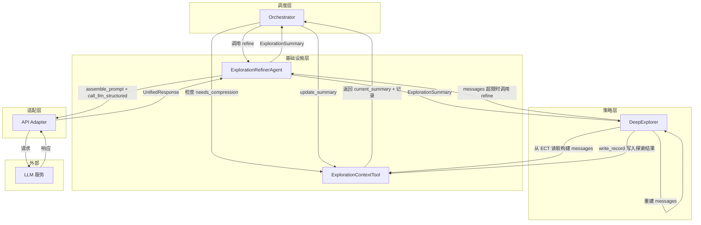
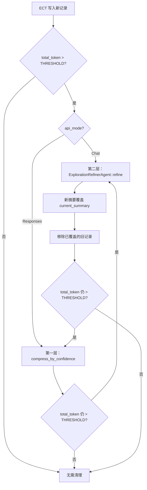
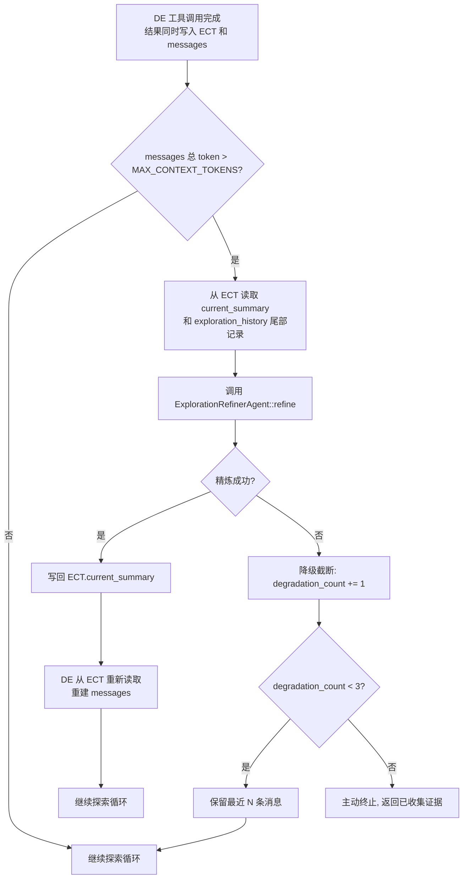
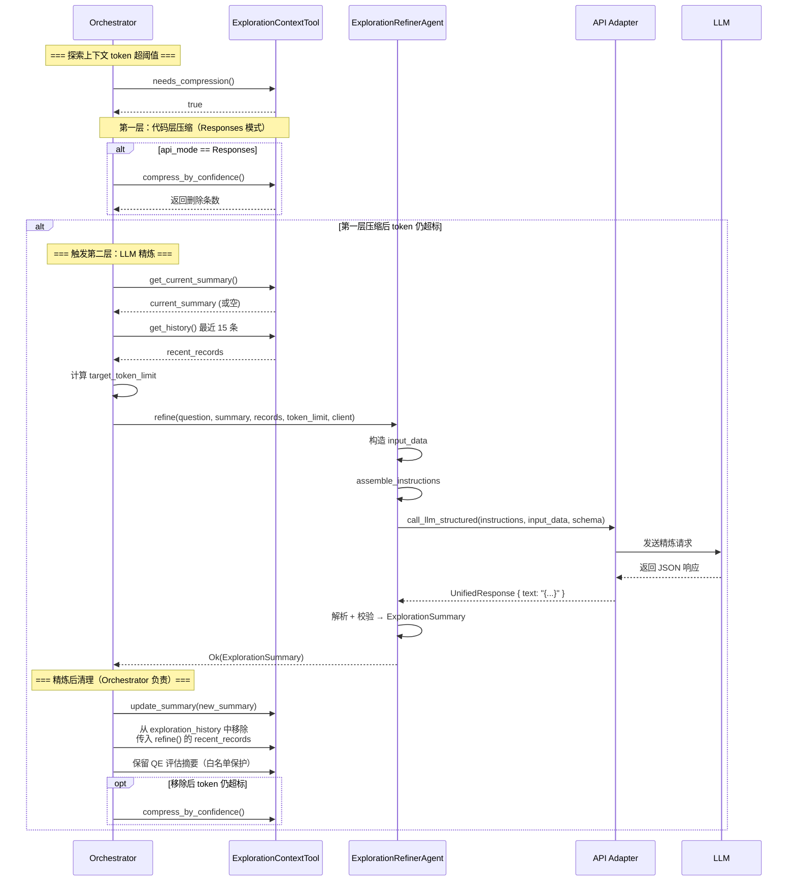
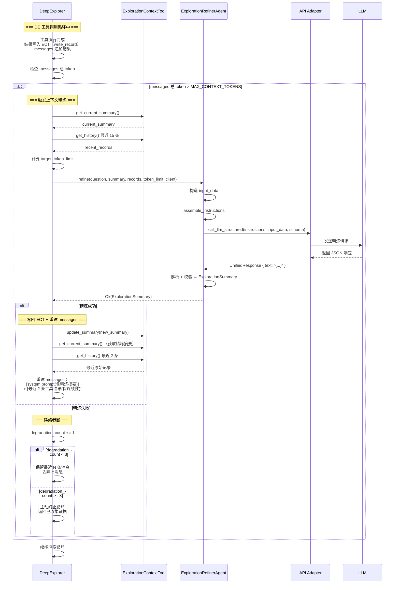

# Explore AI Agent - ExplorationRefinerAgent 详细设计文档 v1.1

| 属性     | 值                                                                 |
| :------- | :----------------------------------------------------------------- |
| 文档版本 | v1.1                                                               |
| 创建日期 | 2026-04-30                                                         |
| 修订日期 | 2026-05-07                                                         |
| 涉及模块 | agents/exploration_refiner                                          |
| 技术栈   | Rust + async-trait                                                  |
| 关联文档 | [Explore AI Agent 架构设计文档 v1.1](Explore%20AI%20Agent架构设计文档v1.1.md) |
| 关联文档 | [上下文管理工具详细设计文档 v1.1](上下文管理工具详细设计文档v1.1.md)   |
| 关联文档 | [DeepExplorer详细设计文档 v1.0](DeepExplorer详细设计文档v1.0.md)     |

> **设计要点**：精炼专家以「探索上下文」这一数据类型为管理边界。ECT 是探索上下文的唯一数据源——SSA 和 DE 的所有探索结果统一写入 ECT，Refiner 统一从 ECT 读取并精炼。DE 的 LLM 对话上下文（`messages`）也从 ECT 派生，不在 ECT 之外维护冗余数据。

---

## 术语表

| 缩写/术语 | 全称 | 说明 |
|:---|:---|:---|
| **Refiner / 精炼专家** | ExplorationRefinerAgent | 本文档所述模块，负责探索上下文的增量压缩 |
| **ECT** | ExplorationContextTool | 探索上下文存储工具，以 `ExplorationRecord` 列表形式存储所有探索记录，维护 `current_summary` 作为经过精炼的当前摘要。**是探索上下文的唯一数据源** |
| **SSA** | SearchStrategyAgent | 搜索策略 Agent，快速探索阶段的主控模块，向 ECT 写入 `Summary` 类型的探索记录 |
| **DE** | DeepExplorer | 深度探索 Agent，在快速探索后被条件触发，向 ECT 写入 `ToolCall` 类型的探索记录。其 LLM 对话上下文（`messages`）从 ECT 读取构建 |
| **QE** | ExplorationQualityEvaluator | 探索质量评估器，评估已有探索数据是否足以回答用户问题，输出 `action: "answer"` 或 `"deep_explore"` |
| **messages** | — | DE 内部维护的 LLM 对话消息向量（`Vec<Message>`），从 ECT 的 `current_summary` 和最近记录派生构建，发送给 LLM |
| **exploration_history** | — | ECT 中存储的探索记录列表（`Vec<ExplorationRecord>`），包含 SSA 的 Summary 和 DE 的 ToolCall 两种变体 |
| **current_summary** | — | 当前精炼后的探索摘要（`ExplorationSummary` 类型），存储在 ECT 中，Refiner 的唯一输出目标 |
| **Chat API** | OpenAI Chat Completions API | LLM 通信协议之一 |
| **Responses API** | Anthropic-style Responses API | LLM 通信协议之一 |
| **token** | — | 文本的最小语义单元，本文档使用「字符数 / 4」作为 token 数的估算值 |
| **CoW** | Copy-on-Write | ECT 更新 `current_summary` 时采用的写时复制策略：先备份旧值，写入新值，校验失败则回滚 |

---

## 目录

- [1. 总体设计](#1-总体设计)
  - [1.1 模块定位](#11-模块定位)
  - [1.2 核心原则](#12-核心原则)
  - [1.3 架构位置](#13-架构位置)
- [2. 数据结构](#2-数据结构)
  - [2.1 RefinerInput](#21-refinerinput)
  - [2.2 输出结构（引用 ExplorationSummary）](#22-输出结构引用-explorationsummary)
  - [2.3 相关类型](#23-相关类型)
- [3. ExplorationRefinerAgent 方法详细设计](#3-explorationrefineragent-方法详细设计)
  - [3.1 构造](#31-构造)
  - [3.2 refine — 执行精炼](#32-refine--执行精炼)
  - [3.3 assemble_prompt — Prompt 组装](#33-assemble_prompt--prompt-组装)
  - [3.4 output_schema — 输出 Schema](#34-output_schema--输出-schema)
- [4. Prompt 设计](#4-prompt-设计)
  - [4.1 Prompt 模板](#41-prompt-模板)
  - [4.2 变量说明](#42-变量说明)
  - [4.3 API 模式差异处理](#43-api-模式差异处理)
- [5. 结构化输出约束](#5-结构化输出约束)
  - [5.1 JSON Schema 定义](#51-json-schema-定义)
  - [5.2 两种 API 模式的约束构建](#52-两种-api-模式的约束构建)
- [6. 调用时机与上下文](#6-调用时机与上下文)
  - [6.1 触发条件](#61-触发条件)
  - [6.2 数据准备与 target_token_limit 计算](#62-数据准备与-target_token_limit-计算)
  - [6.3 调用时序（Orchestrator 调度）](#63-调用时序orchestrator-调度)
  - [6.4 调用时序（DE 自调度）](#64-调用时序de-自调度)
  - [6.5 DE 上下文精炼详细步骤](#65-de-上下文精炼详细步骤)
- [7. 错误处理](#7-错误处理)
- [8. 自动化测试用例](#8-自动化测试用例)
- [9. 附录](#9-附录)

---

## 1. 总体设计

### 1.1 模块定位

ExplorationRefinerAgent 是系统基础设施层的**探索上下文精炼专家**。它不参与代码搜索或文件读取，而是对 SSA 和 DE 产生的所有探索上下文进行增量精炼，输出压缩后的高质量摘要。

ECT 是探索上下文的唯一数据源——SSA 的所有评估结果和 DE 的所有工具调用结果统一通过 `write_record()` 写入 ECT。Refiner 统一从 ECT 读取输入，将精炼后的摘要写回 ECT 的 `current_summary`。DE 的 LLM 对话上下文（`messages`）也从 ECT 派生构建，不在 ECT 之外维护冗余数据。

> **系统中有两个精炼专家**：ExplorationRefinerAgent（本文档）管理探索上下文，ConversationRefinerAgent 管理跨轮次对话上下文。两者职责不同，详见 [ConversationRefinerAgent 详细设计文档](ConversationRefinerAgent详细设计文档v1.0.md)。

**探索上下文的数据流**：

```
        SSA ──► write_record() ──┐
                                 ├── ECT ──► Refiner ──► ECT.current_summary
        DE  ──► write_record() ──┘        ▲              │
                                           │              │
                         DE 从 ECT 读取 ◄──┘              │
                         DE 从 ECT 读取构建 messages ◄────┘
```

三条原则：

1. **ECT 是唯一数据源**——SSA 和 DE 的所有探索结果通过 `write_record()` 写入 ECT。DE 不在 ECT 之外维护冗余副本。
2. **Refiner 是唯一精炼管线**——任何需要压缩探索上下文的场景，都调用同一个 `refine()`，从 ECT 读取，输出写回 ECT 的 `current_summary`。
3. **DE 的 messages 从 ECT 派生**——DE 构建 LLM 对话上下文时，从 ECT 读取 `current_summary`（精炼后的摘要）和最近几条记录来构建 `messages`。

**两个调用时机**：

| 时机 | 上下文来源 | 调度方 | 触发条件 | 精炼后处理 |
|:---|:---|:---|:---|:---|
| **SSA 轮次后 / DE 结束后** | SSA、DE | Orchestrator | ECT 的 `total_token_count > EXPLORATION_TOKEN_THRESHOLD`（12000） | 写回 ECT 的 `current_summary`，移除已覆盖记录 |
| **DE 工具循环中** | DE | DeepExplorer | DE 内部 `messages` 的 token 数 > `MAX_CONTEXT_TOKENS`（8000） | 写回 ECT 的 `current_summary`；DE 从 ECT 重新读取，重建 `messages` |

两个时机精炼的是同一份数据（ECT 中的探索上下文），调用同一个 `refine()`。

> **设计取舍**：SSA 和 DE 的精炼调度方不同——SSA 依赖 Orchestrator 代为调度，DE 则自行调度。这不是刻意追求不对称，而是两个 Agent 的架构约束决定的：
> - **SSA 无状态**：每轮执行独立的 LLM 调用，不持有内部上下文，也不持有 `ApiAdapter` 引用（精炼需要它）。由 Orchestrator 在轮次间隙检查 ECT 并调用 Refiner，是代价最低的方案。
> - **DE 长循环**：`execute()` 是单次异步调用，Orchestrator 在其返回前无法介入。若由 Orchestrator 统一调度，需要把 `execute()` 改为可暂停/恢复的接口，引入状态机复杂度。DE 自调度省掉了这层抽象。
>
> 统一调度在设计上更工整，但在工程上增加的复杂度远高于收益。保留现状是刻意的工程取舍。

**核心职责**：

1. 以已有摘要为基础，融入新增探索记录中的信息
2. 筛除重复信息、已证伪线索和无关数据
3. 在给定 token 预算内输出精炼摘要
4. 输出写入 ECT 的 `current_summary`，作为所有下游消费者的统一数据源

### 1.2 核心原则

| 原则 | 说明 |
|:---|:---|
| **上下文类型管理** | 精炼专家以「探索上下文」这一类型为管理单位，而非以模块为边界。SSA、DE 产生的所有探索上下文均纳入管理 |
| **ECT 为唯一数据源** | ECT 是探索上下文的唯一权威存储。DE 的 messages 从 ECT 派生，不在外部维护冗余数据 |
| **增量精炼** | 以现有摘要为基础，只融入新增信息，不从零重新总结 |
| **信息筛选** | 优先保留代码片段位置和核心文件路径，丢弃重复和无关信息 |
| **结构化输出** | 通过 JSON Schema + `strict: true` 强制 LLM 输出合法 JSON |
| **无工具调用** | 精炼专家不调用任何代码库探索工具，仅基于传入的数据做分析 |
| **适配层注入** | 通过 `&dyn LlmStructuredClient` 调用 LLM，Chat/Responses 差异由适配层处理 |
| **调度方无关** | 精炼算法和接口与调度方（Orchestrator 或 DeepExplorer）无关，数据来源统一为 ECT |

### 1.3 架构位置



**架构说明**：Refiner 管理 SSA 和 DE 两个来源的探索上下文，两者的数据统一存储在 ECT 中。SSA 场景的精炼由 Orchestrator 代为调度，DE 场景的精炼（工具循环中）由 DE 自调度。不论谁调度，调用的都是同一个 `refine()`，从 ECT 读取，写回 ECT 的 `current_summary`。

---

## 2. 数据结构

### 2.1 RefinerInput

精炼专家接收 4 项输入。所有输入均从 ECT 获取：

| 字段 | 类型 | 来源 | 说明 |
|:---|:---|:---|:---|
| user_question | &str | 调度方透传 | 用户原始问题，帮助精炼专家判断信息相关性 |
| current_summary | &ExplorationSummary | `ECT.get_current_summary()`；若为空则构造空 `ExplorationSummary` | 当前已精炼的探索摘要，精炼必须以它为基础 |
| recent_records | &[ExplorationRecord] | `ECT.get_history()` → 取尾部 15 条 | 最近 15 条探索记录（滚动窗口），其中的新增信息将被融入摘要 |
| target_token_limit | usize | 代码层公式计算 | 精炼后摘要的目标 Token 数上限 |

### 2.2 输出结构（引用 ExplorationSummary）

精炼专家的输出复用 `ExplorationSummary` 结构（定义于 `context/exploration.rs`）：

```rust
pub struct ExplorationSummary {
    pub key_findings: String,
    pub critical_files: Vec<CriticalFile>,
    pub missing_info: String,
    pub confidence: f64,
}

pub struct CriticalFile {
    pub path: String,
    pub one_sentence_summary: String,
}
```

| 字段 | 类型 | 说明 |
|:---|:---|:---|
| key_findings | String | 精炼后的核心发现总结（1-3 条） |
| critical_files | Vec\<CriticalFile> | 对回答问题最有帮助的文件列表（1-3 个） |
| missing_info | String | 仍缺失的关键信息。如无则为空字符串 `""` |
| confidence | f64 | 综合置信度评分，范围 [0.0, 1.0] |

> **注意**：与 `QualityEvaluation`（6 字段）不同，`ExplorationSummary` 不含 `action` 和 `reason` 字段。精炼专家的输出是一个纯粹的信息摘要，不参与流程决策。

### 2.3 相关类型

**ExplorationRecord**（定义于 `context/exploration.rs`）：

```rust
pub enum ExplorationRecord {
    Summary {
        source: String,
        data: ExplorationSummary,
        confidence: f64,
        timestamp: DateTime<Utc>,
    },
    ToolCall {
        source: String,
        tool: String,
        params: serde_json::Value,
        result_summary: String,
        confidence: f64,
        timestamp: DateTime<Utc>,
    },
}
```

精炼专家读取 `ToolCall` 变体的 `result_summary`、`tool`、`params` 字段来判断每条工具调用的信息价值，以及 `Summary` 变体的 `data` 字段获取历史摘要。

> **注意**：`ExplorationRecord` 的 `confidence` 字段用于代码层压缩排序，传入精炼专家前由 `refine()` 方法主动剥离——`confidence` 的语义（代码层评分）与 LLM 判断（语义相关性）是两套体系，不应混入 Prompt。

---

## 3. ExplorationRefinerAgent 方法详细设计

### 3.1 构造

```rust
pub fn new() -> Self
```

无参数构造。精炼专家不持有任何内部状态，每次 `refine()` 调用完全独立。

```rust
pub fn output_schema() -> &'static str
```

返回 JSON Schema 常量（见第 5 节），供适配层构建结构化输出约束。

### 3.2 refine — 执行精炼

#### 3.2.1 函数签名

```rust
pub async fn refine(
    &self,
    user_question: &str,
    current_summary: &ExplorationSummary,
    recent_records: &[ExplorationRecord],
    target_token_limit: usize,
    client: &dyn LlmStructuredClient,
) -> Result<ExplorationSummary, String>
```

| 参数 | 类型 | 说明 |
|:---|:---|:---|
| user_question | &str | 用户原始问题。由调度方（Orchestrator 或 DE）透传 |
| current_summary | &ExplorationSummary | 当前已精炼摘要（精炼基础）。从 ECT 获取 |
| recent_records | &[ExplorationRecord] | 待融合的新增探索记录。从 ECT 的 `exploration_history` 尾部获取 |
| target_token_limit | usize | 目标 Token 上限。按公式计算 |
| client | &dyn LlmStructuredClient | 适配层注入。不论谁调度，都使用同一个 adapter 实例 |

**返回值**：成功时返回精炼后的 `ExplorationSummary`；失败时返回错误描述字符串。

**说明**：`refine()` 的函数签名对两个调度方完全一致。传入的数据均来自 ECT，Refiner 不感知调度方身份。

#### 3.2.2 处理流程

```mermaid
flowchart TD
    A[接收 user_question + current_summary<br/>+ recent_records + target_token_limit] --> B[构造 input_data JSON]
    B --> C[调用 assemble_instructions 生成核心指令文本]
    C --> D[从 output_schema 获取 JSON Schema Value]
    D --> E[调用 client.call_llm_structured<br/>传入 instructions + input_data + schema]
    E --> F{调用成功?}
    F -- 是 --> G[从 UnifiedResponse.text 提取 JSON 字符串]
    G --> H[JSON 反序列化为 ExplorationSummary]
    H --> I{反序列化成功?}
    I -- 是 --> J[校验 confidence 范围]
    J --> K{0.0 ≤ confidence ≤ 1.0?}
    K -- 是 --> L[返回 Ok(ExplorationSummary)]
    K -- 否 --> M[返回 Err]
    I -- 否 --> M
    F -- 否 --> M
```

> **说明**：Refiner 不感知调度方身份，仅依据传入的数据执行精炼。

#### 3.2.3 处理步骤详述

**步骤 0：空数据提前返回**

若 `current_summary` 的关键字段全为空（`key_findings.is_empty() && critical_files.is_empty()`）**且** `recent_records` 也为空，说明没有可精炼的数据。调度方应在调用前拦截此场景，但 Refiner 内部也做一次防御性校验。

**步骤 1：构造输入数据**

将 `user_question`、`current_summary`、`recent_records`、`target_token_limit` 序列化为一个 JSON 对象：

```json
{
  "user_question": "...",
  "current_summary": { ... },
  "recent_records": [ ... ],
  "target_token_limit": 1200
}
```

构造时从 `recent_records` 的每条记录中**剥离 `confidence` 字段**。

**步骤 2：组装指令文本**

调用 `self.assemble_instructions()` 生成核心指令文本（角色定义、增量精炼要求、输出格式）。指令文本不含用户问题和探索数据——这两者作为 `input_data` 参数传入适配层。

**步骤 3：调用适配层**

调用 `client.call_llm_structured(&instructions, &input_data, Some(&schema))`。适配层根据 `api_mode` 自动处理 Chat/Responses 的协议差异。重试逻辑由适配层统一处理（最多 3 次）。

**步骤 4：解析响应**

从 `UnifiedResponse.text` 中提取 JSON 字符串，反序列化为 `ExplorationSummary`。

**步骤 5：校验**

| 校验项 | 规则 | 失败处理 |
|:---|:---|:---|
| confidence | 0.0 ≤ confidence ≤ 1.0 | 返回 `Err("confidence out of range [0.0, 1.0]: {value}")` |
| key_findings | 必填，非空字符串 | 由 JSON Schema `strict: true` 在 LLM 侧保证 |
| critical_files | 必填，数组类型 | 由 JSON Schema `strict: true` 保证 |
| missing_info | 必填，字符串类型 | 由 JSON Schema `strict: true` 保证 |

### 3.3 assemble_instructions — 指令文本生成

```rust
fn assemble_instructions() -> String
```

返回核心指令文本。指令文本**不包含**用户问题和探索数据——这两者由 `refine()` 方法序列化为 `serde_json::Value` 后作为 `input_data` 参数传入。

指令模板内容见第 4 节。

### 3.4 output_schema — 输出 Schema

```rust
pub fn output_schema() -> &'static str
```

返回 `REFINER_SCHEMA` 常量（见第 5 节）。

---

## 4. Prompt 设计

（第 4 节 Prompt 模板、变量说明、API 模式差异处理，内容完整，见下方。）

### 4.1 指令模板

```
你是探索上下文精炼专家。对探索上下文进行增量精炼，输出极简、高质量的摘要。

系统会以结构化数据的形式向你提供用户问题、当前已精炼摘要、最近探索记录和目标 Token 上限，请基于这些内容完成精炼。

## 增量精炼要求

1. **增量融入**：必须以「当前已精炼摘要」为基础，只将「最近探索记录」中新增的重要信息融入。不要从零重新总结。如果当前摘要为空（首次精炼），则必须从探索记录中全新归纳总结，但所有信息筛选规则、关键文件处理规则、长度控制规则同等适用，不得因首次精炼而降低标准或跳步。
2. **信息筛选**：
   - 优先保留：直接回答用户问题的代码片段位置、核心文件路径、关键发现。
   - 坚决去除：重复信息、已证伪的线索、无关文件名、调试日志。
3. **关键文件处理规则**：
   - 优先保留在探索记录中已被实际读取并返回有效内容的文件。
   - 丢弃仅在搜索中匹配到文件名、但从未被实际读取过的文件。
   - 如果对某条信息的可靠性存疑，在 `missing_info` 中注明。
4. **长度控制**：输出摘要的总 Token 数必须控制在系统给定的目标上限以内。

## 输出格式（强制约束）

你必须**只输出一个合法的 JSON 对象**，不要包裹任何标记、不要添加任何解释文字。JSON 对象必须包含以下四个字段，字段名不可更改：

- `key_findings`：字符串，精炼后的核心发现总结。
- `critical_files`：数组，每个元素为 `{"path": "文件路径", "one_sentence_summary": "一句话说明该文件的作用"}`。如无相关文件则为空数组 `[]`。
- `missing_info`：字符串，仍缺失的关键信息。如无则为空字符串 `""`。
- `confidence`：数字，综合置信度评分（0.0 到 1.0）。

**示例输出**：
{
  "key_findings": "找到 BooleanValidator.java 和 BooleanParam 注解定义...",
  "critical_files": [
    {"path": "core/validation/BooleanValidator.java", "one_sentence_summary": "包含 BooleanValidator 类..."},
    {"path": "annotation/BooleanParam.java", "one_sentence_summary": "定义 required 和 defaultValue 两个配置属性"}
  ],
  "missing_info": "defaultValue 的默认值装载机制尚未找到",
  "confidence": 0.85
}

**警告**：如果你输出的不是合法 JSON，或者缺少上述四个字段中的任何一个，系统将拒绝你的输出并要求你重新生成。
```

### 4.2 数据接口

精炼专家通过两个渠道向适配层传递数据：

| 数据 | 传递方式 | 说明 |
|:---|:---|:---|
| 指令文本 | `call_llm_structured` 的 `instructions` 参数 | 核心指令（4.1 节模板），由 `assemble_instructions()` 返回 |
| 待精炼数据 | `call_llm_structured` 的 `input_data` 参数 | 包含 `user_question`、`current_summary`、`recent_records`、`target_token_limit` 的 JSON 对象 |

### 4.3 API 模式透明

| 模式 | `instructions` 去向 | `input_data` 去向 | Schema 去向 |
|:---|:---|:---|:---|
| **Chat API** | 与 input_data 拼接后放入 `messages[0].content` | 序列化为 JSON 字符串嵌入 Prompt | `response_format` |
| **Responses API** | HTTP 请求体的 `instructions` 字段 | HTTP 请求体的 `input` 字段 | `text.format` |

---

## 5. 结构化输出约束

（第 5 节 JSON Schema 定义和两种 API 模式的约束构建逻辑，内容完整，见下方。）

### 5.1 JSON Schema 定义

```json
{
  "name": "exploration_refiner_response",
  "strict": true,
  "schema": {
    "type": "object",
    "properties": {
      "key_findings": { "type": "string" },
      "critical_files": {
        "type": "array",
        "items": {
          "type": "object",
          "properties": {
            "path": { "type": "string" },
            "one_sentence_summary": { "type": "string" }
          },
          "required": ["path", "one_sentence_summary"],
          "additionalProperties": false
        }
      },
      "missing_info": { "type": "string" },
      "confidence": { "type": "number" }
    },
    "required": ["key_findings", "critical_files", "missing_info", "confidence"],
    "additionalProperties": false
  }
}
```

| 约束项 | 说明 |
|:---|:---|
| `strict: true` | 启用 API 的严格模式，LLM 必须严格遵守 Schema，不允许额外字段 |
| `additionalProperties: false` | 拒绝任何未在 Schema 中定义的字段 |
| 全部字段 required | 四个字段均为必填，LLM 不得遗漏任何字段 |
| `key_findings` / `missing_info` | `type: "string"`，允许空字符串 `""` |
| `confidence` | `type: "number"`，范围约束由代码层校验 |

### 5.2 两种 API 模式的约束构建

| api_mode | 构建逻辑 |
|:---|:---|
| `Chat` | `{"type": "json_schema", "json_schema": {"name": "exploration_refiner_response", "strict": true, "schema": {...}}}` → 放入 `response_format` |
| `Responses` | `{"type": "json_schema", "name": "exploration_refiner_response", "strict": true, "schema": {...}}` → 放入 `text.format` |

---

## 6. 调用时机与上下文

### 6.1 触发条件

精炼专家有两个调用时机，均以「token 超过阈值」为触发条件：

**时机一：Orchestrator 代为调度（SSA 轮次后 / DE 结束后）**

Orchestrator 在 SSA 每轮结束后和 DE 结束后，检查 ECT 的 `total_token_count` 是否超过 `EXPLORATION_TOKEN_THRESHOLD`（默认 12000）。超过则触发压缩，分为两层：



- SSA 每轮只写入 1 条 Summary 记录（约 500-2000 字符），通常在 3-5 轮后首次触发
- DE 可能产生大量工具调用记录（最多 75 条），结束后几乎必然触发

**时机二：DE 自调度（工具调用循环中）**

DE 在工具调用循环中，每次追加工具结果到 `messages` 后，检查 `messages` 的总 token 数是否超过 `MAX_CONTEXT_TOKENS`（默认 8000）。超过则调用 Refiner：



> **两个时机对比**：
> 
> | 维度 | 时机一（Orchestrator 代为调度） | 时机二（DE 自调度） |
> |:---|:---|:---|
> | 上下文来源 | SSA、DE | DE |
> | 调度方 | Orchestrator | DeepExplorer |
> | 触发条件 | ECT 的 `total_token_count > 12000` | DE 的 `messages` token > 8000 |
> | 第一层压缩 | Chat 跳，Responses 执行 `compress_by_confidence` | 无 |
> | 数据来源 | ECT | ECT（完全相同） |
> | 接口 | `refine(...)` | `refine(...)`（完全相同的调用） |
> | 失败降级 | 跳过，继续流程 | 降级为原始截断，继续探索 |
>
> **阈值差异说明**：`EXPLORATION_TOKEN_THRESHOLD`（12000）用于 ECT 存储——ECT 是持久化的探索记录存储，容量可以较大；`MAX_CONTEXT_TOKENS`（8000）用于 DE 的 LLM 对话窗口——发送给 LLM 的每个请求都必须在这个窗口内。

**第一层（代码层，`compress_by_confidence`）**（仅时机一）：

| 属性 | 说明 |
|:---|:---|
| 触发条件 | `total_token_count > THRESHOLD` 且 `api_mode == Responses` |
| 执行逻辑 | 将所有非白名单记录按 `confidence` 从低到高排序，逐条删除，直到总 token 降至 `THRESHOLD × EXPLORATION_TOKEN_TARGET_RATIO`（默认 4800）或剩余非保护记录不足 5 条 |
| 白名单保护 | `source == "ExplorationQualityEvaluator"` 的 Summary 记录永不删除 |

**第二层（LLM 层，`ExplorationRefinerAgent::refine`）**（两个时机均可能触发）：

| 属性 | 说明 |
|:---|:---|
| 触发条件（时机一） | 第一层压缩后 `total_token_count` 仍 > `THRESHOLD`；或 Chat API 模式下直接触发 |
| 触发条件（时机二） | DE 的 `messages` 总 token > `MAX_CONTEXT_TOKENS` |
| 执行逻辑 | 将现有摘要 + 待融合记录传入 LLM，生成精炼摘要 |
| 输出处理 | 新摘要写入 ECT 的 `current_summary`。时机一由 Orchestrator 移除已覆盖的旧记录；时机二由 DE 从 ECT 重新读取，重建 `messages` |

### 6.2 数据准备与 target_token_limit 计算

两个时机的数据准备步骤相同——均从 ECT 获取：

| 步骤 | 操作 | 数据来源 |
|:---|:---|:---|
| 1 | 获取 `current_summary` | `ECT.get_current_summary()`；若为空则构造空 `ExplorationSummary` |
| 2 | 获取最近 15 条探索记录 | `ECT.get_history()` → 取尾部 15 条（含 SSA 和 DE 的记录，不区分来源） |
| 3 | 计算 `target_token_limit` | 见下方公式 |
| 4 | 获取 `user_question` | 调度方内部保存的用户原始问题 |

**`target_token_limit` 计算公式**：

```
REFINER_SUMMARY_TOKEN_RATIO = 0.10
target_token_limit = max(300, EXPLORATION_TOKEN_THRESHOLD × REFINER_SUMMARY_TOKEN_RATIO)
```

默认值下：`12000 × 0.10 = 1200`。`max(300, ...)` 保底确保摘要不会因阈值调得过低而失去意义。

### 6.3 调用时序（Orchestrator 代为调度 SSA / DE-ECT）



### 6.4 调用时序（DE 自调度）



### 6.5 DE 上下文精炼详细步骤

DE 触发精炼后执行以下五个步骤：

**步骤 1：从 ECT 读取数据**

```rust
let current_summary = ect.get_current_summary()
    .unwrap_or(ExplorationSummary::default());
let recent_records = ect.get_history()
    .into_iter().rev().take(15).collect::<Vec<_>>();
```
DE 不维护任何冗余元数据。精炼所需的数据全部从 ECT 获取。

**步骤 2：调用 Refiner**

```rust
let refiner = ExplorationRefinerAgent::new();
let new_summary = refiner.refine(
    &question,
    &current_summary,
    &recent_records,
    target_token_limit,
    adapter,
).await?;
```

**步骤 3：写回 ECT**

```rust
ect.update_summary(new_summary)?;
```

ECT 的 `current_summary` 被更新为精炼后的摘要。CoW 事务保证写入安全。

**步骤 4：从 ECT 读取，重建 messages**

DE 从 ECT 重新读取 `current_summary`（即刚写入的精炼摘要）和最近几条原始记录，按以下规则重建 `messages`：

```
重建前（messages 膨胀，40K+ chars）:
┌──────────────────────────────────────┐
│ [0] system: "你是深度探索专家..."      │
│ [1] user: 工具结果1 (20K)            │
│ [2] user: 工具结果2 (15K)            │
│ [3] user: 工具结果3 (20K)            │
│ [4] user: 工具结果4 (10K)            │
│ ...                                  │
└──────────────────────────────────────┘

重建后（messages 压缩，~2-3K chars）:
┌──────────────────────────────────────┐
│ [0] system: "你是深度探索专家..."      │
│     (含 ECT.current_summary: 精炼摘要) │  ← 摘要来自 ECT
│ [1] user: 工具结果[N-1] (保留)       │  ← 只保留最近 2 条
│ [2] user: 工具结果[N]   (保留)       │  ← 保持 LLM 上下文连续性
└──────────────────────────────────────┘
```

最近 2 条原始工具结果从 ECT 的 `exploration_history` 尾部读取（`ToolCall` 变体），按原有的 `format!("工具 {} 执行结果:\n{}", ...)` 格式构造消息。

**步骤 5：降级策略**

若步骤 2 中 Refiner 返回 `Err`，DE 不中断探索流程，降级为原始截断——保留 messages 中最后 10 条消息，丢弃旧的。同时 `degradation_count += 1`。

为防止系统性异常（如 LLM 服务故障、ECT 数据结构损坏）导致的无限"膨胀→失败→截断→再膨胀"循环，降级设有上限 `MAX_DEGRADATION = 3`：

- `degradation_count < 3`：降级截断，继续探索循环
- `degradation_count >= 3`：主动终止 DE 循环，返回当前已收集的证据（与达到工具调用上限的兜底行为一致），`missing_info` 标记为"上下文精炼连续失败，探索被强制终止"

此设计平衡了容错健壮性和资源保护——偶发的 LLM 抖动不会报废深度探索，但系统性故障会被及时止损。

---

## 7. 错误处理

| 场景 | 处理方式 | 是否中断流程 |
|:---|:---|:---|
| input_data 序列化失败 | `refine()` 返回 `Err("Failed to serialize refinement input: {details}")` | 时机一：跳过；时机二：降级截断（计数 +1，达上限则终止 DE） |
| LLM 调用失败（含 3 次重试耗尽） | 透传适配层错误，`refine()` 返回 `Err` | 同上 |
| LLM 返回空响应（text = None） | 返回 `Err("Empty response from LLM")` | 同上 |
| JSON 反序列化失败 | 返回 `Err("Failed to parse refinement JSON: {details}")` | 同上 |
| tool_calls 非空且 text 为 None | 返回 `Err("Unexpected tool calls in refiner response: {tool_names}")` | 同上 |
| confidence 超出 [0.0, 1.0] | 返回 `Err("confidence out of range [0.0, 1.0]: {value}")` | 同上 |

> **降级策略**：时机二下 Refiner 失败不立即中断探索流程——DE 降级为原始截断后继续，但降级次数有上限（`MAX_DEGRADATION = 3`）。达到上限后 DE 主动终止，返回当前已收集的证据，防止系统性故障导致无限循环。

---

## 8. 测试设计

### 8.1 测试策略

| 类型 | 覆盖范围 | 依赖 |
|:---|:---|:---|
| **自动化单元测试** | 数据结构、构造、Schema、校验、Prompt 组装 | 无外部依赖 |
| **自动化集成测试** | `refine()` 完整调用、ECT 数据流、DE 上下文精炼 | Mock 适配层（`mock_llm_structured`） |
| **手工测试** | 端到端流程、DE 工具循环精炼、降级行为 | 真实 LLM、真实代码库 |

> **编号规则**：`ER-` 前缀表示 ExplorationRefinerAgent 测试用例。编号按测试类别分组：数据结构 (001~)、构造/Schema (010~)、Prompt (020~)、校验 (030~)、集成 (040~)、ECT/DE 场景 (050~)。手工用例以 `ER-M` 前缀。

---

### 8.2 自动化单元测试

#### 8.2.1 测试夹具

- 构造标准 `ExplorationSummary` 测试数据（含 `key_findings`、`critical_files`、`missing_info`、`confidence`）
- 构造标准 `ExplorationRecord` 测试数据，覆盖 `ToolCall` 和 `Summary` 两种变体
- 集成测试通过 mock 适配层（`call_llm_structured` 返回预设 `UnifiedResponse`）隔离真实 LLM

#### 8.2.2 数据结构

| 编号 | 测试场景 | 输入 | 断言 |
|:---|:---|:---|:---|
| ER-001 | ExplorationSummary 序列化往返 | 构造完整 `ExplorationSummary { key_findings: "...", critical_files: vec![...], missing_info: "...", confidence: 0.85 }` | JSON 序列化后反序列化，所有字段值一致 |
| ER-002 | ExplorationSummary 含多个 CriticalFile | JSON 中含 2 个 `CriticalFile` | `critical_files.len() == 2`，`one_sentence_summary` 字段正确 |
| ER-003 | ExplorationSummary 空 critical_files | JSON 中 `"critical_files": []` | 反序列化成功，数组长度为 0 |
| ER-004 | ExplorationRecord::ToolCall 序列化 | 构造 ToolCall 变体，含 source、tool、params、result_summary、confidence、timestamp | JSON 往返后 `tool` 和 `result_summary` 一致 |
| ER-005 | ExplorationRecord::Summary 序列化 | 构造 Summary 变体，含 data（ExplorationSummary） | JSON 往返后 `data.key_findings` 一致 |

#### 8.2.3 构造与 Schema

| 编号 | 测试场景 | 输入 | 断言 |
|:---|:---|:---|:---|
| ER-010 | 构造精炼专家 | `ExplorationRefinerAgent::new()` | 返回实例，不 panic |
| ER-011 | output_schema 返回合法 JSON | `output_schema()` | 返回值可解析为 JSON，含 `name`、`strict`、`schema` 三个顶层字段 |
| ER-012 | output_schema 的 name 字段 | `output_schema()` | `"name"` = `"exploration_refiner_response"` |
| ER-013 | output_schema 含全部 4 个 required 字段 | 解析 `output_schema()` → `schema.required` | 包含 `key_findings`、`critical_files`、`missing_info`、`confidence`，长度 = 4 |
| ER-014 | output_schema 不含 action/reason | 解析 `output_schema()` → `schema.required` | 不含 `action` 和 `reason` |
| ER-015 | output_schema 的 strict 为 true | 解析 `output_schema()` | `"strict"` = `true` |
| ER-016 | output_schema 的 additionalProperties 为 false | 解析 `output_schema()` → `schema` | `schema.additionalProperties` = `false` |
| ER-017 | output_schema 的 critical_files.items 有 required | 解析 `output_schema()` → `schema.properties.critical_files.items` | 含 `required: ["path", "one_sentence_summary"]` |

#### 8.2.4 Prompt 组装

| 编号 | 测试场景 | 输入 | 断言 |
|:---|:---|:---|:---|
| ER-020 | 指令文本含角色定义 | `assemble_instructions()` | 返回字符串含 `探索上下文精炼专家` |
| ER-021 | 指令文本含增量精炼要求 | `assemble_instructions()` | 含 `增量融入`、`信息筛选`、`关键文件处理规则`、`长度控制` |
| ER-022 | 指令文本含输出格式说明 | `assemble_instructions()` | 含 `key_findings`、`critical_files`、`missing_info`、`confidence` |
| ER-023 | 指令文本含示例输出 | `assemble_instructions()` | 含 `示例输出` 章节和样例 JSON |
| ER-024 | 指令文本含空数组约束 | `assemble_instructions()` | 含 `"critical_files": []` 字样，告知 LLM 无文件时可返回空数组 |

#### 8.2.5 校验逻辑

| 编号 | 测试场景 | 输入 | 断言 |
|:---|:---|:---|:---|
| ER-030 | confidence = 0.0 合法 | `ExplorationSummary { confidence: 0.0, .. }` | `refine()` → `Ok`，confidence 保持 0.0 |
| ER-031 | confidence = 1.0 合法 | `ExplorationSummary { confidence: 1.0, .. }` | `refine()` → `Ok` |
| ER-032 | confidence < 0.0 非法 | `ExplorationSummary { confidence: -0.1, .. }` | `refine()` → `Err`，错误信息含 `confidence out of range` |
| ER-033 | confidence > 1.0 非法 | `ExplorationSummary { confidence: 1.5, .. }` | `refine()` → `Err`，错误信息含 `confidence out of range` |
| ER-034 | key_findings 为空字符串合法 | `ExplorationSummary { key_findings: "", .. }` | `refine()` → `Ok`（空字符串是合法的 string 值） |
| ER-035 | missing_info 为空字符串合法 | `ExplorationSummary { missing_info: "", .. }` | `refine()` → `Ok` |

#### 8.2.6 空数据提前返回

| 编号 | 测试场景 | 输入 | 断言 |
|:---|:---|:---|:---|
| ER-036 | current_summary 为空且 records 为空 | `current_summary`: 空（key_findings="" 且 critical_files=[]），`recent_records`: [] | `refine()` → `Err`，错误信息含 `no data to refine` |

---

### 8.3 自动化集成测试（Mock 适配层）

Mock 适配层实现 `LlmStructuredClient` trait，`call_llm_structured` 按测试用例返回预设 `UnifiedResponse`。

#### 8.3.1 正常精炼

| 编号 | 测试场景 | 输入 | Mock 返回 | 断言 |
|:---|:---|:---|:---|:---|
| ER-040 | 正常精炼流程 | `current_summary` 非空 + 3 条 `recent_records` | `UnifiedResponse { text: Some("{\"key_findings\":\"merged findings\",\"critical_files\":[...],\"missing_info\":\"\",\"confidence\":0.9}") }` | `refine()` → `Ok`，`key_findings` = `"merged findings"`，`confidence` = 0.9 |
| ER-041 | 空探索记录 | `current_summary` 非空，`recent_records = []` | 同上，LLM 返回保留原摘要的 JSON | `refine()` → `Ok`，`key_findings` 与输入的 current_summary 一致 |
| ER-042 | 首次精炼（无 current_summary） | `current_summary` 为空（所有字段空/零），5 条 `recent_records` | LLM 从记录中全新归纳 | `refine()` → `Ok`，`key_findings` 非空 |
| ER-043 | 仅 ToolCall 记录 | `current_summary` 非空，`recent_records` 全为 `ExplorationRecord::ToolCall` 变体 | LLM 融合工具调用结果 | `refine()` → `Ok`，`critical_files` 含工具调用的目标文件 |
| ER-044 | 混合记录（Summary + ToolCall） | `current_summary` 非空，`recent_records` 含 SSA 的 Summary 和 DE 的 ToolCall 各 5 条 | LLM 融合两种来源 | `refine()` → `Ok`，输出同时包含 SSA 和 DE 的发现 |

#### 8.3.2 异常场景

| 编号 | 测试场景 | 输入 | Mock 返回 | 断言 |
|:---|:---|:---|:---|:---|
| ER-045 | LLM 返回空响应 | 正常输入 | `UnifiedResponse { text: None }` | `refine()` → `Err("Empty response from LLM")` |
| ER-046 | LLM 返回非 JSON 文本 | 正常输入 | `UnifiedResponse { text: Some("plain text") }` | `refine()` → `Err`，错误信息含 `parse` |
| ER-047 | LLM 返回 tool_calls 异常 | 正常输入 | `UnifiedResponse { text: None, tool_calls: vec![...] }` | `refine()` → `Err`，错误信息含 `Unexpected tool calls` |
| ER-048 | LLM 返回缺少字段的 JSON | 正常输入 | `text: "{\"key_findings\":\"x\"}"` （缺 critical_files、missing_info、confidence） | `refine()` → `Err`，反序列化失败 |
| ER-049 | 防御性 guard 路径 | `refine()` 内部 `serde_json::to_value(record)` 失败场景。所有 `ExplorationRecord` 字段均可序列化，此路径通过公开 API 不可直接触发 | — | 此用例验证 `refine()` 内部防御性错误处理的存在性和正确性，具体测试通过 step 0（空数据提前返回）间接验证：guard 触发后 Mock 不被调用，Refiner 返回 Err |
| ER-050 | confidence 剥离验证 | `recent_records` 中的 ToolCall 含 `confidence: 0.9` | Mock inspect 传入 LLM 的 `input_data` | `input_data.recent_records[0]` 不含 `confidence` 字段 |

#### 8.3.3 ECT 数据流

| 编号 | 测试场景 | 前置条件 | 测试步骤 | 断言 |
|:---|:---|:---|:---|:---|
| ER-051 | Refiner 输入来自 ECT | ECT 中有 10 条记录（5 SSA Summary + 5 DE ToolCall），`current_summary` 非空 | 从 ECT 读取 → 调用 Refiner | Refiner 收到的 `recent_records.len()` = `min(10, 15)` = 10，`current_summary` 与 ECT 一致 |
| ER-052 | Refiner 输出写回 ECT | ECT 初始 `current_summary = None` | Mock LLM 返回新摘要 → Refiner 输出 → Orchestrator 写入 ECT | ECT `get_current_summary()` 返回精炼后的摘要，`total_token_count` 重新计算 |
| ER-053 | 精炼后 ECT 历史记录清理 | ECT 有 15 条记录，传入 Refiner | 精炼成功 → Orchestrator 移除传入的 15 条 | `get_history().len()` 下降，QE 保护记录保留 |

#### 8.3.4 DE 上下文精炼

| 编号 | 测试场景 | 前置条件 | 测试步骤 | 断言 |
|:---|:---|:---|:---|:---|
| ER-054 | DE messages 超限触发精炼 | DE 循环场景，messages 累积到超过 `MAX_CONTEXT_TOKENS`（8000） | ECT 中有 DE 写入的 ToolCall 记录 → DE 检测到超限 → 从 ECT 读取 → 调用 Refiner | Refiner 被调用，`recent_records` 来自 ECT |
| ER-055 | 精炼后 messages 重建 | DE 精炼成功 | 0. Refiner 返回新摘要 → 写回 ECT 1. DE 从 ECT 读取 `current_summary` → 构建新的 system prompt（含精炼摘要） 2. DE 从 ECT 读取最近 2 条 ToolCall → 追加为消息 | messages 长度从 >8000 token 降至 <3000 token；messages[0] 含精炼摘要内容；messages 末尾 2 条为最近工具调用结果 |
| ER-056 | DE 精炼失败，Refiner 返回 Err | Mock LLM 返回 `Err`（模拟 LLM 调用失败） | `refine()` → `Err` | `refine()` 返回 `Err`；ECT 的 `current_summary` 未被修改；ECT 记录数不变（失败时不触发清理）。DE 的截断和降级计数逻辑属于 DeepExplorer 测试范围，不在此用例中验证 |
| ER-057 | DE 精炼后继续探索，再次调用 `refine()` | 首次 `refine()` 成功，第二次将前次结果作为 `current_summary` 传入 | 两次 `refine()` 均返回 `Ok` | 第二次 `refine()` 返回 `Ok`，输出 `key_findings` 与第二次 Mock 设定一致。DE 的 LLM 探索循环行为属于 DeepExplorer 测试范围 |

---

### 8.4 手工测试用例

#### ER-M01：端到端探索上下文精炼

| 项 | 内容 |
|:---|:---|
| **测试场景** | 用户提出一个需要 3+ 轮 SSA 和深度探索的复杂问题，验证 ECT 在过程中多次触发精炼，最终答案基于精炼后的摘要生成 |
| **前提条件** | LLM 服务正常；目标代码库存在（如 Java 项目）；配置文件使用默认阈值 |
| **测试步骤** | 1. 启动 CLI：`cargo run` 2. 提问：`"这个项目的缓存机制是怎么实现的？"` 3. 观察 stderr 输出：当 SSA 完成第 3 轮后，应看到 `compress_by_confidence` 和/或 Refiner log 4. 观察 stderr：DE 循环中应看到 `messages 超限` 触发精炼的 log 5. 记录每次精炼前后 ECT 的 token 数（通过 info 日志） |
| **预期结果** | SSA 阶段至少触发 1 次精炼；DE 阶段至少触发 1 次精炼；最终答案基于精炼摘要生成，而非原始膨胀数据；每轮精炼后 token 数显著下降 |

#### ER-M02：DE 降级行为

| 项 | 内容 |
|:---|:---|
| **测试场景** | 模拟 DE 精炼失败场景，验证降级截断生效，DE 流程不中断 |
| **前提条件** | 将 `MAX_CONTEXT_TOKENS` 临时调低到 2000 以快速触发超限；LLM 服务正常 |
| **测试步骤** | 1. 修改代码：`MAX_CONTEXT_TOKENS = 2000` 2. 启动 CLI，提问一个触发深度探索的问题 3. 观察 stderr：DE 循环中 messages 超限 → 调用 Refiner 4. 若 Refiner 成功，观察重建后 messages 大小 5. 若 Refiner 失败，观察降级 log 和 messages 截断后大小 |
| **预期结果** | 降级时 DE 不崩溃、不返回错误；messages 通过原始截断缩减；探索继续；最终有答案输出 |

#### ER-M03：SSA 多轮精炼触发

| 项 | 内容 |
|:---|:---|
| **测试场景** | 一个问题需要 SSA 跑满 5 轮，验证每轮后 ECT token 检查和精炼触发 |
| **前提条件** | 默认配置；关闭早期终止（`early_termination_confidence = 1.0`） |
| **测试步骤** | 1. 修改配置：`max_fast_explore_rounds = 5, early_termination_confidence = 1.0` 2. 提问一个开放性问题 3. 记录每轮 SSA 后 ECT token 数 |
| **预期结果** | SSA 第 1-2 轮后 token 可能低于阈值；第 3-5 轮后触发 `compress_by_confidence` 或 Refiner 精炼；精炼后 token 数降至阈值以下；最终答案包含 5 轮累计发现的关键信息 |

#### ER-M04：精炼对答案质量的影响

| 项 | 内容 |
|:---|:---|
| **测试场景** | 对比启用精炼和禁用精炼两种配置下，对同一问题生成的答案 |
| **前提条件** | LLM 服务正常；目标代码库已知（有明确答案的问题） |
| **测试步骤** | 1. 使用默认配置运行，提问一个已知答案的问题（如 `"XXXX模块的 XXX 类有哪些方法？"`），记录答案 A 2. 将 `EXPLORATION_TOKEN_THRESHOLD` 调到极大（如 100000）以禁用精炼，再提问同一问题，记录答案 B 3. 对比 A 和 B |
| **预期结果** | A（有精炼）的答案更聚焦核心文件，不包含无关搜索命中；B（无精炼）可能包含冗余信息或因 DE 超时而回退到不完整的 SSA 结果；A 不会因 context 过大而超时 |

#### ER-M05：常量边界验证

| 项 | 内容 |
|:---|:---|
| **测试场景** | 验证 `target_token_limit` 的 `max(300, ...)` 保底和 `RECENT_RECORDS_LIMIT = 15` 的滚动窗口生效 |
| **前提条件** | LLM Mock（打印 Refiner 接收到的参数） |
| **测试步骤** | 1. 设置 `EXPLORATION_TOKEN_THRESHOLD = 2000` → `target_token_limit = max(300, 2000 × 0.10) = 300` 2. 设置 `EXPLORATION_TOKEN_THRESHOLD = 100` → `target_token_limit = max(300, 100 × 0.10) = 300` 3. ECT 中写入 30 条记录，触发 Refiner |
| **预期结果** | 场景 2 中 `target_token_limit` 保底为 300（不会被极小阈值拉低）；Refiner 只收到最近 15 条记录（`RECENT_RECORDS_LIMIT`），而非全部 30 条 |

---

## 9. 附录

### 9.1 与架构文档的对应关系

| 架构文档章节 | 对应本模块 | 实现状态 |
|:---|:---|:---|
| 4.4 ExplorationRefinerAgent Prompt | 第 4 节 | 本文档设计 |
| 4.4 变量说明 | 第 4.2 节 | 本文档细化 |
| 4.4 输出格式的强制保证 | 第 5 节 | 本文档设计 |
| 4.4 API 模式兼容说明 | 第 4.3 节 + 第 5.2 节 | 本文档细化 |
| 5.1.3 分层压缩流程 | 第 6.1 节 | 本文档设计 |
| 5.1.4 写入安全保证 | 第 6.3 节 | Orchestrator 负责 |

### 9.2 与其他模块的接口

| 调度方 | 调用方法 | 说明 |
|:---|:---|:---|
| Orchestrator（代表 SSA，以及 DE 结束后调度） | `refine(question, summary, records, token_limit, client)` | SSA 轮次后 / DE 结束后的 ECT 压缩 |
| DeepExplorer（工具循环中自调度） | `refine(question, summary, records, token_limit, client)` | DE 工具循环中的上下文精炼 |
| ApiAdapter | `call_llm_structured(prompt, input_data, schema)` | 适配层注入，精炼专家通过 `&dyn LlmStructuredClient` 调用 |

> **接口说明**：DeepExplorer 调用 `refine()` 时传入的 `client` 即为 DE 持有的 `ApiAdapter` 引用（`ApiAdapter` 实现了 `LlmStructuredClient` trait），无需额外构造。

### 9.3 不变式与约束

| 约束 | 说明 |
|:---|:---|
| **无状态** | 精炼专家不持有任何可变状态，每次 `refine()` 调用完全独立 |
| **无工具调用** | 精炼专家不注册任何工具，Prompt 中不提供工具定义 |
| **增量精炼** | 必须以 `current_summary` 为基础，不得从零重新总结 |
| **调度方无关** | 精炼算法不依赖调度方身份（Orchestrator 或 DeepExplorer）。传入的数据格式完全相同（`ExplorationRecord[]`），均来自 ECT |
| **无 API 模式感知** | 不调用 `adapter.api_mode()` 或 `adapter.replace_placeholder()`，差异由适配层处理 |
| **DE 降级有上限** | DE 自调度精炼失败时降级为原始截断，但连续降级达到 `MAX_DEGRADATION`（3）次后主动终止，防止系统性故障导致无限循环 |

### 9.4 常量定义

| 常量 | 值 | 说明 |
|:---|:---|:---|
| `EXPLORATION_TOKEN_THRESHOLD` | 12000（默认，可配置） | ECT 上下文 token 阈值。以 MiniMax M2.7 的 205K 上下文窗口为基准推导 |
| `MAX_CONTEXT_TOKENS` | 8000（DE 内部常量） | DE LLM 对话窗口的 token 上限，用于判断是否触发 DE 自调度精炼 |
| `EXPLORATION_TOKEN_TARGET_RATIO` | 0.40 | 第一层压缩的目标比例——压缩后总 token 须降至阈值的 40% |
| `REFINER_SUMMARY_TOKEN_RATIO` | 0.10 | LLM 精炼摘要自身的 token 占比（阈值的 10%），默认 1200 tokens |
| `MIN_REMAINING_RECORDS` | 5 | 第一层压缩最少保留的非保护记录数 |
| `RECENT_RECORDS_LIMIT` | 15 | 传入 Refiner 的探索记录数量（滚动窗口大小） |
| `MAX_DEGRADATION` | 3 | DE 自调度精炼连续失败的最大降级次数，达到后主动终止 DE |

### 9.5 与 ExplorationQualityEvaluator 的对比

| 维度 | ExplorationQualityEvaluator | ExplorationRefinerAgent |
|:---|:---|:---|
| 输出类型 | `QualityEvaluation`（6 字段，含 action + reason） | `ExplorationSummary`（4 字段，纯信息摘要） |
| 调用时机 | 快速探索后 / 深度探索后 | ECT token 超阈值 / DE LLM 对话超阈值 |
| 上下文来源 | SSA、DE（快速/深度探索） | SSA、DE |
| 调度方 | Orchestrator | Orchestrator（代为调度）、DeepExplorer（自调度） |
| 调用次数 | 每次问题最多 2 次 | 每次问题可能多次 |
| 是否参与流程决策 | 是（action 字段） | 否（纯摘要，不参与流程控制） |
| 适配层注入 | `&dyn LlmStructuredClient` | `&dyn LlmStructuredClient` |

---

## 修订记录

| 版本 | 日期 | 修订人 | 变更说明 |
|:---|:---|:---|:---|
| v1.0 | 2026-04-30 | sdfang1053 | 初版：探索上下文语义压缩，含降级策略 |
| v1.1 | 2026-05-07 | sdfang1053 | 改为纯摘要模式，不参与流程决策 |
