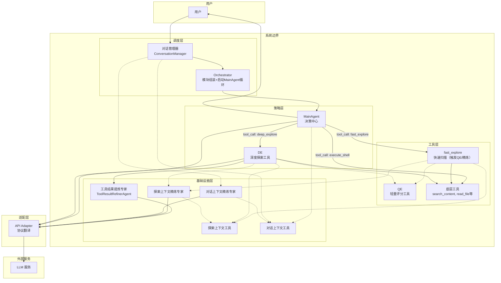
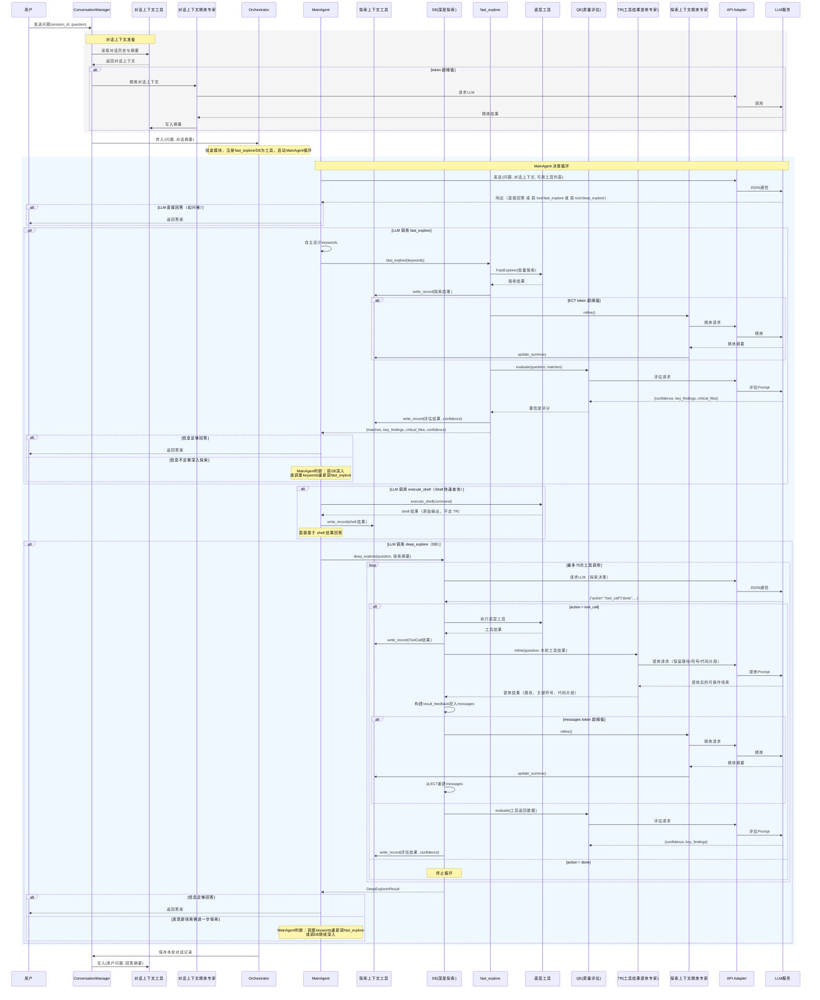
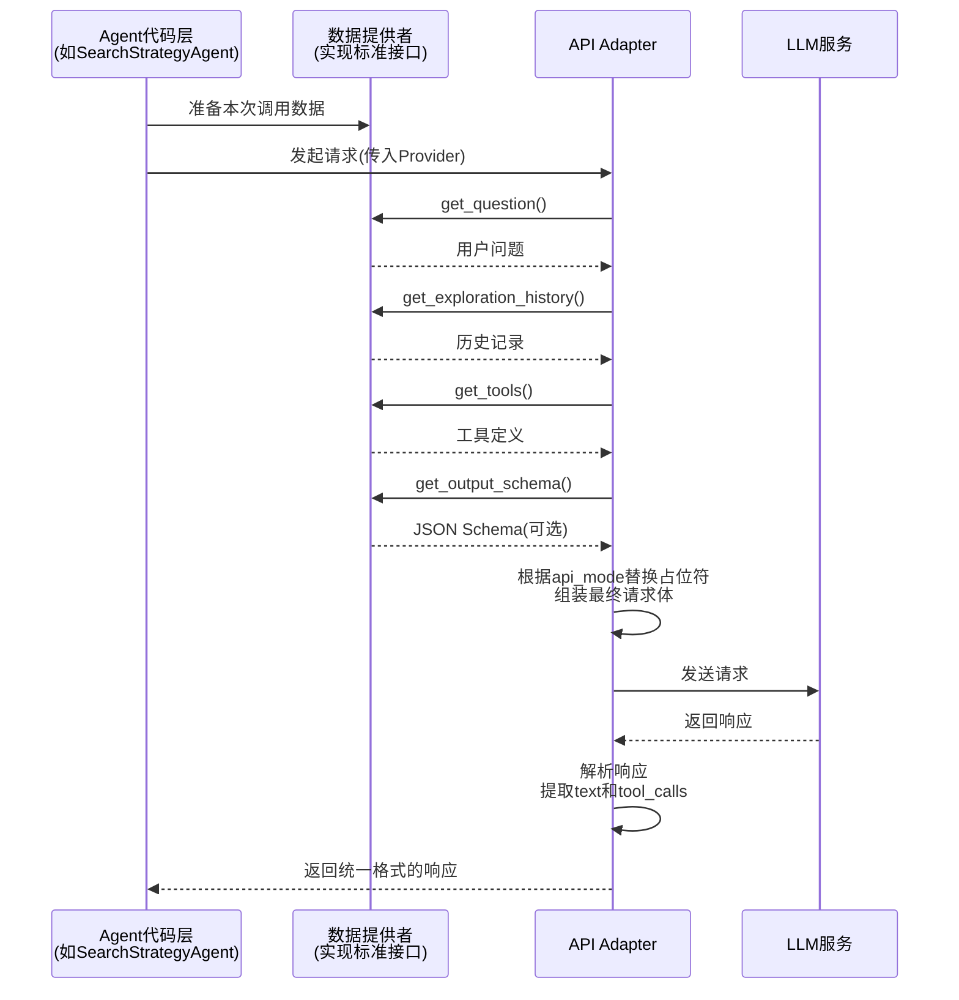
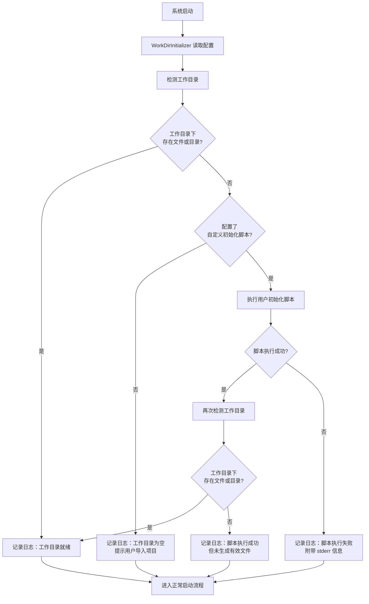
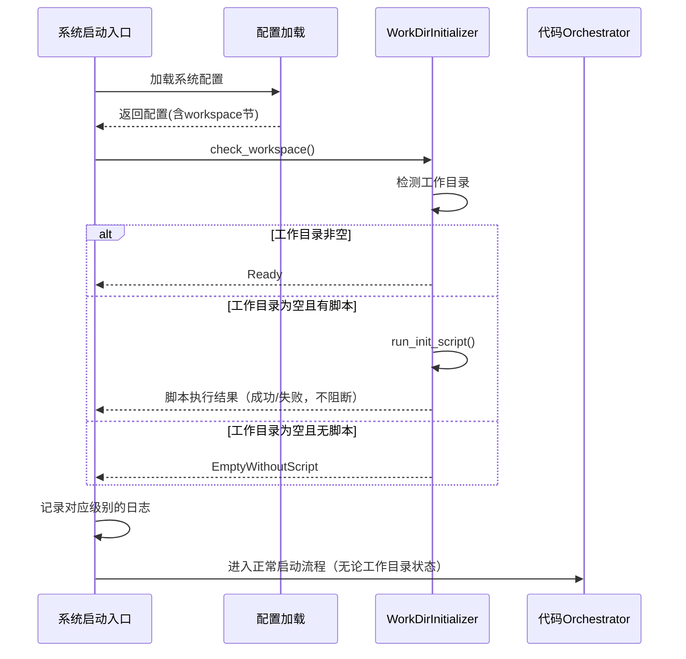
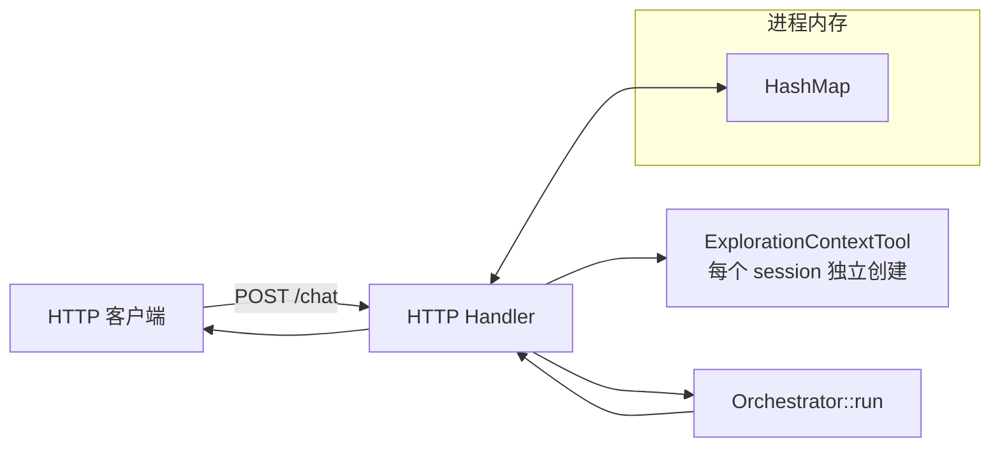

## 一、概述

> **文档版本**: v1.4 | **修订日期**: 2026-05-09
>
> **v1.4 变更**：MainAgent 新增 execute_shell 作为第三工具，提供快速 Shell 查询能力。MainAgent 自主根据问题类型选择工具。shell 结果直接返回 MainAgent，不走 TR。DE 内部仍可用 execute_shell。

### 1.1 设计目标

- MainAgent 为决策中心，通过 JSON 通信自主决定是否执行代码探索、调用哪个工具
- **fast_explore**、**deep_explore**、**execute_shell** 作为工具暴露给 MainAgent。`fast_explore` 可选（配置开关控制），`deep_explore` 始终可用，`execute_shell` 提供 Shell 快速查询
- **MainAgent 自主设计关键词**：不再需要单独的关键词专家，MainAgent 自己从问题中提取关键词传给 `fast_explore`
- 对简单问题（如问候）MainAgent 直接回答，不触发探索管道
- 探索上下文与对话上下文**分离管理，各自独立精炼**。精炼的触发检查和调用均在代码层内部，Orchestrator 不参与
- 通过适配层统一 Chat API 与 Responses API 的协议差异，核心流程与 API 模式解耦

### 1.2 核心原则

| 原则                  | 说明                                                         |
| :-------------------- | :----------------------------------------------------------- |
| **MainAgent 决策**    | MainAgent 是唯一入口，通过 JSON 通信自主判断是否需要探索、调用哪个工具 |
| **MainAgent 设计关键词** | MainAgent 本身就是 LLM，直接提取关键词传给 `fast_explore`，去掉中间的关键词专家环节 |
| **探索即工具**        | `fast_explore`、`deep_explore`、`execute_shell` 作为工具暴露给 MainAgent。`fast_explore` 可选（配置开关控制），`deep_explore` 始终可用，`execute_shell` 提供快速 Shell 查询 |
| **代码层自动**        | 工具结果提炼（TR）、QE 评分和上下文精炼均由代码层在探索结果返回 LLM 前自动执行，MainAgent 不感知 |
| **上下文分离精炼**    | 探索上下文与对话上下文独立存储、独立精炼 |
| **API 协议透明**      | 适配层仅做协议翻译，核心流程不受 API 类型影响                |
| **简调度**            | Orchestrator 退化为薄调度层，仅负责组装模块、启动 MainAgent 循环 |

## 二、整体架构

### 2.1 架构分层图




### 2.2 模块职责

| 模块                         | 职责                                                         | 可见工具                           | LLM调用 | 说明                                            |
| :--------------------------- | :----------------------------------------------------------- | :--------------------------------- | :------ | :---------------------------------------------- |
| **API Adapter**              | 协议翻译：将 Chat API 与 Responses API 的请求和响应转为内部统一格式 | 无                                 | 否      | 仅处理协议差异，不参与业务逻辑                  |
| **ConversationManager**      | 多轮对话管理、触发对话上下文的精炼                           | 对话上下文工具、对话上下文精炼专家 | 否      | 协调对话状态的读取、保存与压缩                  |
| **Orchestrator**             | 薄调度层：组装模块、将 fast_explore/DE 注册为 MainAgent 的工具、启动 MainAgent 循环。不参与工具分发和探索流程控制 | 无                                 | 否      | 工具分发由 MainAgent 内部完成 |
| **MainAgent**                | **决策中心**：通过 JSON 通信自主判断是否需要探索、调用哪个工具、**自主设计关键词**、汇总探索结果生成最终答案 | fast_explore、deep_explore、execute_shell | 是      | v1.4 新增 execute_shell 工具（Shell 快速查询） |
| **fast_explore**（可配置）    | 快速扫描工具：MainAgent 传入 keywords → 代码层执行 FastExplorer → QE 评分 → 写 ECT → 精炼检查 → 返回线索摘要+置信度。**无 LLM 调用** | FastExplorer、ExplorationContextTool、QE | 否      | 纯代码流程。通过 `enable_fast_explore` 配置开关 |
| **DeepExplorer**             | 深度探索工具：在代码库中自主调用底层只读工具，返回原始代码证据。内部自行管理上下文精炼 | 六个底层只读工具、ExplorationContextTool | 是      | 作为 MainAgent 的 function calling 工具，单次最多75次工具调用。终止后代码层自动调 QE 评分 |
| **FastExplorer**             | 程序化批量搜索：构建 OR 模式 → 批量 grep → 去重排序          | 底层搜索工具                       | 否      | 纯代码实现，无 LLM 参与。为 fast_explore 工具提供底层搜索能力 |
| **ExplorationContextTool**   | 记录探索过程中的发现，维护探索上下文的存储与滚动窗口         | 无                                 | 否      | 与对话上下文完全隔离                            |
| **ConversationContextTool**  | 记录多轮对话的历史、话题演变和摘要信息                       | 无                                 | 否      | 与探索上下文完全隔离                            |
| **ExplorationRefinerAgent**  | 对探索上下文进行增量精炼，压缩 token 并保留关键信息          | 探索上下文工具                     | 是      | 由 fast_explore/DE 代码层触发，防止探索上下文膨胀 |
| **ConversationRefinerAgent** | 将完整对话历史压缩为极简摘要，保留话题脉络和指代关系         | 对话上下文工具                     | 是      | 防止多轮对话导致上下文超限                      |
| **ToolResultRefinerAgent**   | 对 DE 每次工具调用的单条结果进行精炼去噪，保留文件路径、关键符号、代码片段等可操作信息 | 无                                 | 是      | DE 内部组件，由 DE 在每次工具执行后自动调用，替代完整 JSON 传入 DE 的 LLM 上下文 |

### 2.3 核心执行流程




### 2.4 配置项

| 配置项 | 类型 | 默认值 | 说明 |
|:---|:---|:---|:---|
| `exploration.enable_fast_explore` | bool | `true` | 是否启用 fast_explore（快速扫描）。`true`：MainAgent 同时感知 fast_explore 和 DE 两个工具。`false`：MainAgent 仅感知 DE |

```yaml
# config.yaml 中的层级示例
exploration:
  enable_fast_explore: true
```

> 关闭 fast_explore 时，MainAgent 拿到的工具列表中不含 `fast_explore`。需要探索时直接调用 `deep_explore`。

> **以下章节（三至九）为各模块的接口参考和 Prompt 模板，部分内容为历史参考。各模块的最新权威设计见对应的详细设计文档。**

## 三、底层工具

系统提供 8 个只读工具。其中 6 个底层工具供 DeepExplorer 调用，FastExplorer 内部使用 search_content。`exploration_context_tool` 为代码层自动调用（记录探索结果）。不暴露给 MainAgent；对 DeepExplorer 及 fast_explore 内部代码层可见。

| 工具名称 | 描述  | 参数  | 返回格式 |
| --- | --- | --- | --- |
| **search_files** | 按文件名模式查找文件，支持 glob 模式 | `pattern`（必选）：文件名匹配模式（如 `**/*.java`）；`path`（可选）：搜索路径，默认 `.`；`exclude_test_files`（可选）：是否排除测试文件，默认 `True` | `{success, files, truncated}`；`files` 为文件相对路径列表 |
| **read_file** | 读取文件内容，支持行范围读取 | `file`（必选）：文件路径（相对路径）；`lines`（可选）：行范围，格式 `{"ranges": [[start, end], ...]}`，`start`/`end` 从1开始，省略则读取整个文件 | `{success, content, lines, truncated}`；`content` 为文件内容字符串，`lines` 为读取的行范围如 `"10-20,45-55"` 或 `"all"` |
| **search_content** | 在文件中搜索文本，支持正则和多关键字 OR 搜索 | `pattern`（必选）：正则表达式模式，支持 `\\|` 组合（如 `"boolean\\|validate\\|parameter"`）；`file_pattern`（可选）：文件匹配模式；`exclude_paths`（可选）：glob 模式的排除路径列表；`exclude_test_files`（可选）：是否排除测试文件，默认 `True` | `{success, matches, truncated}`；`matches` 为匹配结果数组，每项含 `{file, line, content}` |
| **list_dir** | 列出目录内容，包括文件和子目录 | `path`（可选）：目录路径（相对路径），默认 `.` | `{success, items, truncated}`；`items` 为数组，每项含 `{name, is_dir, size}` |
| **file_info** | 获取文件元信息，包括代码统计和头部注释 | `file`（必选）：文件路径（相对路径） | `{success, path, type, size, lines, stats, header_comment}`；`type` 为 `directory`/`file`/`code`/`text`/`config`；`stats` 含 `{lines_of_code, comment_lines, blank_lines, top_level_declarations, functions, imports}`；`header_comment` 含 `{present, lines, content}` |
| **fast_explorer** | 快速批量探索，用于 fast_explore | `keywords`（必选）：关键词列表（1-5个词）；`exclude_paths`（可选）：glob 模式的排除路径列表 | `{matches, total, has_matches}`；`matches` 为匹配结果数组，每项含 `{file, line, content, context}`；`line` 为行号范围如 `"1-10"`；`context` 为匹配行及前后5行的完整内容 |
| **exploration_context_tool** | 记录探索结果，或查询历史探索记录 | `action`（必选）：`"write"` 或 `"read"`；`data`（`action="write"` 时必选）：要存储的数据对象；`query`（`action="read"` 时必选）：查询条件对象，支持 `keyword`、`file`、`limit` | `{success, record_id}`（写入）；`{success, records, total}`（读取） |
| **execute_shell** | 兜底工具，执行受限的只读 Shell 命令。严禁修改文件、安装软件、发起网络请求。 | `command`（必选）：Shell 命令；`working_dir`（可选）：工作目录，默认项目根目录 | `{success, output, error}` |

### 3.1 `exclude_paths` 参数说明

- **类型**：`string[]`
- **支持格式**：glob 模式（如 `"opensource/*"`）和精确路径
- **使用场景**：当 AI 发现某些目录持续返回噪声时，主动排除

### 3.2 Shell 执行工具（兜底工具）

#### 3.2.1 设计目标

现有五个底层工具（`search_content`、`search_files`、`read_file`、`list_dir`、`file_info`）在绝大多数场景下足够覆盖代码探索需求，但存在以下局限性：

- **组合查询能力弱**：无法表达复合条件（如“查找最近一周修改且包含特定注解的 Java 文件”）。
- **扩展成本高**：每新增一种探索模式都需要修改工具定义和实现。
- **非主流文件支持有限**：对特殊格式或未知语言的元信息提取能力不足。

为解决上述问题，引入 **Shell 执行工具（`execute_shell`）** 作为兜底。该工具允许 AI 在结构化工具无法满足需求时，执行受限的只读 Shell 命令，以最原生的方式与代码库交互。

#### 3.2.2 工具定义

| 字段         | 值                                                           |
| :----------- | :----------------------------------------------------------- |
| **工具名称** | `execute_shell`                                              |
| **描述**     | 兜底工具。当 `search_content`、`search_files`、`read_file`、`list_dir`、`file_info` 无法完成探索任务时，可调用此工具执行**只读**的 Shell 命令。严禁用于任何修改文件、安装软件、发起网络请求或有其他副作用的操作。 |
| **参数**     | `command` (string, 必选)：要执行的 Shell 命令。 `working_dir` (string, 可选)：命令执行的工作目录，相对于项目根目录，默认值为项目根目录。 |
| **返回格式** | `{ "success": true/false, "output": "命令输出", "error": "错误信息（失败时）" }` |

#### 3.2.3 安全机制

为保障系统安全，`execute_shell` 采用**多层防御**策略，在命令执行前进行严格拦截。

**第一层：命令白名单**

仅允许执行预定义的只读命令集合。任何不在白名单中的命令将直接被拒绝。

| 类别                 | 允许的命令                                   |
| :------------------- | :------------------------------------------- |
| **文件查看**         | `cat`, `head`, `tail`, `less`                |
| **文件搜索**         | `grep`, `egrep`, `fgrep`, `find`             |
| **目录浏览**         | `ls`, `tree`                                 |
| **统计与处理**       | `wc`, `sort`, `uniq`, `cut`, `tr`            |
| **文本处理（只读）** | `awk`, `sed`（仅当未使用 `-i` 等写入选项时） |
| **文件信息**         | `file`, `stat`                               |

**第二层：危险操作符拦截**

在解析命令前，检查命令字符串是否包含以下危险模式，若存在则立即拒绝：

| 禁止模式             | 说明                                     |
| :------------------- | :--------------------------------------- |
| `>`, `>>`, `tee`     | 输出重定向，可能覆盖或创建文件           |
| `$(...)`, ``...``    | 命令替换，可能执行任意子命令             |
| `;`, `&&`, `||`, `&` | 命令分隔符或后台执行符，可能串联多个命令 |
| `|` 后接非白名单命令 | 管道后的命令同样必须通过白名单和安全检查 |
| `system(`, `exec(`   | `awk` 等工具中的系统调用函数             |
| 路径穿越             | `../` 等试图访问工作目录之外路径的模式   |

**第三层：执行环境隔离**

- **工作目录限制**：所有命令强制在项目根目录或其子目录下执行。
- **资源限制**：单次命令执行超时时间为 **30 秒**；输出内容截断为 **10 KB**，防止无限输出撑爆上下文。
- **网络访问禁止**：阻断任何网络相关的系统调用。
- **只读文件系统**：在支持的环境中，将项目目录以只读方式挂载后执行命令。

#### 3.2.4 使用场景与约束

**适用场景**：

- 搜索结构化工具无法表达的复杂条件（如“查找包含 `@Test` 注解且文件名不以 `Test.java` 结尾的文件”）。
- 统计代码库指标（如“统计所有 `.go` 文件的总行数”）。
- 快速预览未知格式的文件（如二进制文件头信息）。
- 在 `file_info` 工具不支持的语言中提取元信息。

**约束与限制**：

- 仅允许**只读**操作，任何写入尝试将被拦截。
- 命令执行有严格的超时和输出大小限制。
- AI 不应滥用此工具，仅在结构化工具无法满足需求时才应调用。
- 所有命令执行记录将写入审计日志，便于事后追溯。

#### 3.2.5 与现有工具的关系

| 工具                                                         | 定位                             | 调用优先级                                 |
| :----------------------------------------------------------- | :------------------------------- | :----------------------------------------- |
| `search_content` / `search_files` / `read_file` / `list_dir` / `file_info` | **首选工具**，结构化、安全、高效 | 高                                         |
| `execute_shell`                                              | **兜底工具**，灵活但需严格限制   | 低（仅在首选工具无法满足时由 AI 决定调用） |

系统设计上鼓励 AI 优先使用结构化工具，只有在遇到明确的功能边界时才降级到 Shell 工具。这种分层设计兼顾了**安全性**、**可维护性**和**灵活性**。

## 四、Agent Prompt 设计

各 Agent 的 Prompt 模板、变量说明和 API 模式差异处理详见各自的详细设计文档：

| Agent | 详细设计文档 |
|:---|:---|
| MainAgent | [MainAgent详细设计文档](MainAgent详细设计文档v1.0.md) |
| SearchStrategyAgent | [SearchStrategyAgent详细设计文档](SearchStrategyAgent详细设计文档v1.2.md) |
| DeepExplorer | [DeepExplorer详细设计文档](DeepExplorer详细设计文档v1.0.md) |
| ExplorationRefinerAgent | [ExplorationRefinerAgent详细设计文档](ExplorationRefinerAgent详细设计文档v1.1.md) |
| ConversationRefinerAgent | [ConversationRefinerAgent详细设计文档](ConversationRefinerAgent详细设计文档v1.0.md) |

> **⚠️ 历史参考，请勿用于实现**：以下 Prompt 模板为 v1.0/v1.1 历史版本。当前 v1.2 的 MainAgent System Prompt 见 4.3 节，fast_explore 见 4.1 节，DE 见 4.2 节及独立详细设计文档。ExplorationQualityEvaluator 已从流程决策模块转为轻量评分工具，详见 4.6 节。


### 4.1 fast_explore（v1.3 — 代码层工具）

> **v1.3**：新增 matches 截断策略——返回给 MainAgent 的 matches 最多 20 条；完整数据保留在 ECT 中。MainAgent 拿到的是精简后的 top results。

#### 代码层流程

```
fast_explore(keywords):
  1. FastExplorer(keywords) → matches（去重、聚类、排序、上下文提取）
  2. write_record(ECT)（写入完整 matches）
  3. matches 截断：保留 Top 20，其余仅保留在 ECT
  4. needs_compression? → refine()
  5. QE.evaluate(截断后的 matches) → {confidence, key_findings, critical_files}
  6. 置信度写入 ECT
  7. 返回 {matches(≤20), confidence, key_findings, critical_files}
```

#### 与 MainAgent 的交互

| | 旧（SSA） | 新（fast_explore） |
|:---|:---|:---|
| 关键词来源 | 关键词专家 LLM 调用（v1.2 已移除） | MainAgent 自主设计，传入 keywords 数组 |
| LLM 调用 | 2 次/轮（关键词 + 评估） | 1 次（仅有 QE 评估，无关键词 LLM） |
| 返回内容 | SearchStrategyResult | {matches, key_findings, critical_files, confidence} |

#### 测试设计

| 编号 | 测试场景 | Mock 配置 | 断言 |
|:---|:---|:---|:---|
| FE-001 | 正常流程 | 有效 keywords，FastExplorer 返回 matches。Mock QE 返回 confidence=0.8 | 返回 `Ok({matches, key_findings, critical_files, confidence})`；ECT 中有 2 条记录（FastExplorer 结果 + QE 置信度） |
| FE-002 | 空 keywords | `keywords=[]` | 返回 `Err` 或空结果 |
| FE-003 | FastExplorer 返回空 matches | FastExplorer 无匹配 | 返回 `Ok`；QE 评分为 0.0；正常写入 ECT |
| FE-004 | QE 评分后置信度写入 ECT | 正常流程，QE 返回 confidence=0.75 | ECT 中 ToolCall 记录的 confidence=0.75（不是 0.5） |
| FE-005 | ECT 超阈值触发精炼 | 预填 ECT 至超过阈值，然后调 fast_explore | Refiner 被调用；流程不中断；返回仍正常 |
| FE-006 | QE 失败不阻塞流程 | Mock QE 返回 Err | 返回 `Ok`；使用默认置信度 0.5；ECT 中 confidence=0.5 |
| FE-007 | 执行顺序正确 | 记录各步骤时间戳 | 顺序为：FastExplorer → write_record → refine_check → QE → write_confidence → return |
| FE-008 | FastExplorer 执行失败 | Mock FastExplorer 返回 Err | 返回 `Err`；ECT 无新增记录 |

### 4.2 DeepExplorer Prompt（v1.2）

> **v1.3 变更**：DE 内部每次工具调用后新增 ToolResultRefinerAgent 提炼步骤，替代完整 JSON 传入 LLM。消息级主动裁剪（保留最近 2 轮）。QE 输出仅写入 ECT。以下 Prompt 模板为历史参考，完整设计见 [DeepExplorer 详细设计文档](DeepExplorer详细设计文档v1.0.md)。

#### 4.2.1 Prompt（核心指令，两种 API 共用）

```
你是代码库深度探索专家。你的职责是基于已有的探索线索，深入代码库，自主调用底层只读工具，尽可能多地收集与用户问题相关的原始代码证据。

{question}
{current_summary}
{tools}
## 工作原则

- **聚焦探索**：你的职责是深入代码库收集原始证据。系统会自动记录你的每次工具调用结果和关键发现，无需你手动记录。
- **避免短期重复**：不要在短时间内重复执行完全相同的操作（如同一文件的相同行范围、仅同义词替换的搜索）。
- **适时终止**：当你认为已收集到足够丰富的原始证据，或已穷尽所有合理探索路径时，即可终止探索。

## 终止探索时的输出内容

终止探索时，你需要输出你收集到的所有关键原始证据，包含以下字段：

- **critical_files**：数组，列出你探索过的最相关文件，每个文件附带一句话说明你为什么认为它相关。
- **collected_evidence**：数组，列举具体的代码证据，例如：
  - `file`：文件路径
  - `line`：行号范围
  - `code_snippet`：相关代码片段
  - `relevance`：该证据与用户问题的关联说明
- **missing_info**：字符串，如果你认为某些信息本应存在但未能找到，请说明。如无，写“无”。

注意：你只需交付原始证据，无需对整体信息是否足够做出判断。
```


#### 4.2.2 变量说明

| 变量名              | 类型   | 用途                                                         | 拼接规则                                                     |
| :------------------ | :----- | :----------------------------------------------------------- | :----------------------------------------------------------- |
| `{question}`        | string | 用户原始问题                                                 | Chat模式：替换为「## 用户问题\n{实际内容}」；Responses模式：替换为空字符串 |
| `{current_summary}` | object | 当前探索上下文摘要（可能为SearchStrategyAgent评估结果或精炼专家压缩后的版本） | Chat模式：替换为「## 已有探索线索\n{JSON序列化文本}」；Responses模式：替换为空字符串 |
| `{tools}`           | string | 可用工具列表及调用格式                                       | Chat模式：替换为「## 可用工具\n{工具说明文本}」；Responses模式：替换为空字符串 |
| `{loop_warning}`    | string | 防循环警告文本，当检测到连续相似调用时由 DeepExplorer 代码层生成并填充 | DeepExplorer 代码层                                          |

**`{loop_warning}` 示例**：

```
## ⚠️ 系统警告\n你已连续多次执行相似操作……请立即调整探索方向。
```


Chat 模式下的**`{current_summary}` 示例**：

json

```
{
  "key_findings": "找到 BooleanValidator.java 和 BooleanParam 注解定义，但缺少 validate 方法的具体实现细节",
  "critical_files": [
    {"path": "core/validation/BooleanValidator.java", "summary": "包含 BooleanValidator 类及 validate 方法签名"},
    {"path": "annotation/BooleanParam.java", "summary": "定义了 @BooleanParam 注解，含 required 和 defaultValue 属性"}
  ],
  "missing_info": "validate 方法的内部校验逻辑、是否依赖其他配置",
  "confidence": 0.6
}
```

Chat 模式下的**`{tools}` 示例**：

markdown

```
## 可用工具

### search_content
<tool_calls>
<tool name="search_content">
<arg name="pattern">正则或关键词</arg>
<arg name="file_pattern">*.java</arg>
<arg name="exclude_paths">["opensource/*"]</arg>
</tool>
</tool_calls>

### search_files
<tool_calls>
<tool name="search_files">
<arg name="pattern">**/*Validator.java</arg>
<arg name="path">src</arg>
</tool>
</tool_calls>

### read_file
<tool_calls>
<tool name="read_file">
<arg name="file">src/BooleanValidator.java</arg>
<arg name="lines">{"ranges": [[30, 60]]}</arg>
</tool>
</tool_calls>

### list_dir
<tool_calls>
<tool name="list_dir">
<arg name="path">src/validation</arg>
</tool>
</tool_calls>

### file_info
<tool_calls>
<tool name="file_info">
<arg name="file">src/BooleanValidator.java</arg>
</tool>
</tool_calls>

### execute_shell（兜底工具）
仅在以上五个结构化工具无法满足需求时使用。所有命令必须是只读的。
**允许的命令**：`cat`, `head`, `tail`, `less`, `grep`, `egrep`, `fgrep`, `find`, `ls`, `tree`, `wc`, `sort`, `uniq`, `cut`, `tr`, `awk`, `sed`（禁止 `-i`），`file`, `stat`
**禁止**：`>`, `>>`, `$(...)`, `` `...` ``, `;`, `&&`, `||`, `&`，以及任何写入或网络操作。

<tool_calls>
<tool name="execute_shell">
<arg name="command">grep -rn "BooleanValidator" src/</arg>
<arg name="working_dir">.</arg>
</tool>
</tool_calls>


### exploration_context_tool

**写入记录**（必须在使用其他工具发现关键信息后调用）：
<tool_calls>
<tool name="exploration_context_tool">
<arg name="action">write</arg>
<arg name="data">{
  "type": "tool_call",
  "data": {
    "tool": "read_file",
    "params": {"file": "BooleanValidator.java", "lines": {"ranges": [[30,60]]}},
    "result_summary": "在第42行发现 validate 方法调用了 checkRequired",
    "confidence": 0.85
  }
}</arg>
</tool>
</tool_calls>

**查询历史**（当需要回顾之前探索的细节时调用）：
<tool_calls>
<tool name="exploration_context_tool">
<arg name="action">read</arg>
<arg name="query">{
  "keyword": "BooleanValidator",
  "limit": 5
}</arg>
</tool>
</tool_calls>
```

#### 4.2.3 API 模式差异处理

| 模式              | `{question}` 替换内容         | `{current_summary}` 替换内容        | `{tools}` 替换内容                                           | 最终 Prompt 形态            |
| :---------------- | :---------------------------- | :---------------------------------- | :----------------------------------------------------------- | :-------------------------- |
| **Chat API**      | `## 用户问题\n{用户原始问题}` | `## 已有探索线索\n{序列化JSON对象}` | `## 可用工具\n{五个底层工具及exploration_context_tool的调用格式说明}` | 核心指令 + 三个章节完整呈现 |
| **Responses API** | 空字符串                      | 空字符串                            | 空字符串                                                     | 仅保留核心指令部分          |

#### 4.2.4 代码层控制说明

- **调用次数上限**：代码层设定了 75 次工具调用总上限。AI 无需感知，达到上限时强制终止。
- **完全重复拦截**：代码层对 `(工具名, 参数哈希)` 实施缓存，若检测到完全相同的调用，直接返回缓存结果，避免重复执行和浪费资源。
- **重复警告**：若连续出现完全相同调用，代码层在下一轮通过 `{loop_warning}` 注入警告文本，提示 AI 调整策略。
- **上下文清理**：代码层维护所有工具调用记录的 `confidence` 评分。当上下文 token 超过阈值时，按 `confidence` 从低到高逐条删除，直到 token 降至阈值的 70% 或剩余记录不足 5 条。ExplorationQualityEvaluator 的评估摘要受保护，不被删除。


### 4.3 MainAgent System Prompt（v1.4）

> **v1.4**：MainAgent 持有 3 个工具（fast_explore、deep_explore、execute_shell），自主根据问题类型选择工具。execute_shell 提供 Shell 快速查询，结果不走 TR。


#### 变量说明

Prompt 中的占位符由代码层替换：

| 占位符 | 类型 | 说明 | 来源 |
|:---|:---|:---|:---|
| `{conversation_context}` | string | 对话历史摘要。首轮为空 | ConversationContextTool |
| `{user_question}` | string | 用户当前问题原文 | 用户输入 |
| `{shell_info}` | string | 当前 Shell 类型，如 "bash (Windows)" | `MainAgent::shell_info()` |
| `{shell_commands}` | string | 当前 Shell 对应的命令白名单 | `MainAgent::shell_commands()` |

> fast_explore 和 deep_explore 的描述硬编码在 Prompt 中。execute_shell 的命令列表由运行时 Shell 检测动态注入。

#### System Prompt

```
你是探索者（Explore AI Agent），一个专业的代码库探索助手。
你的工作方式是：理解用户问题，必要时调用代码库搜索工具获取信息，然后基于搜索结果回答用户。

{conversation_context}

{user_question}

## 可用工具

你可以调用以下工具来探索代码库。工具的具体输入输出格式由系统控制，
以下是工具的能力描述和数据结构：

### fast_explore — 快速扫描代码库

根据你设计的关键词批量搜索代码库，返回线索摘要和置信度评分。

| 项目 | 说明 |
|:---|:---|
| **输入** | `keywords`（字符串数组）：2-5 个搜索关键词。你需要自己设计关键词——从用户问题中提取核心概念，中英文兼顾 |
| **输出** | `matches`（搜索结果）、`key_findings`（核心发现）、`critical_files`（关键文件列表）、`confidence`（置信度 0.0~1.0） |
| **适用** | 首次探索、快速了解项目中有哪些相关模块、不确定方向时 |
| **限制** | 单次扫描，只返回概要。如果结果不理想，可以调整关键词后再次调用 |

输出示例：
{
  "matches": [...],
  "key_findings": "回测模块在 backtest/engine.py 中实现",
  "critical_files": [{"path": "src/backtest/engine.py", "summary": "回测引擎核心"}],
  "confidence": 0.8
}

### deep_explore — 深度代码探索

深入阅读代码文件，精确定位代码证据。

| 项目 | 说明 |
|:---|:---|
| **输入** | `question`（字符串）：要调查的问题。`current_summary`（对象，可选）：已有的探索线索摘要（如 fast_explore 的返回结果） |
| **输出** | `critical_files`：数组，相关文件及说明。`collected_evidence`：数组，代码证据列表，每条含 `file`（文件路径）、`line`（行号）、`code_snippet`（代码片段）、`relevance`（关联说明）。`missing_info`：字符串，仍缺失的信息 |
| **适用** | fast_explore 指出关键文件但缺少细节、需要确认代码逻辑、追溯调用链 |
| **限制** | 耗时较长（内部最多 75 次操作） |

输出示例：
{
  "critical_files": [
    {"path": "src/backtest/engine.py", "summary": "回测引擎核心"}
  ],
  "collected_evidence": [
    {
      "file": "src/backtest/engine.py",
      "line": "142-158",
      "code_snippet": "def run_backtest(self, start_date, end_date):\n    ...",
      "relevance": "回测主循环，按交易日遍历并执行决策"
    }
  ],
  "missing_info": "无"
}

### execute_shell — 执行只读 Shell 命令

直接执行只读 Shell 命令进行快速查询或统计。

| 项目 | 说明 |
|:---|:---|
| **输入** | `command`（字符串）：只读 Shell 命令 |
| **输出** | 命令的标准输出文本 |
| **适用** | 只读 Shell 命令通用执行。系统启动时自动检测可用 Shell（优先级 bash→pwsh→cmd/sh），注入当前 Shell 信息及对应命令白名单到 Prompt 中。AI 无需猜测 Shell 环境 |
| **限制** | 禁止重定向（`>` `>>`）、`tee`、`rm` `mv` `cp` `mkdir` `touch` `chmod` `chown`、管道中含禁止命令。`output` 最多 50KB（约 2000 行），超出截断丢弃 |

## 规则

1. 任何关于代码库的问题，必须先探索再回答。严禁在未探索的情况下猜测或说"信息不足"。
2. 纯问候（"你好"、"谢谢"、"再见"）或追问刚探索过的话题（"再详细说说"）可不调工具直接回答。
3. 严禁编造代码细节。若探索后仍证据不足，如实告知。
4. `deep_explore` 输出的 `missing_info` 字段不作为重试触发条件。

## 通信协议

你与系统之间通过 JSON 通信。每次回复必须是合法的 JSON 对象，action 字段决定操作类型：

**直接回答用户时**：
{"action": "answer", "final_response": "答案内容"}

**调用工具时**：
{"action": "tool_call", "tool": "fast_explore", "arguments": {"keywords": ["回测", "backtest", "引擎"]}}
{"action": "tool_call", "tool": "deep_explore", "arguments": {"question": "用户问题", "current_summary": {...}}}
{"action": "tool_call", "tool": "execute_shell", "arguments": {"command": "find . -name '*.rs' | wc -l"}}

注意：只输出 JSON，不要包裹任何标记或解释文字。如果你的回答不符合 JSON 要求，系统将强制你重新回答，请务必按照通信协议规范的返回 JSON！！！
```
#### 工具调用机制

MainAgent 复用 DE 已验证的通信方式：**`response_format: json_object` 约束 + 代码层解析分发**。不使用 API 原生的 `tools`/`tool_calls`——国内模型对该标准的实现参差不齐，不可依赖。

LLM 每次响应必须是合法 JSON，含 `action` 字段：

| `action` 值 | 含义 | 附加字段 | 代码层行为 |
|:---|:---|:---|:---|
| `"answer"` | 直接回答用户 | `final_response`（字符串） | 提取文本返回给用户 |
| `"tool_call"` | 调用探索工具 | `tool`（`"fast_explore"` / `"deep_explore"` / `"execute_shell"`）、`arguments`（工具参数） | 执行对应工具（fast_explore 为纯代码层；deep_explore 启动 DE Agent；execute_shell 执行 Shell 命令后直接返回结果），结果追加到对话中继续循环 |

JSON Schema 约束（`response_format`）：

```json
{
  "name": "main_agent_action",
  "strict": true,
  "schema": {
    "type": "object",
    "properties": {
      "action": {"type": "string", "enum": ["answer", "tool_call"]},
      "final_response": {"type": "string"},
      "tool": {"type": "string"},
      "arguments": {"type": "object"}
    },
    "required": ["action"]
  }
}
```

此方案与 DE 的 `action_schema()` 同构——LLM 的自主决策能力完全保留，仅通信方式由代码控制。v1.4 新增 execute_shell 工具，代码层通过 `ToolRegistry` 执行 Shell 命令后直接返回结果给 MainAgent，不经过 DE 或 TR。

#### 设计说明

| 项目 | 说明 |
|:---|:---|
| 变量注入 | `{conversation_context}` 和 `{user_question}` 由代码层替换。工具列表根据 `enable_fast_explore` 配置动态注入——关闭时 prompt 中不出现 `fast_explore` |
| 通信方式 | `json_object` 强制 JSON 输出 + 代码解析 dispatch，不依赖 API 原生 tool_calls |
| 工具描述 | 用表格 + JSON 示例描述输入/输出，LLM 能准确理解工具返回的数据结构 |
| 决策引导 | "必须先探索再回答"——对短上下文模型尤为重要，强制探索避免 LLM 跳过 |
| 先浅后深 | 引导先 fast_explore 再 deep_explore，减少不必要的深度探索开销 |
| 术语 | prompt 不暴露内部模块名（SSA、DE、ECT、QE） |

#### v1.1 对比

| | v1.1 | v1.2 |
|:---|:---|:---|
| 角色 | 被动接收探索数据，汇总生成答案 | 主动决策，通过 function calling 调工具探索 |
| 探索触发 | Orchestrator 固定管道强制触发 | LLM 自主按需触发 |
| "你好" | 关键词专家 3 轮 → QE → MainAgent（多次 LLM 调用） | 直接回答（1 次调用） |
### 4.4 ExplorationRefinerAgent Prompt

#### 变量说明

| 变量名                  | 类型   | 用途                          | 来源           |
| :---------------------- | :----- | :---------------------------- | :------------- |
| `{user_question}`       | string | 用户原始问题                  | 用户输入       |
| `{current_summary}`     | object | 当前已精炼的探索摘要          | 探索上下文工具 |
| `{exploration_history}` | array  | 最近15条探索记录（滚动窗口）  | 探索上下文工具 |
| `{target_token_limit}`  | int    | 精炼后摘要的目标 Token 数上限 | 代码层传入     |

**`{current_summary}` 示例**：

json

```
{
  "key_findings": "找到 BooleanValidator.java 和 BooleanParam 注解定义，但缺少 validate 方法的具体实现细节",
  "critical_files": [
    {"path": "core/validation/BooleanValidator.java", "one_sentence_summary": "包含 BooleanValidator 类及 validate 方法签名"},
    {"path": "annotation/BooleanParam.java", "one_sentence_summary": "定义了 @BooleanParam 注解，含 required 和 defaultValue 属性"}
  ],
  "missing_info": "validate 方法的内部校验逻辑、是否依赖其他配置",
  "confidence": 0.6
}
```


**`{exploration_history}` 示例**：

json

```
[
  {
    "type": "tool_call",
    "tool": "search_content",
    "params": {"pattern": "required", "file_pattern": "*.java"},
    "result_summary": "在 BooleanValidator.java 第42行发现 required 参数校验逻辑"
  },
  {
    "type": "tool_call",
    "tool": "read_file",
    "params": {"file": "core/validation/BooleanValidator.java", "lines": {"ranges": [[40, 60]]}},
    "result_summary": "validate 方法在第42-55行，调用了 checkRequired 和 checkDefaultValue"
  },
  {
    "type": "summary",
    "data": {
      "key_findings": "第二轮探索确认 BooleanParam 包含 required 和 defaultValue",
      "critical_files": [...],
      "missing_info": "缺少 defaultValue 的装载机制",
      "confidence": 0.7
    }
  }
]
```


#### Prompt（两种 API 模式完全相同）

markdown

```
你是探索上下文精炼专家。对探索上下文进行增量精炼，输出极简、高质量的摘要。

## 用户问题
{user_question}

## 当前已精炼摘要（必须作为基础保留）
{current_summary}

## 最近15条探索记录（需融入摘要的新增信息）
{exploration_history}

## 增量精炼要求
1. **增量融入**：必须以「当前已精炼摘要」为基础，只将「最近15条探索记录」中新增的重要信息融入。不要从零重新总结。
2. **信息筛选**：
   - 优先保留：直接回答用户问题的代码片段位置、核心文件路径、关键发现。
   - 坚决去除：重复信息、已证伪的线索、无关文件名、调试日志。
3. **关键文件处理规则**：
   - 优先保留在探索记录中已被实际读取并返回有效内容的文件（记录中 `result_summary` 非空或有代码片段返回）。
   - 丢弃仅在搜索中匹配到文件名、但从未被实际读取过的文件。
   - 如果对某条信息的可靠性存疑，在 `missing_info` 中注明。
4. **长度控制**：输出摘要的总 Token 数必须控制在 {target_token_limit} 以内。

## 输出格式（强制约束）
你必须**只输出一个合法的 JSON 对象**，不要包裹任何标记、不要添加任何解释文字。JSON 对象必须包含以下四个字段，字段名不可更改：

- `key_findings`：字符串，精炼后的核心发现总结。
- `critical_files`：数组，每个元素为 `{"path": "文件路径", "one_sentence_summary": "一句话说明该文件的作用"}`。如无相关文件则为空数组 `[]`。
- `missing_info`：字符串，仍缺失的关键信息。如无则为空字符串 `""`。
- `confidence`：数字，综合置信度评分（0.0 到 1.0）。

**示例输出**：
{
  "key_findings": "找到 BooleanValidator.java 和 BooleanParam 注解定义，探明 validate 方法通过 checkRequired 和 checkDefaultValue 实现校验",
  "critical_files": [
    {"path": "core/validation/BooleanValidator.java", "one_sentence_summary": "包含 BooleanValidator 类，validate 方法实现了完整校验逻辑"},
    {"path": "annotation/BooleanParam.java", "one_sentence_summary": "定义 required 和 defaultValue 两个配置属性"}
  ],
  "missing_info": "defaultValue 的默认值装载机制尚未找到",
  "confidence": 0.85
}

**警告**：如果你输出的不是合法 JSON，或者缺少上述四个字段中的任何一个，系统将拒绝你的输出并要求你重新生成。
```


#### 输出格式的强制保证

精炼专家代码层持有以下 JSON Schema 定义，通过 API 的 `strict` 模式强制模型输出合法 JSON。

json

```
{
  "name": "exploration_refiner_response",
  "strict": true,
  "schema": {
    "type": "object",
    "properties": {
      "key_findings": { "type": "string" },
      "critical_files": {
        "type": "array",
        "items": {
          "type": "object",
          "properties": {
            "path": { "type": "string" },
            "one_sentence_summary": { "type": "string" }
          },
          "required": ["path", "one_sentence_summary"],
          "additionalProperties": false
        }
      },
      "missing_info": { "type": "string" },
      "confidence": { "type": "number" }
    },
    "required": ["key_findings", "critical_files", "missing_info", "confidence"],
    "additionalProperties": false
  }
}
```


#### API 模式差异处理

| 模式              | `{user_question}` 替换内容       | `{current_summary}` 替换内容              | `{exploration_history}` 替换内容         | 最终 Prompt 形态            |
| :---------------- | :------------------------------- | :---------------------------------------- | :--------------------------------------- | :-------------------------- |
| **Chat API**      | `## 用户问题\n{用户原始问题}`    | `## 当前已精炼摘要\n{序列化 JSON 对象}`   | `## 最近15条探索记录\n{序列化 JSON 数组}` | 核心指令 + 四个章节完整呈现 |
| **Responses API** | 空字符串                         | 空字符串                                  | 空字符串                                 | 仅保留核心指令部分          |

`{target_token_limit}` 为长度控制参数，在两种模式下均替换为具体数值。

#### 格式约束方式

| 模式              | 格式约束方式                                                 |
| :---------------- | :----------------------------------------------------------- |
| **Chat API**      | 适配层将 JSON Schema 放入 `response_format={"type": "json_schema", "json_schema": {"strict": true, "schema": {...}}}` |
| **Responses API** | 适配层将 JSON Schema 放入 `text={"format": {"type": "json_schema", "schema": {...}}}` |

两种模式下 Schema 的定义完全相同，仅外层参数名由适配层根据 `api_mode` 选择，精炼专家代码层无需感知。

### 4.5 ConversationRefinerAgent Prompt

#### 变量说明

| 变量名                          | 类型   | 用途                 | 来源           |
| :------------------------------ | :----- | :------------------- | :------------- |
| `{user_question}`               | string | 用户当前问题         | 用户输入       |
| `{recent_conversation_history}` | array  | 最近10轮完整对话记录 | 对话上下文工具 |
| `{existing_summary}`            | string | 已有的历史对话摘要   | 对话上下文工具 |

**`{recent_conversation_history}` 示例**：

json

```
[
  {
    "round": 3,
    "user_question": "它有哪些参数可以配置？",
    "answer_summary": "说明了 required 和 defaultValue 两个参数。",
    "topic": "BooleanValidator 参数配置"
  },
  {
    "round": 4,
    "user_question": "那个 required 参数默认是 true 还是 false？",
    "answer_summary": "确认 required 参数默认为 true。",
    "topic": "BooleanValidator 参数默认值"
  }
]
```


**`{existing_summary}` 示例**：

text

```
第1-2轮讨论了 BooleanValidator 的基本用法，用户询问了注解的使用方式，系统介绍了 @BooleanParam 注解。
```


#### Prompt（两种 API 模式完全相同）

markdown

```
你是对话上下文精炼专家。将完整对话历史压缩为极简摘要，保留关键话题脉络和重要指代关系。

## 用户当前问题
{user_question}

## 最近10轮完整对话
{recent_conversation_history}

## 已有历史摘要
{existing_summary}

## 精炼要求
1. **保留话题演变**：清晰描述用户先后讨论了哪些话题，以及话题之间的关联。
2. **保留指代关系**：明确指出当前问题中的指代词（如“它”、“这个参数”）具体指代前文中的哪个概念或实体。
3. **去除冗余**：删除寒暄、重复确认、与话题无关的闲聊。
4. **长度控制**：输出摘要的总 Token 数必须控制在 500 以内。

## 输出格式（强制约束）
你必须**只输出一个合法的 JSON 对象**，不要包裹任何标记、不要添加任何解释文字。

- `summary`：字符串，压缩后的对话摘要。

**示例输出**：
{
  "summary": "第1-2轮讨论了 BooleanValidator 的基本用法，第3-4轮追问了它的参数配置。当前问题中的‘它’指代 BooleanValidator，用户想了解 required 参数的默认值。"
}

**警告**：如果你输出的不是合法 JSON，或者缺少 `summary` 字段，系统将拒绝你的输出并要求你重新生成。
```


#### 输出格式的强制保证

为确保输出可靠，代码层持有以下 JSON Schema 并开启 `strict: true`：

json

```
{
  "name": "conversation_refiner_response",
  "strict": true,
  "schema": {
    "type": "object",
    "properties": {
      "summary": {
        "type": "string",
        "description": "压缩后的对话摘要"
      }
    },
    "required": ["summary"],
    "additionalProperties": false
  }
}
```


#### API 模式兼容说明

| 模式              | 格式约束方式                                                 |
| :---------------- | :----------------------------------------------------------- |
| **Chat API**      | 适配层将 JSON Schema 放入 `response_format={"type": "json_schema", "json_schema": {"strict": true, "schema": {...}}}` |
| **Responses API** | 适配层将 JSON Schema 放入 `text={"format": {"type": "json_schema", "schema": {...}}}` |

#### 触发机制

- **触发条件**：对话轮次达到 10 轮，或对话上下文 Token 超过 2000。
- **执行方式**：由 `ConversationManager` 调用，精炼后的摘要写回 `对话上下文工具` 的 `conversation_summary` 字段。

### 4.6 ExplorationQualityEvaluator Prompt（v1.2 — 轻量评分工具）

> **v1.3 角色变更**：QE 为轻量评分工具，fast_explore 和 DE 内部调用 QE 对探索数据打分（置信度），结果仅写入 ECT，供后续 Refiner 精炼时按置信度排序。**QE 输出不再反馈给 DE 的 LLM 上下文**（该职责已由 ToolResultRefinerAgent 接管）。

#### 评估 Prompt

```
你是搜索质量评估专家。评估探索数据与用户问题的相关性，给出置信度评分。

{question}
{exploration_data}

## 评估标准

检查探索数据中的匹配内容是否包含直接回答用户问题的信息。

| 情况 | 建议置信度 |
|:---|:---|
| 问题与代码库无关（保留字段，当前流程不会出现） | 0.0 |
| 找到直接答案（如相关代码片段、配置说明） | 0.8 - 1.0 |
| 找到相关信息，但需要进一步整合或确认 | 0.5 - 0.7 |
| 只找到文件名，没有实质内容 | 0.2 - 0.4 |
| 探索后确认项目不包含该功能 | 0.1 - 0.2 |
| 完全不相关或没有任何搜索结果 | 0.0 |

## 输出格式

只输出一个 JSON 对象：

{
  "key_findings": "核心发现总结",
  "critical_files": [{"path": "文件路径", "summary": "一句话说明为何相关"}],
  "missing_info": "仍缺失的关键信息。如无则写"无"",
  "confidence": 0.0~1.0
}
```

#### v1.2 说明

| 项目 | 说明 |
|:---|:---|
| 调用方 | fast_explore（每次 FastExplorer 执行后触发 1 次）和 DE（每次底层工具调用后触发 1 次），代码层在数据返回 LLM 之前自动触发 |
| 职责 | 仅打分，不决策。不输出 `action` |
| 用途 | 置信度写入 ECT，Refiner 精炼时按 confidence 从低到高删除记录 |
| 与 v1.1 的区别 | 去掉 `action: "answer" | "deep_explore"` 字段，流程决策移至 MainAgent |

#### 5.1.2 字段说明

| 字段                               | 类型   | 说明                                                         |
| :--------------------------------- | :----- | :----------------------------------------------------------- |
| `exploration_history`              | array  | 所有探索操作的记录列表，按时间顺序追加。                     |
| `exploration_history[].type`       | string | 记录类型：`"summary"`（评估摘要）或 `"tool_call"`（工具调用记录）。 |
| `exploration_history[].source`     | string | 记录来源：`fast_explore`、`DeepExplorer` 或 `ExplorationQualityEvaluator`。 |
| `exploration_history[].confidence` | number | 本条发现对回答用户问题的置信度评分（0.0 ~ 1.0）。由代码层写入（探索工具执行后自动记入，含 QE 评估置信度）。 |
| `current_summary`                  | object | 当前精炼后的探索摘要。可能为评估专家的输出，或精炼专家压缩后的版本。 |
| `metadata.total_token_count`       | int    | 当前探索上下文的总 token 估算值，用于精炼触发判断。          |
| `metadata.history_record_count`    | int    | 当前探索历史记录条数。                                       |

#### 5.1.3 维护规则

| 规则         | 说明                                                         |
| :----------- | :----------------------------------------------------------- |
| **单条截断** | 每条记录写入前，序列化后超过 **8000 字符** 则截断并标记 `_truncated: true`。防止单条超大记录撑爆上下文。 |
| **写入来源** | `fast_explore` 写入探索摘要（`type: "summary"`）；`DeepExplorer` 写入工具调用记录（`type: "tool_call"`，含代码层自动记录的置信度）；ExplorationQualityEvaluator 写入全局评估摘要（`type: "summary"`）。 |
| **分层压缩** | 当 `exploration_history` 的总 token 超过阈值（默认 **5500**）时触发上下文清理。ExplorationQualityEvaluator 的评估摘要受白名单保护，永不丢弃。 |

**分层压缩流程**：

1. **第一层（代码层，基于评分清理）**：将所有非白名单记录按 `confidence` 从低到高排序，从最低分开始逐条删除，直到总 token 降至阈值的 **70%**（约 3850 token）或剩余记录不足 **5 条**。
2. **第二层（LLM 精炼）**：仅在第一层清理后 token 仍超标时，fast_explore 或 DE 代码层调用 `ExplorationRefinerAgent` 进行智能精炼。精炼后的摘要覆盖写入 `current_summary`，已被精炼覆盖的旧记录从 `exploration_history` 中移除。
3. **Chat API 模式**：跳过第一层（compress_by_confidence），仅执行第二层 LLM 精炼。Responses API 模式则两层均启用。

#### 5.1.4 写入安全保证

为确保在更新 `current_summary` 时不会因意外导致数据丢失，采用 **copy-on-write** 内存事务机制：

1. **写入前**：将当前 `current_summary` 对象深拷贝一份作为备份 `_backup_summary`。
2. **写入新值**：将精炼专家返回的新摘要写入 `current_summary`。
3. **校验**：写入后立即校验新值是否合法（JSON 解析成功、必填字段完整）。
4. **确认或回滚**：
   - 若校验通过：删除备份 `_backup_summary`，事务完成。
   - 若校验失败：用 `_backup_summary` 覆盖 `current_summary`，记录错误日志，流程继续使用旧摘要。

备份仅在单次写入操作期间存在，写入成功后立即释放。备份不持久化，仅存在于当前进程内存中。

------

### 5.2 ConversationContextTool（对话上下文工具）

**职责**：记录对话历史，维护对话摘要。与探索上下文完全隔离，独立管理其生命周期和存储。

#### 5.2.1 数据结构

json

```
{
  "session_id": "xxx",
  "conversation_history": [
    {
      "round": 1,
      "user_question": "BooleanValidator 有哪些配置参数？",
      "answer_summary": "介绍了 @BooleanParam 注解的 required 和 defaultValue 两个参数。",
      "timestamp": "2026-04-23T10:00:00Z"
    },
    {
      "round": 2,
      "user_question": "required 参数默认是 true 还是 false？",
      "answer_summary": "确认 required 参数默认为 true。",
      "timestamp": "2026-04-23T10:05:00Z"
    }
  ],
  "conversation_summary": "第1-2轮讨论了 BooleanValidator 的参数配置，用户先后询问了参数列表和 required 的默认值。",
  "metadata": {
    "total_rounds": 2,
    "summarized_rounds": 0,
    "last_updated": "2026-04-23T10:05:00Z"
  }
}
```


#### 5.2.2 字段说明

| 字段                                    | 类型   | 说明                                                 |
| :-------------------------------------- | :----- | :--------------------------------------------------- |
| `conversation_history`                  | array  | 每轮对话的记录列表，按时间顺序追加。                 |
| `conversation_history[].round`          | int    | 对话轮次编号，从 1 开始。                            |
| `conversation_history[].user_question`  | string | 用户在本轮提出的问题原文。                           |
| `conversation_history[].answer_summary` | string | 系统在本轮给出的回答摘要。                           |
| `conversation_summary`                  | string | 经精炼专家压缩后的对话摘要，保留话题脉络和指代关系。 |
| `metadata.total_rounds`                 | int    | 当前会话的总对话轮次。                               |
| `metadata.summarized_rounds`            | int    | 已被压缩进 `conversation_summary` 的轮次数。         |

#### 5.2.3 维护规则

| 规则             | 说明                                                         |
| :--------------- | :----------------------------------------------------------- |
| **自动记录**     | 每轮对话结束后，由 `ConversationManager` 自动将用户问题与回答摘要追加到 `conversation_history`。 |
| **精炼触发**     | 当对话轮次达到 **10 轮**，或对话上下文 token 超过 **2000** 时，`ConversationManager` 调用 `ConversationRefinerAgent` 压缩历史并更新 `conversation_summary`。 |
| **会话生命周期** | 对话上下文跟随 Session 生命周期。用户新建 Session 时，对话上下文完全重置。 |
| **只读暴露**     | AI Agent 只能通过 `ConversationManager` 间接获取对话上下文，不能直接写入。 |

## 六、ConversationManager（纯代码）

**职责**：管理多轮对话的 Session 生命周期，协调对话上下文的读写与精炼触发。不负责问题类型判断、话题识别或探索上下文的重置策略。

**职责边界说明**：本模块仅管理**对话上下文**（`ConversationContextTool`）。**探索上下文**（`ExplorationContextTool`）的读取、写入、精炼触发、分层压缩均由代码 Orchestrator 在流程中直接操作，不经过本模块。这一划分的依据是：探索上下文跟随探索流程的推进实时变化，由 Orchestrator 紧耦合控制更高效；对话上下文跨越整个 Session 生命周期，由独立模块统一管理更清晰。

### 6.1 核心职责

| 职责                     | 说明                                                         |
| :----------------------- | :----------------------------------------------------------- |
| **Session 生命周期管理** | 创建、检索、销毁对话 Session，维护 `session_id` 与对话上下文的映射。 |
| **对话上下文读写**       | 从 `ConversationContextTool` 中读取当前对话摘要和历史，供主 Agent 在回答时参考。 |
| **对话记录保存**         | 每轮对话结束后，将用户问题与回答摘要追加写入 `ConversationContextTool`。 |
| **精炼触发**             | 监控对话轮次和上下文 token 数，满足条件时调用 `ConversationRefinerAgent` 进行压缩。 |

### 6.2 主要方法

| 方法                                                      | 输入                                     | 输出                     | 说明                                                         |
| :-------------------------------------------------------- | :--------------------------------------- | :----------------------- | :----------------------------------------------------------- |
| `init_session(session_id)`                                | `session_id`                             | 新会话的初始上下文       | 创建新的对话上下文，若 `session_id` 已存在则恢复已有上下文。 |
| `get_context(session_id)`                                 | `session_id`                             | 对话摘要 + 最近 N 轮历史 | 返回 `conversation_summary` 和未压缩的 `conversation_history` 尾部记录，供主 Agent Prompt 使用。 |
| `save_conversation(session_id, question, answer_summary)` | `session_id`，用户问题原文，系统回答摘要 | 无                       | 追加本轮对话记录到 `conversation_history`，更新 `total_rounds`。 |
| `check_and_refine(session_id)`                            | `session_id`                             | 无（有副作用）           | 检查是否满足精炼触发条件（轮次 ≥ 10 或上下文 token > 2000），若满足则调用 `ConversationRefinerAgent` 并更新 `conversation_summary`。 |

### 6.3 精炼触发条件

| 条件           | 阈值                          | 触发动作                                                     |
| :------------- | :---------------------------- | :----------------------------------------------------------- |
| **轮次触发**   | 对话轮次 ≥ **10 轮**          | 调用 `ConversationRefinerAgent` 将最近 10 轮完整对话压缩为摘要，更新 `conversation_summary`，更新 `summarized_rounds`。 |
| **Token 触发** | 对话上下文总 token > **2000** | 同上，优先压缩最旧的未被压缩过的轮次。                       |

精炼后，`conversation_summary` 包含压缩后的摘要，原始记录保留在 `conversation_history` 中供后续精炼参考。`summarized_rounds` 记录已被压缩的轮次数，避免重复压缩。

### 6.4 数据传递

`ConversationManager` 向代码 Orchestrator 传递的对话上下文格式：

json

```
{
  "conversation_summary": "第1-2轮讨论了 BooleanValidator 的参数配置，用户先后询问了参数列表和 required 的默认值。",
  "active_topic": "BooleanValidator 参数配置"
}
```


**注意**：`active_topic` 字段由最近对话摘要中自动提取维护，仅供主 Agent 参考对话背景，不参与任何流程控制逻辑。新 Session 开始时该字段为空。

## 七、API Adapter

### 7.1 职责

适配层是系统与外部 LLM 服务之间的**协议翻译层**。它定义标准的数据接口，将上层模块传入的信息组装成具体 API 所需的请求格式，并将 LLM 返回的响应统一解析为内部标准结构，使上层模块不感知 API 差异。

### 7.2 核心功能

| 功能               | 说明                                                         |
| :----------------- | :----------------------------------------------------------- |
| **请求组装**       | 根据 `api_mode` 执行占位符替换（`{question}`、`{exploration_history}`、`{tools}` 等），将工具定义和结构化输出约束放入请求体的正确位置。 |
| **响应解析**       | 将 LLM 返回的原始响应解析为内部统一的结构化数据（文本内容或工具调用指令）。 |
| **格式校验与重试** | 当解析结果为“未识别到工具调用”时，启动正则兜底匹配；若匹配到关键字符则向 LLM 发送修正提示并重试，最多 3 次；耗尽后记录错误日志并继续执行。 |
| **协议透明**       | 适配层不关心 Prompt 中的业务语义，不关心调用方是哪个 Agent，只按标准接口获取数据。 |

### 7.3 何时翻译，何时不翻译

适配层的核心目标是为**协议相关**的内容提供翻译。以下是明确的责任边界：

| 场景                                                         | 是否需要适配层翻译 | 说明                                                         |
| :----------------------------------------------------------- | :----------------- | :----------------------------------------------------------- |
| **工具调用指令**（LLM → 代码）                               | **需要**           | Chat API 返回 `tool_calls` 数组，Responses API 返回 `function_call` 项。适配层统一解析为 `{ name, arguments }`。 |
| **工具执行结果**（代码 → LLM）                               | **需要**           | Chat API 要求 `{"role":"tool","tool_call_id":"...","content":"..."}` 格式；Responses API 要求 `function_call_output` 对象。适配层负责格式互转。 |
| **结构化输出约束**（代码 → LLM）                             | **需要**           | Agent 代码层提供通用的 JSON Schema 常量，适配层在 Chat 模式下将其放入 `response_format`，在 Responses 模式下放入 `text.format`。 |
| **主 Agent 回答生成**（纯文本响应）                          | **不需要**         | 两种 API 返回的自然语言文本结构一致，适配层直接透传。        |
| **子 Agent 的非工具调用输出**（如“问题与代码库无关”的 JSON 评估） | **不需要**         | 此类输出不涉及工具调用协议，由上层 Agent 直接解析 JSON，适配层只作为透明通道。 |

### 7.4 格式校验与重试机制

当适配层解析 LLM 响应时，若未识别到任何工具调用，则启动**正则兜底匹配**：用当前 API 模式下工具调用的特征字符串（如 Chat 模式下的 `tool_call`）对原始回复全文进行扫描。若匹配到关键特征，说明模型可能输出了格式异常的内容（如工具调用未正确封装在 `function_call` 对象中），此时触发重试。

**重试流程**：

1. **构造修正提示**：适配层将以下内容拼接为一段系统消息，发送给 LLM：
   - 正确的工具调用格式说明。
   - 本次错误回复的原文。
   - 要求 LLM 按照正确格式重新输出。
2. **发起重试**：将修正提示作为新的一轮消息追加到对话中，再次调用 LLM。
3. **上限控制**：最多重试 **3 次**。若仍无法正常解析，则**不中断流程**，只记录一条错误日志（包含原始回复内容和时间戳），继续执行后续逻辑。

**重试 Prompt 模板**：

text

```
你的上一次回复格式不符合规范，未能正确识别其中的工具调用指令。请严格按照以下格式要求，重新生成你的回复。

## 正确的工具调用格式
{tool_call_format_description}

## 你的错误回复
{previous_response_content}

## 要求
请根据上述正确格式，将你原本想要执行的操作重新输出。如果原本没有打算调用工具，请明确表示你希望直接回复文本。
```


其中 `{tool_call_format_description}` 由适配层根据当前 `api_mode` 自动填充对应的工具调用语法描述。

##### Chat 模式下的 `tool_call_format_description`

text

```
## 正确的工具调用格式

在 Chat API 模式下，工具调用必须包含在 choices[0].message.tool_calls 数组中。每个工具调用必须包含 id、type（固定为 "function"）和 function 对象。function 对象必须包含 name（工具名称）和 arguments（JSON 格式的参数字符串）。

示例：
{
  "choices": [
    {
      "message": {
        "role": "assistant",
        "tool_calls": [
          {
            "id": "call_abc123",
            "type": "function",
            "function": {
              "name": "search_content",
              "arguments": "{\"pattern\": \"BooleanValidator\"}"
            }
          }
        ]
      }
    }
  ]
}
```

##### Responses 模式下的 `tool_call_format_description`

text

```
## 正确的工具调用格式

在 Responses API 模式下，工具调用必须在 output 数组中返回。每个工具调用必须包含 type（固定为 "function_call"）、call_id、name（工具名称）和 arguments（JSON 格式的参数字符串）。

示例：
{
  "output": [
    {
      "type": "function_call",
      "call_id": "call_abc123",
      "name": "search_content",
      "arguments": "{\"pattern\": \"BooleanValidator\"}"
    }
  ]
}
```

### 7.5 对外的数据接口

适配层不持有任何业务数据。它定义一份**标准的数据接口**，由调用 LLM 的模块实现。适配层在构造请求时，通过这组接口获取所需内容。

| 接口方法                    | 返回类型 | 说明                                                 | 实现方                                                     |
| :-------------------------- | :------- | :--------------------------------------------------- | :--------------------------------------------------------- |
| `get_question()`            | string   | 用户原始问题                                         | 各 Agent（由调用方传入）                                   |
| `get_exploration_history()` | array    | 本模块相关的历史探索记录                             | SearchStrategyAgent / DeepExplorer（从探索上下文工具获取） |
| `get_current_summary()`     | object   | 当前探索上下文摘要                                   | 代码 Orchestrator（从探索上下文工具获取）                  |
| `get_tools()`               | array    | 本模块可用的工具定义                                 | 各 Agent 代码层                                            |
| `get_output_schema()`       | object   | 本模块输出的 JSON Schema（仅需结构化输出的模块提供） | ExplorationRefinerAgent / ExplorationQualityEvaluator 等   |
| `get_loop_warning()`        | string   | 防循环警告文本                                       | DeepExplorer 代码层                                        |

#### 适配层与周边模块的协作




### 7.6 动态 Prompt 组装规则

适配层根据 `api_mode` 执行占位符替换。替换逻辑不关心业务语义，只做纯文本操作。

| 占位符                  | Chat 模式替换内容                                     | Responses 模式替换内容 |
| :---------------------- | :---------------------------------------------------- | :--------------------- |
| `{question}`            | `## 用户问题\n{问题原文}`                             | 空字符串               |
| `{exploration_history}` | `## 历史探索记录\n{序列化 JSON}`                      | 空字符串               |
| `{current_summary}`     | `## 已有探索线索\n{序列化 JSON}`                      | 空字符串               |
| `{tools}`               | `## 可用工具\n{工具调用格式说明}`                     | 空字符串               |
| `{loop_warning}`        | 若有警告：`## ⚠️ 系统警告\n{警告文本}`；若无：空字符串 | 空字符串               |

### 7.7 配置

| 配置项     | 说明     | 可选值                           |
| :--------- | :------- | :------------------------------- |
| `api_mode` | API 模式 | `"chat"`（默认）或 `"responses"` |

------

**注意**：重试 Prompt 模板在文档中采用文字描述其核心要素和可变部分，而非贴入完整代码。这是为了保持架构文档的语言中立性和可读性。具体的字符串模板由实现层按此描述组配。

## 八、工作目录初始化模块

### 8.1 设计目标

探索 Agent 的所有能力都建立在**工作目录中存在可探索的内容**这一前提之上。但工作目录的状态是动态变化的——用户可能在系统运行期间随时添加、修改或删除文件。

工作目录初始化模块的核心目标是：

- **启动时检测**工作目录状态，记录初始状态日志
- 若工作目录为空，**温和提醒**用户当前无内容可探索，但不阻止系统启动
- 提供**可选的初始化脚本**机制，用户可配置自动化导入项目的脚本
- **运行时透明**：Agent 在执行探索时天然感知工作目录的实时状态，无需本模块干预

### 8.2 初始化流程



**关键变化**：所有路径最终都走向"进入正常启动流程"，不会因工作目录为空而阻断系统启动。

### 8.3 模块职责

| 职责 | 说明 |
|:---|:---|
| **工作目录检测** | 启动时扫描工作目录，判断是否存在至少一个文件或子目录。仅检查直接子项，不递归。隐藏文件（以 `.` 开头）计入有效文件。 |
| **状态日志** | 工作目录为空时，输出温提醒日志（非错误），告知用户当前无内容可探索，建议导入项目。 |
| **初始化脚本执行** | 若用户配置了自定义初始化脚本（Shell 脚本），在检测到工作目录为空时自动调用该脚本。脚本执行失败不会阻止系统启动。 |
| **运行时透明** | 本模块仅在启动时执行一次检测。系统运行期间，Agent 的每次探索调用都会实时读取文件系统，工作目录内容的增减对探索行为即时生效。 |

### 8.4 配置方式

在系统配置文件中增加 `workspace` 节：

```yaml
workspace:
  # 工作目录路径（必填）
  path: "./workspace"
  
  # 初始化脚本配置（可选）
  init_script:
    # 是否启用初始化脚本
    enabled: false
    # 脚本文件路径（相对于系统根目录或绝对路径）
    script_path: "./scripts/init_workspace.sh"
    # 脚本执行超时时间（秒），默认 120
    timeout_sec: 120
```

**配置项说明**：

| 配置项 | 类型 | 必选 | 默认值 | 说明 |
|:---|:---|:---|:---|:---|
| `workspace.path` | string | 是 | — | 工作目录的绝对或相对路径 |
| `workspace.init_script.enabled` | bool | 否 | `false` | 是否启用初始化脚本 |
| `workspace.init_script.script_path` | string | 否 | — | 初始化脚本的文件路径 |
| `workspace.init_script.timeout_sec` | int | 否 | `120` | 脚本执行超时时间 |

### 8.5 初始化脚本规范

#### 8.5.1 脚本语言

**当前版本仅支持 Shell 脚本**（`.sh` 文件），系统通过 `/bin/sh`（Unix）或 `cmd.exe /C`（Windows）执行。

**后续版本计划扩展为语言无关的可执行文件方式**，支持任何可独立运行的二进制文件或脚本（通过 shebang 或文件关联自动识别解释器）。

#### 8.5.2 脚本参数

系统调用初始化脚本时，传入以下位置参数：

| 参数位置 | 含义 | 示例值 |
|:---|:---|:---|
| `$1` | 工作目录的绝对路径 | `/home/user/wsf-agent/workspace` |

#### 8.5.3 脚本职责

- 从代码仓库克隆项目、从远程下载文件、或从本地其他位置复制文件到工作目录
- 脚本退出码为 0 表示成功，非 0 表示失败
- stderr 中的内容将被系统捕获并在失败时记录到日志

#### 8.5.4 示例脚本

```bash
#!/bin/sh
# init_workspace.sh - 初始化工作目录
# 参数 $1: 工作目录路径

WORKSPACE_DIR="$1"

if [ -z "$WORKSPACE_DIR" ]; then
    echo "错误：未提供工作目录路径" >&2
    exit 1
fi

# 从 Git 仓库克隆项目
cd "$WORKSPACE_DIR" || exit 1
git clone https://github.com/example/my-project.git .

echo "工作目录初始化完成"
exit 0
```

### 8.6 日志信息设计

| 场景 | 日志级别 | 日志内容 |
|:---|:---|:---|
| 工作目录就绪 | INFO | `工作目录已就绪: /home/user/wsf-agent/workspace（检测到 N 个文件/目录）` |
| 工作目录为空（无脚本） | WARN | `工作目录为空: /home/user/wsf-agent/workspace。当前无内容可探索，请将项目文件导入该目录。` |
| 脚本执行成功 | INFO | `初始化脚本执行成功: ./scripts/init_workspace.sh` |
| 脚本执行成功但无文件 | WARN | `初始化脚本执行成功，但工作目录下未检测到任何文件。请检查脚本是否将项目文件放入了正确位置。` |
| 脚本执行失败 | ERROR | `初始化脚本执行失败: ./scripts/init_workspace.sh，退出码: 1。错误详情: [stderr 内容]` |

### 8.7 安全约束

| 约束项 | 说明 |
|:---|:---|
| **脚本来源** | 初始化脚本由用户自行编写和维护，系统不提供默认脚本。 |
| **执行环境** | 脚本在子进程中执行，不影响主系统进程。工作目录锁定为配置中指定的路径。 |
| **超时控制** | 脚本执行有超时限制（默认 120 秒），防止因网络问题或脚本死循环导致系统启动卡死。 |
| **权限** | 系统仅负责调用脚本，不检查脚本内容。用户应确保脚本来源可信。 |
| **启动不阻断** | 脚本执行失败不会阻止系统启动。Agent 在工作目录为空时仍可正常响应，只是探索结果会显示"无匹配"。 |

### 8.8 模块接口

| 接口 | 说明 |
|:---|:---|
| `WorkDirInitializer::new(config)` | 从系统配置创建初始化器实例 |
| `check_workspace() -> WorkspaceStatus` | 检测工作目录状态，返回枚举值 |
| `run_init_script() -> Result<(), InitError>` | 执行用户配置的初始化脚本（若已启用） |

**WorkspaceStatus 枚举**：

| 状态值 | 含义 |
|:---|:---|
| `Ready` | 工作目录已存在且包含至少一个文件或目录 |
| `EmptyWithoutScript` | 工作目录为空，且用户未配置初始化脚本 |
| `EmptyWithScript` | 工作目录为空，已配置初始化脚本（可自动执行） |
| `ScriptExecutedButEmpty` | 脚本执行成功但工作目录仍为空 |
| `ScriptExecutionFailed` | 脚本执行失败 |

### 8.9 在系统启动流程中的位置



---

## 九、部署模式

### 9.1 设计目标

系统支持两种部署模式——CLI 命令行工具和 Web HTTP 服务。两种模式共享同一套核心逻辑（`lib.rs`），仅入口层（`main.rs` / HTTP handler）不同。

| 模式 | 入口 | 适用场景 |
|:---|:---|:---|
| **CLI** | `main.rs` → 标准输入输出循环 | 端到端测试、单用户调试、管道集成 |
| **Web** | HTTP server + `/chat` 端点 | 生产部署、多用户、前端对接 |

### 9.2 会话隔离机制

部署模式正确运行的前提是**探索上下文和对话上下文的会话级隔离**。架构对此的设计如下：

| 上下文类型 | 生命周期 | 管理方式 |
|:---|:---|:---|
| **探索上下文**（`ExplorationContextTool`） | 单次问题 | **不归属 Orchestrator**。每次 `Orchestrator::run()` 启动时应传入状态干净的 ECT 实例（建议每问重置），避免旧问题线索污染新探索。Web 模式按 session 管理，但每个新问题应重新创建或清空 ECT |
| **对话上下文**（`ConversationContextTool`） | 跨轮次（随 Session） | 由 `ConversationManager` 按 `session_id` 隔离管理，Orchestrator 通过 `session_id` 间接访问 |

Orchestrator 的 `run()` 签名反映了这一设计：

```rust
pub async fn run(
    &self,
    question: &str,
    exploration_context: &mut ExplorationContextTool,  // 调用方传入，每 session 独立
) -> Result<String, String>
```

Orchestrator 内部不持有 `exploration_context`——它是**无会话状态的调度器**。调用方负责决定何时创建、复用或销毁探索上下文。

### 9.3 CLI 模式

#### 9.3.1 启动方式

```bash
explore-agent --config config.yaml --workspace ./my-project
```

进入 REPL 后输入问题，`/exit` 退出。

#### 9.3.2 运行循环

```
启动 → 加载配置 → 初始化 Orchestrator + ConversationManager
创建 ExplorationContextTool
进入 REPL:
  loop:
    读取用户问题（stdin）
    若为 /exit /quit → 退出
    调用 Orchestrator::run(question, &mut exploration_context)
    输出答案（stdout）
    ConversationManager::check_and_refine(session_id)
```

#### 9.3.3 特点

- **单进程、单 session**：一个 `ExplorationContextTool` 实例在整个 REPL 周期内复用
- **零额外依赖**：不需要任何 web 框架
- **输出**：原始 LLM 回答文本

### 9.4 Web 模式

#### 9.4.1 启动方式

```bash
explore-agent serve --config config.yaml --port 8080
```

#### 9.4.2 架构



#### 9.4.3 API 定义

| 端点 | 方法 | 请求体 | 响应体 | 说明 |
|:---|:---|:---|:---|:---|
| `/chat` | POST | `{"session_id"?: "...", "question": "..."}` | `{"code": 0, "session_id": "...", "answer": "..."}` | 核心接口。`session_id` 可选——省略时自动创建新会话并在响应中返回 |
| `/health` | GET | — | `{"status": "ok"}` | 健康检查 |

**请求/响应示例**：

```json
// 首次请求（无 session_id）
POST /chat
{"question": "BooleanValidator 有哪些参数？"}

// 响应（自动创建会话）
{
  "code": 0,
  "session_id": "7f3a-4b2c",
  "answer": "BooleanValidator 支持两个配置参数..."
}

// 后续请求（携带 session_id 实现多轮对话）
POST /chat
{"session_id": "7f3a-4b2c", "question": "它默认是什么值？"}
```

#### 9.4.4 会话管理

- **自动创建**：首次请求不带 `session_id` 时，Handler 创建新的 `ExplorationContextTool` 实例并注册到内存 HashMap
- **会话过期**：可配置 TTL（默认 30 分钟无活动自动清理），防止内存泄漏
- **并发隔离**：每个 session 持有独立的 `ExplorationContextTool`，同一 session 内串行处理，不同 session 间天然隔离

#### 9.4.5 特点

- **多 session 并发**：HashMap 按 session_id 隔离，不同用户互不干扰
- **响应含 `code` 字段**：`0` 表示成功，非 `0` 表示错误，前端可直接据此做逻辑判断
- **前端友好**：标准 JSON REST API，可直接对接任何前端框架。响应中 `code` 字段指示业务状态（0=成功，非0=错误），前端可据此直接做逻辑判断

### 9.5 两种模式的共享与差异

| 维度 | CLI | Web |
|:---|:---|:---|
| Orchestrator 初始化 | 完全相同 | 完全相同 |
| ECT 管理 | 单实例，REPL 期间复用 | HashMap<session_id, ECT> |
| Session 管理 | 单 session | 多 session，按 session_id 索引 |
| 输出格式 | 原始文本 | `{"code": 0, "answer": "...", "session_id": "..."}` |
| HTTP 框架 | 无 | `axum` |

### 9.6 实现策略

1. **先 CLI**：零外部依赖，最快验证端到端流程
2. **后 Web**：在 CLI 验证通过后，增加 HTTP 层，核心逻辑零改动

---

## 修订记录

| 版本 | 日期 | 修订人 | 变更说明 |
|:---|:---|:---|:---|
| v1.0 | 2026-04-25 | sdfang1053 | 初版：三阶段固定管道架构（搜索策略 → 深度探索 → 质量评估） |
| v1.1 | 2026-04-30 | sdfang1053 | 增加 fast_explore、上下文精炼分离管理、API 适配层 |
| v1.2 | 2026-05-08 | sdfang1053 | 重构为 MainAgent 决策中心模式，SSA 废弃，Orchestrator 退化为薄调度层 |
| v1.3 | 2026-05-09 | sdfang1053 | 新增 ToolResultRefinerAgent，QE 输出仅写 ECT 不反馈 DE，消息级裁剪 |
| v1.4 | 2026-05-09 | sdfang1053 | MainAgent 新增 execute_shell 工具，提供 Shell 快速查询能力 |
