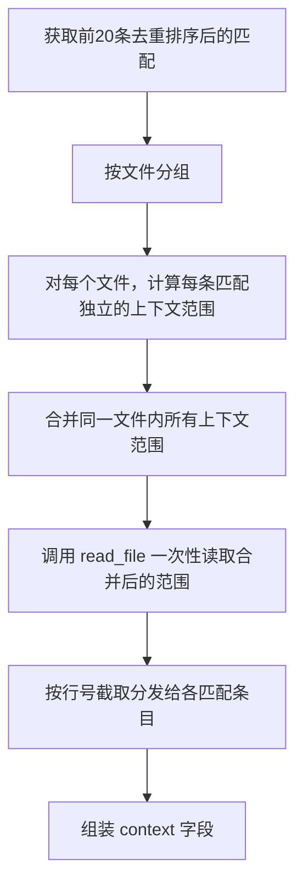
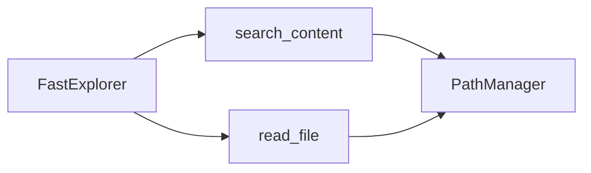

# Explore AI Agent - FastExplorer 详细设计文档 v1.2

| 属性     | 值                                                     |
| :------- | :----------------------------------------------------- |
| 文档版本 | v1.3                                                   |
| 创建日期 | 2026-04-26                                             |
| 修订日期 | 2026-05-09                                             |
| 工具名称 | fast_explorer                                          |
| 技术栈   | Rust                                                   |
| 关联文档 | [Explore AI Agent 架构设计文档 v1.1](Explore%20AI%20Agent架构设计文档v1.1.md) |
| 关联文档 | [底层只读工具详细设计文档 v1.1](底层工具详细设计文档v1.1.md) |

---

## 目录

- [1. 功能概述](#1-功能概述)
- [2. 输入参数](#2-输入参数)
- [3. 输出结构](#3-输出结构)
- [4. 处理流程](#4-处理流程)
  - [4.1 总体流程](#41-总体流程)
  - [4.2 关键词转义与 OR 模式构建](#42-关键词转义与-or-模式构建)
  - [4.3 搜索执行与文件过滤](#43-搜索执行与文件过滤)
  - [4.4 去重规则](#44-去重规则)
  - [4.4.1 文件级聚类](#441-文件级聚类)
  - [4.5 排序规则](#45-排序规则)
  - [4.6 上下文提取](#46-上下文提取)
    - [4.6.1 上下文范围计算](#461-上下文范围计算)
    - [4.6.2 批量读取优化](#462-批量读取优化)
    - [4.6.3 上下文分发（关键步骤）](#463-上下文分发关键步骤)
    - [4.6.4 调用失败降级](#464-调用失败降级)
    - [4.6.5 上下文行数不足处理](#465-上下文行数不足处理)
  - [4.7 结果截断](#47-结果截断)
- [5. 与已有工具的复用关系](#5-与已有工具的复用关系)
- [6. 错误处理](#6-错误处理)
- [7. 自动化测试用例](#7-自动化测试用例)

---

## 1. 功能概述

FastExplorer 是纯代码实现的批量搜索工具，**无 LLM 参与**。由 `fast_explore` 代码层在快速扫描时调用（v1.2 架构：SSA 已废弃）。

**核心功能**：接收 1-5 个关键词，构建正则 OR 模式，在代码库中批量搜索，对结果去重排序，提取上下文，返回精简的匹配结果集（最多 20 条）。

**定位**：比 `search_content` 更高层的聚合工具——一次调用完成"多关键词搜索 → 去重 → 排序 → 上下文提取"全流程，减少工具调用次数。

---

## 2. 输入参数

| 参数           | 类型     | 必选 | 默认值 | 说明                                                         |
| :------------- | :------- | :--- | :----- | :----------------------------------------------------------- |
| keywords       | String[] | 是   | —      | 关键词列表，**1-5 个**，每个关键词为纯文本（非正则）         |
| exclude_paths  | String[] | 否   | []     | 排除路径列表，支持 glob 模式（如 `["opensource/*", "vendor/*"]`） |

**参数校验规则**：
- `keywords` 为空 → 返回 `INTERNAL_ERROR`，提示 "keywords must not be empty (1-5 words)"
- `keywords` 超过 5 个 → 返回 `INTERNAL_ERROR`，提示 "keywords must not exceed 5 words"

---

## 3. 输出结构

### FastExplorerOutput

| 字段          | 类型                | 说明                                                         |
| :------------ | :------------------ | :----------------------------------------------------------- |
| matches       | FastExplorerMatch[] | 匹配结果数组，最多 60 条（20 文件 × 3 条/文件）              |
| total         | usize               | 去重合并后的匹配条目总数                                     |
| files_total   | usize               | 去重后的唯一文件总数                                         |
| files_sampled | usize               | 实际采样的唯一文件数（≤ MAX_FILES），供 Agent 判断关键词覆盖广度 |
| has_matches   | bool                | total > 0 时为 true                                          |

### FastExplorerMatch

| 字段    | 类型   | 说明                                                          |
| :------ | :----- | :------------------------------------------------------------ |
| file    | String | 匹配文件的相对路径（相对于 project_root）                     |
| line    | String | 匹配行号范围，格式 `"42"` 或 `"42-47"`（多行匹配时）          |
| content | String | 匹配行的文本内容（trim 后）                                    |
| context | String | 匹配行及前后各 5 行的完整上下文文本，行之间以 `\n` 分隔       |

**输出 JSON 示例**：

```json
{
  "matches": [
    {
      "file": "src/validation/BooleanValidator.java",
      "line": "42-46",
      "content": "if (required && value == null) {",
      "context": "    // check required constraint\n    public void validate(Object value) {\n        if (required && value == null) {\n            throw new ValidationException(\"required\");\n        }\n        // check default value\n        if (hasDefault && value.equals(defaultValue)) {\n            return;\n        }\n    }"
    }
  ],
  "total": 1,
  "has_matches": true
}
```

### context 字段说明

- `context` 包含匹配行及**前后各 5 行**的完整文本
- 当匹配行靠近文件开头时，前方行数可能少于 5 行
- 当匹配行靠近文件结尾时，后方行数可能少于 5 行
- 所有行之间以 `\n` 分隔，末尾无多余 `\n`
- 如果匹配行本身跨多行（搜索词跨越换行），则 context 范围以第一个匹配行位置计算

---

## 4. 处理流程

### 4.1 总体流程

```mermaid
flowchart TD
    A[接收 keywords, exclude_paths] --> B[参数校验]
    B --> C{校验通过?}
    C -- 否 --> D[返回 INTERNAL_ERROR]
    C -- 是 --> E[对每个关键词进行正则转义]
    E --> F[构建 OR 模式: k1|k2|...|kn]
    F --> G[调用 search_content 执行搜索]
    G --> H[获取原始匹配结果]
    H --> I[按 file + line 去重]
    I --> J[按文件路径字典序 + 行号升序排序]
    J --> K[对前 20 条匹配提取上下文]
    K --> L[截取前后各 5 行]
    L --> M[组装 FastExplorerMatch 结果]
    M --> N[返回 FastExplorerOutput]
```

### 4.2 关键词转义与 OR 模式构建

**步骤**：
1. 对每个关键词调用 `regex::escape()` 转义正则特殊字符（如 `.`、`*`、`(`、`[` 等）
2. 将转义后的关键词用 `|` 连接：`\Qk1\E|\Qk2\E|...|\Qkn\E`
3. 得到的 OR 模式作为 `search_content` 的 `pattern` 参数

**示例**：

| 输入 keywords | 转义后 | 构建的 pattern |
| :--- | :--- | :--- |
| `["BooleanValidator", "参数"]` | `["BooleanValidator", "参数"]` | `BooleanValidator\|参数` |
| `["config.go", "yaml"]` | `["config\\.go", "yaml"]` | `config\\.go\|yaml` |

> **实现方式**：Rust 标准库无 `regex::escape()`。使用 `regex` crate 的 `escape()` 函数或手动实现字符级转义。

### 4.3 搜索执行与文件过滤

调用 `search_content` 工具执行搜索，传入参数：

| 参数               | 值                                                    | 说明                         |
| :----------------- | :---------------------------------------------------- | :--------------------------- |
| pattern            | 构建的 OR 正则模式                                     | 多关键词 OR 搜索             |
| file_pattern       | null（不传）                                           | 搜索所有文本文件             |
| exclude_paths      | FastExplorer 的 exclude_paths 参数透传                  | AI 指定的排除路径            |
| exclude_test_files | true（默认）                                           | 排除测试文件                 |
| context_lines      | 0                                                     | 不提取上下文（由 FastExplorer 后续自行提取） |

> **`context_lines` 设为 0 的原因**：FastExplorer 通过 `read_file` 自行提取上下文以提供更完整的 `context` 字段（包含前后 5 行原始内容），而非依赖 `search_content` 的上下文能力。设为非 0 值不会出错，但会额外增加输出体积且最终会被 FastExplorer 覆盖，无实际收益。

**搜索范围**：`search_content` 自动在 project_root 下递归搜索，跳过 `.git`、`node_modules` 等目录。

> **`exclude_paths` 透传说明**：FastExplorer 不对 `exclude_paths` 做独立校验，glob 语法正确性由 `search_content` 的底层实现保证。若 glob 非法，`search_content` 返回的 `INVALID_PATTERN` 错误将被透传。

### 4.4 去重规则

原始 `search_content` 结果可能对同一文件的相近行产生多条匹配。去重规则：

1. 按 `(file, line)` 组合去重
2. 对于**相邻或重叠的行范围**进行合并：
   - 如 `file=A, line=42` 和 `file=A, line=43` → 合并为 `line="42-43"`
   - 如 `file=A, line=42` 和 `file=A, line=44` → 不合并（间距 > 1）
3. 同一文件内，合并后的所有行范围视为独立条目

**合并算法**：
1. 将同一文件的所有匹配按行号升序排列
2. 遍历排序后的列表，若当前行号 ≤ 前一行号 + 1，则扩展前一条目的行范围
3. 否则，当前条目作为新的独立条目

### 4.4.1 文件级聚类

去重合并后，对结果按文件聚类采样，避免单一文件垄断返回配额：

1. 将去重后的匹配按文件分组
2. 同文件内按行号升序排列
3. 每个文件取前 `MAX_MATCHES_PER_FILE`（默认 3）条匹配，代表该文件中最靠前的匹配区域
4. 如文件匹配数 < 3，则保留全部

> **扩展方向（后续版本）**：可考虑基于信息密度的动态配额。当前固定 3 条策略作为第一版已满足基本需求。

### 4.5 排序规则

聚类后对文件组排序，使用四级排序：

1. **第一关键字（v1.3）**：文件修改时间（mtime）**降序**。借鉴 OpenCode，最近修改的文件排在最前，LLM 优先看到活跃代码。
2. **第二关键字**：首次匹配行号 ≤ `SHORT_FILE_LINE_THRESHOLD`（默认 5）的文件**排后**。避免仅含包声明的短文件挤占核心源码。
3. **第三关键字**：首次匹配行号升序。行号越小，排名越靠前。
4. **第四关键字**：文件路径字典序（兜底，保证排序稳定）。

### 4.6 上下文提取

对排序后的**前 20 条**匹配结果，提取上下文。

> **read_file 调用方式**：FastExplorer 直接调用 `ReadFileTool` 的实例方法，使用**字符串格式** `"start-end"` 传入 `lines` 参数（内部直接构造 `LineRanges`，避免序列化开销）。格式与底层工具设计文档 V1.1 中 `read_file` 的字符串格式兼容。

#### 4.6.1 上下文范围计算

每条匹配以**自身去重合并后的行号**为基准，独立计算上下文范围：

- `context_start = max(1, match_start_line - 5)`
- `context_end = match_end_line + 5`

#### 4.6.2 批量读取优化

同一文件的多个匹配共享一次文件读取：

1. 将同一文件内所有匹配的 `context_start..context_end` 范围合并为一次批量读取的整体范围
2. 若多个上下文范围有重叠，合并为一个更大的范围一次性读取
3. 调用 `read_file` 一次性读取合并后的范围



#### 4.6.3 上下文分发（关键步骤）

`read_file` 返回的是批量合并后的整体范围内容。**必须按每条匹配自身的行号从整体内容中截取对应的子串**，而非直接使用整体范围。

**分发算法**：

1. 将批量读取的整体内容按行号索引（整体起始行 = 合并范围的 `min(context_start)`）
2. 对于每条匹配，计算其 `context_start` 和 `context_end` 在整体内容中的偏移量：
   - `offset_start = 匹配的 context_start - 整体起始行`
   - `offset_end = 匹配的 context_end - 整体起始行 + 1`
3. 从整体内容中按偏移量截取对应的行，作为该条匹配的 `context`

**示例**：

```
文件 src/lib.rs 有两条独立匹配：第 10 行和第 25 行（不合并）

匹配1（line="10"）：context 范围 = 5-15（10±5）
匹配2（line="25"）：context 范围 = 20-30（25±5）

批量读取范围合并为：5-30（无重叠，但不相邻也合并为一次读取）
read_file 返回：第 5-30 行共 26 行内容

分发：
  匹配1：截取整体内容的第 0-10 行（对应原始行号 5-15）→ 作为匹配1的 context
  匹配2：截取整体内容的第 15-25 行（对应原始行号 20-30）→ 作为匹配2的 context
```

**关键约束**：
- 两个独立匹配的 `context` **互不污染**：匹配1的 context 不含第 25 行（匹配2的匹配行），匹配2的 context 不含第 10 行（匹配1的匹配行）
- 对于已合并为行范围（如 line="42-44"）的条目，其 context 以合并后的起始行 42 计算范围（37-49），context 内容覆盖合并后条目涵盖的所有行

#### 4.6.4 调用失败降级

- 如 `read_file` 调用失败（如文件被删除），该条匹配的 `context` 字段设为空字符串 `""`
- 同一文件的其他匹配不受影响，各自保持独立的降级行为

#### 4.6.5 上下文行数不足处理

- `context_start` 计算后小于 1 → 从第 1 行开始
- `context_end` 超出文件总行数 → 取到文件末尾
- 结果 `context` 中的实际行数可能少于 11 行（1 匹配行 + 前5 + 后5）

### 4.7 结果截断

| 截断点     | 阈值 | 说明                                                         |
| :--------- | :--- | :----------------------------------------------------------- |
| 去重合并后 | 无   | `total` 字段反映去重合并后的真实匹配总数，`files_total` 反映唯一文件总数 |
| 文件采样   | 20   | 最多返回 20 个文件（`MAX_FILES`），每个文件最多 3 条（`MAX_MATCHES_PER_FILE`） |
| 总返回条目 | 60   | 20 文件 × 3 条/文件 = 最多 60 条                             |

无 `truncated` 标记。

**常量定义**：

| 常量 | 值 | 说明 |
|:---|:---|:---|
| `MAX_FILES` | 20 | 最多返回的文件数 |
| `MAX_MATCHES_PER_FILE` | 3 | 每个文件最多保留的匹配条数 |
| `CONTEXT_LINES_AROUND` | 5 | 上下文行数 |
| `SHORT_FILE_LINE_THRESHOLD` | 5 | 短文件阈值：首次匹配行 ≤5 的文件在排序中排后（通常为仅含包声明的简单文件） |

---

## 5. 与已有工具的复用关系

FastExplorer **不重复实现**底层搜索/读取逻辑，而是调用已有的工具：

| 步骤           | 调用的工具       | 调用方式                                                     |
| :------------- | :--------------- | :----------------------------------------------------------- |
| 搜索匹配       | search_content   | 传入构建的 OR pattern，context_lines=0                        |
| 上下文提取     | read_file        | 传入 file + lines range，获取上下文文本                       |

**依赖关系**：



> FastExplorer 直接调用 `SearchContentTool` 和 `ReadFileTool` 的实例方法（而非通过 ToolRegistry 字符串分发），避免不必要的序列化开销。

---

## 6. 错误处理

| 场景                     | 行为                                                         |
| :----------------------- | :----------------------------------------------------------- |
| keywords 为空             | 返回 `INTERNAL_ERROR`                                        |
| keywords 超过 5 个        | 返回 `INTERNAL_ERROR`                                        |
| search_content 返回错误   | 透传该错误，不继续执行                                       |
| 搜索无匹配结果            | 返回 `{ matches: [], total: 0, has_matches: false }`，success = true |
| read_file 上下文提取失败  | 该条匹配的 `context` 填充为空字符串 `""`，不影响其他条目       |
| 正则转义异常              | 返回 `INVALID_PATTERN` 错误（理论上不会发生，纯文本转义总是成功） |

---

## 7. 自动化测试用例

### 7.1 测试夹具

复用 `tests/common/mod.rs` 中已有的 `create_test_fixture()`，无需额外夹具。

### 7.2 测试用例

#### FE-001 ~ FE-003：参数校验

| 用例编号 | 测试场景 | 输入 | 预期结果 |
| :------- | :------- | :--- | :------- |
| FE-001 | 空关键词列表 | `keywords: []` | 返回 `INTERNAL_ERROR` |
| FE-002 | 关键词超过 5 个 | `keywords: ["a","b","c","d","e","f"]` | 返回 `INTERNAL_ERROR` |
| FE-003 | 边界值：恰好 1 个关键词 | `keywords: ["main"]` | success = true |

#### FE-004 ~ FE-007：基本搜索功能

| 用例编号 | 测试场景 | 输入 | 预期结果 |
| :------- | :------- | :--- | :------- |
| FE-004 | 单个关键词搜索 | `keywords: ["main"]` | matches 包含 `src/main.rs` 中的匹配，total > 0 |
| FE-005 | 多关键词 OR 搜索 | `keywords: ["println", "helper"]` | matches 同时包含匹配 `println` 和 `helper` 的结果 |
| FE-006 | 无匹配结果 | `keywords: ["zzz_nonexistent_xyz"]` | matches = [], total = 0, has_matches = false |
| FE-007 | 中英文混合关键词 | `keywords: ["test", "测试"]` | 正常执行，不报错 |

#### FE-008 ~ FE-011：去重与合并

| 用例编号 | 测试场景 | 输入 | 预期结果 |
| :------- | :------- | :--- | :------- |
| FE-008 | 连续行合并 | 关键词匹配同一文件的第 42、43、44 行 | 合并为一条，line = "42-44" |
| FE-009 | 非连续行不合并 | 关键词匹配同一文件的第 10 行和第 25 行 | 保持两条独立匹配 |
| FE-010 | 跨文件不合并 | 关键词匹配 `a.rs:10` 和 `b.rs:10` | 保持两条独立匹配，按文件排序 |
| FE-011 | 去重：完全相同行只保留一条 | 同一文件同一行被两个关键词同时匹配 | 去重后只保留一条 |

#### FE-012 ~ FE-013：排序验证

| 用例编号 | 测试场景 | 预期结果 |
| :------- | :------- | :------- |
| FE-012 | 文件路径字典序 | 结果按文件路径升序排列 |
| FE-013 | 同文件内行号升序 | 同一文件的匹配按行号从小到大排列 |

#### FE-014 ~ FE-016：上下文提取

| 用例编号 | 测试场景 | 预期结果 |
| :------- | :------- | :------- |
| FE-014 | 上下文包含前后 5 行 | `context` 字符串包含匹配行及前后各 5 行 |
| FE-015 | 文件开头上下文不足 5 行 | `context` 从第 1 行开始，前方行数 < 5 |
| FE-016 | 文件结尾上下文不足 5 行 | `context` 到文件末尾，后方行数 < 5 |

#### FE-017 ~ FE-019：结果限制

| 用例编号 | 测试场景 | 预期结果 |
| :------- | :------- | :------- |
| FE-017 | 匹配数 > 20 条 | `matches.len() == 20`，`total > 20` |
| FE-018 | 匹配数 < 20 条 | `matches.len() == total` |
| FE-019 | 边界值：恰好 20 条 | `matches.len() == 20`，`total == 20` |

#### FE-020 ~ FE-021：排除路径

| 用例编号 | 测试场景 | 输入 | 预期结果 |
| :------- | :------- | :--- | :------- |
| FE-020 | 排除指定目录 | `keywords: ["test"]`, `exclude_paths: ["docs/*"]` | matches 不包含 `docs/` 下的文件 |
| FE-021 | 空排除列表 | `keywords: ["main"]`, `exclude_paths: []` | 等价于不传 exclude_paths |

#### FE-022 ~ FE-023：正则转义

| 用例编号 | 测试场景 | 输入 | 预期结果 |
| :------- | :------- | :--- | :------- |
| FE-022 | 关键词含正则特殊字符 `.` | `keywords: ["config.go"]` | 只匹配字面 `config.go`，不匹配 `config_go` |
| FE-023 | 关键词含正则特殊字符 `(` | `keywords: ["validate("]` | 只匹配字面 `validate(`，不触发正则语法错误 |

#### FE-024：ToolExecutor trait 集成

| 用例编号 | 测试场景 | 预期结果 |
| :------- | :------- | :------- |
| FE-024 | 通过 ToolRegistry 调用 | `registry.execute("fast_explorer", params)` 返回正确的 `ToolOutput` |

#### FE-025 ~ FE-027：上下文分发与边界

| 用例编号 | 测试场景 | 预期结果 |
| :------- | :------- | :------- |
| FE-025 | 同文件非连续匹配上下文隔离 | 两个独立匹配（如第 10 行和第 25 行）的 context 各自独立，互不包含对方的匹配行 |
| FE-026 | 关键词含反斜杠 `\` | `keywords: ["src\\main"]` → 匹配字面 `src\main`，不触发转义异常 |
| FE-027 | read_file 上下文提取失败 | 失败匹配的 `context = ""`，其他匹配正常返回上下文 |

---

## 附录 A：关键词转义对照表

| 原始关键词 | 转义后 | 说明 |
| :--------- | :----- | :--- |
| `BooleanValidator` | `BooleanValidator` | 纯字母，无需转义 |
| `config.go` | `config\.go` | `.` 是正则元字符，需转义 |
| `test*.rs` | `test\*\.rs` | `*` 和 `.` 均需转义 |
| `[INFO]` | `\[INFO\]` | `[` `]` 是正则字符类，需转义 |
| `func(` | `func\(` | `(` 是正则分组，需转义 |
| `C:\path` | `C:\\path` | `\` 需转义为 `\\` |

> 使用 `regex::escape()` 或等效函数自动处理所有正则特殊字符

---

## 修订记录

| 版本 | 日期 | 修订人 | 变更说明 |
|:---|:---|:---|:---|
| v1.0 | 2026-04-25 | sdfang1053 | 初版：关键词匹配批量搜索 |
| v1.1 | 2026-04-26 | sdfang1053 | 增加搜索结果分组聚类、置信度评分 |
| v1.2 | 2026-04-26 | sdfang1053 | 硬截断替换为 per-file 聚类压缩 |
| v1.3 | 2026-05-09 | sdfang1053 | 排序新增第一关键字：文件 mtime 降序（最近修改的文件优先展示） |
