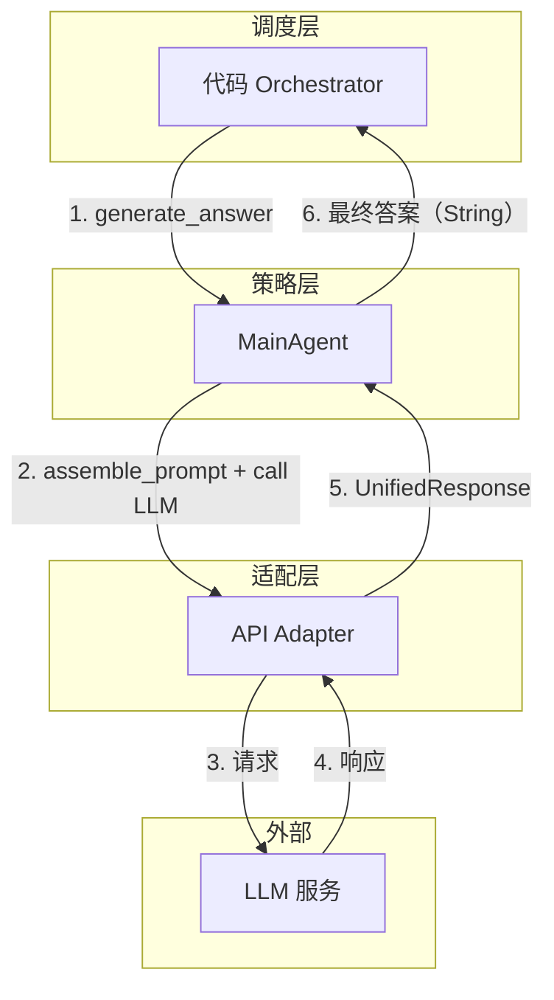
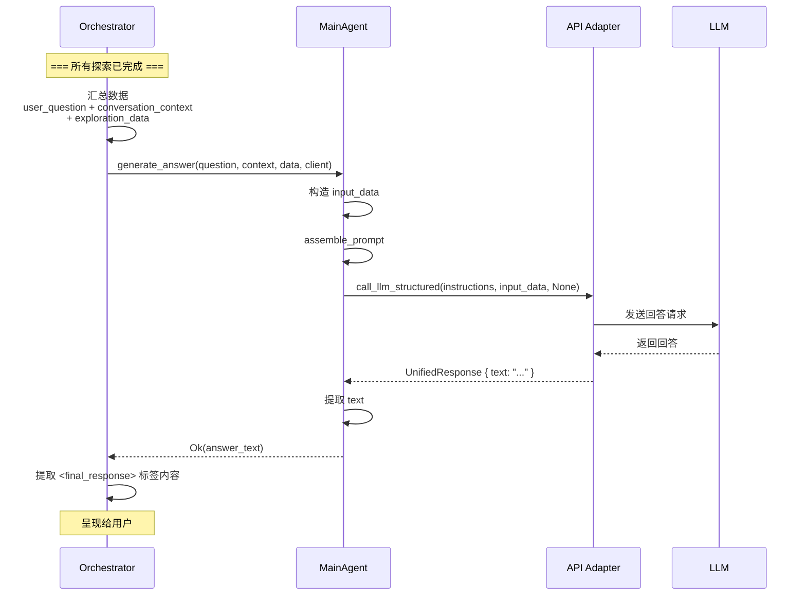

# Explore AI Agent - MainAgent 详细设计文档 v1.0

| 属性     | 值                                                                 |
| :------- | :----------------------------------------------------------------- |
| 文档版本 | v1.0                                                               |
| 创建日期 | 2026-04-30                                                         |
| 涉及模块 | agents/main_agent                                                   |
| 技术栈   | Rust + async-trait                                                  |
| 关联文档 | [Explore AI Agent 架构设计文档 v1.1](Explore%20AI%20Agent架构设计文档v1.1.md) |

---

## 目录

- [1. 总体设计](#1-总体设计)
  - [1.1 模块定位](#11-模块定位)
  - [1.2 核心原则](#12-核心原则)
  - [1.3 架构位置](#13-架构位置)
- [2. 数据结构](#2-数据结构)
  - [2.1 MainAgentInput](#21-mainagentinput)
  - [2.2 输出](#22-输出)
- [3. MainAgent 方法详细设计](#3-mainagent-方法详细设计)
  - [3.1 构造](#31-构造)
  - [3.2 generate_answer — 生成最终答案](#32-generate_answer--生成最终答案)
- [4. Prompt 设计](#4-prompt-设计)
  - [4.1 Prompt 模板](#41-prompt-模板)
  - [4.2 变量说明](#42-变量说明)
  - [4.3 输出格式](#43-输出格式)
- [5. 调用时机与上下文](#5-调用时机与上下文)
  - [5.1 触发条件](#51-触发条件)
  - [5.2 调用时序](#52-调用时序)
- [6. 错误处理](#6-错误处理)
- [7. 自动化测试用例](#7-自动化测试用例)
- [8. 附录](#8-附录)

---

## 1. 总体设计

### 1.1 模块定位

MainAgent 是系统策略层的**最终回答专家**。它是整个 Explore AI Agent 流程的最后一个环节——接收 Orchestrator 汇总的所有探索数据和对话上下文，基于这些数据生成用户的最终答案。MainAgent 不参与代码探索、不调用任何工具、不做流程决策。

**核心职责**：

1. 基于系统提供的探索数据回答用户问题
2. 结合对话上下文理解多轮对话中的指代关系
3. 仅基于给定的数据作答，不凭空编造
4. 当探索数据不足时如实告知用户

### 1.2 核心原则

| 原则 | 说明 |
|:---|:---|
| **纯数据消费** | 只接收和解读数据，不参与搜索、评估、决策 |
| **无工具调用** | 不向 LLM 暴露任何工具 |
| **诚实回答** | 数据不足时明确告知，不编造信息 |
| **输出包裹** | 最终答案用 `<final_response>` 标签包裹，便于上游解析 |

### 1.3 架构位置



MainAgent 是流程的终点。Orchestrator 在所有探索和评估完成后调用它，将返回的答案直接传递给用户。

---

## 2. 数据结构

### 2.1 MainAgentInput

MainAgent 接收 3 项输入，由 Orchestrator 汇总后传入：

| 字段 | 类型 | 来源 | 说明 |
|:---|:---|:---|:---|
| user_question | &str | 用户输入 | 用户原始问题，由 Orchestrator 透传 |
| conversation_context | &str | ConversationContextTool | 对话历史摘要（含话题脉络和指代关系） |
| exploration_data | &serde_json::Value | Orchestrator 汇总 | 探索阶段收集的所有数据（ECT 摘要 + DeepExplorer 原始证据 + QE 评估结果） |

### 2.2 输出

MainAgent 的输出是纯文本字符串——LLM 生成的最终答案（含 `<final_response>` 标签）。不涉及 JSON 反序列化或结构化校验。Orchestrator 负责从返回文本中提取 `<final_response>` 标签内的内容呈现给用户。

---

## 3. MainAgent 方法详细设计

### 3.1 构造

```rust
pub fn new() -> Self
```

无参数构造。MainAgent 不持有任何内部状态。

### 3.2 generate_answer — 生成最终答案

#### 3.2.1 函数签名

```rust
pub async fn generate_answer(
    &self,
    user_question: &str,
    conversation_context: &str,
    exploration_data: &serde_json::Value,
    client: &dyn LlmStructuredClient,
) -> Result<String, String>
```

| 参数 | 类型 | 说明 |
|:---|:---|:---|
| user_question | &str | 用户原始问题 |
| conversation_context | &str | 对话历史摘要 |
| exploration_data | &serde_json::Value | 探索阶段收集的所有数据 |
| client | &dyn LlmStructuredClient | 适配层注入，与 QE/Refiner 共用同一 trait |

**返回值**：成功时返回 LLM 生成的答案文本；失败时返回错误描述。

#### 3.2.2 处理流程

```mermaid
flowchart TD
    A[接收 user_question + conversation_context + exploration_data] --> B[构造 input_data JSON<br/>含三者的结构化数据]
    B --> C[调用 assemble_prompt 生成指令文本]
    C --> D[调用 client.call_llm_structured<br/>传入 instructions + input_data + schema=None]
    D --> E{调用成功?}
    E -- 是 --> F[从 UnifiedResponse.text 提取答案]
    F --> G{text 非空?}
    G -- 是 --> H[返回 Ok(答案文本)]
    G -- 否 --> I[返回 Err: Empty response]
    E -- 否 --> I
```

#### 3.2.3 处理步骤详述

**步骤 1：构造输入数据**

将 `user_question`、`conversation_context`、`exploration_data` 包装为一个 JSON 对象：

```json
{
  "user_question": "...",
  "conversation_context": "...",
  "exploration_data": { ... }
}
```

若序列化失败，返回 `Err("Failed to serialize answer input: {details}")`。

**步骤 2：组装指令文本**

调用 `self.assemble_prompt()` 生成核心指令文本（角色定义、工作要求、输出格式）。指令文本见第 4 节。

**步骤 3：调用适配层**

调用 `client.call_llm_structured(&instructions, &input_data, None)`。`output_schema` 参数为 `None`——MainAgent 不需要结构化输出约束，答案格式由 Prompt 中的 `<final_response>` 标签约定。

适配层内部处理 Chat/Responses 差异：Chat 模式指令与数据拼接后放入 system message，Responses 模式分别放入 `instructions` 和 `input` 字段。

**步骤 4：提取答案**

从 `UnifiedResponse.text` 中获取答案文本。若 `text` 为 `None` 或空字符串，返回 `Err("Empty response from LLM")`。

MainAgent 不做 `<final_response>` 标签的提取或校验——此职责归 Orchestrator。

---

## 4. Prompt 设计

### 4.1 Prompt 模板

指令模板由 `assemble_prompt()` 返回。用户问题、对话上下文和探索数据通过 `input_data` 参数传入。

```
你是 WSF 技术专家。基于系统提供的探索数据回答用户问题。

系统会以结构化数据的形式向你提供对话上下文、用户问题和探索数据，请基于这些内容生成答案。

## 要求
- 仅基于提供的探索数据回答，不要凭空编造
- 如果探索数据不足以回答问题，如实告知用户
- 回答专业、准确、简洁
- 结合对话上下文理解多轮对话中的指代关系

## 输出格式
直接输出答案，用 <final_response> 标签包裹。

例如：
<final_response>
BooleanValidator 支持两个配置参数：required（默认 true）和 defaultValue。required 参数控制……
</final_response>
```

### 4.2 变量说明

MainAgent 的指令模板不含占位符——所有数据通过 `input_data` 参数传入。`call_llm_structured` 在 Chat 模式下将 `input_data` 拼接到指令末尾，Responses 模式下将其放入 API 原生 `input` 字段。

| 变量 | 传递方式 | 说明 |
|:---|:---|:---|
| 用户问题 | `input_data.user_question` | 用户原始问题 |
| 对话上下文 | `input_data.conversation_context` | 对话历史摘要，帮助理解多轮对话中的"它"、"这个"等指代 |
| 探索数据 | `input_data.exploration_data` | ECT 摘要 + DeepExplorer 证据 + QE 全局评估 |

### 4.3 输出格式

MainAgent 不要求 LLM 输出 JSON。答案格式由 Prompt 中的自然语言约定：

- LLM 输出的文本中应包含 `<final_response>...</final_response>` 标签
- Orchestrator 负责从返回文本中提取标签内的内容呈现给用户
- 标签不是强约束（无 JSON Schema），LLM 可能不遵守——此时 Orchestrator 回退为返回原始文本

> **设计说明**：与 QE/Refiner 不同，MainAgent 不使用 `strict: true` 的 JSON Schema。原因：(1) 最终答案是面向用户展示的自然语言，不应被 JSON 格式约束限制表达；(2) `<final_response>` 标签提供了足够的结构化边界，足够上游解析。

---

## 5. 调用时机与上下文

### 5.1 触发条件

MainAgent 由 Orchestrator 在以下时机调用：

| 场景 | 触发条件 | 输入数据来源 |
|:---|:---|:---|
| **快速探索后直接回答** | QE 快速探索评估返回 `action: "answer"` 或问题与代码库无关 | QE 评估结果 + 快速探索摘要 |
| **深度探索后回答** | DeepExplorer 完成 + QE 深度探索评估完成 | QE 评估结果（作为精准摘要）+ DeepExplorer 原始证据 |

MainAgent 始终是流程的最后一步。Orchestrator 在调用它之前确保所有探索和评估都已结束。

### 5.2 调用时序



---

## 6. 错误处理

| 场景 | 处理方式 | 是否中断流程 |
|:---|:---|:---|
| input_data 序列化失败 | 返回 `Err("Failed to serialize answer input: {details}")` | 是 |
| LLM 调用失败（含 3 次重试耗尽） | 透传适配层错误 | 是 |
| LLM 返回空响应（text = None 或空字符串） | 返回 `Err("Empty response from LLM")` | 是 |

> MainAgent 不做 `<final_response>` 标签缺失的兜底——此职责归 Orchestrator。

---

## 7. 自动化测试用例

### 7.1 测试夹具

- 构造标准对话上下文和探索数据 JSON
- `generate_answer()` 的测试通过 mock `LlmStructuredClient` 隔离真实 LLM
- 所有测试不依赖真实 LLM 调用

### 7.2 构造测试

| 用例编号 | 测试场景 | 输入 | 预期结果 |
|:---|:---|:---|:---|
| MA-001 | 构造 MainAgent | `MainAgent::new()` | 返回实例，不 panic |

### 7.3 Prompt 组装测试

| 用例编号 | 测试场景 | 输入 | 预期结果 |
|:---|:---|:---|:---|
| MA-002 | 指令文本含角色定义 | 调用 `assemble_prompt()` | 结果含 `WSF 技术专家` |
| MA-003 | 指令文本含工作要求 | 调用 `assemble_prompt()` | 结果含 `仅基于提供的探索数据回答`、`如实告知用户` |
| MA-004 | 指令文本含输出格式说明 | 调用 `assemble_prompt()` | 结果含 `<final_response>` 标签说明 |

### 7.4 集成测试

| 用例编号 | 测试场景 | 输入 | 预期结果 |
|:---|:---|:---|:---|
| MA-005 | 正常回答生成 | mock 返回 text=`"<final_response>\nBooleanValidator 支持两个参数...\n</final_response>"` | `generate_answer()` 返回 `Ok`，含 `<final_response>` |
| MA-006 | 数据不足如实告知 | mock 返回 text=`"<final_response>\n当前探索数据不足，无法完整回答该问题。\n</final_response>"` | `generate_answer()` 返回 `Ok`，含 `数据不足` |
| MA-007 | 空响应错误 | mock 返回 UnifiedResponse { text: None } | `generate_answer()` 返回 `Err`，含 "Empty response" |
| MA-008 | 含对话上下文的回答 | conversation_context 含对话历史 | `generate_answer()` 返回 `Ok`，LLM 收到了对话上下文 |

---

## 8. 附录

### 8.1 与架构文档的对应关系

| 架构文档章节 | 对应本模块 | 实现状态 |
|:---|:---|:---|
| 4.3 主 Agent Prompt | 第 4 节 | 本文档设计 |
| 4.3 变量说明 | 第 4.2 节 | 本文档细化 |
| 2.2 模块职责（主 Agent） | 第 1.1 节 | 本文档设计 |

### 8.2 与其他模块的接口

| 调用方 | 调用方法 | 说明 |
|:---|:---|:---|
| Orchestrator | `generate_answer(user_question, conversation_context, exploration_data, client)` | 唯一调用入口，流程的最后一步 |
| ApiAdapter | `call_llm_structured(instructions, input_data, None)` | 通过 `&dyn LlmStructuredClient` 注入 |

### 8.3 不变式与约束

| 约束 | 说明 |
|:---|:---|
| **无状态** | 不持有任何可变状态，每次 `generate_answer()` 完全独立 |
| **无工具** | 不向 LLM 暴露任何工具 |
| **无 Schema** | 不使用 JSON Schema 约束输出，答案格式由 Prompt 约定 |
| **纯消费** | 只读取数据，不写入 ECT/CCT，不参与流程决策 |

### 8.4 与其他 Agent 的对比

| 维度 | MainAgent | ExplorationQualityEvaluator | ExplorationRefinerAgent |
|:---|:---|:---|:---|
| 是否有工具 | 否 | 否 | 否 |
| 输出类型 | 自由文本（String） | 结构化 JSON（6 字段） | 结构化 JSON（4 字段） |
| JSON Schema | 无 | `strict: true` | `strict: true` |
| 适配层接口 | `call_llm_structured` | `call_llm_structured` | `call_llm_structured` |
| 调用时机 | 流程最后一步 | 探索后（1-2 次） | token 超阈值 |
| 是否参与决策 | 否 | 是（action 字段） | 否 |
| 标签约定 | `<final_response>` | — | — |

---

## 修订记录

| 版本 | 日期 | 修订人 | 变更说明 |
|:---|:---|:---|:---|
| v1.0 | 2026-04-30 | sdfang1053 | 初版：被动接收探索数据的汇总 Agent |
| v1.1 | 2026-05-08 | sdfang1053 | 废除：由新版 MainAgent 文档替代 |
