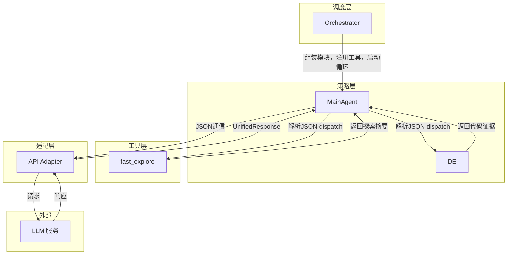
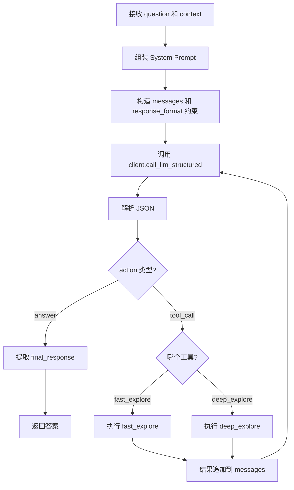

# Explore AI Agent - MainAgent 详细设计文档 v1.4

| 属性 | 值 |
|:---|:---|
| 文档版本 | v1.4 |
| 创建日期 | 2026-04-30 |
| 修订日期 | 2026-05-09 |
| 涉及模块 | agents/main_agent |
| 技术栈 | Rust + async-trait |
| 关联文档 | [Explore AI Agent 架构设计文档 v1.4](Explore%20AI%20Agent架构设计文档v1.1.md) |
| 关联文档 | [DeepExplorer 详细设计文档 v1.3](DeepExplorer详细设计文档v1.0.md) |

> **v1.4 变更说明**：deep_explore 变为可配置（`deep_explorer.enable`），禁用时 MainAgent 只持有 fast_explore + execute_shell。execute_shell 描述升级为全场景工具（grep/find/awk/sed 搜索代码）。`run()` 的 DE 参数改为 `Option`。

---

## 目录

- [1. 总体设计](#1-总体设计)
- [2. 数据结构](#2-数据结构)
- [3. MainAgent 方法详细设计](#3-mainagent-方法详细设计)
- [4. System Prompt 设计](#4-system-prompt-设计)
- [5. 工具定义](#5-工具定义)
- [6. 决策循环与上下文](#6-决策循环与上下文)
- [7. 错误处理](#7-错误处理)
- [8. 测试设计](#8-测试设计)
- [9. 附录](#9-附录)

---

## 1. 总体设计

### 1.1 模块定位

MainAgent 是系统的**唯一入口和决策中心**。它不直接执行代码搜索或文件读取，而是通过 JSON 通信协议自主调度两个探索工具（fast_explore 和 deep_explore），基于探索结果生成最终答案。

**核心职责**：

1. 接收用户问题，判断是否需要代码探索
2. 通过 JSON 通信协议（`response_format: json_object`）自主决定下一步：直接回答、调用 fast_explore、或调用 deep_explore
3. **自主设计关键词**并调用 fast_explore 进行快速代码扫描（可多次调用，每次调整关键词）
4. 调用 deep_explore 进行深度代码探索
5. 汇总探索数据，生成最终答案

**与 v1.1 的关键区别**：

| | v1.1 | v1.2 |
|:---|:---|:---|
| 角色 | 被动接收探索数据，汇总生成答案 | 主动决策，自主调度探索工具 |
| 通信方式 | 接收结构化的探索数据 JSON | JSON 通信协议（`action: answer | tool_call`） |
| 工具调用 | 无 | 通过 JSON 协议调用 fast_explore/DE |
| 探索触发 | Orchestrator 固定管道强制触发 | 自主按需触发 |

### 1.2 核心原则

| 原则 | 说明 |
|:---|:---|
| **自主决策** | MainAgent 自己判断是否需要探索、调用哪个工具、何时停止，不依赖外部调度 |
| **JSON 通信** | 通过 `response_format: json_object` 约束 LLM 输出严格 JSON，代码层解析分发。不使用 API 原生的 `tools`/`tool_calls` |
| **多轮迭代** | MainAgent 可以多次调用同一工具（如调整关键词后重新调 fast_explore），循环直到信息足够 |
| **禁止编造** | 探索数据不足以回答时，如实告知用户 |

### 1.3 架构位置



---

## 2. 数据结构

### 2.1 MainAgentAction（JSON 通信协议）

MainAgent 每次响应必须是合法 JSON，由 `response_format` 约束：

```rust
// LLM 输出的 JSON 结构
{
  "action": "answer" | "tool_call",
  "final_response": "...",      // action=answer 时必填
  "tool": "fast_explore" | "deep_explore",  // action=tool_call 时必填
  "arguments": { ... }          // action=tool_call 时必填
}
```

| 字段 | 类型 | 说明 |
|:---|:---|:---|
| action | string | `"answer"`：直接回答用户；`"tool_call"`：调用探索工具 |
| final_response | string | 最终答案文本。仅 `action=answer` 时有效 |
| tool | string | 工具名：`"fast_explore"` 或 `"deep_explore"`。仅 `action=tool_call` 时有效 |
| arguments | object | 工具参数。`fast_explore` 时含 `keywords`（字符串数组）；`deep_explore` 时含 `question` 和可选的 `current_summary` |

### 2.2 JSON Schema（response_format 约束）

```json
{
  "name": "main_agent_action",
  "strict": true,
  "schema": {
    "type": "object",
    "properties": {
      "action": {"type": "string", "enum": ["answer", "tool_call"]},
      "final_response": {"type": "string"},
      "tool": {"type": "string", "enum": ["fast_explore", "deep_explore"]},
      "arguments": {"type": "object"}
    },
    "required": ["action"]
  }
}
```

---

## 3. MainAgent 方法详细设计

### 3.1 构造

```rust
pub fn new() -> Self
```

无参数构造。MainAgent 不持有任何内部状态。

```rust
pub fn action_schema() -> serde_json::Value
```

返回 MainAgent 的 JSON Schema 约束（见 2.2 节），供适配层构建 `response_format`。

### 3.2 run — 执行决策循环

#### 3.2.1 函数签名

```rust
pub async fn run(
    &self,
    question: &str,
    conversation_context: &str,
    fast_explore: &dyn FastExploreExecutor,
    de: Option<&dyn DeepExploreExecutor>,
    shell: &dyn ShellExecutor,
    client: &dyn LlmToolClient,
) -> Result<String, String>
```

| 参数 | 类型 | 说明 |
|:---|:---|:---|
| question | &str | 用户原始问题 |
| conversation_context | &str | 对话历史摘要 |
| fast_explore | &dyn FastExploreExecutor | fast_explore 执行器（trait 注入） |
| de | Option<&dyn DeepExploreExecutor> | DE 执行器（trait 注入）。由 `deep_explorer.enable` 配置决定：`Some` 启用，`None` 禁用 |
| shell | &dyn ShellExecutor | execute_shell 执行器（trait 注入）。结果直接返回 MainAgent，不走 TR |
| client | &dyn LlmToolClient | LLM 客户端 |

**返回值**：最终答案文本。DE 禁用时 prompt 自动剔除 deep_explore 段落，dispatch 返回"当前不可用"。

#### 3.2.2 处理流程



#### 3.2.3 处理步骤详述

**步骤 1：组装 System Prompt**

调用 `assemble_prompt()` 生成 system prompt。prompt 中包含 fast_explore、deep_explore、execute_shell 三个工具的完整描述。

**步骤 2：构造初始消息**

```rust
let messages = vec![
    serde_json::json!({"role": "system", "content": system_prompt}),
    serde_json::json!({"role": "user", "content": format!("{}\n{}", conversation_context, question)}),
];
```

**步骤 3：JSON 通信循环**

进入循环：

1. 将 `messages` 发送给 LLM（通过 `call_llm_structured`，带 `action_schema()` 约束）
2. 解析 `UnifiedResponse.text` 中的 JSON：
           - `action == "answer"`：提取 `final_response`，退出循环
           - `action == "tool_call"`：
             - `tool == "fast_explore"`：调 `fast_explore.execute(arguments.keywords)` → 结果追加到 messages
             - `tool == "deep_explore"`：若 `de.is_some()` 执行探索；若 `de.is_none()` 追加"当前不可用"提示
             - `tool == "execute_shell"`：调 `shell.execute(arguments.command)` → 结果追加到 messages（不走 TR）
             - 继续循环
3. JSON 解析失败：追加 user message 提示 LLM 重试，最多 2 次

**步骤 4：返回答案**

从 `action == "answer"` 的 JSON 中提取 `final_response`，返回给用户。

### 3.3 assemble_prompt — System Prompt 组装

```rust
fn assemble_prompt() -> String
```

返回包含 fast_explore、deep_explore、execute_shell 三个工具描述的 System Prompt。模板见第 4 节。

### 3.4 action_schema — JSON Schema

```rust
pub fn action_schema() -> serde_json::Value
```

返回 2.2 节定义的 JSON Schema。

---

## 4. System Prompt 设计

### 4.1 变量说明

Prompt 中的占位符由代码层替换：

| 占位符 | 类型 | 说明 | 来源 |
|:---|:---|:---|:---|
| `{conversation_context}` | string | 对话历史摘要。首轮为空 | ConversationContextTool |
| `{user_question}` | string | 用户当前问题原文 | 用户输入 |
| `{shell_info}` | string | 当前 Shell 类型（如 "bash (Windows)"） | `MainAgent::shell_info()` |
| `{shell_commands}` | string | 当前 Shell 对应的命令白名单 | `MainAgent::shell_commands()` |

### 4.2 System Prompt 模板

```
你是探索者（Explore AI Agent），一个专业的代码库探索助手。
你的工作方式是：理解用户问题，必要时调用代码库搜索工具获取信息，然后基于搜索结果回答用户。

{conversation_context}

{user_question}

## 可用工具

你可以调用以下工具来探索代码库。工具的具体输入输出格式由系统控制，
以下是工具的能力描述和数据结构：

### fast_explore — 快速扫描代码库

根据你设计的关键词批量搜索代码库，返回线索摘要和置信度评分。

| 项目 | 说明 |
|:---|:---|
| **输入** | `keywords`（字符串数组）：2-5 个搜索关键词。你需要**自己设计关键词**——从用户问题中提取核心概念，中英文兼顾 |
| **输出** | `matches`（搜索结果）、`key_findings`（核心发现）、`critical_files`（关键文件列表）、`confidence`（置信度 0.0~1.0） |
| **适用** | 首次探索、快速了解项目中有哪些相关模块、不确定方向时 |
| **限制** | 单次扫描，只返回概要。如果结果不理想，可以调整关键词后再次调用 |

输出示例：
{
  "matches": [...],
  "key_findings": "回测模块在 backtest/engine.py 中实现",
  "critical_files": [{"path": "src/backtest/engine.py", "summary": "回测引擎核心"}],
  "confidence": 0.8
}

### deep_explore — 深度代码探索

深入阅读代码文件，精确定位代码证据。

| 项目 | 说明 |
|:---|:---|
| **输入** | `question`（字符串）：要调查的问题。`current_summary`（对象，可选）：已有的探索线索摘要（如 fast_explore 的返回结果） |
| **输出** | `critical_files`：数组，相关文件及说明。`collected_evidence`：数组，代码证据列表，每条含 `file`（文件路径）、`line`（行号）、`code_snippet`（代码片段）、`relevance`（关联说明）。`missing_info`：字符串，仍缺失的信息 |
| **适用** | fast_explore 指出关键文件但缺少细节、需要确认代码逻辑、追溯调用链 |
| **限制** | 耗时较长（内部最多 75 次操作） |

输出示例：
{
  "critical_files": [
    {"path": "src/backtest/engine.py", "summary": "回测引擎核心"}
  ],
  "collected_evidence": [
    {
      "file": "src/backtest/engine.py",
      "line": "142-158",
      "code_snippet": "def run_backtest(self, start_date, end_date):\n    ...",
      "relevance": "回测主循环，按交易日遍历并执行决策"
    }
  ],
  "missing_info": "无"
}

### execute_shell — 执行只读 Shell 命令

执行只读 Shell 命令。grep 搜索代码、find 查文件、awk/sed 文本处理、wc 统计、管道组合过滤。系统启动时自动检测可用 Shell（bash → pwsh → cmd/sh），注入 `{shell_info}` 和 `{shell_commands}` 到 Prompt。DE 禁用时可作为替代探索手段。

| 项目 | 说明 |
|:---|:---|
| **输入** | `command`（字符串）：只读 Shell 命令 |
| **输出** | `success`（是否成功）、`output`。失败时含 `error` |
| **限制** | 禁止重定向（`>` `>>`）、`tee`、`rm` `mv` `cp` `mkdir` `touch` `chmod` `chown`、管道含禁止命令。`output` 最多 50KB（约 2000 行），超出丢弃 |

## 规则

1. 任何关于代码库的问题，必须先探索再回答。严禁在未探索的情况下猜测或说"信息不足"。
2. 纯问候（"你好"、"谢谢"、"再见"）或追问刚探索过的话题（"再详细说说"）可不调工具直接回答。
3. 严禁编造代码细节。若探索后仍证据不足，如实告知。
4. `deep_explore` 输出的 `missing_info` 字段不作为重试触发条件。`missing_info` 表示该次搜索未覆盖的盲区，不影响已收集证据的有效性。

## 通信协议

你与系统之间通过 JSON 通信。每次回复必须是合法的 JSON 对象，action 字段决定操作类型：

**直接回答用户时**：
{"action": "answer", "final_response": "答案内容"}

**调用工具时**：
{"action": "tool_call", "tool": "fast_explore", "arguments": {"keywords": ["回测", "backtest", "引擎"]}}
{"action": "tool_call", "tool": "deep_explore", "arguments": {"question": "用户问题", "current_summary": {...}}}
{"action": "tool_call", "tool": "execute_shell", "arguments": {"command": "find . -name '*.rs' | wc -l"}}

注意：只输出 JSON，不要包裹任何标记或解释文字。如果你的回答不符合 JSON 要求，系统将强制你重新回答，请务必按照通信协议规范的返回 JSON！！！
```

---

## 5. 工具定义

MainAgent 不直接持有 fast_explore/DE 的引用，而是通过 trait 注入：

### 5.1 FastExploreExecutor

```rust
#[async_trait::async_trait]
pub trait FastExploreExecutor: Send + Sync {
    async fn execute(
        &self,
        keywords: &[String],
    ) -> Result<serde_json::Value, String>;
}
```

> `keywords` 由 MainAgent 自主从用户问题中提取并传入，包含 2-5 个搜索关键词（中英文兼顾）。返回的 JSON 包含 `matches`、`key_findings`、`critical_files`、`confidence`。

### 5.2 DeepExploreExecutor

```rust
#[async_trait::async_trait]
pub trait DeepExploreExecutor: Send + Sync {
    async fn execute(
        &self,
        question: &str,
        current_summary: Option<&serde_json::Value>,
    ) -> Result<serde_json::Value, String>;
}
```

### 5.3 ShellExecutor

```rust
#[async_trait::async_trait]
pub trait ShellExecutor: Send + Sync {
    async fn execute(
        &self,
        command: &str,
    ) -> Result<serde_json::Value, String>;
}
```

> `command` 由 MainAgent 自主构造并传入。返回的 JSON 包含 `output`（命令标准输出）和 `success`（执行是否成功）。Shell 结果直接返回 MainAgent，不经过 TR 精炼。

> 三个 trait 由 Orchestrator 在组装阶段注入。MainAgent 不感知背后的实现细节——它只知道"调这个函数，拿到这个结果"。

---

## 6. 决策循环与上下文

### 6.1 循环终止条件

| 条件 | 行为 |
|:---|:---|
| LLM 返回 `action: "answer"` | 提取 `final_response`，退出循环，返回答案 |
| JSON 解析失败连续 2 次 | 返回 `Err`，不无限重试 |
| LLM 调用失败（3 次重试耗尽） | 返回 `Err` |

> **无硬性工具调用上限**：MainAgent 可以调用任意次工具，由 LLM 自主决定何时停止。Orchestrator 可以注入一个上限（如 20 次），但 MainAgent 自身不控制。

### 6.2 上下文管理

MainAgent 不管理探索上下文（那是 fast_explore/DE 和 ECT 的职责）。MainAgent 自己的 messages 向量只包含：
- system prompt
- 用户问题和对话上下文
- LLM 的 JSON 响应
- 工具返回的结果（追加为 user message）

当 messages 过长时，MainAgent 可以截断旧消息（保留 system prompt + 最近 N 轮）。

---

## 7. 错误处理

| 场景 | 处理方式 | 是否中断 | 测试 |
|:---|:---|:---|:---|
| LLM 返回非法 JSON | 追加提示重试，最多 2 次 | 耗尽后中断 | MA-026, MA-027 |
| LLM 返回 `action` 字段缺失或 `action=tool_call` 缺 `tool` | 同上 | 同上 | MA-033 |
| LLM 返回未知 `tool` 名称 | 追加提示："可用工具为 fast_explore、deep_explore、execute_shell" | 否 | MA-028 |
| LLM 调用失败（含 3 次重试耗尽） | 返回 `Err` | 是 | MA-029 |
| fast_explore 执行失败 | 将错误信息作为 tool result 返回给 LLM，继续循环 | 否 | MA-025 |
| deep_explore 执行失败 | 同上 | 否 | MA-030 |
| execute_shell 执行失败 | 将错误信息作为 tool result 返回给 LLM，继续循环 | 否 | MA-034 |
| messages 过长 | 截断旧消息，保留 system prompt + 最近 N 轮 | 否 | MA-031 |

---

## 8. 测试设计

### 8.1 测试策略

| 类型 | 覆盖范围 | 依赖 |
|:---|:---|:---|
| 自动化单元 | action_schema 结构、prompt 组装（含 execute_shell 工具标题）、JSON 解析 | 无 |
| 自动化集成 | `run()` 完整决策循环（mock LLM + mock 三工具执行器） | Mock |
| 手工 | 端到端 MainAgent 决策（真实 LLM + 真实工具） | 真实 LLM |

### 8.2 自动化单元测试

#### 8.2.1 数据结构与 Schema

| 编号 | 测试场景 | 输入 | 断言 |
|:---|:---|:---|:---|
| MA-001 | action_schema 返回合法 JSON | `action_schema()` | 可解析，含 `name`、`strict`、`schema` |
| MA-002 | action_schema 的 enum 含 answer 和 tool_call | `action_schema()` | `schema.properties.action.enum` = `["answer", "tool_call"]` |
| MA-003 | action_schema 的 tool enum 含两个工具 | `action_schema()` | `schema.properties.tool.enum` = `["fast_explore", "deep_explore"]` |

#### 8.2.2 Prompt 组装

| 编号 | 测试场景 | 输入 | 断言 |
|:---|:---|:---|:---|
| MA-010 | prompt 含 fast_explore 工具标题 | `assemble_prompt()` | 含 `### fast_explore` 标题（Markdown 结构） |
| MA-011 | prompt 含 deep_explore 工具标题 | `assemble_prompt()` | 含 `### deep_explore` 标题 |
| MA-012 | prompt 含 execute_shell 工具标题 | `assemble_prompt()` | 含 `### execute_shell` 标题 |
| MA-013 | prompt 含 JSON 通信协议格式 | `assemble_prompt()` | 含 `{"action":` 模式 |
| MA-014 | prompt 含工具选择决策分支 | `assemble_prompt()` | 含 `"fast_explore"`、`"deep_explore"`、`"execute_shell"` 三个 tool 名称 |
| MA-015 | shell_info() 返回非空 | `MainAgent::shell_info()` | 返回值非空，含 "bash" / "cmd" / "pwsh" / "sh" 之一 |
| MA-016 | shell_commands() 返回命令列表 | `MainAgent::shell_commands()` | 返回值非空；bash/shell 环境下含 `grep`；cmd 环境下含 `dir` |
| MA-017 | prompt 含 shell 占位符 | `assemble_prompt()` | 含 `{shell_info}` 和 `{shell_commands}` 占位符 |

### 8.3 自动化集成测试（Mock LLM + Mock 工具）

| 编号 | 测试场景 | Mock 配置 | 断言 |
|:---|:---|:---|:---|
| MA-020 | LLM 直接回答 | Mock LLM 返回 `{"action":"answer","final_response":"你好！"}` | `run()` 返回 `Ok("你好！")`；工具执行器未被调用 |
| MA-021 | 调 fast_explore 后回答 | Mock LLM 依次返回 `{"action":"tool_call","tool":"fast_explore","arguments":{"keywords":["test"]}}` → `{"action":"answer","final_response":"找到结果"}`；Mock fast_explore 返回预设摘要 | `run()` 返回 `Ok`；fast_explore 被调用 1 次 |
| MA-022 | 调 deep_explore 后回答 | Mock LLM 依次返回 tool_call(DE) → answer；Mock DE 返回预设证据 | `run()` 返回 `Ok`；DE 被调用 1 次 |
| MA-023 | 多次调 fast_explore 迭代 | Mock LLM 调 fast_explore 3 次后 answer；每次 confidence 递增 | `run()` 返回 `Ok`；fast_explore 被调用 3 次 |
| MA-024 | fast_explore → DE → answer | Mock LLM 序列: fast_explore → deep_explore → answer | `run()` 返回 `Ok`；fast_explore 1次，DE 1次，顺序正确 |
| MA-025 | fast_explore 失败，LLM 切换到 DE | Mock fast_explore 返回 `Err("search failed")`；Mock LLM 第2次返回 `{"action":"tool_call","tool":"deep_explore",...}`，第3次 answer | `run()` 返回 `Ok`；第2次 LLM 调用收到的 messages 中包含 "search failed"；DE 被调用 1 次 |
| MA-026 | JSON 解析失败重试成功 | Mock LLM 第1次返回非法 JSON，第2次返回 answer | `run()` 返回 `Ok` |
| MA-027 | JSON 重试耗尽 | Mock LLM 连续 3 次非法 JSON | `run()` 返回 `Err` |
| MA-028 | LLM 返回未知 tool 名称 | Mock LLM 返回 `{"action":"tool_call","tool":"unknown_tool","arguments":{}}` → 第2次返回 answer | `run()` 返回 `Ok`；第2次 LLM 调用收到的 messages 中含 "可用工具为 fast_explore、deep_explore、execute_shell" 提示 |
| MA-029 | LLM 底层调用失败 | Mock LLM 客户端直接返回 `Err("connection timeout")` | `run()` 返回 `Err`；工具执行器从未被调用 |
| MA-030 | deep_explore 执行失败，LLM 调整 | Mock DE 返回 `Err("deep explore failed")`；Mock LLM 第2次调 fast_explore，第3次 answer | `run()` 返回 `Ok`；第2次 LLM 调用收到的 messages 中包含 "deep explore failed"；fast_explore 被调用 1 次 |
| MA-031 | 上下文过长时截断旧消息 | 注入大量工具返回结果使 messages 超过预设 token 阈值 | 截断后 system prompt 完整保留（含三个工具的标题）；LLM 可正常继续决策 |
| MA-032 | 交替调用 fast → deep → fast → shell | Mock LLM 序列: fast_explore → deep_explore → fast_explore → execute_shell → answer | `run()` 返回 `Ok`；四个工具均被调用，顺序与 Mock 序列一致 |
| MA-033 | action=tool_call 但缺少 tool 字段 | Mock LLM 返回 `{"action":"tool_call","arguments":{"keywords":["test"]}}` → 第2次返回 answer | `run()` 返回 `Ok`；MainAgent 将其视为格式错误并追加修正提示 |
| MA-034 | execute_shell 执行失败，LLM 调整 | Mock Shell 返回 `Err("command not allowed")`；Mock LLM 第2次调 fast_explore，第3次 answer | `run()` 返回 `Ok`；第2次 LLM 调用收到的 messages 中包含 `"command not allowed"`（execute_shell 返回的原始错误信息原文） |
| MA-035 | execute_shell 正常执行 | Mock LLM: execute_shell({"command":"find . -name '*.rs' \| wc -l"}) → answer | `run()` 返回 `Ok`；Shell 被调用 1 次；返回结果含命令输出 |

### 8.4 手工测试

| 编号 | 场景 | 前提条件 | 步骤 | 预期 |
|:---|:---|:---|:---|:---|
| MA-M01 | 端到端 MainAgent 决策 | 真实 LLM，真实代码库 | 1. 提问"你好" 2. 提问"项目有多少文件" 3. 提问"回测怎么实现的" | "你好"直接回答，不调工具；统计类问题可能用 execute_shell；复杂问题先 fast_explore 再 DE |

---

## 9. 附录

### 9.1 与架构文档的对应关系

| 架构文档章节 | 对应本模块 | 实现状态 |
|:---|:---|:---|
| 2.2 MainAgent 模块职责 | 第 1.1 节 | 本文档设计 |
| 4.3 MainAgent System Prompt | 第 4 节 | 本文档设计 |
| 2.3 核心执行流程 | 第 6 节 | 本文档设计 |

### 9.2 与其他模块的接口

| 调用方/被调用方 | 调用方法 | 说明 |
|:---|:---|:---|
| Orchestrator → MainAgent | `run(question, context, fast_explore, de: Option<&dyn DeepExploreExecutor>, shell, client)` | 唯一调用入口 |
| MainAgent → fast_explore | 通过 `FastExploreExecutor` trait | 工具调用 |
| MainAgent → DE | 通过 `DeepExploreExecutor` trait | 工具调用 |
| MainAgent → ApiAdapter | `call_llm_structured(prompt, input_data, schema)` | LLM 调用 |

### 9.3 不变式与约束

| 约束 | 说明 |
|:---|:---|
| **无状态** | MainAgent 不持有跨轮次状态，每次 `run()` 独立 |
| **JSON 通信** | LLM 通过 `response_format: json_object` 输出严格 JSON，代码解析 dispatch |
| **trait 注入** | fast_explore/DE 通过 trait 注入，MainAgent 不感知实现细节 |
| **三工具** | fast_explore、deep_explore、execute_shell 始终可用，MainAgent 自主选择 |

---

## 修订记录

| 版本 | 日期 | 修订人 | 变更说明 |
|:---|:---|:---|:---|
| v1.0 | 2026-04-30 | sdfang1053 | 初版：三阶段管道中的汇总 Agent |
| v1.1 | 2026-05-05 | sdfang1053 | 重构为决策中心模式，通过 JSON 通信自主调度工具 |
| v1.2 | 2026-05-08 | sdfang1053 | deep_explore 升为主力、fast_explore 降为可选用，优化决策规则 |
| v1.3 | 2026-05-09 | sdfang1053 | 新增 execute_shell 工具 + ShellExecutor trait，三工具自主选择 |
| v1.4 | 2026-05-09 | sdfang1053 | deep_explore 可配置开关（`deep_explorer.enable`），`run()` DE→`Option`，execute_shell 定位升级 |
