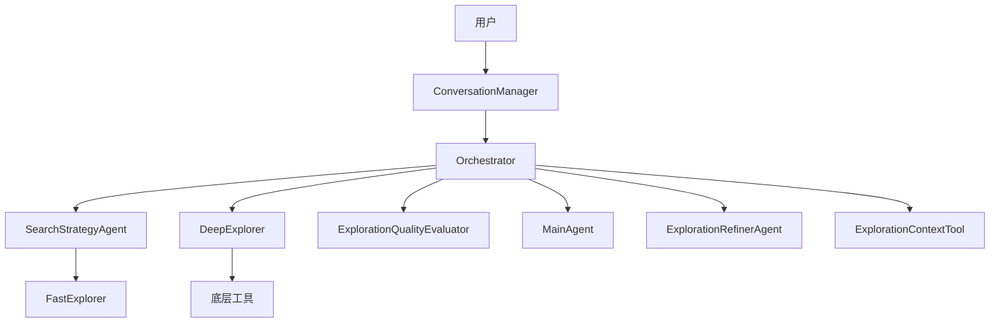
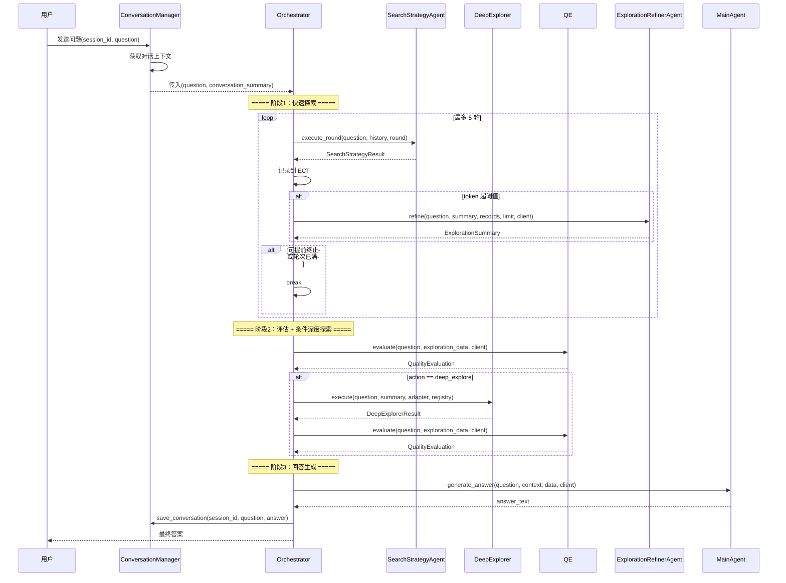

# Explore AI Agent - Orchestrator 详细设计文档 v1.0

| 属性     | 值                                                                 |
| :------- | :----------------------------------------------------------------- |
| 文档版本 | v1.0                                                               |
| 创建日期 | 2026-04-30                                                         |
| 涉及模块 | orchestrator/orchestrator                                           |
| 技术栈   | Rust + async-trait                                                  |
| 关联文档 | [Explore AI Agent 架构设计文档 v1.1](Explore%20AI%20Agent架构设计文档v1.1.md) |

---

## 目录

- [1. 总体设计](#1-总体设计)
  - [1.1 模块定位](#11-模块定位)
  - [1.2 核心原则](#12-核心原则)
  - [1.3 架构位置](#13-架构位置)
- [2. 数据结构](#2-数据结构)
- [3. Orchestrator 方法详细设计](#3-orchestrator-方法详细设计)
  - [3.1 构造](#31-构造)
  - [3.2 run — 主流程](#32-run--主流程)
  - [3.3 辅助决策方法](#33-辅助决策方法)
  - [3.4 构建 QE 输入](#34-构建-qe-输入)
  - [3.5 构建主 Agent 输入](#35-构建主-agent-输入)
- [4. 主流程设计](#4-主流程设计)
  - [4.1 流程图](#41-流程图)
  - [4.2 三个阶段详述](#42-三个阶段详述)
- [5. 调用时序](#5-调用时序)
- [6. 错误处理](#6-错误处理)
- [7. 自动化测试用例](#7-自动化测试用例)
- [8. 附录](#8-附录)

---

## 1. 总体设计

### 1.1 模块定位

Orchestrator 是系统的**中央调度器**。它不实现任何 AI 逻辑，不调用 LLM，不执行工具。它的唯一职责是按照架构文档定义的流程，依次调度各个 Agent 和上下文工具，串联起从用户问题到最终答案的完整链路。

**核心职责**：

1. 接收用户问题，协调对话上下文准备
2. 驱动快速探索阶段（SearchStrategyAgent，最多 5 轮）
3. 在 token 超阈值时触发探索上下文精炼（ExplorationRefinerAgent）
4. 调用 QE 对快速探索结果做全局评估
5. 根据 QE 的 `action` 决策是否启动深度探索（DeepExplorer）
6. 深度探索后再次调用 QE 生成精准摘要
7. 调用 MainAgent 生成最终答案
8. 每轮对话结束后保存记录到 ConversationManager

### 1.2 核心原则

| 原则 | 说明 |
|:---|:---|
| **纯调度** | Orchestrator 不实现任何 AI 逻辑，只负责按顺序调用各模块 |
| **决策集中** | 所有流程分支（是否深度探索、是否提前终止）在 Orchestrator 中判断 |
| **上下文管理** | 探索上下文的读写由 Orchestrator 直接操作 ECT；对话上下文由 ConversationManager 管理 |
| **错误传播** | 各模块返回的 `Err` 由 Orchestrator 统一处理，决定是否中断流程 |

### 1.3 架构位置

Orchestrator 位于调度层，是连接所有模块的中心节点：



---

## 2. 数据结构

### 2.1 Orchestrator 结构体

```rust
pub struct Orchestrator {
    adapter: Arc<ApiAdapter>,
    tool_registry: Arc<ToolRegistry>,
    conversation_manager: ConversationManager,
    search_strategy: SearchStrategyAgent,
    deep_explorer: DeepExplorer,
    quality_evaluator: ExplorationQualityEvaluator,
    exploration_refiner: ExplorationRefinerAgent,
    main_agent: MainAgent,
    max_fast_explore_rounds: usize,
    early_termination_confidence: f64,
}
```

| 字段 | 类型 | 说明 |
|:---|:---|:---|
| adapter | Arc\<ApiAdapter> | 适配层，注入给所有需要 LLM 的 Agent |
| tool_registry | Arc\<ToolRegistry> | 工具注册表，注入给 DeepExplorer |
| conversation_manager | ConversationManager | 对话会话管理 |
| exploration_context | — | **不持有**。探索上下文由调用方（CLI/Web handler）创建，通过 `run()` 的 `&mut ExplorationContextTool` 参数传入 |
| search_strategy | SearchStrategyAgent | 快速探索 Agent |
| deep_explorer | DeepExplorer | 深度探索 Agent |
| quality_evaluator | ExplorationQualityEvaluator | 探索质量评估 |
| exploration_refiner | ExplorationRefinerAgent | 探索上下文精炼 |
| main_agent | MainAgent | 最终回答生成 |
| max_fast_explore_rounds | usize | 快速探索最大轮次，默认 5 |
| early_termination_confidence | f64 | 提前终止置信度阈值，默认 0.9 |

---

## 3. Orchestrator 方法详细设计

### 3.1 构造

```rust
pub fn new(
    adapter: Arc<ApiAdapter>,
    tool_registry: Arc<ToolRegistry>,
    conversation_manager: ConversationManager,
) -> Self
```

所有依赖通过构造函数注入。Orchestrator 内部创建各 Agent 实例并持有。

### 3.2 run — 主流程

#### 3.2.1 函数签名

```rust
pub async fn run(
    &self,
    question: &str,
    exploration_context: &mut ExplorationContextTool,
) -> Result<String, String>
```

| 参数 | 类型 | 说明 |
|:---|:---|:---|
| question | &str | 用户原始问题 |
| session_id | &str | 会话标识（仅用于 ConversationManager） |
| exploration_context | &mut ExplorationContextTool | **调用方传入**。每个 session 独立持有，Orchestrator 内部不维护探索上下文 |

**返回值**：成功时返回 MainAgent 生成的最终答案；失败时返回错误描述。

> **`&self`**：Orchestrator 自身无会话状态。`exploration_context` 由调用方以 `&mut` 传入，DeepExplorer 的状态在 `execute()` 调用期间由该方法内部管理。

#### 3.2.2 处理流程

详见第 4 节。

### 3.3 辅助决策方法

#### should_early_terminate

```rust
pub fn should_early_terminate(&self, confidence: f64, current_round: usize) -> bool
```

判断是否可以提前终止快速探索循环。

| 条件 | 返回值 |
|:---|:---|
| `confidence >= early_termination_confidence` 且 `current_round < max_fast_explore_rounds` | `true` |
| 否则 | `false` |

> 提前终止非强制——Orchestrator **可**在条件满足时提前退出循环，但不强制。

#### should_deep_explore

```rust
pub fn should_deep_explore(&self, action: &ExplorationAction, question_is_code_related: bool) -> bool
```

判断是否启动深度探索。

| 条件 | 返回值 |
|:---|:---|
| `action == DeepExplore` 且问题与代码库相关 | `true` |
| 否则 | `false` |

"问题与代码库相关"由 Orchestrator 根据快速探索阶段 SearchStrategyAgent 是否调用了工具来判断——若 AI 未调用任何工具（说明是闲聊或通用知识），则视为不相关。

### 3.4 构建 QE 输入

```rust
fn build_qe_input(&self) -> Result<QualityEvaluatorInput, String>
```

从 ExplorationContextTool 中提取 `current_summary` 和 `exploration_history`，构造 `QualityEvaluatorInput`：

- `current_summary`：直接读取 `ECT.get_current_summary()`，若为 `None` 则构造空 ExplorationSummary
- `collected_evidence`：从 ECT 的 exploration_history 中筛选 DeepExplorer 写入的 ToolCall 记录的 `result_summary`，构造为 CollectedEvidence 数组

### 3.5 构建主 Agent 输入

```rust
fn build_exploration_data(&self) -> serde_json::Value
```

整合 QE 评估摘要、快速探索摘要和 DeepExplorer 原始证据，构造为传给 MainAgent 的 `exploration_data` JSON。

---

## 4. 主流程设计

### 4.1 流程图

```mermaid
flowchart TD
    A[接收 question + exploration_context] --> B[ConversationManager: 获取对话上下文]
    B --> C{对话上下文需精炼?}
    C -- 是 --> D[ConversationRefinerAgent::refine]
    D --> E[更新 conversation_summary]
    C -- 否 --> E

    E --> F[阶段1: 快速探索]
    F --> G[初始化 exploration_history = []]

    G --> H[SearchStrategyAgent::execute_round]
    H --> I[记录本轮结果到 ECT]
    I --> J{ECT token 超阈值?}
    J -- 是 --> K[ExplorationRefinerAgent::refine]
    K --> L[ECT.update_summary + 清理旧记录]
    J -- 否 --> M
    L --> M{should_early_terminate?}
    M -- 是 --> N[提前终止快速探索]
    M -- 否 --> O{轮次 < max_rounds?}
    O -- 是 --> H
    O -- 否 --> N

    N --> P[QE: evaluate - 快速探索后全局评估]
    P --> Q{should_deep_explore?}

    Q -- 是 --> R[阶段2: DeepExplorer::execute]
    R --> S[记录证据到 ECT]
    S --> T[QE: evaluate - 深度探索后精准摘要]

    Q -- 否 --> U
    T --> U[阶段3: MainAgent::generate_answer]
    U --> V[提取 <final_response> 标签]
    V --> W[ConversationManager: save_conversation]
    W --> X[返回最终答案]
```

### 4.2 三个阶段详述

#### 阶段 1：强制快速探索（最多 5 轮）

| 步骤 | 操作 | 说明 |
|:---|:---|:---|
| 1.1 | 读取 `ECT.current_summary` | 获取当前探索摘要 |
| 1.2 | 循环调用 `SearchStrategyAgent::execute_round` | 每轮传入 question + 累积的 history |
| 1.3 | 记录每轮结果 | 将 SearchStrategyResult 转换为 ExplorationRecord 写入 ECT |
| 1.4 | 检查 token 阈值 | 若 `ECT.needs_compression()`，调用 ExplorationRefinerAgent 精炼 |
| 1.5 | 判断提前终止或继续 | `should_early_terminate()` 或达到 `max_rounds` |

#### 阶段 2：条件深度探索

| 步骤 | 操作 | 说明 |
|:---|:---|:---|
| 2.1 | 调用 `QE.evaluate()` | 传入快速探索汇总数据 |
| 2.2 | 判断 `should_deep_explore()` | QE 返回 `action: deep_explore` 且问题与代码库相关 |
| 2.3 | 调用 `DeepExplorer::execute()` | 传入 question + QE 摘要，最多 75 次工具调用 |
| 2.4 | 记录证据 | DeepExplorer 内部通过 exploration_context_tool 记录 |
| 2.5 | 再次调用 `QE.evaluate()` | 传入深度探索证据 + 先前摘要，生成精准摘要 |

若 QE 返回 `action: answer` 或问题无关，跳过阶段 2，直接进入阶段 3。

#### 阶段 3：回答生成

| 步骤 | 操作 | 说明 |
|:---|:---|:---|
| 3.1 | 从 ECT 获取最终数据 | 含深度探索证据（如有） |
| 3.2 | 调用 `MainAgent::generate_answer()` | 传入 question + conversation_context + exploration_data |
| 3.3 | 提取 `<final_response>` 标签 | 从 LLM 回答中提取标签内容呈现给用户 |
| 3.4 | 保存对话记录 | ConversationManager.save_conversation() |

---

## 5. 调用时序



---

## 6. 错误处理

| 场景 | 处理方式 | 是否中断流程 |
|:---|:---|:---|
| ConversationManager 返回错误 | 透传错误，`run()` 返回 `Err` | 是 |
| SearchStrategyAgent 单轮失败 | 透传错误，`run()` 返回 `Err` | 是 |
| ExplorationRefinerAgent 精炼失败 | 记录错误日志，流程继续（使用未精炼的上下文） | 否 |
| QE 评估失败 | 透传错误，`run()` 返回 `Err` | 是 |
| DeepExplorer 执行失败 | 透传错误，`run()` 返回 `Err` | 是 |
| MainAgent 生成失败 | 透传错误，`run()` 返回 `Err` | 是 |
| `<final_response>` 标签缺失 | Orchestrator 回退为返回原始文本 | 否 |

---

## 7. 自动化测试用例

### 7.1 测试夹具

- `run()` 的集成测试通过 mock 各 Agent 隔离真实 LLM 和文件系统
- 单元测试覆盖辅助决策方法

### 7.2 辅助方法测试

| 用例编号 | 测试场景 | 输入 | 预期结果 |
|:---|:---|:---|:---|
| OC-001 | 高置信度提前终止 | confidence=0.95, round=2 (< max) | `should_early_terminate()` → true |
| OC-002 | 低置信度不提前终止 | confidence=0.5, round=2 | `should_early_terminate()` → false |
| OC-003 | 达到最大轮次不提前终止 | confidence=0.95, round=5 (= max) | `should_early_terminate()` → false |
| OC-004 | action=DeepExplore + 代码相关 | action=DeepExplore, code_related=true | `should_deep_explore()` → true |
| OC-005 | action=Answer 不启动深度探索 | action=Answer | `should_deep_explore()` → false |
| OC-006 | action=DeepExplore 但问题无关 | action=DeepExplore, code_related=false | `should_deep_explore()` → false |

### 7.3 构造测试

| 用例编号 | 测试场景 | 输入 | 预期结果 |
|:---|:---|:---|:---|
| OC-007 | 构造 Orchestrator | `Orchestrator::new(adapter, registry, cm, ect)` | 返回实例，不 panic |

### 7.4 构建 QE 输入测试

| 用例编号 | 测试场景 | 输入 | 预期结果 |
|:---|:---|:---|:---|
| OC-008 | 从 ECT 构造 QE 输入（含证据） | ECT 含 current_summary + DeepExplorer 的 ToolCall 记录 | `QualityEvaluatorInput.collected_evidence` 非空 |
| OC-009 | 从 ECT 构造 QE 输入（无证据） | ECT 仅含 SearchStrategyAgent 的 Summary 记录 | `QualityEvaluatorInput.collected_evidence` 为空 |

### 7.5 集成测试

| 用例编号 | 测试场景 | 输入 | 预期结果 |
|:---|:---|:---|:---|
| OC-010 | 快速探索后直接回答（无需深度探索） | mock SSA 返回高置信度 + mock QE 返回 action=Answer | `run()` 返回 `Ok`，最终答案含 `<final_response>` |
| OC-011 | 快速探索 + 深度探索完整流程 | mock SSA 返回低置信度 + mock QE 返回 action=DeepExplore + mock DE 返回证据 | `run()` 返回 `Ok` |
| OC-012 | 对话上下文精炼触发 | 对话轮次 ≥ 10 | `run()` 内触发了对话精炼 |

---

## 8. 附录

### 8.1 与架构文档的对应关系

| 架构文档章节 | 对应本模块 | 实现状态 |
|:---|:---|:---|
| 2.1 整体架构 | 第 1.3 节 | 本文档设计 |
| 2.2 模块职责（Orchestrator） | 第 1.1 节 | 本文档设计 |
| 2.3 核心执行流程 | 第 4 节 | 本文档详细设计 |
| 6 ConversationManager | 第 3.2 节步骤 0 | 本文档引用 |

### 8.2 与其他模块的接口

| 调用方向 | 方法 | 说明 |
|:---|:---|:---|
| Orchestrator → SearchStrategyAgent | `execute_round()` | 快速探索阶段，每轮一次 |
| Orchestrator → ExplorationQualityEvaluator | `evaluate()` | 快速探索后 1 次 + 深度探索后 1 次（如触发） |
| Orchestrator → DeepExplorer | `execute()` | 条件触发 |
| Orchestrator → MainAgent | `generate_answer()` | 流程最后一步 |
| Orchestrator → ExplorationRefinerAgent | `refine()` | token 超阈值时触发 |
| Orchestrator → ExplorationContextTool | `write_record()`, `get_current_summary()`, `compress_by_confidence()` | 直接操作探索上下文 |
| Orchestrator → ConversationManager | `get_context()`, `save_conversation()`, `check_and_refine()` | 对话上下文管理 |

### 8.3 常量定义

| 常量 | 值 | 说明 |
|:---|:---|:---|
| `MAX_FAST_EXPLORE_ROUNDS` | 5 | 快速探索最大轮次 |
| `EARLY_TERMINATION_CONFIDENCE` | 0.9 | 提前终止的置信度阈值 |

### 8.4 不变式与约束

| 约束 | 说明 |
|:---|:---|
| **纯调度** | 不实现 AI 逻辑，只调用各模块 |
| **持有所有共享依赖** | 构造时注入 adapter + tool_registry + conversation_manager；ECT 由调用方传入 |
| **探索上下文外部管理** | Orchestrator 通过参数接收 ECT 引用，不持有、不创建、不销毁 ECT |
| **对话上下文经 ConversationManager** | Orchestrator 不能直接操作 CCT |

---

## 修订记录

| 版本 | 日期 | 修订人 | 变更说明 |
|:---|:---|:---|:---|
| v1.0 | 2026-04-30 | sdfang1053 | 初版：三阶段管道完整调度器 |
| v1.1 | 2026-05-08 | sdfang1053 | 废除：由新版 Orchestrator 文档替代 |
