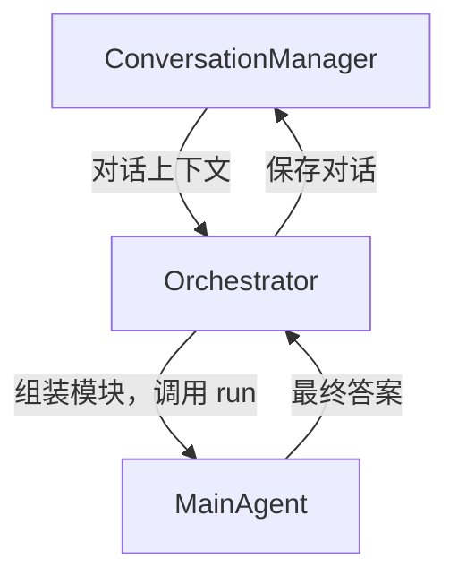
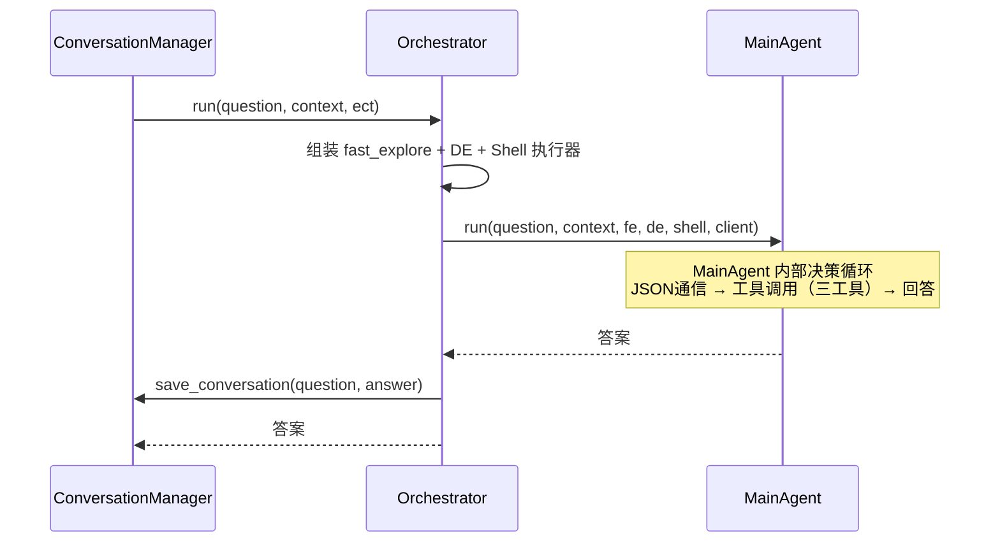

# Explore AI Agent - Orchestrator 详细设计文档 v1.3

| 属性 | 值 |
|:---|:---|
| 文档版本 | v1.3 |
| 创建日期 | 2026-04-30 |
| 修订日期 | 2026-05-09 |
| 涉及模块 | orchestrator/orchestrator |
| 技术栈 | Rust + async-trait |
| 关联文档 | [Explore AI Agent 架构设计文档 v1.4](Explore%20AI%20Agent架构设计文档v1.1.md) |
| 关联文档 | [MainAgent 详细设计文档 v1.3](MainAgent详细设计文档v1.2.md) |

> **v1.3 变更说明**：新增 `ShellExec` 执行器（实现 `ShellExecutor` trait），将 `execute_shell` 作为第三工具注入 MainAgent。Shell 执行通过 `ToolRegistry` 委托底层 `execute_shell` 工具。

---

## 目录

- [1. 总体设计](#1-总体设计)
- [2. 方法设计](#2-方法设计)
- [3. 错误处理](#3-错误处理)
- [4. 测试设计](#4-测试设计)

---

## 1. 总体设计

### 1.1 模块定位

Orchestrator 是系统的**模块组装器**。它不控制探索流程、不解析 MainAgent 的 JSON、不分发工具调用——这些都是 MainAgent 内部的事。Orchestrator 只做一件事：把模块拼起来，调 `MainAgent::run()`。

**与 v1.1 的关键区别**：

| | v1.1 | v1.2 |
|:---|:---|:---|
| 流程控制 | 三阶段固定管道 | 无。MainAgent 自主决策 |
| SSA 循环 | Orchestrator 控制多轮 | 不存在 |
| QE 调度 | Orchestrator 独立调用 | 代码层自动触发 |
| 精炼调度 | Orchestrator 检查并调 Refiner | Agent 内部代码层 |
| 工具分发 | 不存在（v1.1 无 function calling） | MainAgent 内部处理 |
| 职责 | ~350 行 | ~50 行 |

### 1.2 架构位置



---

## 2. 方法设计

### 2.1 构造

```rust
pub fn new(
    adapter: Arc<ApiAdapter>,
    tool_registry: Arc<ToolRegistry>,
    conversation_manager: ConversationManager,
) -> Self
```

### 2.2 run — 入口

```rust
pub async fn run(
    &self,
    question: &str,
    conversation_context: &str,
    exploration_context: &ExplorationContextTool,
) -> Result<String, String>
```

| 参数 | 类型 | 说明 |
|:---|:---|:---|
| question | &str | 用户原始问题 |
| conversation_context | &str | 对话历史摘要 |
| exploration_context | &ExplorationContextTool | ECT 实例，调用方创建并传入，每问重置 |

**处理步骤**：

1. 创建三个执行器。`FeExec` 的 `ect`、`qe_client` 由 `run()` 的 `exploration_context` 参数和 `adapter` 注入（MainAgent 不感知这些内部依赖）；`ShellExec` 仅持 `registry`
2. 创建 `MainAgent` 实例
3. 调用 `main_agent.run(question, conversation_context, &fast_explore, &de, &shell, adapter.as_ref())`
4. 将返回的答案传给 `ConversationManager::save_conversation()`
5. 返回答案



---

## 3. 执行器实现

Orchestrator 内部创建三个轻量执行器，实现 MainAgent 定义的 trait，均通过 `ToolRegistry` 委托执行：

### FeExec（FastExploreExecutor）

```rust
struct FeExec { registry, ect, qe_client }
impl FastExploreExecutor for FeExec {
    async fn execute(&self, keywords) -> Result<Value, String> {
        fast_explore_pipeline(keywords, &self.registry, self.ect, self.qe_client)
    }
}
```

### DeExec（DeepExploreExecutor）

```rust
struct DeExec { adapter, registry, ect, de_config }
impl DeepExploreExecutor for DeExec {
    async fn execute(&self, question, summary) -> Result<Value, String> {
        let mut de = DeepExplorer::from_config(&self.de_config);
        de.execute(question, &summary, self.adapter, &self.registry, self.ect).await
    }
}
```

### ShellExec（ShellExecutor）— v1.3 新增

```rust
struct ShellExec { registry }
impl ShellExecutor for ShellExec {
    async fn execute(&self, command) -> Result<Value, String> {
        let params = serde_json::json!({"command": command});
        self.registry.execute("execute_shell", params).map(|r| r.data)
    }
}
```

> ShellExec 直接调用 `ToolRegistry::execute("execute_shell", ...)`，结果返回给 MainAgent，不经过 DE 或 TR。

---

## 4. 错误处理

| 场景 | 处理方式 |
|:---|:---|
| MainAgent::run() 返回 Err | 透传错误给调用方 |
| ConversationManager 保存失败 | 记录警告日志，不影响答案返回 |

---

## 5. 测试设计

### 5.1 测试策略

| 类型 | 覆盖范围 | 依赖 |
|:---|:---|:---|
| 自动化集成 | `run()` 端到端流程（mock MainAgent + mock CM） | Mock |

### 5.2 自动化集成测试

| 编号 | 测试场景 | Mock 配置 | 断言 |
|:---|:---|:---|:---|
| OR-001 |正常流程 | Mock MainAgent 返回答案 | `run()` 返回答案；CM.save_conversation 被调用 |
| OR-002 | MainAgent 失败 | Mock MainAgent 返回 Err | `run()` 返回 Err |
| OR-004 | ShellExec 构造与执行 | 构造 ShellExec{registry} → `execute("find . -name '*.rs' | wc -l")` | ToolRegistry 中 execute_shell 被调用；返回含 `output` 字段的结果 |
| OR-005 | ShellExec 执行失败 | ShellExec 执行不允许的命令 → ToolRegistry 拒绝 | 返回 `Err`，不阻塞 MainAgent 循环 |
| OR-003 | CM 保存失败不阻塞 | Mock MainAgent 正常，Mock CM 保存失败 | `run()` 仍然返回 Ok（答案不受影响） |

---

## 修订记录

| 版本 | 日期 | 修订人 | 变更说明 |
|:---|:---|:---|:---|
| v1.0 | 2026-04-30 | sdfang1053 | 初版：完整三阶段管道调度 |
| v1.1 | 2026-05-05 | sdfang1053 | SSA 轮次配置化、精炼下沉到 Agent 内部、QE 决策移至 MainAgent |
| v1.2 | 2026-05-08 | sdfang1053 | 退化为薄调度层，仅负责模块组装与 MainAgent 启动 |
| v1.3 | 2026-05-09 | sdfang1053 | 新增 ShellExec 执行器，将 execute_shell 作为第三工具注入 MainAgent |
