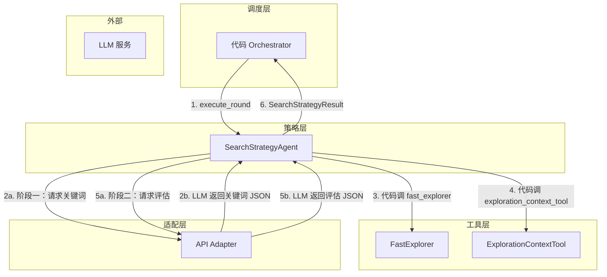
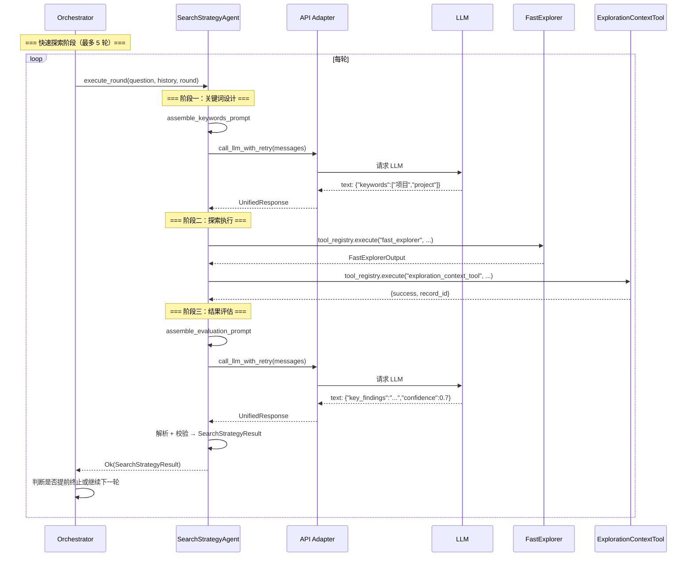

# Explore AI Agent - SearchStrategyAgent 详细设计文档 v1.0

| 属性     | 值                                                                 |
| :------- | :----------------------------------------------------------------- |
| 文档版本 | v1.2                                                               |
| 创建日期 | 2026-04-30                                                         |
| 修订日期 | 2026-05-08                                                         |
| 涉及模块 | agents/search_strategy                                              |
| 技术栈   | Rust + async-trait                                                  |
| 关联文档 | [Explore AI Agent 架构设计文档 v1.1](Explore%20AI%20Agent架构设计文档v1.1.md) |
| 关联文档 | [FastExplorer 详细设计文档 v1.2](FastExplorer详细设计文档v1.2.md)    |
| 关联文档 | [ExplorationRefinerAgent 详细设计文档 v1.1](ExplorationRefinerAgent详细设计文档v1.1.md) |

> **v1.2 变更说明**：将上下文精炼逻辑从 Orchestrator 下沉到 SSA 内部。v1.1 中 SSA 每轮执行后由 Orchestrator 检查 ECT 并调用 Refiner；v1.2 中 SSA 在 `execute_round()` 内部自行写 ECT、自行检测 token 超阈值、自行调用 Refiner。此改动使 SSA 适配短上下文模型（如 Minimax 100K），避免多轮累积后首次 LLM 调用就超时。

---

> **⚠️ 本模块已于 v1.2 架构废弃**。SearchStrategyAgent 不再作为独立 Agent 存在。MainAgent 自主设计关键词，探索执行、QE 评分、ECT 记录和精炼检查合并为 `fast_explore` 纯代码工具。本文档保留作为历史参考。

## 目录

- [1. 总体设计](#1-总体设计)
  - [1.1 模块定位](#11-模块定位)
  - [1.2 核心原则](#12-核心原则)
  - [1.3 架构位置](#13-架构位置)
- [2. 数据结构](#2-数据结构)
  - [2.1 SearchRoundRecord](#21-searchroundrecord)
  - [2.2 SearchStrategyResult](#22-searchstrategyresult)
  - [2.3 CriticalFileRef](#23-criticalfileref)
- [3. SearchStrategyAgent 方法详细设计](#3-searchstrategyagent-方法详细设计)
  - [3.1 构造](#31-构造)
  - [3.2 execute_round — 执行单轮探索](#32-execute_round--执行单轮探索)
  - [3.3 assemble_prompt — Prompt 组装](#33-assemble_prompt--prompt-组装)
  - [3.4 execute_tool — 工具调用执行](#34-execute_tool--工具调用执行)
- [4. Prompt 设计](#4-prompt-设计)
  - [4.1 Prompt 模板](#41-prompt-模板)
  - [4.2 变量说明](#42-变量说明)
  - [4.3 API 模式差异处理](#43-api-模式差异处理)
- [5. 工具定义](#5-工具定义)
  - [5.1 fast_explorer](#51-fast_explorer)
  - [5.2 exploration_context_tool](#52-exploration_context_tool)
- [6. 调用时机与上下文](#6-调用时机与上下文)
  - [6.1 多轮探索循环](#61-多轮探索循环)
  - [6.2 提前终止条件](#62-提前终止条件)
  - [6.3 调用时序](#63-调用时序)
- [7. 错误处理](#7-错误处理)
- [8. 自动化测试用例](#8-自动化测试用例)
- [9. 附录](#9-附录)

---

## 1. 总体设计

### 1.1 模块定位

SearchStrategyAgent 是系统策略层的**快速探索专家**。它负责设计关键词、调用 FastExplorer 执行批量搜索、评估搜索质量，并在多轮探索中迭代调整关键词方向。每轮返回结构化评估结果，供 Orchestrator 累积到三轮后交给 ExplorationQualityEvaluator 做全局决策。

**核心职责**：

1. 判断用户问题是否与代码库相关
2. 设计 2-5 个关键词，调用 FastExplorer 批量搜索
3. 评估本轮搜索结果的质量，给出置信度评分
4. 记录本轮发现到 ExplorationContextTool
5. 参考历史关键词避免重复，迭代调整搜索方向
6. **v1.2 新增**：每轮内部自行检测 ECT token 超阈值并调用 ExplorationRefinerAgent 精炼上下文

**与其他 Agent 的关键区别**：SearchStrategyAgent 通过**代码编排**控制探索流程——LLM 仅负责两件事：设计关键词和评估结果（均输出 JSON），工具调用由代码层直接执行。这与 ExplorationQualityEvaluator（单次评估）和 DeepExplorer（LLM 自主调用 5 个底层工具）形成对比。

> **v1.1 变更说明**：v1.0 采用 LLM 自主工具调用模式（向 LLM 暴露 `fast_explorer` 和 `exploration_context_tool`）。经实测，DeepSeek `deepseek-chat` 模型在工具调用场景下出现循环不收敛问题——调用 `fast_explorer` 后反复搜索工具名称而非调用 `exploration_context_tool`。v1.1 改为代码编排模式，LLM 不再接触工具，仅负责关键词设计和结果评估两个 JSON 输出任务。此方案更稳定、对模型能力要求更低。

### 1.2 核心原则

| 原则 | 说明 |
|:---|:---|
| **关键词驱动** | 探索方向由 LLM 设计的关键词决定，FastExplorer 是纯代码执行 |
| **多轮迭代** | 最多 5 轮，每轮参考历史关键词调整方向，避免重复 |
| **代码编排** | 工具调用（`fast_explorer`、`exploration_context_tool`）由代码层控制顺序和参数，LLM 不接触工具 |
| **两阶段 LLM** | 每轮两次 LLM 交互：阶段一输出关键词 JSON，阶段二依据探索结果输出评估 JSON |
| **强制记录** | `fast_explorer` 执行后，代码自动调用 `exploration_context_tool` 记录发现，不依赖 LLM 记忆 |
| **自主精炼**（v1.2 新增） | 每轮写入 ECT 后，SSA 自行检查 `needs_compression()` 并调用 ExplorationRefinerAgent。精炼下沉到 Agent 内部，不再依赖 Orchestrator 跨阶段调度 |
| **自评置信度** | 每轮 LLM 输出自评估，但仅用于 Orchestrator 参考（提前终止），不直接决定系统流程 |

### 1.3 架构位置



SearchStrategyAgent 仅被 Orchestrator 调用。每轮内部两次请求 LLM（关键词设计 + 结果评估），工具调用由代码直接执行，LLM 不接触工具。

---

## 2. 数据结构

### 2.1 SearchRoundRecord

```rust
#[derive(Debug, Clone, Serialize, Deserialize)]
pub struct SearchRoundRecord {
    pub round: usize,
    pub keywords: Vec<String>,
    pub key_findings: String,
    pub confidence: f64,
}
```

| 字段 | 类型 | 说明 |
|:---|:---|:---|
| round | usize | 轮次编号，从 1 开始 |
| keywords | Vec\<String> | 本轮使用的关键词列表（2-5 个） |
| key_findings | String | 本轮探索的核心发现总结 |
| confidence | f64 | 本轮自评置信度，范围 [0.0, 1.0] |

用途：记录每轮探索的关键词和结果，作为下一轮 `exploration_history` 的输入，帮助 LLM 避免重复关键词。

> **设计说明**：此结构不包含 `critical_files` 和 `missing_info` 字段——`key_findings` 已概括了本轮核心发现和关键文件信息。将完整文件列表和缺失信息放入历史记录会增加 token 消耗，且 LLM 在下一轮关键词设计时主要参考"哪些词已搜过"，而非文件的完整路径。详细的文件列表和缺失信息由 ExplorationContextTool 持久化存储，供后续阶段（QE、主 Agent）使用。

### 2.2 SearchStrategyResult

```rust
#[derive(Debug, Clone, Serialize, Deserialize)]
pub struct SearchStrategyResult {
    pub key_findings: String,
    pub critical_files: Vec<CriticalFileRef>,
    pub missing_info: String,
    pub confidence: f64,
}
```

| 字段 | 类型 | 说明 |
|:---|:---|:---|
| key_findings | String | 本轮探索的核心发现总结（使用用户的语言），1-3 条 |
| critical_files | Vec\<CriticalFileRef> | 对本轮发现最有帮助的文件列表（1-3 个） |
| missing_info | String | 仍缺失的关键信息，如无则为 `"无"` |
| confidence | f64 | 本轮自评置信度评分，范围 [0.0, 1.0] |

> **注意**：此结构不含 `action` 字段。流程决策（继续探索 vs 回答）由 Orchestrator 在所有轮次结束后参考 `ExplorationQualityEvaluator` 的全局评估决定，而非 SearchStrategyAgent 的单轮自评。

### 2.3 CriticalFileRef

```rust
#[derive(Debug, Clone, Serialize, Deserialize)]
pub struct CriticalFileRef {
    pub path: String,
    pub summary: String,
}
```

| 字段 | 类型 | 说明 |
|:---|:---|:---|
| path | String | 文件相对路径 |
| summary | String | 一句话说明该文件如何帮助回答问题 |

> **命名说明**：此结构使用 `summary` 字段名，与架构文档 4.1.1 节 Prompt 中的输出格式 `{"path": "...", "summary": "..."}` 一致。这与 `ExplorationSummary::CriticalFile`（使用 `one_sentence_summary`）不同——Orchestrator 在构造 `QualityEvaluatorInput` 时负责 `summary → one_sentence_summary` 的字段映射。

---

## 3. SearchStrategyAgent 方法详细设计

### 3.1 构造

```rust
pub fn new(adapter: Arc<ApiAdapter>, tool_registry: Arc<ToolRegistry>) -> Self
```

| 参数 | 类型 | 说明 |
|:---|:---|:---|
| adapter | Arc\<ApiAdapter> | 适配层实例，用于调用 LLM |
| tool_registry | Arc\<ToolRegistry> | 工具注册表，用于执行 LLM 请求的工具调用 |

SearchStrategyAgent 持有 `adapter` 和 `tool_registry` 的共享引用，不持有可变状态（`max_rounds` 是常量配置）。

```rust
pub fn max_rounds(&self) -> usize
```

返回最大探索轮次（默认 5）。

### 3.2 execute_round — 执行单轮探索

#### 3.2.1 函数签名

```rust
pub async fn execute_round(
    &self,
    question: &str,
    exploration_history: &[SearchRoundRecord],
    round: usize,
    ect: &ExplorationContextTool,
    refiner_client: &dyn LlmStructuredClient,
) -> Result<SearchStrategyResult, String>
```

| 参数 | 类型 | 说明 |
|:---|:---|:---|
| question | &str | 用户原始问题 |
| exploration_history | &[SearchRoundRecord] | 之前轮次的关键词和发现记录（第一轮为空） |
| round | usize | 当前轮次编号（从 1 开始） |
| ect | &ExplorationContextTool | **v1.2 新增**。探索上下文存储，SSA 写记录、检测精炼阈值 |
| refiner_client | &dyn LlmStructuredClient | **v1.2 新增**。传递给 Refiner 的 LLM 客户端 |

**返回值**：成功时返回 `SearchStrategyResult`；失败时返回错误描述字符串。

#### 3.2.2 处理流程

```mermaid
flowchart TD
    A[接收 question + exploration_history + round] --> B[阶段一: 组装关键词 Prompt]
    B --> C[调用 adapter 发送 → LLM 返回关键词 JSON]
    C --> D{关键词 JSON 解析成功?}
    D -- 是 --> E{keywords 非空?}
    E -- 是 --> F[代码调 fast_explorer(keywords)]
    F --> G[代码调 exploration_context_tool.write(结果)]
    G --> G2{ECT token > 阈值?}
    G2 -- 是 --> G3[调用 ExplorationRefinerAgent.refine]
    G3 --> G4[ect.update_summary]
    G4 --> H
    G2 -- 否 --> H[阶段二: 组装评估 Prompt<br/>含探索结果]
    H --> I[调用 adapter 发送 → LLM 返回评估 JSON]
    I --> J{JSON 解析成功?}
    J -- 是 --> K[校验 confidence 范围]
    K --> L{0.0 ≤ confidence ≤ 1.0?}
    L -- 是 --> M[返回 Ok(SearchStrategyResult)]
    L -- 否 --> N[返回 Err]
    J -- 否 --> N
    E -- 否 --> O{历史中是否已有探索?}
    O -- 是 --> H
    O -- 否 --> P[问题与代码库无关<br/>构造空结果 confidence=1.0]
    P --> M
    D -- 否 --> Q{重试 < 2?}
    Q -- 是 --> B
    Q -- 否 --> N
```

#### 3.2.3 处理步骤详述

**阶段一：关键词设计**

1. 调用 `assemble_keywords_prompt(question, exploration_history, round)` 生成关键词设计 Prompt
2. 构造 messages，调用 `adapter.call_llm_with_retry(messages)` 获取 LLM 响应
3. 从 `UnifiedResponse.text` 提取 JSON，解析为 `KeywordsOutput { keywords: Vec<String> }`
4. 若 `keywords` 非空：进入阶段二（探索执行）。若 `keywords` 为空且 history 为空：判定为"问题与代码库无关"，返回 `confidence=1.0` 的空结果。若 `keywords` 为空但 history 非空：跳过探索，直接进入阶段三（评估）
5. JSON 解析失败时最多重试 2 次

**阶段二：探索执行（代码层）**

1. 调用 `tool_registry.execute("fast_explorer", {keywords, exclude_paths: []})` 执行批量搜索
2. 拿到 `FastExplorerOutput`（含 matches、total、files_sampled 等）
3. 代码构造 `exploration_context_tool` 的写入数据：
   - `action: "write"`
   - `data.type: "summary"`
   - `data.source: "SearchStrategyAgent"`
   - `data.data`: 包含 fast_explorer 的关键发现（key_findings 暂由代码从 matches 中提取摘要，critical_files 从文件匹配中提取）
4. 调用 `tool_registry.execute("exploration_context_tool", {...})` 记录发现
5. **v1.2 新增 — 上下文精炼**：调用 `ect.needs_compression()` 检查 token 是否超过 `EXPLORATION_TOKEN_THRESHOLD`。若超阈值：
   - 从 ECT 读取 `current_summary` 和 `exploration_history` 尾部 15 条记录
   - 计算 `target_token_limit = max(300, EXPLORATION_TOKEN_THRESHOLD × 0.10)`
   - 调用 `ExplorationRefinerAgent::refine(question, &summary, &records, target, refiner_client)`
   - 精炼成功：调用 `ect.update_summary(new_summary)` 写回
   - 精炼失败：不中断流程（SSA 的容错策略与 DE 不同——单轮精炼失败不阻塞探索）

> **设计说明**：`exploration_context_tool` 的入参由代码层根据 fast_explorer 返回的结构化数据自动构造，不依赖 LLM。LLM 根本不需要知道此工具的存在，不会出现"忘记记录"或"记录格式错误"的问题。
>
> **v1.2 精炼设计说明**：精炼下沉到 SSA 内部的核心动机是适配短上下文模型。SSA 在 FastExplorer 返回大量匹配后，若 ECT 已累积多轮记录，下一轮 LLM 调用前必须先压缩上下文，避免因 context 过大导致 HTTP 超时。这与 DE 的精炼逻辑一致——谁产生上下文，谁负责精炼。

**阶段三：结果评估**

1. 调用 `assemble_evaluation_prompt(question, exploration_result)` 生成评估 Prompt，Prompt 中包含 fast_explorer 返回的 matches 摘要数据
2. 构造 messages，调用 `adapter.call_llm_with_retry(messages)` 获取 LLM 响应
3. 从 `UnifiedResponse.text` 提取 JSON，反序列化为 `SearchStrategyResult`
4. JSON 解析失败时最多重试 2 次

**校验**

| 校验项 | 规则 | 失败处理 |
|:---|:---|:---|
| confidence | 0.0 ≤ confidence ≤ 1.0 | 返回 `Err("confidence out of range [0.0, 1.0]: {value}")` |
| key_findings | 必填，非空字符串 | 由 Prompt 约束保证 |
| critical_files | 必填，数组类型 | 由 Prompt 约束保证 |
| missing_info | 必填，字符串类型 | 由 Prompt 约束保证 |

### 3.3 Prompt 组装（两个独立方法）

#### 3.3.1 assemble_keywords_prompt — 关键词设计 Prompt

```rust
fn assemble_keywords_prompt(
    &self,
    question: &str,
    exploration_history: &[SearchRoundRecord],
    round: usize,
) -> String
```

将关键词设计 Prompt 模板（见 4.1 节）中的占位符替换为实际内容：

| 占位符 | 替换内容 |
|:---|:---|
| `{question}` | `## 用户问题\n{问题原文}` |
| `{exploration_history}` | `## 历史探索记录\n{序列化为 JSON 数组}`，第一轮替换为 `（首轮探索，无历史记录）` |

#### 3.3.2 assemble_evaluation_prompt — 结果评估 Prompt

```rust
fn assemble_evaluation_prompt(
    &self,
    question: &str,
    exploration_result: &serde_json::Value,
) -> String
```

将评估 Prompt 模板（见 4.2 节）中的占位符替换为实际内容：

| 占位符 | 替换内容 |
|:---|:---|
| `{question}` | `## 用户问题\n{问题原文}` |
| `{exploration_data}` | `## 探索数据\n{fast_explorer 返回的 matches 摘要 JSON}` |

#### 3.3.3 与适配层的分工

两个方法均直接调用适配层的 `adapter.call_llm_with_retry(messages)` 发送请求。Prompt 文本由 SSA 自行组装（字符串替换），不经过适配层的 `assemble_prompt`。

| 职责 | 负责方 |
|:---|:---|
| 提供 Prompt 模板文本 | SSA |
| 执行占位符替换 | SSA（简单字符串替换） |
| 调用 LLM + 重试 + 解析响应 | 适配层 — `call_llm_with_retry()` |
| 解析 LLM 返回的 JSON | SSA |

### 3.4 execute_tool — 工具调用执行

> **v1.1 已废弃**。工具调用不再由 LLM 发起，改为代码层直接调用 `tool_registry.execute()`。本节保留作为历史参考。

---

## 4. Prompt 设计

v1.1 拆分为两个独立的 Prompt：关键词设计 Prompt（阶段一）和结果评估 Prompt（阶段二）。LLM 不再接触工具定义，仅输出 JSON。

### 4.1 阶段一：关键词设计 Prompt

```
你是搜索策略专家。你的任务是根据用户问题设计 2-5 个搜索关键词。

{question}
{exploration_history}

## 要求

1. 从用户问题中直接提取核心概念，同时包含中英文关键词。
2. 参考「历史探索记录」中已尝试的关键词，避免重复。如果上一轮置信度低但方向正确，尝试调整关键词（如同义词、缩写、不同命名风格）。
3. 如果用户问题与代码库完全无关（如通用知识提问、闲聊），返回空关键词列表。

## 输出格式（强制约束）

你必须**只输出一个合法的 JSON 对象**，不要包裹任何标记、不要添加任何解释文字。JSON 对象包含以下字段：

- `keywords`：字符串数组，2-5 个关键词。如果问题与代码库无关，返回空数组 `[]`。

**示例输出**：
{"keywords": ["项目结构", "project", "架构", "architecture"]}
```

### 4.2 阶段二：结果评估 Prompt

```
你是搜索策略专家。你的任务是评估以下探索数据与用户问题的相关性，给出置信度评分。

{question}
{exploration_data}

## 评估标准

检查探索数据中的匹配内容是否包含直接回答用户问题的信息。

| 情况 | 建议置信度 |
| :--- | :--- |
| 问题与代码库无关（无需探索） | 1.0 |
| 找到直接答案（如相关代码片段、配置说明） | 0.8 - 1.0 |
| 找到相关信息，但需要进一步整合或确认 | 0.5 - 0.7 |
| 只找到文件名，没有实质内容 | 0.2 - 0.4 |
| 探索后确认项目不包含该功能 | 0.1 - 0.2 |
| 完全不相关或没有任何搜索结果 | 0.0 |

## 输出格式（强制约束）

你必须**只输出一个合法的 JSON 对象**，不要包裹任何标记、不要添加任何解释文字。JSON 对象包含以下字段：

- `key_findings`：本轮评估的总结。如果问题与代码库无关，应明确写出"问题与代码库无关"。如果进行了探索，则用用户的语言概括发现。
- `critical_files`：数组，每个元素为 `{"path": "文件路径", "summary": "该文件如何帮助回答问题"}`。如果未探索或未发现相关文件，则为空数组 `[]`。
- `missing_info`：字符串，说明当前还缺少哪些关键信息。如果问题无关或信息充足，可写"无"。
- `confidence`：数字，0.0 到 1.0 之间的置信度评分。

**示例输出**：
{"key_findings": "在 README.md 中确认项目是多 Agent 股票分析系统", "critical_files": [{"path": "README.md", "summary": "项目概述文档"}], "missing_info": "各 Agent 的具体实现逻辑尚未探索", "confidence": 0.7}
```

### 4.3 变量说明

| 变量名 | 类型 | 用途 | 来源 |
|:---|:---|:---|:---|
| `{question}` | string | 用户原始问题 | 用户输入 |
| `{exploration_history}` | array | 之前轮次的探索记录（含关键词、发现、置信度） | Orchestrator 从上一轮的 SearchStrategyResult 累积 |
| `{exploration_data}` | object | fast_explorer 返回的 matches 摘要数据 | SSA 代码层从 FastExplorerOutput 提取 |

### 4.4 API 模式差异处理

两个 Prompt 在不同 API 模式下的处理方式相同：Prompt 文本放入 system role 的 message 中，无工具定义。Chat 和 Responses 模式仅在适配层请求格式上有差异，对 SSA 透明。

---

## 5. 工具调用（代码层）

v1.1 中工具调用不再由 LLM 发起，改为 SSA 代码层直接通过 `ToolRegistry` 执行。

### 5.1 fast_explorer 调用

```rust
let params = serde_json::json!({
    "keywords": keywords,       // 来自阶段一 LLM 输出
    "exclude_paths": [],
});
let output = tool_registry.execute("fast_explorer", params)?;
let result: FastExplorerOutput = serde_json::from_value(output.data)?;
```

### 5.2 exploration_context_tool 调用

```rust
let data = serde_json::json!({
    "action": "write",
    "data": {
        "type": "summary",
        "source": "SearchStrategyAgent",
        "data": {
            "key_findings": summary_text,    // 代码从 matches 提取
            "critical_files": top_files,     // 代码从 matches 提取
            "missing_info": "",
            "confidence": 0.0,               // 阶段二由 LLM 评估后更新
        }
    }
});
tool_registry.execute("exploration_context_tool", data)?;
```

> `exploration_context_tool` 的入参由代码层根据 `FastExplorerOutput` 的结构化数据自动构造，不依赖 LLM。LLM 根本不需要知道此工具的存在。

---

## 6. 调用时机与上下文

### 6.1 多轮探索循环

SearchStrategyAgent 由 Orchestrator 在快速探索阶段调用，循环最多 5 轮。每轮调用 `execute_round()` 一次。每轮内部 SSA 自行管理上下文精炼。

| 维度 | 说明 |
|:---|:---|
| **调用节点** | 快速探索阶段（无条件执行，在 ExplorationQualityEvaluator 之前） |
| **循环次数** | 最多 `max_rounds()` 轮（默认 5），由 Orchestrator 控制 |
| **输入数据** | `question` = 用户原始问题；`exploration_history` = 之前轮次的 SearchRoundRecord 数组；`round` = 当前轮次编号；`ect` = ECT 实例（v1.2 新增，用于 SSA 内部写记录和精炼）；`refiner_client` = Refiner 的 LLM 客户端（v1.2 新增） |
| **输出处理** | Orchestrator 将本轮 SearchStrategyResult 转换为 SearchRoundRecord，追加到 history 数组 |

### 6.2 提前终止条件

Orchestrator 可在每轮 `execute_round()` 返回后检查是否提前终止循环：

| 条件 | 行为 |
|:---|:---|
| 本轮 `confidence ≥ 0.9` 且轮次未满 | Orchestrator **可**提前终止循环（非强制，参考值） |
| 问题与代码库无关（AI 未调用任何工具） | Orchestrator 跳过后续轮次，直接进入回答阶段 |
| 已达到 `max_rounds()` | 强制终止 |

> **设计说明**：AI 自评的 `confidence` 仅用于指导关键词调整和提前终止参考，不直接决定系统流程。最终是否进入深度探索由 ExplorationQualityEvaluator 的全局评估决定。

### 6.3 调用时序



---

## 7. 错误处理

| 场景 | 处理方式 | 是否中断流程 |
|:---|:---|:---|
| 适配层调用失败（含 3 次重试耗尽） | 透传适配层错误，`execute_round()` 返回 `Err` | 是 |
| 阶段一 JSON 解析失败（关键词设计） | 重试最多 2 次，耗尽后返回 `Err("Failed to parse keywords JSON after retries")` | 是 |
| 阶段三 JSON 解析失败（结果评估） | 重试最多 2 次，耗尽后返回 `Err("Failed to parse evaluation JSON after retries")` | 是 |
| fast_explorer 执行失败 | 返回 `Err` 并附带工具错误信息 | 是 |
| exploration_context_tool 执行失败 | 记录警告日志，继续流程（记录失败不影响探索结果） | 否 |
| LLM 返回空响应（text = None） | 返回 `Err("Empty response from LLM")` | 是 |
| confidence 超出 [0.0, 1.0] | 返回 `Err("confidence out of range [0.0, 1.0]: {value}")` | 是 |
| 阶段一 LLM 返回空 keywords 数组 | 若 history 为空：判定为问题无关，返回 confidence=1.0 空结果。若 history 非空：跳过探索，用已有数据直接进入阶段三 | 否 |
| **v1.2** Refiner 精炼失败 | 记录警告日志，不中断流程。SSA 继续进入阶段三（结果评估） | 否 |

---

## 8. 自动化测试用例

> **v1.1 变更总览**：因架构从 LLM 工具调用改为代码编排（两阶段 JSON 请求），以下测试用例变更：
> - **沿用**（9 个）：SS-001~005（数据结构+构造）、SS-014~017（校验逻辑）
> - **修改**（10 个）：SS-006~010（Prompt 改为两个方法分别验证）、SS-011（get_tools 改为返回 0 个）、SS-018~020（集成测试改为两阶段 JSON）、SS-022~023（更新断言文字）、SS-026（代码层工具错误）
> - **删除**（3 个）：SS-012~013（LLM 工具定义已废弃）、SS-021（无工具调用循环）、SS-025（无强制记录重试）
> - **替换**（1 个）：SS-024 → SS-024-v1.1（强制记录提示 → 代码自动记录验证）
> - **新增**（3 个）：SS-027~029（关键词解析、代码自动记录、评估解析）
>
> **v1.2 变更（SSA 上下文精炼下沉）**：
> - **修改**（所有集成测试）：`execute_round()` 签名新增 `ect` 和 `refiner_client` 参数
> - **新增**（4 条自动化）：SS-030（精炼触发）、SS-031（未超阈不触发）、SS-032（精炼失败不阻塞）、SS-033（多轮累计触发）
> - **新增**（1 条手工）：SS-M01（真实短上下文 LLM 验证无超时）

### 8.1 测试夹具

- 构造标准 `SearchRoundRecord` 测试数据（覆盖首轮空 history 和多轮有 history 两种场景）
- 构造 `FastExplorerOutput` 模拟数据
- `execute_round()` 的集成测试通过 mock 适配层 + mock ToolRegistry 隔离真实 LLM 和文件系统
- 所有单元测试不依赖真实 LLM 调用

### 8.2 数据结构测试（沿用 v1.0）

| 用例编号 | 测试场景 | 输入 | 预期结果 |
|:---|:---|:---|:---|
| SS-001 | SearchRoundRecord 序列化往返 | `SearchRoundRecord { round: 1, keywords: vec!["k1"], key_findings: "发现", confidence: 0.5 }` | JSON 序列化后可无损反序列化，所有字段值一致 |
| SS-002 | SearchStrategyResult 序列化往返 | 构造完整结果含 2 个 CriticalFileRef | JSON 序列化后可无损反序列化 |
| SS-003 | CriticalFileRef 序列化 | `CriticalFileRef { path: "a.rs", summary: "文件 A" }` | JSON 序列化后 `summary` 字段名保留（非 `one_sentence_summary`） |

### 8.3 构造测试（沿用 v1.0）

| 用例编号 | 测试场景 | 输入 | 预期结果 |
|:---|:---|:---|:---|
| SS-004 | 构造 SSA | `SearchStrategyAgent::new(adapter, registry)` | 返回实例，`max_rounds` = 5 |
| SS-005 | max_rounds 返回值 | 默认构造 | `max_rounds` = 5 |

### 8.4 Prompt 组装测试（修改 — 拆为两个 Prompt 分别验证）

#### 8.4.1 关键词设计 Prompt（assemble_keywords_prompt）

| 用例编号 | 测试场景 | 输入 | 预期结果 |
|:---|:---|:---|:---|
| SS-006 | 含用户问题 | question = "What is X?" | 结果含 `## 用户问题` 和 `What is X?` |
| SS-007 | 含探索历史 | history 含 1 条 SearchRoundRecord | 结果含 `## 历史探索记录` 和关键词 JSON |
| SS-008 | 首轮空历史提示 | history = [] | 结果含 `首轮探索` 或等价空历史标识 |
| SS-009 | 含关键词设计要求 | 组装后的 Prompt | 结果含 `设计关键词`、`中英文关键词`、`输出格式` |

#### 8.4.2 结果评估 Prompt（assemble_evaluation_prompt）

| 用例编号 | 测试场景 | 输入 | 预期结果 |
|:---|:---|:---|:---|
| SS-010 | 含探索数据 | exploration_result = FastExplorerOutput JSON | 结果含探索数据中的匹配内容 |
| SS-010b | 含置信度评分参考表 | 组装后的 Prompt | 结果含 `置信度` 评分表（0.0 ~ 1.0） |
| SS-010c | 含输出格式约束 | 组装后的 Prompt | 结果含 `key_findings`、`critical_files`、`missing_info`、`confidence` 字段说明和示例 JSON |

### 8.5 工具定义测试（修改）

| 用例编号 | 测试场景 | 输入 | 预期结果 |
|:---|:---|:---|:---|
| SS-011 | get_tools 返回空列表 | `get_tools()` | 返回空 `Vec`。v1.1 LLM 不再接触工具，工具由代码层直接调用 |
| ~~SS-012~~ | ~~fast_explorer 工具定义~~ | — | **已删除**（v1.1 LLM 无工具定义） |
| ~~SS-013~~ | ~~exploration_context_tool 工具定义~~ | — | **已删除**（v1.1 LLM 无工具定义） |

### 8.6 校验逻辑测试（沿用 v1.0）

| 用例编号 | 测试场景 | 输入 | 预期结果 |
|:---|:---|:---|:---|
| SS-014 | confidence = 0.0 合法 | SearchStrategyResult.confidence = 0.0 | 校验通过 |
| SS-015 | confidence = 1.0 合法 | SearchStrategyResult.confidence = 1.0 | 校验通过 |
| SS-016 | confidence < 0.0 非法 | SearchStrategyResult.confidence = -0.1 | 校验失败，返回 Err，含 "confidence out of range" |
| SS-017 | confidence > 1.0 非法 | SearchStrategyResult.confidence = 1.5 | 校验失败，返回 Err，含 "confidence out of range" |

### 8.7 集成测试（修改 + 删除 + 替换 + 新增）

> **v1.1 集成测试 mock 策略**：mock 适配层返回关键词 JSON（阶段一）和评估 JSON（阶段二），不再返回 tool_calls。mock ToolRegistry 验证代码层正确调用了 `fast_explorer` 和 `exploration_context_tool`。

#### 8.7.1 两阶段正常流程

| 用例编号 | 测试场景 | 输入 | 预期结果 |
|:---|:---|:---|:---|
| SS-018 | 正常探索流程 | mock 适配层：阶段一返回 `{"keywords":["test","测试"]}`；阶段二返回 `{"key_findings":"发现核心代码","critical_files":[{"path":"src/main.rs","summary":"入口"}],"missing_info":"缺少配置","confidence":0.6}` | `execute_round()` 返回 `Ok`；`result.key_findings` = "发现核心代码"；`result.confidence` = 0.6；验证代码层调用了 fast_explorer 和 exploration_context_tool |
| SS-019 | 问题与代码库无关 | mock 适配层：阶段一返回 `{"keywords":[]}` | `execute_round()` 返回 `Ok`；`result.confidence` = 1.0；`result.key_findings` 含 "无关"；验证代码层**未**调用 fast_explorer |
| SS-020 | 多轮迭代（history 非空） | mock 适配层：阶段一返回 `{"keywords":["第二轮"]}`；阶段二返回预设评估 | `execute_round()` 返回 `Ok`；`result.key_findings` = "第二轮发现"；Prompt 含历史记录 |

#### 8.7.2 错误处理

| 用例编号 | 测试场景 | 输入 | 预期结果 |
|:---|:---|:---|:---|
| SS-022 | 阶段一空响应 | mock 适配层返回空 UnifiedResponse（text = None） | `execute_round()` 返回 `Err`，含 "Empty response" |
| SS-023 | 阶段二非法 JSON | mock 适配层：阶段一正常 → 阶段二返回 text=`"not valid json"` | `execute_round()` 返回 `Err`，含 "Failed to parse"，重试 2 次后仍失败 |
| SS-026 | fast_explorer 执行失败 | mock 适配层正常 → mock ToolRegistry 执行 fast_explorer 返回错误 | `execute_round()` 返回 `Err`，含工具错误信息 |
| ~~SS-021~~ | ~~工具调用循环超限~~ | — | **已删除**（v1.1 无工具调用循环） |
| ~~SS-025~~ | ~~强制记录重试耗尽~~ | — | **已删除**（v1.1 代码自动记录） |

#### 8.7.3 v1.1 新增

| 用例编号 | 测试场景 | 输入 | 预期结果 |
|:---|:---|:---|:---|
| SS-024-v1.1 | 代码自动记录 exploration_context_tool | mock 适配层返回正常关键词 + 正常评估 | 验证代码层在 fast_explorer 执行后自动调用了 `exploration_context_tool.write()`，入参包含正确的 `source="SearchStrategyAgent"` 和探索数据 |
| SS-027 | 阶段一 JSON 解析失败后重试 | mock 适配层：第 1 次返回非法 JSON → 第 2 次返回 `{"keywords":["ok"]}` | `execute_round()` 返回 `Ok`，重试成功 |
| SS-028 | 阶段一 JSON 重试耗尽 | mock 适配层连续 3 次返回非法 JSON | `execute_round()` 返回 `Err`，含 "Failed to parse keywords JSON after retries" |
| SS-029 | 阶段二 JSON 重试耗尽 | mock 适配层：阶段一正常 → 阶段二连续 3 次非法 JSON | `execute_round()` 返回 `Err`，含 "Failed to parse evaluation JSON after retries" |

#### 8.7.4 v1.2 新增: SSA 上下文精炼

> **v1.2 mock 策略**：调用 `execute_round()` 时需传入 `ect`（`ExplorationContextTool`）和 `refiner_client`（实现 `LlmStructuredClient` 的 mock）。Mock 适配层返回两阶段 JSON；Mock refiner_client 验证 Refiner 是否被调用。所有用例通过 mock 实现自动化。

| 用例编号 | 测试场景 | 输入 | 预期结果 |
|:---|:---|:---|:---|
| SS-030 | SSA 内部精炼触发 | ECT 中预写入多轮累积记录（`total_token_count > THRESHOLD`）。mock 适配层返回正常关键词 + 评估 JSON；mock refiner_client 返回精炼 JSON | `execute_round()` 返回 `Ok`。验证：(1) `ect.needs_compression()` 为 true 后调用了 Refiner（`refiner_client` 被调用 ≥ 1 次）；(2) 精炼后 ECT 的 `current_summary` 被更新 |
| SS-031 | ECT 未超阈值不触发精炼 | ECT 仅有少量记录（`total_token_count ≤ THRESHOLD`）。mock 适配层返回正常 JSON | `execute_round()` 返回 `Ok`。验证：(1) `refiner_client` **未被调用**；(2) ECT 的 `current_summary` 保持原值 |
| SS-032 | Refiner 精炼失败不中断流程 | ECT 中超阈值。mock 适配层返回正常 JSON；mock refiner_client 返回 `Err` | `execute_round()` 返回 `Ok`（非 Err）。验证：(1) 精炼失败不阻塞探索；(2) `execute_round()` 正常返回 `SearchStrategyResult` |
| SS-033 | SSA 多轮迭代中精炼累计 | 模拟 3 轮调用 `execute_round()`。第 1 轮 ECT 空 → 不触发；第 2 轮 ECT 近阈值 → 不触发；第 3 轮 ECT 超阈值 → 触发精炼 | 三轮均返回 `Ok`。第 3 轮 refiner_client 被调用；精炼后 ECT token 数下降 |

### 8.8 手工测试

| 用例编号 | 测试场景 | 前提条件 | 测试步骤 | 预期结果 |
|:---|:---|:---|:---|:---|
| SS-M01 | 真实 LLM 验证 SSA 精炼不超时 | Minimax（100K 上下文）或其他短上下文模型；目标代码库存在；默认配置 | 1. 启动 CLI 2. 提问复杂问题（需 3+ 轮 SSA） 3. 观察 stderr：SSA 每轮后不出现 HTTP timeout 4. 观察 stderr：出现 Refiner 精炼日志 | SSA 跑满多轮无超时；精炼日志出现 `[INFO] SSA refinement done` |

---

## 9. 附录

### 9.1 与架构文档的对应关系

| 架构文档章节 | 对应本模块 | 实现状态 |
|:---|:---|:---|
| 4.1 SearchStrategyAgent Prompt | 第 4 节（v1.1 拆分为两个 Prompt） | 本文档设计 |
| 4.1.2 变量说明 | 第 4.3 节 | 本文档设计 |
| 4.1.4 代码层决策逻辑 | 第 6.2 节 | 本文档设计 |
| 2.2 模块职责（SearchStrategyAgent） | 第 1.1 节 | 本文档设计 |

> **v1.1 说明**：v1.1 废弃了 LLM 工具调用模式，改为代码编排。架构文档 4.1 节的 Prompt 模板已被本节的拆分 Prompt 取代。架构文档 4.1.3 节的 API 模式差异处理不再适用（SSA 不再通过适配层 `assemble_prompt` 组装 Prompt）。

### 9.2 与其他模块的接口

| 调用方 | 调用方法 | 说明 |
|:---|:---|:---|
| Orchestrator | `execute_round(question, history, round, ect, refiner_client)` | 每轮调用一次，Orchestrator 负责循环控制和历史累积。v1.2 新增 `ect` 和 `refiner_client` 参数用于 SSA 内部精炼 |
| ApiAdapter | `assemble_prompt(template, provider)` | SSA 通过 DataProvider trait 提供数据 |
| ApiAdapter | `call_llm_with_retry(messages)` | 在工具调用循环中多次调用 |
| ToolRegistry | `execute(tool_name, params)` | 执行 LLM 请求的 fast_explorer / exploration_context_tool 调用 |

### 9.3 不变式与约束

| 约束 | 说明 |
|:---|:---|
| **无状态** | SSA 不持有跨轮次的可变状态。history 由 Orchestrator 外部维护并传入 |
| **代码编排** | 工具调用由代码层控制顺序和参数，LLM 不接触工具。LLM 仅负责两次 JSON 输出（关键词 + 评估） |
| **两阶段 LLM** | 每轮两次 LLM 交互，各独立构造 messages，不共享上下文 |
| **强制记录（代码层）** | fast_explorer 执行后，代码自动调用 exploration_context_tool，不依赖 LLM |
| **JSON 重试** | 每个阶段的 JSON 解析失败时重试最多 2 次 |
| **置信度范围** | `confidence` 必须满足 0.0 ≤ confidence ≤ 1.0 |
| **自主精炼**（v1.2） | 阶段二写入 ECT 后，SSA 自行检查 `needs_compression()`。若超阈值则调用 Refiner，精炼失败不阻塞流程 |

### 9.4 与其他 Agent 的对比

| 维度 | SearchStrategyAgent | ExplorationQualityEvaluator | ExplorationRefinerAgent |
|:---|:---|:---|:---|
| 是否有工具 | 否（代码层直接调用） | 否 | 否 |
| LLM 交互次数/轮 | **2 次**（关键词 + 评估） | 1 次 | 1 次 |
| 适配层接口 | `call_llm_with_retry` | `call_llm_structured` | `call_llm_structured` |
| 输出结构 | `SearchStrategyResult`（4 字段） | `QualityEvaluation`（6 字段） | `ExplorationSummary`（4 字段） |
| 状态管理 | 无状态（history 外部传入） | 无状态 | 无状态 |
| 调用次数/问题 | 1-5 次（多轮） | 1-2 次 | 可能多次（token 多次超阈值） |

---

## 修订记录

| 版本 | 日期 | 修订人 | 变更说明 |
|:---|:---|:---|:---|
| v1.0 | 2026-04-30 | sdfang1053 | 初版：搜索策略 Agent |
| v1.1 | 2026-05-05 | sdfang1053 | 上下文精炼下沉到 SSA 内部 |
| v1.2 | 2026-05-08 | sdfang1053 | 废除：由 MainAgent 和 fast_explore 替代 |
