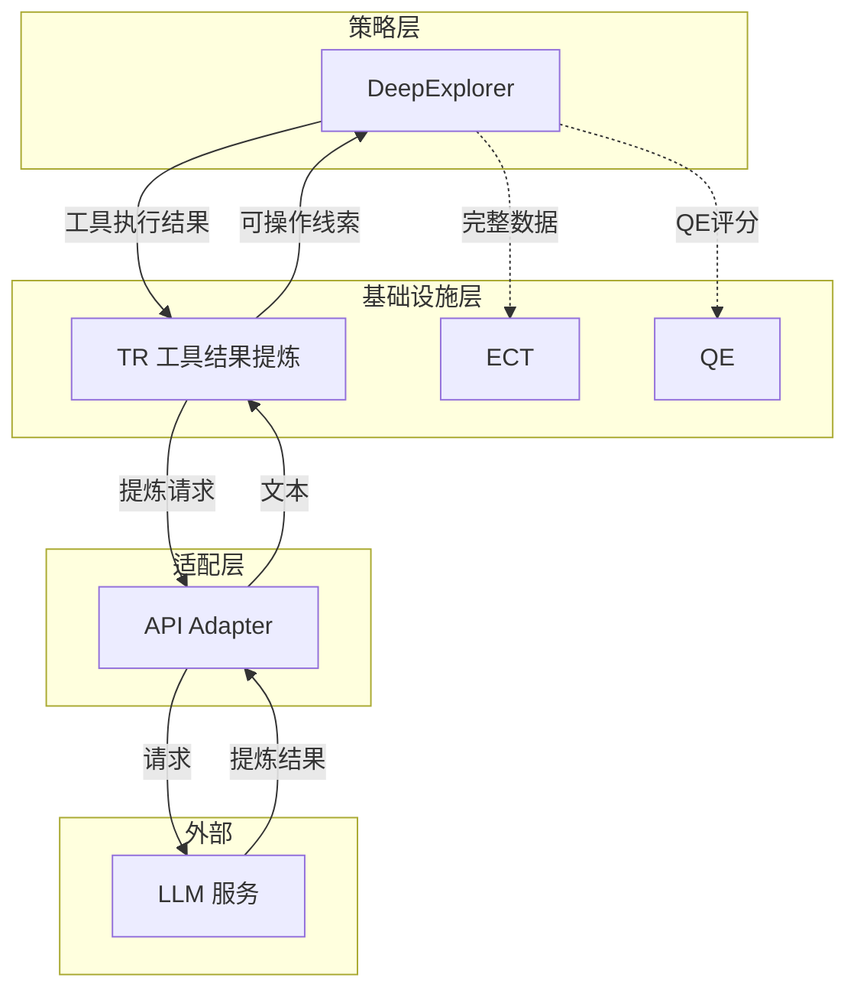
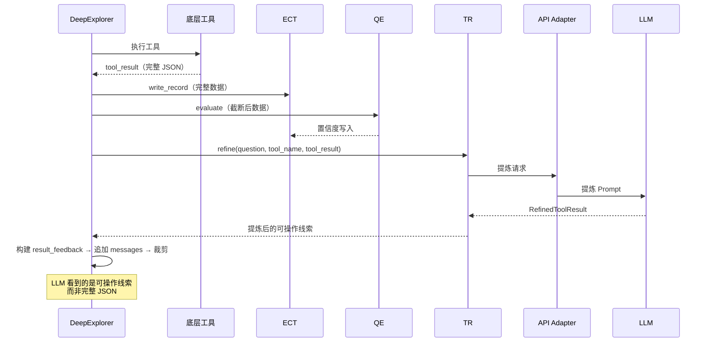

# Explore AI Agent - ToolResultRefinerAgent 详细设计文档 v1.0

| 属性 | 值 |
|:---|:---|
| 文档版本 | v1.0 |
| 创建日期 | 2026-05-09 |
| 涉及模块 | agents/tool_result_refiner（待实现） |
| 技术栈 | Rust + async-trait |
| 关联文档 | [Explore AI Agent 架构设计文档 v1.3](Explore%20AI%20Agent架构设计文档v1.1.md) |
| 关联文档 | [DeepExplorer 详细设计文档 v1.3](DeepExplorer详细设计文档v1.0.md) |
| 关联文档 | [ExplorationQualityEvaluator 详细设计文档 v1.3](ExplorationQualityEvaluator详细设计文档v1.2.md) |

---

## 目录

- [1. 总体设计](#1-总体设计)
- [2. 数据结构](#2-数据结构)
- [3. 方法详细设计](#3-方法详细设计)
- [4. Prompt 设计](#4-prompt-设计)
- [5. 调用时机与上下文](#5-调用时机与上下文)
- [6. 错误处理](#6-错误处理)
- [7. 测试设计](#7-测试设计)
- [8. 附录](#8-附录)

---

## 1. 总体设计

### 1.1 模块定位

ToolResultRefinerAgent（TR）是 DE 的**内部精炼组件**。在 DE 每次底层工具调用后，TR 对单条工具执行结果进行去噪提炼，输出可操作的结构化线索（文件路径、关键符号名、代码片段摘录），替代原始完整 JSON 传入 DE 的 LLM 上下文。

**核心职责**：

1. 对单条工具结果去噪，剔除 JSON 结构冗余和无关内容
2. 保留可操作信息：文件路径、函数名、类名、关键符号、代码片段
3. 保持原汁原味的探索事实，不做主观判断
4. 输出精炼文本投入 DE 的 messages，供 LLM 决策下一步探索方向

**TR 不做什么**：

| 不做 | 原因 |
|:---|:---|
| 置信度评分 | QE 负责 |
| 标注 missing_info | QE 负责 |
| 做"信息是否足够"的判断 | MainAgent 负责 |
| 多轮上下文精炼 | ExplorationRefinerAgent 负责 |
| 修改或丢弃 ECT 中的数据 | 完整数据始终保留在 ECT |

### 1.2 核心原则

| 原则 | 说明 |
|:---|:---|
| **去噪不丢信息** | 剔除 JSON 包装和冗余，保留所有可能对探索有用的实体 |
| **原汁原味** | 不总结、不判断、不评分。文件路径、代码片段直接搬运 |
| **单条处理** | 每次只处理一条工具结果，不聚合多轮 |
| **可操作优先** | 优先保留 DE 能据此采取下一步行动的信息（如文件路径→read_file） |
| **降级兜底** | 精炼失败时截断原始结果前 N 字符，不阻塞 DE 循环 |

### 1.3 架构位置



### 1.4 与 QE 的职责对比

| 维度 | TR | QE |
|:---|:---|:---|
| 消费者 | DE 的 LLM（messages） | ECT / ExplorationRefinerAgent |
| 输出形式 | 精炼文本（路径、符号、代码片段） | 数值（confidence + key_findings） |
| 对 DE LLM 可见 | 是 | 否（v1.3） |
| 输入 | 单条工具结果 | 单条工具结果 |
| 目的 | 减小 Prompt 体量，提供可操作线索 | 为精炼排序提供置信度依据 |
| 调用 LLM | 是 | 是 |

---

## 2. 数据结构

### 2.1 输入

TR 接收统一的工具执行结果，由 DE 代码层在每次底层工具调用后传入：

| 字段 | 类型 | 说明 |
|:---|:---|:---|
| question | string | 用户原始问题，供 TR 判断哪些信息与问题相关 |
| tool_name | string | 工具名称（search_content / read_file / search_files / list_dir / file_info / execute_shell） |
| tool_result | serde_json::Value | 工具执行完整结果（ToolRegistry 返回的 output.data） |

### 2.2 输出 — RefinedToolResult

```rust
pub struct RefinedToolResult {
    /// 提炼后的文本描述（直接作为 user message content）
    pub summary: String,
}
```

| 字段 | 类型 | 说明 |
|:---|:---|:---|
| summary | String | 精炼后的可操作线索文本。内容因工具类型而异，见 2.3 节 |

### 2.3 各工具类型的提炼要点

提炼 Prompt 中根据 `tool_name` 调整强调重点：

| 工具 | 提炼重点 |
|:---|:---|
| `search_content` | 匹配到的文件路径列表、每条匹配的关键行号、匹配到的函数/类名、匹配总数 |
| `search_files` | 文件路径列表、文件数量、关键文件名 |
| `read_file` | 关键函数签名、类定义、核心逻辑的代码片段（≤10 行）、文件总行数 |
| `list_dir` | 目录结构摘要、子目录/文件数量、关键文件名 |
| `file_info` | 代码行数、函数/类数量、文件类型 |
| `execute_shell` | 命令输出中的关键实体（文件路径、符号名、统计数据） |

### 2.4 JSON Schema（response_format 约束）

```json
{
  "name": "tool_result_refined",
  "strict": true,
  "schema": {
    "type": "object",
    "properties": {
      "summary": {
        "type": "string",
        "description": "提炼后的可操作线索，包含文件路径、关键符号名、代码片段、匹配统计等"
      }
    },
    "required": ["summary"],
    "additionalProperties": false
  }
}
```

---

## 3. 方法详细设计

### 3.1 构造

```rust
pub fn new() -> Self
```

无参数构造。不持有任何内部状态。

### 3.2 refine — 执行提炼

#### 3.2.1 函数签名

```rust
pub async fn refine(
    &self,
    question: &str,
    tool_name: &str,
    tool_result: &serde_json::Value,
    client: &dyn LlmStructuredClient,
) -> Result<RefinedToolResult, String>
```

| 参数 | 类型 | 说明 |
|:---|:---|:---|
| question | &str | 用户原始问题 |
| tool_name | &str | 工具名称 |
| tool_result | &serde_json::Value | 工具执行完整结果 |
| client | &dyn LlmStructuredClient | LLM 客户端（通过 trait 注入，可 mock） |

#### 3.2.2 处理步骤

1. 组装提炼 Prompt（含 question + tool_name + tool_result）
2. 调用 `client.call_llm_structured(instructions, input_data, schema)`
3. 解析 JSON → `RefinedToolResult`
4. `summary` 为空时返回原 `RefinedToolResult`（由 DE 代码层检测并降级截断，见 6.1）
5. 返回结果

---

## 4. Prompt 设计

### 4.1 提炼 Prompt

```
你是工具执行结果提炼专家。你的职责是对代码探索工具返回的原始数据去噪提炼，
输出可操作的探索线索，供下一轮探索决策使用。

## 用户问题
{question}

## 工具名称
{tool_name}

## 工具执行结果
{tool_result}

## 提炼规则

1. **保留所有可操作实体**：文件路径、函数名、类名、方法名、关键变量名、模块名
2. **保留关键代码片段**：函数签名、类定义、核心逻辑（≤10 行为宜）
3. **保留统计信息**：匹配总数、文件数、行数
4. **剔除 JSON 结构冗余**：去掉 `success`、`truncated` 等元数据字段，只保留探索数据本身
5. **不总结、不判断、不评分**：只搬运和整理原始数据，不要添加"建议读取这个文件"等主观判断
6. **按工具类型调整**：
   - search_content：列出匹配到的文件→行号→内容（Top 10）
   - search_files：列出所有文件路径
   - read_file：提取关键代码片段（函数/类/核心逻辑）
   - list_dir：列出目录结构和关键文件
   - file_info：提取统计信息（行数、函数数等）
   - execute_shell：提取输出中的文件路径/符号/统计

## 输出格式

只输出一个 JSON 对象：

{
  "summary": "提炼后的可操作线索文本"
}
```

### 4.2 变量说明

| 变量 | 类型 | 说明 | 来源 |
|:---|:---|:---|:---|
| `{question}` | string | 用户原始问题 | DE 传入 |
| `{tool_name}` | string | 工具名称 | DE 传入 |
| `{tool_result}` | object | 工具执行完整结果（代码层截断至 4000 chars 后传入） | ToolRegistry |

---

## 5. 调用时机与上下文

### 5.1 触发条件

TR 由 **DE 代码层**在每次底层工具调用后触发。触发顺序（DE 内部）：

```
工具执行 → write_record(ECT) → QE.evaluate → QE 写 ECT → TR.refine → 提炼结果追加到 messages → 裁剪
```

### 5.2 调用时序



### 5.3 输入截断

工具结果可能很大（如 search_content 返回数万行匹配）。TR 是一次 LLM 调用，全量传入会超时。**DE 代码层在调 TR 前截断 tool_result**：

| 保留 | 丢弃 | 理由 |
|:---|:---|:---|
| 匹配/文件/目录列表（Top 50） | 超出的匹配项 | TR 仅需代表性样本进行提炼 |
| 关键字段（file、line、content、name 等） | 元数据字段（success、truncated 等） | 元数据不包含探索信息 |
| — | 完整文件内容（read_file 全量） | 代码片段由后续步骤按需读取 |

截断后目标：≤ 4000 chars。DE 调用 TR 前负责此截断逻辑。

---

## 6. 错误处理

### 6.1 降级策略

| 场景 | 处理方式 | 是否中断 DE |
|:---|:---|:---|
| TR LLM 调用失败 | 原始 tool_result 前 500 字符截断作为 summary | 否 |
| TR 返回非法 JSON | 同降级截断 | 否 |
| TR 返回空 summary | 同降级截断 | 否 |
| TR LLM 超时 | 同降级截断 | 否 |

> **降级不阻塞**：TR 失败时 DE 循环继续，tool_result 以截断形式传入 messages。DE 的探索流程不因 TR 失败而中断。
>
> 以上所有降级场景均使用 6.2 节的 `fallback_truncate` 函数，统一截断原始 tool_result 的前 500 字符作为 summary。
>
> **已知风险 — LLM 幻觉**：TR 返回合法 JSON + 合法 summary 字符串，但内容与输入的 tool_result 完全无关（LLM 编造了文件路径或符号名）时，当前设计不做语义校验（验证 summary 中实体是否来自原始输入的成本较高），该 summary 会作为合法结果投入 DE 的 messages。缓解措施：(1) TR 的提炼 Prompt 明确要求"只搬运和整理原始数据，不添加主观判断"；(2) DE 自身的重复检测和循环警告机制可部分防御误导性线索。

### 6.2 降级截断实现

```rust
fn fallback_truncate(tool_name: &str, tool_result: &Value) -> String {
    let raw = serde_json::to_string(tool_result).unwrap_or_default();
    let truncated: String = raw.chars().take(500).collect();
    format!("工具 {} 执行结果 (截断):\n{}...", tool_name, truncated)
}
```

---

## 7. 测试设计

### 7.1 测试策略

| 类型 | 数量 | 覆盖范围 | 依赖 |
|:---|:---|:---|:---|
| 自动化单元 | 3 | Schema 结构、Prompt 组装 | 无 |
| 自动化集成 | 14 | refine 正常/异常/降级/幻觉、各工具类型、调用次数、截断边界 | Mock LLM |
| 手工 | 1 | TR Prompt 调优与提炼质量对比 | 真实 LLM |

### 7.2 自动化单元测试

| 编号 | 测试场景 | 输入 | 断言 |
|:---|:---|:---|:---|
| TR-001 | Schema 返回合法 JSON | `output_schema()` | 可解析，含 `name`、`strict`、`schema` |
| TR-002 | Schema required 含 summary | `output_schema()` | `required` 数组仅含 `"summary"` |
| TR-003 | Prompt 含提炼规则 | `assemble_instructions()` | 含 `{question}`、`{tool_name}`、`{tool_result}` 占位符 和 "可操作实体" 关键词 |

### 7.3 自动化集成测试

#### 7.3.1 正常提炼

| 编号 | 测试场景 | Mock 配置 | 断言 |
|:---|:---|:---|:---|
| TR-010 | search_content 结果提炼 | tool_result 含 `{"file":"src/backtest/engine.py","line":"142","content":"def run_backtest..."}` | `refine()` 返回 `Ok`；`summary` 含输入中实际存在的文件路径 `"src/backtest/engine.py"` 和行号 `"142"` |
| TR-011 | read_file 结果提炼 | tool_result 含文件内容中的函数 `run_backtest`、类 `BacktestEngine` | `refine()` 返回 `Ok`；`summary` 含输入文件中实际存在的函数名 `"run_backtest"` 或类名 `"BacktestEngine"` |
| TR-012 | search_files 结果提炼 | tool_result 含 `"files":["src/backtest/engine.py","src/backtest/config.py"]` | `summary` 含输入中实际存在的文件路径 `"src/backtest/engine.py"` |
| TR-013 | list_dir 结果提炼 | tool_result 含 `"items":[{"name":"engine.py","is_dir":false},...]` | `summary` 含输入目录中实际存在的文件/子目录名 `"engine.py"` |
| TR-014 | 空结果提炼（search_content 无匹配） | tool_result 为 `{"matches":[],"total":0}` | `refine()` 返回 `Ok`；`summary` 含 `"0"` 或 `"无匹配"` 或 `"无结果"` 等明确表达零结果的信息 |

#### 7.3.2 降级处理

| 编号 | 测试场景 | Mock 配置 | 断言 |
|:---|:---|:---|:---|
| TR-020 | TR LLM 调用失败降级 | Mock client 返回 `Err` | DE 代码层捕获 Err → 降级为截断 500 chars → `summary` 非空 |
| TR-021 | TR 返回空 summary 降级 | Mock LLM 返回 `{"summary":""}` | DE 代码层检测空字符串 → 降级截断 |
| TR-022 | TR 返回非法 JSON 降级 | Mock LLM 返回纯文本 | 解析失败 → 降级截断 |
| TR-023 | TR 返回格式正确但内容与输入无关（LLM 幻觉） | Mock LLM 返回 `{"summary":"发现用户认证模块在 auth.py 中实现"}`，但原始 tool_result 不含 `auth.py` 及认证相关符号 | 按当前设计不触发降级截断（不做语义检测）；`summary` 作为合法结果传入 messages。此场景风险见 6.1 节备注 |

#### 7.3.3 输入截断

| 编号 | 测试场景 | 输入 | 断言 |
|:---|:---|:---|:---|
| TR-030 | 大工具结果被截断后传入 TR | tool_result 含 10K+ chars | 传入 TR 的 tool_result ≤ 4000 chars |
| TR-031 | 截断不丢关键字段 | tool_result 含 file/line/content | 截断后的 tool_result 仍含这些字段 |
| TR-032 | TR 调用次数与 tool_call 一致 | DE 模拟循环：3 次 tool_call + 1 次 done | TR 被调用 3 次（每次 tool_call 后 1 次）；done 不触发 TR |
| TR-033 | 小于阈值的 tool_result 不做截断 | tool_result 为 1200 chars（< 4000） | 传入 TR 的 tool_result 与原 tool_result 字符级完全一致 |

### 7.4 手工测试

| 编号 | 场景 | 前提条件 | 步骤 | 预期 |
|:---|:---|:---|:---|:---|
| TR-M01 | TR Prompt 调优与不同工具类型提炼质量对比 | LLM 服务正常；目标代码库存在 | 1. 对同一问题分别记录 search_content、read_file、search_files、list_dir 四种工具类型的 TR 提炼输出 2. 检查每种工具类型下提炼文本是否保留关键实体（文件路径、函数名、行号），是否剔除了 JSON 结构冗余 3. 对比不同工具类型的提炼质量，调整 Prompt 中对应工具的提炼要点 | 四种工具类型的提炼输出均保留了对应类型的可操作实体；JSON 元数据（success、truncated 等）不出现在 summary 中。注：DE-M01 覆盖整体探索流程，本用例聚焦 TR 提炼质量的对比调优 |

---

## 8. 附录

### 8.1 与其他模块的接口

| 调用方 | 调用方法 | 说明 |
|:---|:---|:---|
| DE 代码层 | `refine(question, tool_name, tool_result, client)` | DE 每次底层工具调用后触发，提炼结果投入 messages |

### 8.2 不变式与约束

| 约束 | 说明 |
|:---|:---|
| **无状态** | 每次 `refine()` 调用完全独立 |
| **不修改 ECT** | TR 只读 tool_result，不写入 ECT |
| **降级不阻塞** | TR 失败时 DE 继续，以截断形式传 tool_result |
| **单条处理** | 每次只处理一条工具结果，不跨轮次聚合 |
| **调用一次** | DE 每个 tool_call 后调用 TR 恰好一次 |

### 8.3 与 ExplorationRefinerAgent 的区别

| 维度 | TR | ExplorationRefinerAgent |
|:---|:---|:---|
| 精炼对象 | 单条工具执行结果 | 多轮累积的 ECT 记录（15 条） |
| 触发频率 | DE 每次工具调用后 | token 超阈值时 |
| 消费者 | DE 的 LLM（messages） | ECT（update_summary） |
| 目的 | 减小单轮 Prompt 体量 | 压缩积累的探索上下文 |

---

## 修订记录

| 版本 | 日期 | 修订人 | 变更说明 |
|:---|:---|:---|:---|
| v1.0 | 2026-05-09 | sdfang1053 | 初版：ToolResultRefinerAgent 完整设计 |
