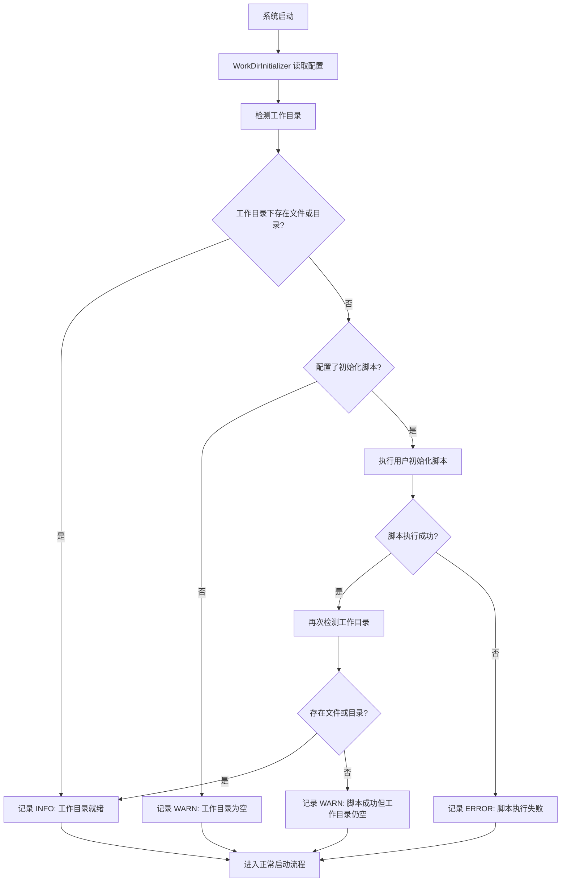
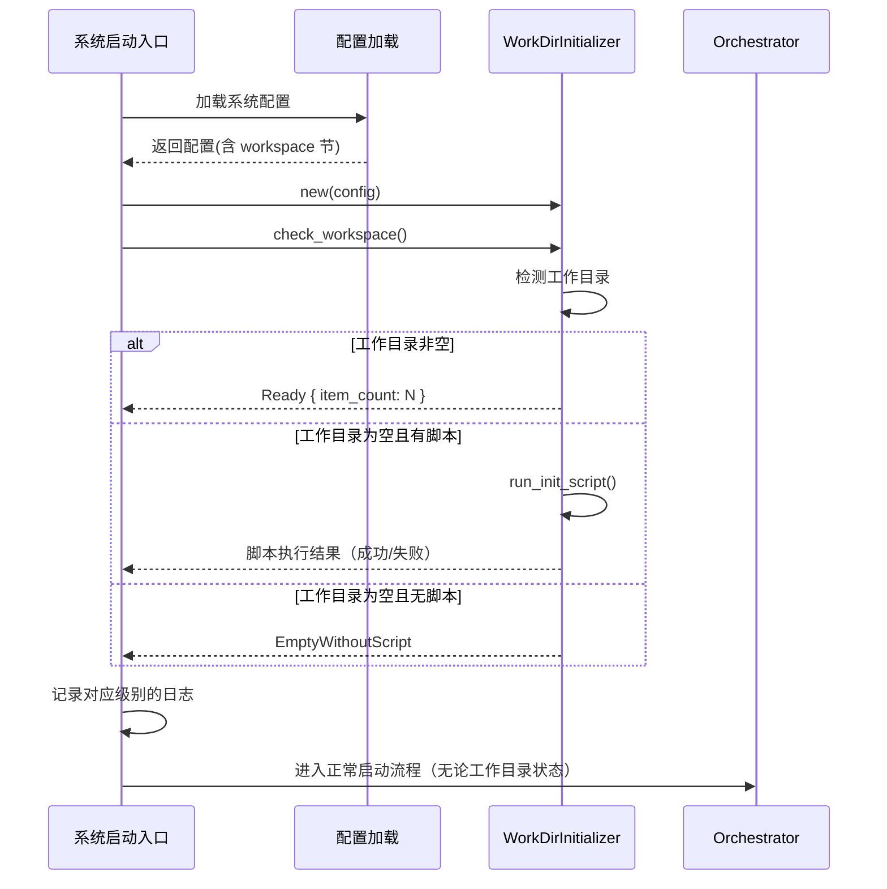

# Explore AI Agent - WorkDirInitializer 详细设计文档 v1.0

| 属性     | 值                                                                 |
| :------- | :----------------------------------------------------------------- |
| 文档版本 | v1.0                                                               |
| 创建日期 | 2026-04-30                                                         |
| 涉及模块 | common/path_manager（扩展）或新增 common/work_dir                    |
| 技术栈   | Rust                                                               |
| 关联文档 | [Explore AI Agent 架构设计文档 v1.1](Explore%20AI%20Agent架构设计文档v1.1.md) 第 8 节 |

---

## 目录

- [1. 总体设计](#1-总体设计)
  - [1.1 模块定位](#11-模块定位)
  - [1.2 核心原则](#12-核心原则)
  - [1.3 初始化流程](#13-初始化流程)
- [2. 数据结构](#2-数据结构)
  - [2.1 WorkspaceConfig](#21-workspaceconfig)
  - [2.2 WorkspaceStatus](#22-workspacestatus)
  - [2.3 WorkDirInitializer](#23-workdirinitializer)
- [3. 方法详细设计](#3-方法详细设计)
  - [3.1 构造](#31-构造)
  - [3.2 check_workspace — 检测工作目录](#32-check_workspace--检测工作目录)
  - [3.3 run_init_script — 执行初始化脚本](#33-run_init_script--执行初始化脚本)
- [4. 配置方式](#4-配置方式)
- [5. 在系统启动流程中的位置](#5-在系统启动流程中的位置)
- [6. 错误处理](#6-错误处理)
- [7. 自动化测试用例](#7-自动化测试用例)
- [8. 附录](#8-附录)

---

## 1. 总体设计

### 1.1 模块定位

WorkDirInitializer 是系统启动阶段的基础设施模块。它在系统启动时执行一次性工作目录检测，记录状态日志，并可选的执行用户配置的初始化脚本。它不参与运行时的探索逻辑——Agent 在运行时天然感知文件系统的实时状态。

**核心职责**：

1. 启动时检测工作目录是否包含可探索的内容
2. 若工作目录为空且配置了初始化脚本，执行脚本自动导入项目
3. 记录对应级别的日志（INFO / WARN / ERROR）
4. 无论检测结果如何，不阻断系统启动

### 1.2 核心原则

| 原则 | 说明 |
|:---|:---|
| **启动不阻断** | 工作目录为空或脚本执行失败均不阻止系统启动 |
| **运行时透明** | 仅在启动时执行一次，Agent 运行时自行感知文件系统变化 |
| **脚本可选** | 初始化脚本由用户自行编写和维护，系统不提供默认实现 |
| **安全边界** | 脚本在子进程执行，超时可终止，不影响主进程 |

### 1.3 初始化流程



---

## 2. 数据结构

### 2.1 WorkspaceConfig

```rust
#[derive(Debug, Clone, Deserialize)]
pub struct WorkspaceConfig {
    /// 工作目录的绝对或相对路径（必填）
    pub path: String,

    /// 初始化脚本配置（可选）
    #[serde(default)]
    pub init_script: Option<InitScriptConfig>,
}

#[derive(Debug, Clone, Deserialize)]
pub struct InitScriptConfig {
    /// 是否启用初始化脚本
    pub enabled: bool,

    /// 脚本文件路径（相对于系统根目录或绝对路径）
    pub script_path: String,

    /// 脚本执行超时时间（秒），默认 120
    #[serde(default = "default_timeout")]
    pub timeout_sec: u64,
}

fn default_timeout() -> u64 { 120 }
```

| 配置项 | 类型 | 必选 | 默认值 | 说明 |
|:---|:---|:---|:---|:---|
| `workspace.path` | String | 是 | — | 工作目录路径 |
| `init_script.enabled` | bool | 否 | `false` | 是否启用初始化脚本 |
| `init_script.script_path` | String | 否 | — | 脚本文件路径 |
| `init_script.timeout_sec` | u64 | 否 | `120` | 脚本超时时间 |

### 2.2 WorkspaceStatus

```rust
#[derive(Debug, Clone, PartialEq, Eq)]
pub enum WorkspaceStatus {
    /// 工作目录已存在且包含至少一个文件或目录
    Ready { item_count: usize },
    /// 工作目录为空，且用户未配置初始化脚本
    EmptyWithoutScript,
    /// 工作目录为空，已配置初始化脚本
    EmptyWithScript,
    /// 脚本执行成功但工作目录仍为空
    ScriptExecutedButEmpty,
    /// 脚本执行失败
    ScriptExecutionFailed { exit_code: Option<i32>, stderr: String },
}
```

| 状态值 | 含义 |
|:---|:---|
| `Ready { item_count }` | 工作目录就绪，含至少一个文件或目录 |
| `EmptyWithoutScript` | 空目录且无脚本，提示用户手动导入 |
| `EmptyWithScript` | 空目录但有脚本，触发自动导入 |
| `ScriptExecutedButEmpty` | 脚本跑完但没产出文件 |
| `ScriptExecutionFailed { ... }` | 脚本退出码非零或超时，含 stderr |

### 2.3 WorkDirInitializer

```rust
pub struct WorkDirInitializer {
    config: WorkspaceConfig,
}
```

仅持有配置，无其他状态。

---

## 3. 方法详细设计

### 3.1 构造

```rust
pub fn new(config: WorkspaceConfig) -> Self
```

从系统配置创建初始化器实例。

### 3.2 check_workspace — 检测工作目录

#### 3.2.1 函数签名

```rust
pub fn check_workspace(&self) -> Result<WorkspaceStatus, String>
```

#### 3.2.2 处理逻辑

1. 解析 `config.path`，若为相对路径则基于可执行文件所在目录（或系统根目录）拼接为绝对路径
2. 检查路径是否存在：不存在 → 返回 `EmptyWithoutScript`（或 `EmptyWithScript`，取决于脚本配置）
3. 路径存在且为目录：读取目录直接子项列表
4. 存在至少一个文件或子目录（含隐藏文件，以 `.` 开头）→ 返回 `Ready { item_count }`
5. 无任何子项 → 返回 `EmptyWithoutScript` 或 `EmptyWithScript`

**关键规则**：
- 仅检查**直接子项**，不递归
- 以 `.` 开头的隐藏文件计入有效文件
- 空目录 = 无任何子项 = 视为"空"

### 3.3 run_init_script — 执行初始化脚本

#### 3.3.1 函数签名

```rust
pub fn run_init_script(&self, workspace_path: &str) -> Result<(), InitError>
```

#### 3.3.2 处理逻辑

1. 检查 `config.init_script` 是否存在且 `enabled == true`，否则直接返回 `Ok(())`
2. 构造命令行：`/bin/sh <script_path> <workspace_path>`（Unix）或 `cmd.exe /C <script_path> <workspace_path>`（Windows）
3. 创建子进程执行，设置超时（默认 120 秒）
4. 超时或超限 → 终止子进程 → 返回 `Err(InitError::Timeout)`
5. 退出码非零 → 返回 `Err(InitError::ScriptFailed { exit_code, stderr })`
6. 退出码为零 → 返回 `Ok(())`

#### 3.3.3 InitError

```rust
#[derive(Debug, Clone)]
pub enum InitError {
    ScriptFailed { exit_code: Option<i32>, stderr: String },
    Timeout,
}
```

---

## 4. 配置方式

在系统配置文件中增加 `workspace` 节：

```yaml
workspace:
  path: "./workspace"

  init_script:
    enabled: false
    script_path: "./scripts/init_workspace.sh"
    timeout_sec: 120
```

### 初始化脚本规范

- **语言**：Shell 脚本（`.sh`），通过 `/bin/sh`（Unix）或 `cmd.exe /C`（Windows）执行
- **参数**：系统传入工作目录的绝对路径作为 `$1`
- **职责**：从代码仓库克隆项目、下载文件、或从本地复制文件到工作目录
- **退出码**：0 = 成功，非 0 = 失败；stderr 内容将在失败时记录到日志

**示例脚本**：

```bash
#!/bin/sh
# $1: 工作目录路径
WORKSPACE_DIR="$1"
if [ -z "$WORKSPACE_DIR" ]; then
    echo "错误：未提供工作目录路径" >&2
    exit 1
fi
cd "$WORKSPACE_DIR" || exit 1
git clone https://github.com/example/my-project.git .
echo "工作目录初始化完成"
```

---

## 5. 在系统启动流程中的位置



---

## 6. 错误处理

| 场景 | 处理方式 | 是否阻断启动 |
|:---|:---|:---|
| 工作目录路径不存在 | 返回 `EmptyWithoutScript` / `EmptyWithScript`，记录 WARN 日志 | 否 |
| 初始化脚本执行超时 | 终止子进程，返回 `Err(InitError::Timeout)`，记录 ERROR 日志 | 否 |
| 初始化脚本退出码非零 | 返回 `Err(InitError::ScriptFailed { ... })`，记录 ERROR 日志含 stderr | 否 |
| 脚本执行成功但无文件 | 返回 `ScriptExecutedButEmpty`，记录 WARN 日志 | 否 |
| 配置解析失败 | 系统启动失败（此错误在配置加载阶段处理，非本模块） | 是 |

---

## 7. 自动化测试用例

### 7.1 测试夹具

- 测试前创建临时目录模拟工作目录
- 构造标准 `WorkspaceConfig` 测试数据
- 测试后清理临时目录

### 7.2 数据结构和构造测试

| 用例编号 | 测试场景 | 输入 | 预期结果 |
|:---|:---|:---|:---|
| WI-001 | WorkspaceConfig 反序列化（完整配置） | YAML 含 path + init_script | 所有字段正确解析，timeout_sec 默认 120 |
| WI-002 | WorkspaceConfig 反序列化（最小配置） | YAML 仅含 path | init_script = None |
| WI-003 | 构造 WorkDirInitializer | `WorkDirInitializer::new(config)` | 返回实例，不 panic |

### 7.3 check_workspace 测试

| 用例编号 | 测试场景 | 输入 | 预期结果 |
|:---|:---|:---|:---|
| WI-004 | 工作目录就绪（含文件） | 临时目录含 `src/main.rs` | `Ready { item_count: 1 }` |
| WI-005 | 工作目录就绪（含子目录） | 临时目录含 `src/` | `Ready { item_count: 1 }` |
| WI-006 | 工作目录就绪（含隐藏文件） | 临时目录含 `.gitignore` | `Ready { item_count: 1 }`，隐藏文件计入 |
| WI-007 | 工作目录为空（无脚本） | 空临时目录，无 init_script | `EmptyWithoutScript` |
| WI-008 | 工作目录为空（有脚本） | 空临时目录，有 init_script | `EmptyWithScript` |
| WI-009 | 工作目录路径不存在 | path 指向不存在的路径 | `EmptyWithoutScript`（或 `EmptyWithScript`） |

### 7.4 run_init_script 测试

| 用例编号 | 测试场景 | 输入 | 预期结果 |
|:---|:---|:---|:---|
| WI-010 | 脚本未启用 | `enabled = false` | `run_init_script()` 直接返回 `Ok(())` |
| WI-011 | 无脚本配置 | `init_script = None` | `run_init_script()` 直接返回 `Ok(())` |
| WI-012 | 脚本执行成功 | 脚本 `echo done; exit 0` | 返回 `Ok(())` |
| WI-013 | 脚本执行失败 | 脚本 `exit 1` | 返回 `Err(InitError::ScriptFailed { exit_code: Some(1), ... })` |

---

## 8. 附录

### 8.1 与架构文档的对应关系

| 架构文档章节 | 对应本模块 | 实现状态 |
|:---|:---|:---|
| 8.1 设计目标 | 第 1.1 节 | 本文档设计 |
| 8.2 初始化流程 | 第 1.3 节 | 本文档设计 |
| 8.3 模块职责 | 第 1.2 节 | 本文档设计 |
| 8.4 配置方式 | 第 4 节 | 本文档设计 |
| 8.5 初始化脚本规范 | 第 4 节脚本部分 | 本文档设计 |
| 8.6 日志信息设计 | 第 1.3 节流程图 | 本文档引用 |
| 8.7 安全约束 | 第 1.2 节 | 本文档设计 |
| 8.8 模块接口 | 第 3 节 | 本文档细化 |

### 8.2 不变式与约束

| 约束 | 说明 |
|:---|:---|
| **不阻断启动** | 所有路径最终都进入正常启动流程 |
| **仅检查直接子项** | 不递归扫描子目录 |
| **隐藏文件计入** | 以 `.` 开头视为有效 |
| **子进程隔离** | 脚本在独立进程执行，超时可终止 |

---

## 修订记录

| 版本 | 日期 | 修订人 | 变更说明 |
|:---|:---|:---|:---|
| v1.0 | 2026-04-30 | sdfang1053 | 初版：工作目录初始化与 Git 仓库检出 |
