# Explore AI Agent - 上下文管理工具详细设计文档 v1.1

| 属性     | 值                                                                 |
| :------- | :----------------------------------------------------------------- |
| 文档版本 | v1.1                                                               |
| 创建日期 | 2026-04-27                                                         |
| 修订日期 | 2026-04-27                                                         |
| 涉及模块 | ExplorationContextTool, ConversationContextTool, ConversationManager |
| 技术栈   | Rust                                                                |
| 关联文档 | [Explore AI Agent 架构设计文档 v1.1](Explore%20AI%20Agent架构设计文档v1.1.md) |

---

## 目录

- [1. 总体设计](#1-总体设计)
  - [1.1 模块职责与边界](#11-模块职责与边界)
  - [1.2 上下文分离原则](#12-上下文分离原则)
  - [1.3 模块结构](#13-模块结构)
- [2. ExplorationContextTool 详细设计](#2-explorationcontexttool-详细设计)
  - [2.1 数据结构](#21-数据结构)
  - [2.2 write_record — 写入探索记录](#22-write_record--写入探索记录)
  - [2.3 read_records — 查询探索记录](#23-read_records--查询探索记录)
  - [2.4 update_summary — 更新探索摘要](#24-update_summary--更新探索摘要)
  - [2.5 compress_by_confidence — 基于置信度的压缩](#25-compress_by_confidence--基于置信度的压缩)
  - [2.6 needs_compression — 压缩触发判断](#26-needs_compression--压缩触发判断)
  - [2.7 Token 估算](#27-token-估算)
  - [2.8 ToolExecutor 实现](#28-toolexecutor-实现)
- [3. ConversationContextTool 详细设计](#3-conversationcontexttool-详细设计)
  - [3.1 数据结构](#31-数据结构)
  - [3.2 add_record — 追加对话记录](#32-add_record--追加对话记录)
  - [3.3 get_recent_history — 获取最近 N 轮记录](#33-get_recent_history--获取最近-n-轮记录)
  - [3.4 update_summary — 更新对话摘要](#34-update_summary--更新对话摘要)
  - [3.5 needs_refinement — 精炼触发判断](#35-needs_refinement--精炼触发判断)
- [4. ConversationManager 详细设计](#4-conversationmanager-详细设计)
  - [4.1 数据结构](#41-数据结构)
  - [4.2 init_session — 会话初始化](#42-init_session--会话初始化)
  - [4.3 get_context — 获取对话上下文](#43-get_context--获取对话上下文)
  - [4.4 save_conversation — 保存对话记录](#44-save_conversation--保存对话记录)
  - [4.5 check_and_refine — 检查并触发精炼](#45-check_and_refine--检查并触发精炼)
  - [4.6 destroy_session — 销毁会话](#46-destroy_session--销毁会话)
  - [4.7 active_topic 提取](#47-active_topic-提取)
- [5. 自动化测试用例](#5-自动化测试用例)
- [6. 附录](#6-附录)

---

## 1. 总体设计

### 1.1 模块职责与边界

上下文管理工具是系统基础设施层的核心组件，负责维护两种完全隔离的上下文：

| 模块                     | 管理对象       | 生命周期             | 写入方                                   | 读取方                                                   |
| :----------------------- | :------------- | :------------------- | :--------------------------------------- | :------------------------------------------------------- |
| ExplorationContextTool   | 探索上下文     | 单次问题（随探索流程） | SearchStrategyAgent, DeepExplorer, ExplorationQualityEvaluator | SearchStrategyAgent, DeepExplorer, QE, MainAgent, Orchestrator |
| ConversationContextTool  | 对话上下文     | 跨轮次（随 Session）  | ConversationManager（唯一写入方）         | ConversationManager, MainAgent                           |
| ConversationManager      | Session 映射   | 跨轮次（随 Session）  | Orchestrator                             | Orchestrator, MainAgent                                  |

**关键边界约束**：

- 探索上下文**严禁**被 ConversationManager 访问或修改
- 对话上下文**严禁**被 Orchestrator 或任何 Agent 直接写入
- ConversationManager 是对话上下文的**唯一写入入口**

### 1.2 上下文分离原则

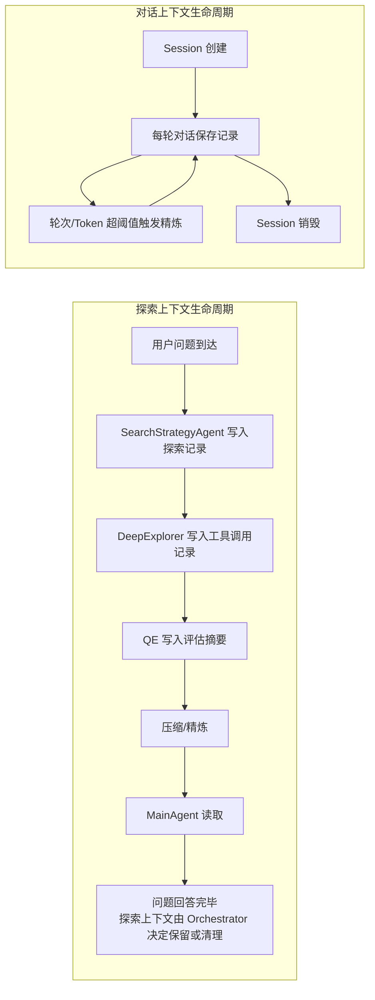

两者的数据**物理隔离**，存储在不同的数据结构中，由不同的模块管理。MainAgent 在生成回答时同时接收两类上下文，但二者的来源和精炼逻辑完全独立。

### 1.3 模块结构

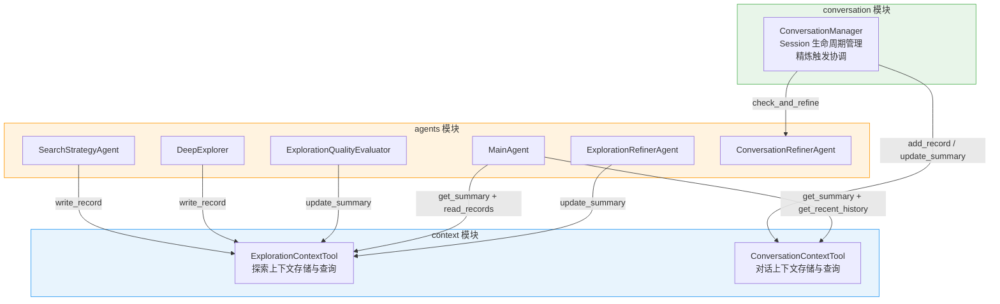

---

## 2. ExplorationContextTool 详细设计

### 2.1 数据结构

#### 2.1.1 核心结构体

```rust
pub struct ExplorationContextTool {
    context: ExplorationContext,
    backup_summary: Option<ExplorationSummary>,
}
```

| 字段            | 类型                       | 说明                                                         |
| :-------------- | :------------------------- | :----------------------------------------------------------- |
| context         | ExplorationContext         | 探索上下文的完整数据                                         |
| backup_summary  | Option\<ExplorationSummary> | copy-on-write 的备份副本，仅在 update_summary 事务期间非空   |

#### 2.1.2 ExplorationContext

```rust
pub struct ExplorationContext {
    pub session_id: String,
    pub exploration_history: Vec<ExplorationRecord>,
    pub current_summary: Option<ExplorationSummary>,
    pub metadata: ExplorationMetadata,
}
```

| 字段                 | 类型                     | 说明                                   |
| :------------------- | :----------------------- | :------------------------------------- |
| session_id           | String                   | 所属 Session 标识                      |
| exploration_history  | Vec\<ExplorationRecord>  | 按时间顺序追加的探索记录列表           |
| current_summary      | Option\<ExplorationSummary> | 当前精炼后的探索摘要                |
| metadata             | ExplorationMetadata      | Token 计数与记录统计                   |

#### 2.1.3 ExplorationRecord

```rust
pub enum ExplorationRecord {
    Summary {
        source: String,
        data: ExplorationSummary,
        confidence: f64,
        timestamp: DateTime<Utc>,
    },
    ToolCall {
        source: String,
        tool: String,
        params: serde_json::Value,
        result_summary: String,
        confidence: f64,
        timestamp: DateTime<Utc>,
    },
}
```

| 变体      | 写入来源                          | 说明                                       |
| :-------- | :-------------------------------- | :----------------------------------------- |
| Summary   | SearchStrategyAgent, ExplorationQualityEvaluator | 评估摘要记录            |
| ToolCall  | DeepExplorer                      | 工具调用记录，含置信度自评                  |

**关键方法**：

| 方法                        | 返回值 | 说明                                                         |
| :-------------------------- | :----- | :----------------------------------------------------------- |
| confidence()                | f64    | 返回本条记录的置信度。Summary 变体返回内层 data.confidence 而非外层字段（外层字段为历史遗留，实际以 data.confidence 为准） |
| source()                    | &str   | 返回记录来源标识                                             |
| is_quality_evaluator_summary() | bool | 判断是否为 ExplorationQualityEvaluator 写入的 Summary（双重条件：`type == Summary && source == "ExplorationQualityEvaluator"`），用于压缩保护 |

#### 2.1.4 ExplorationSummary

```rust
pub struct ExplorationSummary {
    pub key_findings: String,
    pub critical_files: Vec<CriticalFile>,
    pub missing_info: String,
    pub confidence: f64,
}

pub struct CriticalFile {
    pub path: String,
    pub one_sentence_summary: String,
}
```

#### 2.1.5 ExplorationMetadata

```rust
pub struct ExplorationMetadata {
    pub total_token_count: usize,
    pub history_record_count: usize,
    pub last_updated: DateTime<Utc>,
}
```

#### 2.1.6 RecordQuery

```rust
pub struct RecordQuery {
    pub keyword: Option<String>,
    pub file: Option<String>,
    pub limit: Option<usize>,
}
```

### 2.2 write_record — 写入探索记录

#### 2.2.1 函数签名

```rust
pub fn write_record(&mut self, record: ExplorationRecord) -> Result<String, String>
```

**返回值**：成功时返回记录的摘要标识字符串；失败时返回错误描述。

#### 2.2.2 处理流程

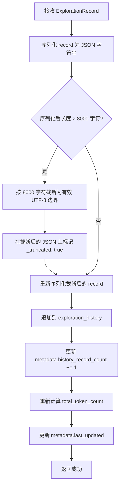

#### 2.2.3 单条记录截断规则

| 规则项         | 说明                                                         |
| :------------- | :----------------------------------------------------------- |
| 截断阈值       | 序列化后超过 **8000 字符**（RECORD_MAX_CHARS）               |
| 截断方式       | 在 8000 字符处截断，回退到最近的合法 UTF-8 字符边界（避免截断在多字节字符中间） |
| 截断标记       | 截断后在 JSON 对象中追加 `"_truncated": true` 字段           |
| 截断对象       | 对整个 record 的序列化 JSON 进行截断，而非仅截断 result_summary 或 data 字段 |
| 截断后行为     | 将截断后的 JSON 反序列化回 ExplorationRecord，追加到 history  |
| 测量单位       | 以 Rust `String::len()`（UTF-8 字节数）为准，而非 `chars().count()`（Unicode 标量值数量）。与架构文档 5.1.3 节"8000 字符"语义一致（架构文档中"字符"泛指文本长度单位） |

#### 2.2.4 Token 计数更新

每次 write_record 后重新计算 `metadata.total_token_count`：

```
total_token_count = Σ(每条 exploration_history 记录的序列化 JSON 的字符数 / 4)
                 + (current_summary 序列化 JSON 的字符数 / 4)  [若存在]
```

> **Token 估算策略**：采用 **字符数 / 4** 的粗略估算，适用于中英文混合场景。此策略与架构文档第 5.1.3 节一致。

### 2.3 read_records — 查询探索记录

#### 2.3.1 函数签名

```rust
pub fn read_records(&self, query: &RecordQuery) -> Vec<&ExplorationRecord>
```

#### 2.3.2 查询逻辑

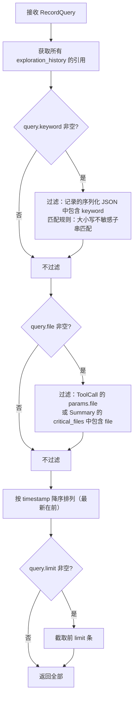

#### 2.3.3 匹配规则详述

| 过滤维度 | 匹配方式                                   | 适用范围                             |
| :------- | :----------------------------------------- | :----------------------------------- |
| keyword  | 对序列化后的 JSON 字符串做**大小写不敏感**子串匹配 | 所有变体的所有字段                   |
| file     | ToolCall 变体：匹配 `params["file"]` 字段<br/>Summary 变体：匹配 `data.critical_files[].path` | 按变体分别处理                      |
| limit    | 截取排序后的前 N 条                        | 所有记录                             |

### 2.4 update_summary — 更新探索摘要

#### 2.4.1 函数签名

```rust
pub fn update_summary(&mut self, new_summary: ExplorationSummary) -> Result<(), String>
```

#### 2.4.2 Copy-on-Write 事务流程

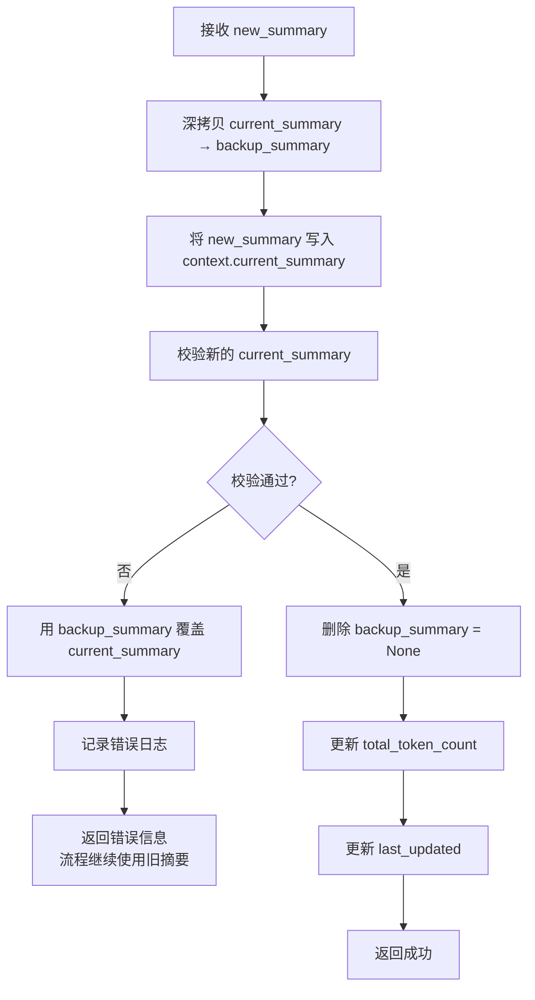

#### 2.4.3 校验规则

| 校验项           | 规则                                                   | 失败处理     |
| :--------------- | :----------------------------------------------------- | :----------- |
| JSON 反序列化    | 将 current_summary 序列化后重新反序列化，确保数据完整   | 回滚到备份   |
| key_findings     | 必填，非空字符串（允许内容为 `""`，但不允许字段缺失）   | 回滚到备份   |
| critical_files   | 必填，数组类型（允许空数组 `[]`）                       | 回滚到备份   |
| missing_info     | 必填，字符串类型                                        | 回滚到备份   |
| confidence       | 必填，数字类型，范围 [0.0, 1.0]                         | 回滚到备份   |

#### 2.4.4 备份生命周期

- **创建**：update_summary 开始时
- **释放**：校验通过后立即设为 `None`
- **作用域**：仅存在于单次 update_summary 调用期间
- **持久化**：不持久化，仅存于进程内存

> **调用方职责**：`update_summary` 仅负责摘要的原子更新，内部不自动触发 `compress_by_confidence()`。更新完成后，由调用方（Orchestrator 或 ExplorationRefinerAgent）检查 `needs_compression()`，必要时调用 `compress_by_confidence()` 或触发 LLM 精炼。

### 2.5 compress_by_confidence — 基于置信度的压缩

#### 2.5.1 函数签名

```rust
pub fn compress_by_confidence(&mut self) -> usize
```

**返回值**：被删除的记录条数。

#### 2.5.2 压缩流程

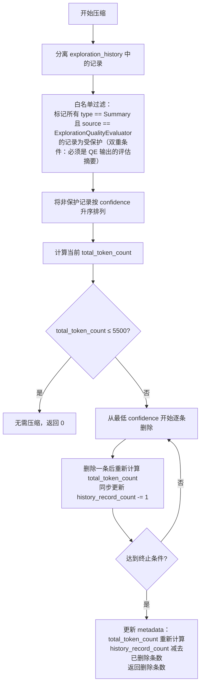

#### 2.5.3 终止条件

| 条件                           | 说明                                         |
| :----------------------------- | :------------------------------------------- |
| Token ≤ 阈值 × 0.7（≈ 3850）   | 总 token 降至阈值的 70% 以下                 |
| 非保护记录剩余 < 5 条           | 防止过度删除导致上下文信息不足               |

**两个条件满足其一即停止**。

#### 2.5.4 保护规则

| 记录类型                 | 保护策略                                        |
| :----------------------- | :---------------------------------------------- |
| QE 评估摘要（`type == Summary && source == "ExplorationQualityEvaluator"`） | **永不删除**（白名单保护，双重条件匹配） |
| SearchStrategyAgent 摘要  | 可删除（按 confidence 排序参与竞争）             |
| DeepExplorer ToolCall     | 可删除（按 confidence 排序参与竞争）             |

> **保护条件说明**：白名单保护使用**双重条件**——必须是 `Summary` 变体且 `source == "ExplorationQualityEvaluator"`。仅有 `source` 匹配但变体为 `ToolCall` 的记录不受保护（防止未来 QE 扩展或误写时将 ToolCall 也纳入保护范围）。
>
> **注意**：此方法仅为代码层压缩（架构文档第 5.1.3 节"第一层"）。若压缩后 token 仍超标，由 Orchestrator 调用 ExplorationRefinerAgent 进行 LLM 精炼（"第二层"），精炼逻辑不在本模块范围内。

### 2.6 needs_compression — 压缩触发判断

```rust
pub fn needs_compression(&self) -> bool
```

**判断逻辑**：

```
needs_compression = metadata.total_token_count > EXPLORATION_TOKEN_THRESHOLD (5500)
```

为纯数值比较，O(1) 复杂度。

### 2.7 Token 估算

#### 2.7.1 估算公式

```
estimated_tokens = byte_count / 4
```

其中 `byte_count` 为序列化为 JSON 字符串后的 UTF-8 字节数。

#### 2.7.2 计算时机

| 触发操作                        | 重算范围                     |
| :------------------------------ | :--------------------------- |
| write_record                    | 全量（所有 history + summary） |
| update_summary                  | 全量                          |
| compress_by_confidence          | 全量（每删除一条后增量更新）   |

#### 2.7.3 可观测性

对外暴露方法：

```rust
pub fn total_token_count(&self) -> usize  // 返回 metadata.total_token_count
```

### 2.8 ToolExecutor 实现

ExplorationContextTool 实现 ToolExecutor trait，以便通过 ToolRegistry 统一调用。

#### 2.8.1 Action 分发

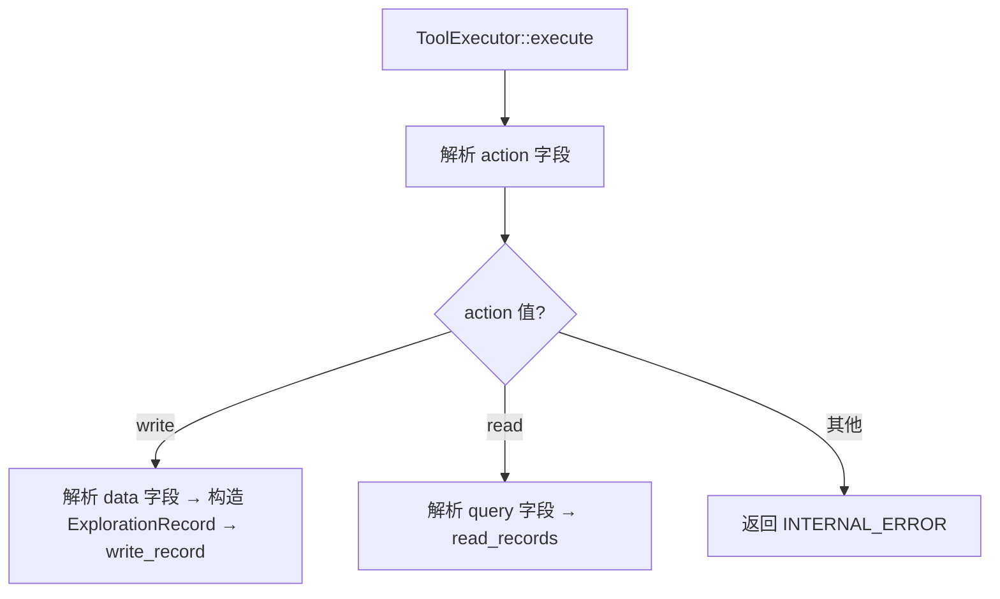

#### 2.8.2 write action

输入格式：

```json
{
  "action": "write",
  "data": {
    "type": "tool_call",
    "source": "DeepExplorer",
    "tool": "read_file",
    "params": {"file": "src/main.rs", "lines": {"ranges": [[1, 10]]}},
    "result_summary": "Found main function at line 3",
    "confidence": 0.85
  }
}
```

或：

```json
{
  "action": "write",
  "data": {
    "type": "summary",
    "source": "SearchStrategyAgent",
    "data": {
      "key_findings": "...",
      "critical_files": [...],
      "missing_info": "...",
      "confidence": 0.6
    }
  }
}
```

处理逻辑：

1. 解析 `data.type` 判断变体类型
2. 自动填入 `timestamp = Utc::now()`
3. 若 `data.type == "summary"` 且未提供外层 `confidence`，使用 `data.data.confidence` 作为外层值
4. 调用 `write_record()`

输出格式：

```json
{
  "success": true,
  "record_id": "<source>-<timestamp>",
  "total_records": 5
}
```

#### 2.8.3 read action

输入格式：

```json
{
  "action": "read",
  "query": {
    "keyword": "BooleanValidator",
    "file": null,
    "limit": 10
  }
}
```

处理逻辑：

1. 解析 `query` 字段构造 RecordQuery
2. 调用 `read_records()`
3. 序列化查询结果

输出格式：

```json
{
  "success": true,
  "records": [...],
  "total": 3
}
```

#### 2.8.4 可变性说明

ExplorationContextTool 的 write action 需要 `&mut self`。由于 ToolExecutor trait 的 execute 方法签名为 `&self`，实际的可变 dispatch 由 Orchestrator 持有 `&mut ExplorationContextTool` 直接调用 `write_record()` 方法完成。ToolExecutor 实现提供 name/description 用于工具列表展示；read action 通过 `&self` 的 execute 正常执行。

---

## 3. ConversationContextTool 详细设计

### 3.1 数据结构

#### 3.1.1 核心结构体

```rust
pub struct ConversationContextTool {
    context: ConversationContext,
}
```

#### 3.1.2 ConversationContext

```rust
pub struct ConversationContext {
    pub session_id: String,
    pub conversation_history: Vec<ConversationRecord>,
    pub conversation_summary: String,
    pub metadata: ConversationMetadata,
}
```

#### 3.1.3 ConversationRecord

```rust
pub struct ConversationRecord {
    pub round: u32,
    pub user_question: String,
    pub answer_summary: String,
    pub timestamp: DateTime<Utc>,
}
```

#### 3.1.4 ConversationMetadata

```rust
pub struct ConversationMetadata {
    pub total_rounds: u32,
    pub summarized_rounds: u32,
    pub last_updated: DateTime<Utc>,
}
```

### 3.2 add_record — 追加对话记录

#### 3.2.1 函数签名

```rust
pub fn add_record(&mut self, question: String, answer_summary: String)
```

#### 3.2.2 处理流程

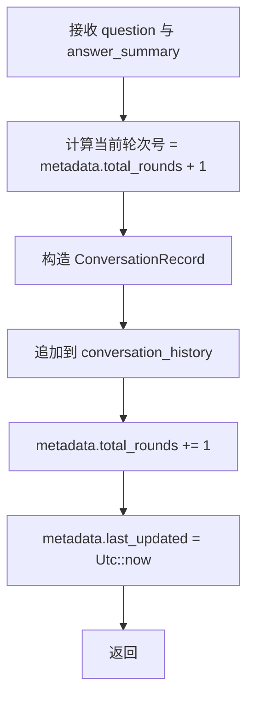

**注意**：此方法不执行截断、不触发精炼。截断与精炼由 ConversationManager 在调用 add_record 之后统一处理。

### 3.3 get_recent_history — 获取最近 N 轮记录

#### 3.3.1 函数签名

```rust
pub fn get_recent_history(&self, n: usize) -> &[ConversationRecord]
```

#### 3.3.2 处理逻辑

```mermaid
flowchart TD
    A[接收 n] --> B[计算起始索引]
    B --> C{history.len() <= n?}
    C -- 是 --> D[返回全部]
    C -- 否 --> E[返回最后 n 条：&history[history.len() - n..]]
```

**边界情况**：
- 共 15 轮，n=10 → 返回第 6-15 轮（索引 5..15）
- 共 3 轮，n=10 → 返回全部 3 轮
- history 为空 → 返回空切片 `&[]`（不会 panic）

### 3.4 update_summary — 更新对话摘要

#### 3.4.1 函数签名

```rust
pub fn update_summary(&mut self, summary: String)
```

#### 3.4.2 处理逻辑

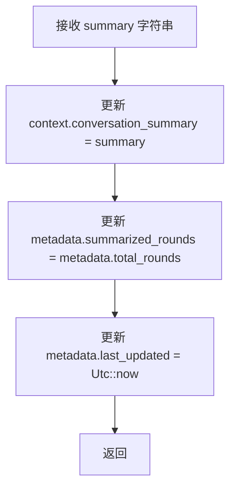

**summarized_rounds 的含义**：记录在最近一次精炼时已处理的轮次数。此字段用于避免对同一批记录重复精炼。

### 3.5 needs_refinement — 精炼触发判断

#### 3.5.1 函数签名

```rust
pub fn needs_refinement(&self) -> bool
```

#### 3.5.2 判断逻辑

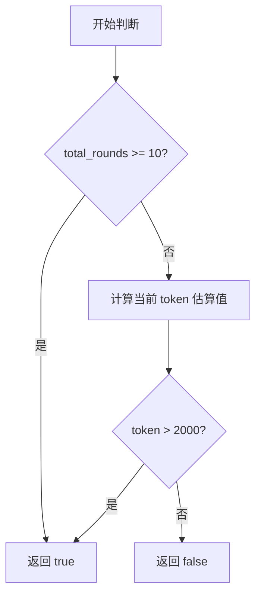

#### 3.5.3 Token 估算方式

```
estimated_tokens = (
    conversation_history 全部序列化为 JSON 的字节数 +
    conversation_summary 的字节数
) / 4
```

阈值常量：`CONVERSATION_TOKEN_THRESHOLD = 2000`

---

## 4. ConversationManager 详细设计

### 4.1 数据结构

```rust
pub struct ConversationManager {
    sessions: std::collections::HashMap<String, ConversationContextTool>,
}
```

| 字段     | 类型                                      | 说明                            |
| :------- | :---------------------------------------- | :------------------------------ |
| sessions | HashMap\<String, ConversationContextTool\> | session_id → 对话上下文的映射   |

### 4.2 init_session — 会话初始化

#### 4.2.1 函数签名

```rust
pub fn init_session(&mut self, session_id: &str) -> &ConversationContextTool
```

#### 4.2.2 处理流程

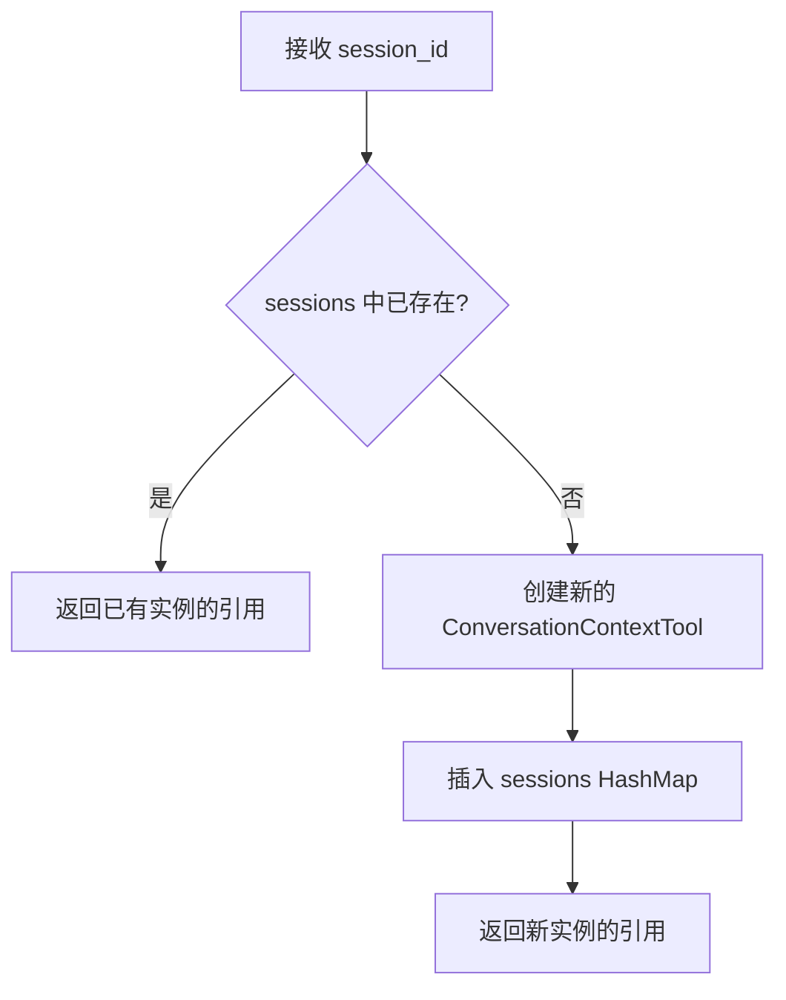

**语义**：`init_session` 是幂等操作，重复调用相同的 `session_id` 不会重置已有上下文。

### 4.3 get_context — 获取对话上下文

#### 4.3.1 函数签名

```rust
pub fn get_context(&self, session_id: &str) -> Result<ConversationOutput, String>
```

#### 4.3.2 输出结构

```rust
pub struct ConversationOutput {
    pub conversation_summary: String,
    pub active_topic: String,
    pub recent_history: Vec<ConversationRecord>,
}
```

#### 4.3.3 处理流程

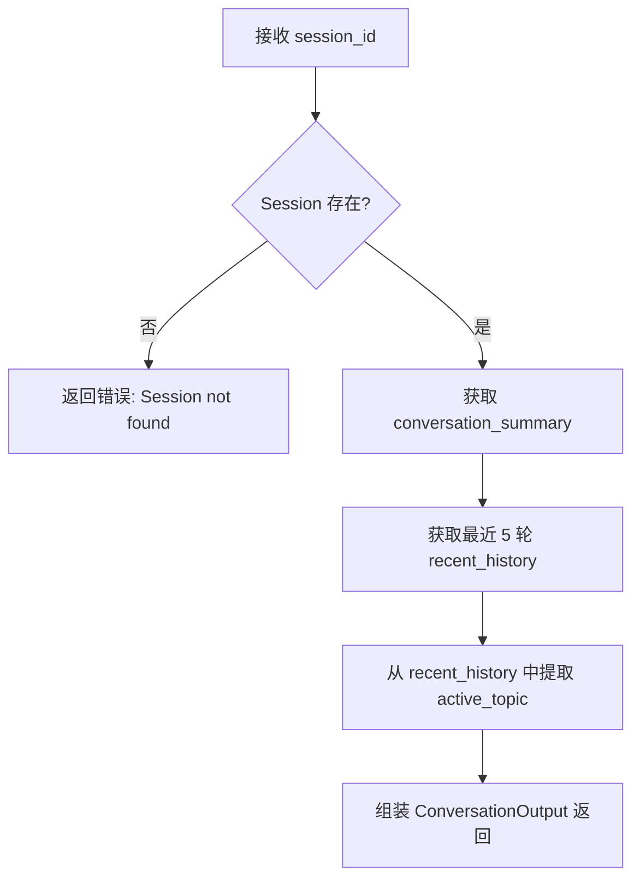

#### 4.3.4 recent_history 范围

取最近 **5 轮**对话记录（可配置常量 `RECENT_HISTORY_LIMIT`），用于 MainAgent 理解最近的对话上下文。

### 4.4 save_conversation — 保存对话记录

#### 4.4.1 函数签名

```rust
pub fn save_conversation(
    &mut self,
    session_id: &str,
    question: &str,
    answer_summary: &str,
) -> Result<(), String>
```

#### 4.4.2 处理流程

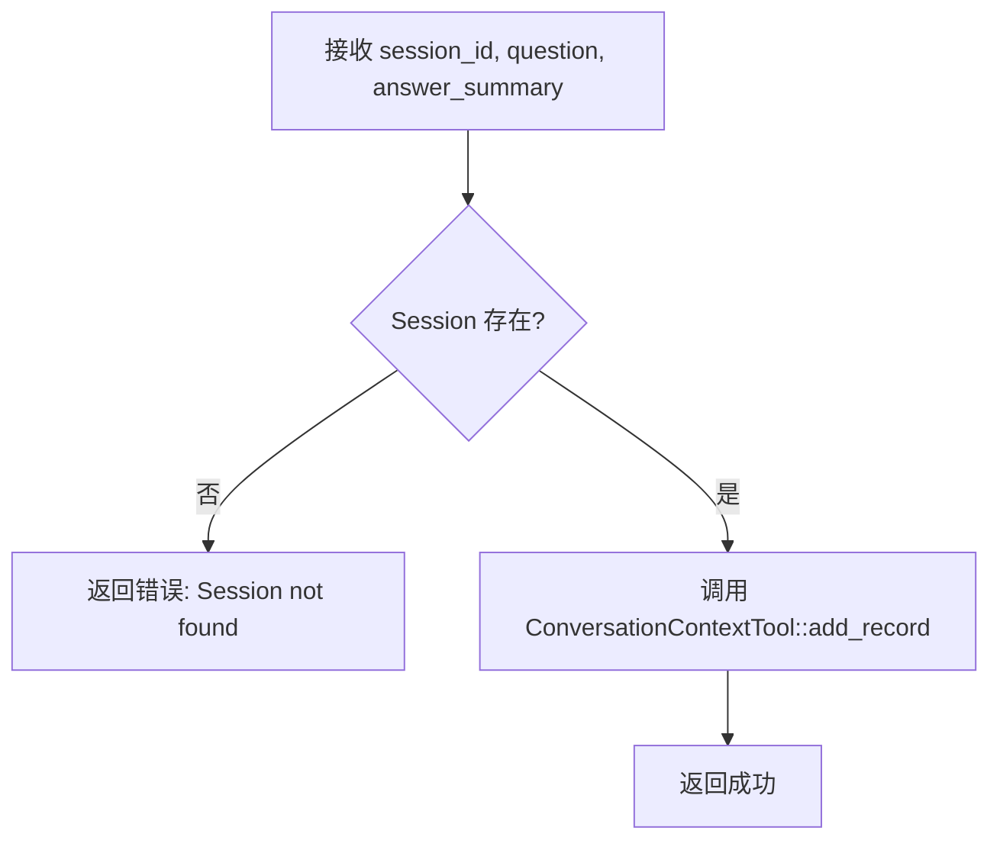

### 4.5 check_and_refine — 检查并触发精炼

#### 4.5.1 函数签名

```rust
pub async fn check_and_refine(
    &mut self,
    session_id: &str,
    current_question: &str,
) -> Result<(), String>
```

| 参数 | 类型 | 说明 |
|:---|:---|:---|
| session_id | &str | Session 标识 |
| current_question | &str | 当前用户问题，由 Orchestrator 传入，供 ConversationRefinerAgent 理解当前语境 |

#### 4.5.2 处理流程

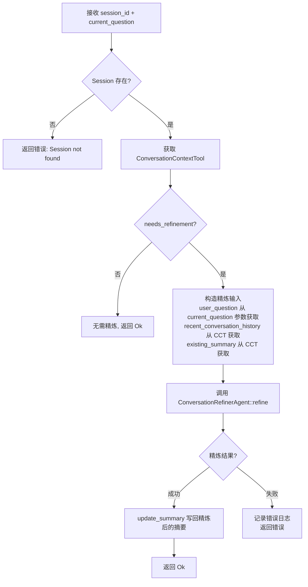

#### 4.5.3 精炼输入构造

从 ConversationContextTool 中提取以下数据，传入 `ConversationRefinerAgent::refine()`：

| 参数                         | 来源                                         | 说明                     |
| :--------------------------- | :------------------------------------------- | :----------------------- |
| user_question                | Orchestrator 传入（当前用户问题）            | 帮助 Refiner 理解当前语境 |
| recent_conversation_history  | 最近 10 轮 ConversationRecord → 转为 ConversationRoundRecord | 含 round, user_question, answer_summary, topic |
| existing_summary             | conversation_summary 字段                    | 已有的历史对话摘要       |

### 4.6 destroy_session — 销毁会话

#### 4.6.1 函数签名

```rust
pub fn destroy_session(&mut self, session_id: &str)
```

#### 4.6.2 处理逻辑

从 `sessions` HashMap 中移除指定的 session_id。若 session_id 不存在，静默成功（不报错）。

### 4.7 active_topic 提取

#### 4.7.1 提取逻辑

从 `recent_history` 中提取当前活跃话题：

1. 若有最近记录，取最后一条记录的 `user_question` 进行关键词提取
2. 关键词提取策略：对问题进行分词，过滤停用词（如"的"、"是"、"什么"等），取前 3-5 个实词拼接
3. 若无记录，返回空字符串 `""`

**实现简化**：在第一版中，`active_topic` 采用简化策略——取最近一次 `answer_summary` 的前 50 个字符作为话题描述。后续版本可接入 NLP 分词或由 LLM 生成。

---

## 5. 自动化测试用例

### 5.1 ExplorationContextTool 测试用例

| 用例编号 | 测试场景 | 输入 | 预期结果 |
| :------- | :------- | :--- | :------- |
| ECT-001 | 新建 Session | `new("session-1")` | session_id = "session-1"，history 为空，summary 为 None，token_count = 0 |
| ECT-002 | 写入 ToolCall 记录 | source="DeepExplorer", tool="read_file", confidence=0.85 | write_record 返回 Ok，history.len() = 1 |
| ECT-003 | 写入 Summary 记录 | source="SearchStrategyAgent", confidence=0.6 | write_record 返回 Ok，history.len() = 1 |
| ECT-004 | 记录序列化超 8000 字符截断 | result_summary 长度为 9000 字符 | history.len() = 1，序列化后长度 ≤ 8000 + 100（含截断标记容差） |
| ECT-005 | 截断后为合法 UTF-8 | result_summary 在 8000 字符边界处包含多字节 UTF-8 字符（如中文） | 截断后 JSON 可正常反序列化，不出现乱码 |
| ECT-006 | 置信度排序压缩 | 写入 10 条低置信度 (0.1) 记录 + 1 条 QE Summary | QE Summary 仍在 history 中，低置信度记录被删除 |
| ECT-007 | 压缩保护的 QE Summary 不被删除 | 仅写入 1 条 QE Summary 和 5 条低置信度记录 | QE Summary 保留，至少删除部分低置信度记录 |
| ECT-008 | 空 history 压缩不报错 | 全新 Session，直接调用 compress_by_confidence() | 返回 0，不 panic |
| ECT-009 | 未达阈值不触发压缩 | Token < 5500 | compress_by_confidence() 返回 0，history 不变 |
| ECT-010 | 到达最小保留数终止 | 仅有 4 条非保护记录，Token > 5500 | 4 条全部保留（起始数不足 MIN_REMAINING_RECORDS 时压缩循环立即终止，一条不删） |
| ECT-011 | 更新 Summary 成功 | 传入合法的 ExplorationSummary | update_summary 返回 Ok，get_current_summary() 返回新摘要 |
| ECT-012 | 更新 Summary 后 Token 重算 | 写入 3 条记录 → 更新 Summary | total_token_count 包含 Summary 的 token |
| ECT-013 | needs_compression 阈值判断 | Token < 5500 | 返回 false |
| ECT-014 | needs_compression 超额 | Token > 5500（写入大量记录） | 返回 true |
| ECT-015 | read_records keyword 过滤 | 写入关于 "BooleanValidator" 和 "StringValidator" 的记录 | keyword="Boolean" 只返回匹配的记录 |
| ECT-016 | read_records limit 限制 | 写入 10 条含相同 keyword 的记录 | query.limit=3 返回 3 条 |
| ECT-017 | read_records 空结果 | 查询不存在的 keyword | 返回空 Vec |
| ECT-018 | is_quality_evaluator_summary 识别 | 创建 Summary(source="ExplorationQualityEvaluator") 和 ToolCall(source="ExplorationQualityEvaluator") | 前者 true（Summary+QE 双重匹配），后者 false（ToolCall 不受保护） |
| ECT-018b | is_quality_evaluator_summary 其他 source | Summary(source="SearchStrategyAgent") | false（source 不匹配） |
| ECT-019 | Confidence 访问器正确性 | ToolCall { confidence: 0.75 } 和 Summary { data.confidence: 0.9 } | 分别返回 0.75 和 0.9 |
| ECT-020 | Source 访问器正确性 | 各变体设置不同 source | 返回正确的 source 字符串 |

### 5.2 ConversationContextTool 测试用例

| 用例编号 | 测试场景 | 输入 | 预期结果 |
| :------- | :------- | :--- | :------- |
| CCT-001 | 新建 Session | `new("session-1")` | 所有字段为空/0 |
| CCT-002 | 追加单条记录 | add_record("Q1", "A1") | total_rounds=1, history.len()=1, round=1 |
| CCT-003 | 多轮追加轮次递增 | 循环 add_record 5 次 | total_rounds=5, 轮次号依次为 1-5 |
| CCT-004 | get_recent_history 获取最近 N 条 | 15 轮后 get_recent_history(10) | 返回 10 条, 轮次 6-15 |
| CCT-005 | get_recent_history 不足 N 条 | 3 轮后 get_recent_history(10) | 返回全部 3 条 |
| CCT-006 | update_summary | update_summary("Summarized 10 rounds") | get_summary() 返回该字符串 |
| CCT-007 | needs_refinement 轮次触发 | 添加 10 轮记录 | 返回 true |
| CCT-008 | needs_refinement 轮次未达 | 添加 9 轮记录 | 返回 false |
| CCT-009 | needs_refinement Token 触发 | 添加 3 轮长文本（每轮 ~500 字符） | 返回 true |
| CCT-010 | summarized_rounds 更新 | add_record 10 轮 → update_summary | summarized_rounds = 10 |
| CCT-011 | 序列化往返正确 | 构造完整 ConversationContext | JSON 序列化后反序列化一致 |

### 5.3 ConversationManager 测试用例

| 用例编号 | 测试场景 | 输入 | 预期结果 |
| :------- | :------- | :--- | :------- |
| CM-001 | 初始化新 Session | init_session("session-1") | 返回空上下文，has_session=true |
| CM-002 | 重复初始化恢复已有会话 | init_session("s1") → save → init_session("s1") | total_rounds 保持为 1 |
| CM-003 | get_context 返回正确结构 | 包含摘要和历史的 Session | summary 和历史正确填充 |
| CM-004 | get_context 不存在 | get_context("nonexistent") | 返回 Err |
| CM-005 | save_conversation 累计轮次 | 连续 save 5 次 | Session 的 total_rounds = 5 |
| CM-006 | save_conversation 不存在 | save_conversation("nonexistent", "Q", "A") | 返回 Err |
| CM-007 | destroy_session | init → destroy | has_session 返回 false |
| CM-008 | destroy_session 不存在 | destroy("nonexistent") | 不 panic，静默成功 |
| CM-009 | check_and_refine 低于阈值 | 5 轮记录 | 返回 Ok，不触发精炼，summary 不变 |
| CM-010 | check_and_refine 达到 10 轮阈值 | 10 轮记录 | 调用 ConversationRefinerAgent，summary 更新 |
| CM-011 | check_and_refine 不存在 Session | check_and_refine("nonexistent", "Q") | 返回 Err |
| CM-012 | get_context 的 active_topic 提取 | 最后一条记录的答案摘要 | active_topic 非空 |

### 5.4 ExplorationContextTool ToolExecutor 测试用例

| 用例编号 | 测试场景 | 输入 | 预期结果 |
| :------- | :------- | :--- | :------- |
| TE-001 | execute write tool_call | action="write", data={type="tool_call", ...} | 返回 success=true，含 record_id |
| TE-002 | execute write summary | action="write", data={type="summary", ...} | 返回 success=true |
| TE-003 | execute read | action="read", query={keyword="main"} | 返回 success=true，含 records 数组 |
| TE-004 | execute 未知 action | action="delete" | 返回 INTERNAL_ERROR |
| TE-005 | execute write 缺 data | action="write" 不传 data | 返回 INTERNAL_ERROR |

---

## 6. 附录

### 6.1 常量汇总

| 常量名 | 值 | 所属模块 | 说明 |
|:---|:---|:---|:---|
| RECORD_MAX_CHARS | 8000 | ExplorationContextTool | 单条探索记录最大字符数 |
| EXPLORATION_TOKEN_THRESHOLD | 5500 | ExplorationContextTool | 探索上下文压缩触发阈值 |
| EXPLORATION_TOKEN_TARGET_RATIO | 0.70 | ExplorationContextTool | 压缩目标比例（降至阈值 70%） |
| MIN_REMAINING_RECORDS | 5 | ExplorationContextTool | 压缩后最少保留的非保护记录数 |
| CONVERSATION_ROUND_THRESHOLD | 10 | ConversationContextTool | 对话精炼触发轮次阈值 |
| CONVERSATION_TOKEN_THRESHOLD | 2000 | ConversationContextTool | 对话精炼触发 token 阈值 |
| RECENT_HISTORY_LIMIT | 5 | ConversationManager | get_context 返回的最近记录数 |
| REFINEMENT_HISTORY_LIMIT | 10 | ConversationManager | 传入 Refiner 的历史记录数 |

### 6.2 线程安全说明

| 模块 | 线程模型 | 说明 |
|:---|:---|:---|
| ExplorationContextTool | 单线程持有 `&mut` | 由 Orchestrator 独占可变引用，无需内部锁 |
| ConversationContextTool | 单线程持有 `&mut` | 由 ConversationManager 独占可变引用 |
| ConversationManager | 单线程持有 `&mut` | 由 Orchestrator 独占可变引用 |

当前架构中所有上下文工具均在单线程异步运行时中使用，无需 `Mutex` 或 `RwLock`。若后续需要多线程访问，应在 ConversationManager 外层加锁。

### 6.3 错误处理策略

| 错误类型 | 处理方式 | 是否中断流程 |
|:---|:---|:---|
| Session 不存在 | 返回 `Err("Session not found: {id}")` | 否（由调用方决定） |
| 序列化失败 | 返回 `Err("Serialization error: {details}")` | 是（数据结构不变量被破坏） |
| 校验失败（update_summary） | 回滚 + 记录日志 + 返回 Err | 否（继续使用旧摘要） |
| Refiner 调用失败 | 记录日志 + 返回 Err | 否（流程继续，下次再触发） |
| UTF-8 截断边界 | 自动回退到合法边界 | 否（截断逻辑内置容错） |

### 6.4 与架构文档的对应关系

| 架构文档章节 | 对应本模块 | 实现状态 |
|:---|:---|:---|
| 5.1 ExplorationContextTool | 第 2 节 | 本文档设计 |
| 5.1.1 数据结构 | 2.1 节 | 代码已定义 |
| 5.1.2 字段说明 | 2.1.3-2.1.5 节 | 本文档补充 |
| 5.1.3 维护规则 | 2.2-2.6 节 | 本文档详细设计 |
| 5.1.4 写入安全保证 | 2.4 节 | 本文档详细设计 |
| 5.2 ConversationContextTool | 第 3 节 | 本文档设计 |
| 5.2.1 数据结构 | 3.1 节 | 代码已定义 |
| 5.2.2 字段说明 | 3.1.3-3.1.4 节 | 本文档补充 |
| 5.2.3 维护规则 | 3.2-3.5 节 | 本文档详细设计 |
| 6. ConversationManager | 第 4 节 | 本文档设计 |
| 6.1 核心职责 | 4.1 节 | 本文档设计 |
| 6.2 主要方法 | 4.2-4.7 节 | 本文档详细设计 |
| 6.3 精炼触发条件 | 4.5 节 | 本文档设计 |
| 6.4 数据传递 | 4.3 节 | 本文档设计 |

---

## 修订记录

| 版本 | 日期 | 修订人 | 变更说明 |
|:---|:---|:---|:---|
| v1.0 | 2026-04-26 | sdfang1053 | 初版：探索/对话上下文分离管理 |
| v1.1 | 2026-04-27 | sdfang1053 | 增加 token 估算、压缩触发逻辑、ConversationRefiner 集成 |
