# Explore AI Agent - 底层只读工具详细设计文档 v1.2

| 属性     | 值                                                                 |
| :------- | :----------------------------------------------------------------- |
| 文档版本 | v1.3                                                               |
| 创建日期 | 2026-04-26                                                         |
| 修订日期 | 2026-05-09                                                         |
| 涉及工具 | search_files, read_file, search_content, list_dir, file_info, execute_shell |
| 技术栈   | Rust (主体) + C (execute_shell 核心)                               |
| 目标平台 | Linux / macOS / Windows                                            |
| 关联文档 | [Explore AI Agent 架构设计文档 v1.1](Explore%20AI%20Agent架构设计文档v1.1.md) |

---

## 目录

- [1. 总体设计](#1-总体设计)
  - [1.1 设计目标与约束](#11-设计目标与约束)
  - [1.2 模块结构](#12-模块结构)
  - [1.3 统一接口抽象](#13-统一接口抽象)
  - [1.4 统一输入输出模型](#14-统一输入输出模型)
  - [1.5 错误码体系](#15-错误码体系)
  - [1.6 路径安全策略](#16-路径安全策略)
  - [1.7 跨平台适配策略](#17-跨平台适配策略)
- [2. search_files 详细设计](#2-search_files-详细设计)
- [3. read_file 详细设计](#3-read_file-详细设计)
- [4. search_content 详细设计](#4-search_content-详细设计)
- [5. list_dir 详细设计](#5-list_dir-详细设计)
- [6. file_info 详细设计](#6-file_info-详细设计)
- [7. execute_shell 详细设计](#7-execute_shell-详细设计)
  - [7.1 C 层实现设计](#71-c-层实现设计)
  - [7.2 FFI 绑定设计](#72-ffi-绑定设计)
  - [7.3 三层安全机制](#73-三层安全机制)
- [8. 自动化测试用例](#8-自动化测试用例)
- [9. 手工测试用例](#9-手工测试用例)
- [10. 附录](#10-附录)

---

## 1. 总体设计

### 1.1 设计目标与约束

**设计目标**

- 为上层 Agent（SearchStrategyAgent、DeepExplorer）提供安全、高效的只读代码探索能力
- 所有工具严格只读，不得对文件系统产生任何写入副作用
- 统一的接口抽象与错误处理，降低上层调用复杂度
- 跨平台行为一致，同一输入在 Linux / macOS / Windows 上返回语义等价的结果

**核心约束**

- 所有文件路径操作必须限制在项目根目录（project_root）及其子目录内
- 单次工具调用的输出大小不得超过 **64 KB**，超出部分截断并标记 `truncated: true`
- 单次工具调用的执行时间不得超过 **120 秒**，超时则中止并返回超时错误
- 工具不维护跨调用状态，每次调用独立执行

### 1.2 模块结构

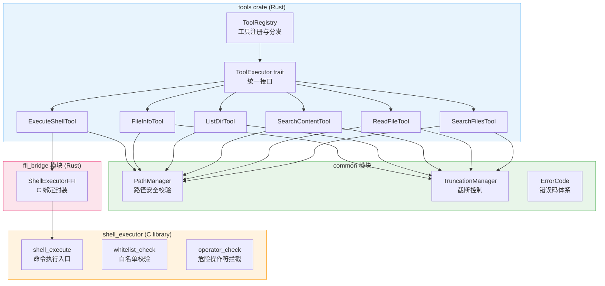

**模块说明**

- **tools crate**：Rust 主体，包含 6 个工具的实现及统一注册分发
- **common 模块**：跨工具共享的基础能力——路径安全校验、输出截断控制、错误码定义
- **shell_executor (C library)**：execute_shell 的核心执行引擎，使用 C 实现以便进行底层系统调用控制
- **ffi_bridge 模块**：Rust 与 C 之间的 FFI 绑定封装，负责类型转换与内存安全

### 1.3 统一接口抽象

所有 6 个工具实现同一个 **ToolExecutor** trait，提供统一的调用入口。

**trait 职责**

- `name()` — 返回工具名称标识符（如 `"search_files"`）
- `description()` — 返回工具的功能描述文本
- `execute(input) -> Result<ToolOutput, ToolError>` — 执行工具逻辑，接受通用输入，返回通用输出或错误

**ToolRegistry 的分发流程**

- 启动时将所有工具实例注册到 registry 的 HashMap 中，key 为工具名称
- 接收到调用请求时，根据请求中的 tool_name 查找对应的 ToolExecutor 实例
- 调用实例的 execute 方法，将结果序列化为 JSON 返回

### 1.4 统一输入输出模型

#### ToolInput（通用输入）

| 字段         | 类型              | 必选 | 说明                                   |
| :----------- | :---------------- | :--- | :------------------------------------- |
| tool_name    | String            | 是   | 工具名称                               |
| params       | serde_json::Value | 是   | 工具特定参数，由各工具自行反序列化     |
| project_root | PathBuf           | 是   | 项目根目录绝对路径，由 Orchestrator 注入 |

#### ToolOutput（通用成功输出）

| 字段      | 类型              | 必选 | 说明                                |
| :-------- | :---------------- | :--- | :---------------------------------- |
| success   | bool              | 是   | 固定为 true                         |
| data      | serde_json::Value | 是   | 工具特定返回数据                    |
| truncated | bool              | 是   | 输出是否被截断                      |
| metadata  | Option\<Metadata> | 否   | 可选的元信息（执行耗时、匹配总数等） |

#### ToolError（通用错误输出）

| 字段    | 类型   | 必选 | 说明                                  |
| :------ | :----- | :--- | :------------------------------------ |
| success | bool   | 是   | 固定为 false                          |
| error   | String | 是   | 人类可读的错误描述                    |
| code    | String | 是   | 机器可读的错误码（见 1.5 错误码体系） |

### 1.5 错误码体系

| 错误码                   | 含义                                 | 适用工具                 |
| :----------------------- | :----------------------------------- | :----------------------- |
| PATH_OUTSIDE_ROOT        | 路径超出项目根目录                   | 所有工具                 |
| PATH_NOT_FOUND           | 目标路径不存在                       | 所有工具                 |
| PATH_NOT_FILE            | 期望文件但目标是目录                 | read_file, file_info     |
| PATH_NOT_DIRECTORY       | 期望目录但目标是文件                 | list_dir                 |
| INVALID_PATTERN          | glob 或正则表达式语法错误            | search_files, search_content |
| INVALID_LINE_RANGE       | 行范围参数非法（start > end 或 ≤ 0） | read_file                |
| ENCODING_ERROR           | 文件编码无法识别或解码失败           | read_file, search_content, file_info |
| PERMISSION_DENIED        | 操作系统级别的权限拒绝               | 所有工具                 |
| EXECUTION_TIMEOUT        | 执行超时（超过 120 秒）               | 所有工具                 |
| OUTPUT_TOO_LARGE         | 输出超过 64 KB 上限（已截断）        | 所有工具                 |
| SHELL_CMD_NOT_ALLOWED    | Shell 命令不在白名单中               | execute_shell            |
| SHELL_DANGEROUS_OPERATOR | 命令包含危险操作符                   | execute_shell            |
| SHELL_EXECUTION_FAILED   | Shell 命令执行失败                   | execute_shell            |
| INTERNAL_ERROR           | 未预期的内部错误                     | 所有工具                 |

### 1.6 路径安全策略

路径安全由 **PathManager** 统一负责，所有工具在执行前必须调用其校验方法。

**校验流程**

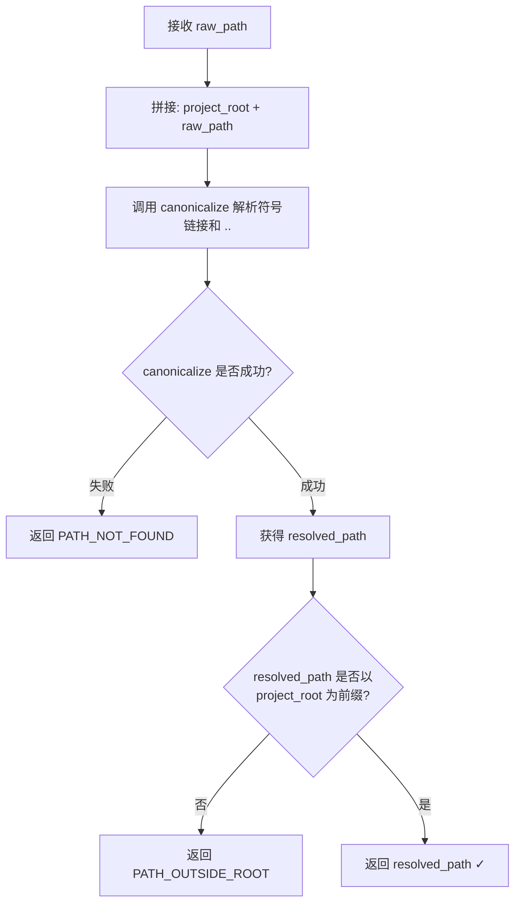

**关键规则**

- 输入路径统一视为**相对于 project_root 的相对路径**
- 使用操作系统的 canonicalize（而非字符串替换）解析 `..`、`.` 和符号链接
- 校验 canonicalize 后的绝对路径必须以 project_root 为前缀
- 空路径 `""` 和 `"."` 均合法，解析为 project_root 本身
- **禁止**在校验前对路径做任何字符串级别的 `..` 过滤，因为无法覆盖所有绕过手段

### 1.7 跨平台适配策略

| 差异项           | Linux / macOS                | Windows                        | 适配策略                                                    |
| :--------------- | :--------------------------- | :----------------------------- | :---------------------------------------------------------- |
| 路径分隔符       | `/`                          | `\`（也接受 `/`）               | 内部统一使用 PathBuf，输出时统一转为 `/` 分隔               |
| 文件名大小写     | 大小写敏感                   | 大小写不敏感                    | glob 匹配在 Windows 上自动忽略大小写                        |
| 符号链接         | 原生支持                     | 需管理员权限或开发者模式        | canonicalize 在两平台行为一致，无需特殊处理                 |
| 换行符           | `\n`                         | `\r\n`                          | read_file 和 search_content 统一以行为单位处理              |
| 文件编码         | 通常 UTF-8                   | 可能 GBK / UTF-16              | 优先 UTF-8 解码，失败后回退到 lossy 解码并在 metadata 中标记 |
| Shell 执行环境   | `/bin/sh -c`                 | `cmd.exe /C`                    | C 层通过条件编译选择执行方式                                |
| 隐藏文件判断     | 以 `.` 开头                  | 文件属性 FILE_ATTRIBUTE_HIDDEN  | list_dir 和 search_files 使用平台特定的隐藏文件判断逻辑     |
| 文件权限（mode） | Unix 权限位（如 `0o755`）     | ACL 模型，无 Unix 权限位        | file_info 在 Windows 上 mode 字段返回 null                  |

---

## 2. search_files 详细设计

### 2.1 功能描述

按文件名模式（glob）在指定目录下递归查找匹配的文件路径。支持排除测试文件，返回匹配文件的相对路径列表。

### 2.2 输入参数

| 参数               | 类型   | 必选 | 默认值 | 说明                                                       |
| :----------------- | :----- | :--- | :----- | :--------------------------------------------------------- |
| pattern            | String | 是   | —      | glob 模式（如 `**/*.java`、`src/**/Test*.py`）              |
| path               | String | 否   | `"."`  | 搜索起始目录，相对于 project_root                          |
| exclude_test_files | bool   | 否   | true   | 是否排除测试文件                                           |

**测试文件判定规则**（当 `exclude_test_files = true` 时）

- 文件路径包含以下目录名之一：`test/`、`tests/`、`__tests__/`、`__test__/`、`spec/`、`specs/`
- 文件名匹配以下模式之一：`*_test.*`、`*_spec.*`、`test_*.*`、`*Test.*`、`*Spec.*`

### 2.3 输出结构

| 字段      | 类型     | 说明                                           |
| :-------- | :------- | :--------------------------------------------- |
| success   | bool     | 是否成功                                       |
| files     | String[] | 匹配文件的相对路径列表（相对于 project_root）  |
| truncated | bool     | 匹配结果是否被截断（超过 1000 条时截断）        |

**输出 JSON 示例**

```json
{
  "success": true,
  "files": [
    "src/validation/BooleanValidator.java",
    "src/validation/StringValidator.java"
  ],
  "truncated": false
}
```

### 2.4 处理流程

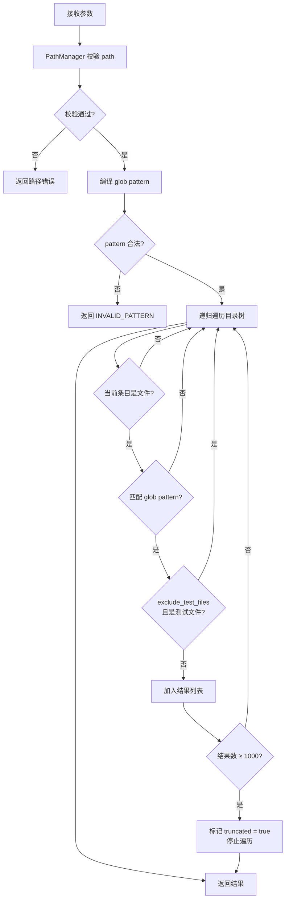

**关键实现细节**

- 使用 `glob` crate 或 `walkdir` + 手动匹配实现递归遍历
- 遍历时自动跳过以下目录以提升性能：`.git/`、`node_modules/`、`target/`、`.idea/`、`__pycache__/`
- 结果按路径字典序升序排列
- 匹配总数上限 1000 条，超过后停止遍历并标记 truncated

### 2.5 错误处理

| 场景                     | 错误码          | 说明                       |
| :----------------------- | :-------------- | :------------------------- |
| path 指向 project_root 外 | PATH_OUTSIDE_ROOT | 路径校验不通过             |
| path 不存在              | PATH_NOT_FOUND  | 搜索起始目录不存在         |
| path 是文件非目录        | PATH_NOT_DIRECTORY | 搜索起始路径不是目录       |
| glob 语法错误            | INVALID_PATTERN | 如未闭合的 `[`、非法字符    |
| 遍历过程中部分路径无权限 | —               | 跳过该路径，不中断整体流程 |

---

## 3. read_file 详细设计

### 3.1 功能描述

读取指定文件的文本内容，支持通过行范围参数读取文件的指定片段。对于非 UTF-8 编码的文件进行 lossy 解码。

### 3.2 输入参数

| 参数  | 类型       | 必选 | 默认值 | 说明                                                              |
| :---- | :--------- | :--- | :----- | :---------------------------------------------------------------- |
| file  | String     | 是   | —      | 文件路径，相对于 project_root                                     |
| lines | LineRanges | 否   | null   | 行范围参数，支持两种格式（见下方说明），行号从 1 开始              |

**lines 参数格式说明**

该参数接受两种格式，工具内部统一解析为行范围列表：

- **字符串格式**（简写）：`"10-20"` 或 `"1-5,10-15"`，以逗号分隔多个范围
- **结构化格式**（与架构文档一致）：`{"ranges": [[start, end], ...]}`，ranges 为二维数组

**LineRanges 规则**

- 每个范围为闭区间 [start, end]，start 和 end 均从 1 开始，start ≤ end
- 多个范围可以重叠，输出时去重合并
- 省略 lines 参数时读取整个文件

> **命名说明**：参数名保持 `lines` 以兼容架构文档中的定义。内部实现中使用 `LineRanges` 类型，对外 API 通过 serde 的 `untagged` 反序列化同时接受上述两种输入格式。

### 3.3 输出结构

| 字段      | 类型   | 说明                                                        |
| :-------- | :----- | :---------------------------------------------------------- |
| success   | bool   | 是否成功                                                    |
| content   | String | 文件内容文本                                                |
| lines     | String | 实际读取的行范围描述，如 `"10-20,45-55"` 或 `"all"`         |
| truncated | bool   | 内容是否被截断（单次读取超过 2000 行或 64 KB 时截断）        |

**输出 JSON 示例**

```json
{
  "success": true,
  "content": "public class BooleanValidator {\n    ...\n}",
  "lines": "30-60",
  "truncated": false
}
```

### 3.4 处理流程

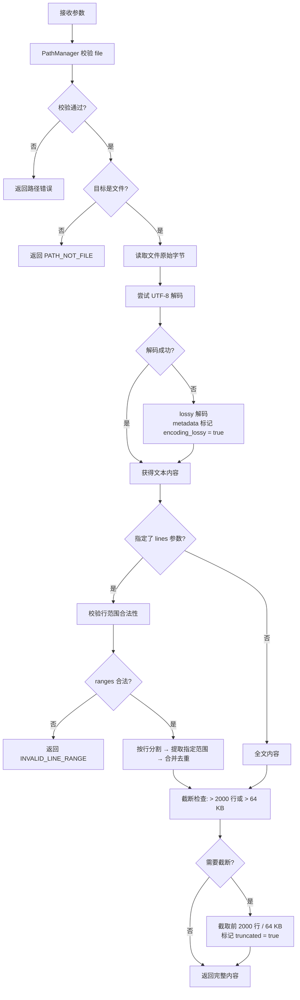

**关键实现细节**

- 文件大小预检：若文件大于 **10 MB**，在未指定 lines 参数时拒绝读取全文，返回提示信息建议指定行范围
- 行范围合并算法：将所有 ranges 按 start 排序，相邻或重叠的区间合并为一个
- 二进制文件检测：对文件进行三点采样检测 NUL 字节（`\0`）——头部 8192 字节、中部 8192 字节（从文件大小 / 2 位置开始）、尾部 8192 字节（从文件末尾回退 8192 字节）。任一采样区域包含 NUL 字节则判定为二进制文件，返回提示信息而非内容。文件小于 24576 字节时全文检测
- 行号从 1 开始计数，与用户直觉一致
- 若指定的行范围超出文件实际行数，返回实际可读取的部分，不报错

### 3.5 错误处理

| 场景                       | 错误码            | 说明                                     |
| :------------------------- | :---------------- | :--------------------------------------- |
| file 路径越界              | PATH_OUTSIDE_ROOT | 路径校验不通过                           |
| file 不存在                | PATH_NOT_FOUND    | 目标文件不存在                           |
| file 是目录                | PATH_NOT_FILE     | 目标不是文件                             |
| start > end 或 start ≤ 0  | INVALID_LINE_RANGE | 行范围非法                               |
| 文件无读取权限             | PERMISSION_DENIED | 操作系统拒绝读取                         |
| 文件为二进制               | —                 | success: true，content 返回提示信息       |
| 文件超过 10 MB 且未指定行范围 | —              | success: true，content 返回提示信息       |

---

## 4. search_content 详细设计

### 4.1 功能描述

在文件内容中搜索匹配指定正则表达式的文本行。支持多关键字 OR 组合搜索、文件类型过滤和路径排除。

### 4.2 输入参数

| 参数               | 类型     | 必选 | 默认值 | 说明                                                                   |
| :----------------- | :------- | :--- | :----- | :--------------------------------------------------------------------- |
| pattern            | String   | 是   | —      | 正则表达式，支持 `\|` 表示 OR（如 `"boolean\|validate\|parameter"`）    |
| file_pattern       | String   | 否   | null   | 文件名 glob 过滤（如 `"*.java"`），null 表示搜索所有文本文件           |
| exclude_paths      | String[] | 否   | []     | 排除路径列表，支持 glob 模式（如 `["opensource/*", "vendor/*"]`）       |
| exclude_test_files | bool     | 否   | true   | 是否排除测试文件（规则同 search_files）                                |
| context_lines      | int      | 否   | 0      | 每个匹配行前后各包含的上下文行数（0-5），0 表示不包含上下文             |

> **扩展性说明**：`context_lines` 参数为详细设计层面的能力扩展，架构文档第三章工具表中未定义此参数。当设为 0（默认）时，行为与架构文档中定义的 search_content 完全一致，不影响兼容性。

### 4.3 输出结构

| 字段      | 类型     | 说明                                  |
| :-------- | :------- | :------------------------------------ |
| success   | bool     | 是否成功                              |
| matches   | Match[]  | 匹配结果数组                          |
| truncated | bool     | 结果是否被截断（超过 500 条时截断）    |

**Match 结构**

| 字段           | 类型           | 说明                                                     |
| :------------- | :------------- | :------------------------------------------------------- |
| file           | String         | 匹配文件的相对路径                                       |
| line           | int            | 匹配行号（从 1 开始）                                    |
| content        | String         | 匹配行的完整文本内容（已 trim）                           |
| context_before | Option\<String[]> | 匹配行之前的上下文行（仅 context_lines > 0 时有值）    |
| context_after  | Option\<String[]> | 匹配行之后的上下文行（仅 context_lines > 0 时有值）    |

**输出 JSON 示例**（context_lines = 2）

```json
{
  "success": true,
  "matches": [
    {
      "file": "src/validation/BooleanValidator.java",
      "line": 42,
      "content": "if (required && value == null) {",
      "context_before": [
        "    public void validate(Object value) {",
        "        // check required constraint"
      ],
      "context_after": [
        "            throw new ValidationException(\"required\");",
        "        }"
      ]
    }
  ],
  "truncated": false
}
```

**上下文行处理规则**

- 当 `context_lines = 0`（默认）时，`context_before` 和 `context_after` 字段不出现在输出中，保持与原有行为完全兼容
- `context_lines` 上限为 5，超过 5 自动截为 5
- 文件首行的 `context_before` 和文件末行的 `context_after` 可能少于请求的行数
- 相邻匹配行的上下文可能重叠，各自独立返回（不做去重合并），以保持每条 match 的自包含性
- 上下文行会增加输出体积，截断条件（总 500 条 match）按匹配行计数，不按上下文行计数

### 4.4 处理流程

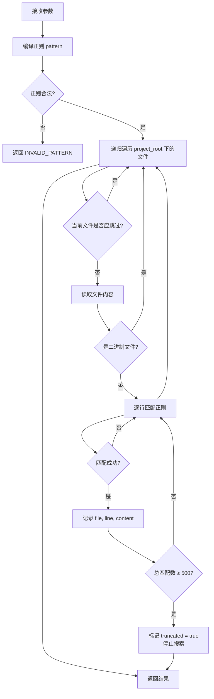

**文件跳过判定逻辑**（判定顺序）

- 路径在默认跳过目录列表中（`.git/`、`node_modules/`、`target/` 等）
- 路径匹配 exclude_paths 中的任一 glob 模式
- 文件名不匹配 file_pattern（若指定）
- exclude_test_files 为 true 且文件为测试文件
- 文件大小超过 **5 MB**（大文件跳过，避免性能问题）

**关键实现细节**

- 使用 `regex` crate 编译正则表达式，编译一次复用
- `\|` 在正则中天然表示 OR 语义，无需特殊处理
- 二进制文件检测同 read_file（三点采样：头部、中部、尾部各 8192 字节，含 NUL 则跳过）
- 匹配结果按 file 路径字典序排列，同一文件内按行号升序
- 每个文件单独计算匹配，单文件出现编码或权限错误时跳过该文件，不中断整体搜索

### 4.5 错误处理

| 场景               | 错误码          | 说明                                 |
| :----------------- | :-------------- | :----------------------------------- |
| 正则语法错误       | INVALID_PATTERN | 如未闭合的括号、非法量词             |
| 部分文件无权限     | —               | 跳过该文件，不中断搜索               |
| 部分文件编码异常   | —               | lossy 解码后继续搜索                 |
| 无任何匹配         | —               | 返回空 matches 数组，success = true  |

---

## 5. list_dir 详细设计

### 5.1 功能描述

列出指定目录的直接子项（不递归），返回每个子项的名称、类型和大小信息。

### 5.2 输入参数

| 参数 | 类型   | 必选 | 默认值 | 说明                         |
| :--- | :----- | :--- | :----- | :--------------------------- |
| path | String | 否   | `"."` | 目录路径，相对于 project_root |

### 5.3 输出结构

| 字段      | 类型   | 说明                                       |
| :-------- | :----- | :----------------------------------------- |
| success   | bool   | 是否成功                                   |
| items     | Item[] | 目录项数组                                 |
| truncated | bool   | 是否被截断（超过 1000 个条目时截断）        |

**Item 结构**

| 字段   | 类型   | 说明                                          |
| :----- | :----- | :-------------------------------------------- |
| name   | String | 条目名称（仅文件名，非完整路径）              |
| is_dir | bool   | 是否为目录                                    |
| size   | u64    | 文件大小（字节），目录时为 0                   |

**输出 JSON 示例**

```json
{
  "success": true,
  "items": [
    {"name": "src", "is_dir": true, "size": 0},
    {"name": "pom.xml", "is_dir": false, "size": 4096},
    {"name": "README.md", "is_dir": false, "size": 1280}
  ],
  "truncated": false
}
```

### 5.4 处理流程

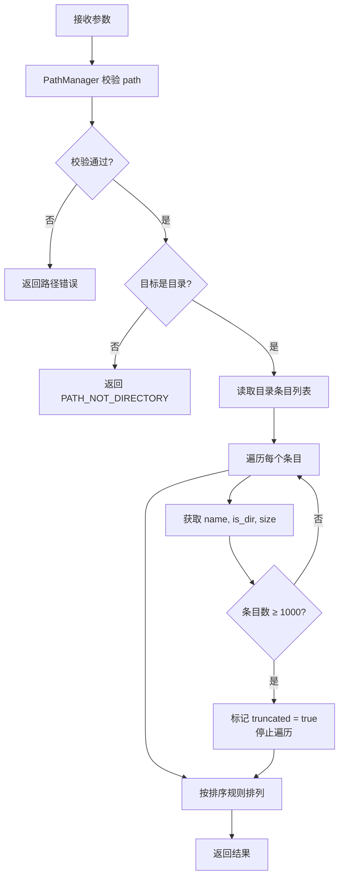

**排序规则**

- 目录在前，文件在后
- 同类型内按名称字典序升序
- 以 `.` 开头的隐藏条目排在同类型末尾

**关键实现细节**

- 仅列出直接子项，不递归进入子目录
- 对于符号链接，跟随链接获取实际类型和大小
- 单个条目读取 metadata 失败时跳过该条目，不中断整体列举
- size 对目录固定返回 0，对文件返回实际字节数

### 5.5 错误处理

| 场景               | 错误码            | 说明                               |
| :----------------- | :---------------- | :--------------------------------- |
| path 路径越界      | PATH_OUTSIDE_ROOT | 路径校验不通过                     |
| path 不存在        | PATH_NOT_FOUND    | 目标目录不存在                     |
| path 是文件        | PATH_NOT_DIRECTORY | 目标不是目录                       |
| 目录无读取权限     | PERMISSION_DENIED | 无法列出目录内容                   |
| 部分条目无权限     | —                 | 跳过该条目，不中断列举             |

---

## 6. file_info 详细设计

### 6.1 功能描述

获取指定文件的元信息，包括文件类型分类、大小、行数统计、代码统计指标和头部注释提取。

### 6.2 输入参数

| 参数 | 类型   | 必选 | 说明                       |
| :--- | :----- | :--- | :------------------------- |
| file | String | 是   | 文件路径，相对于 project_root |

### 6.3 输出结构

| 字段           | 类型           | 说明                                                               |
| :------------- | :------------- | :----------------------------------------------------------------- |
| success        | bool           | 是否成功                                                           |
| path           | String         | 文件相对路径                                                       |
| type           | String         | 文件类型：`"directory"` / `"code"` / `"text"` / `"config"` / `"file"` |
| size           | u64            | 文件大小（字节）                                                   |
| lines          | int            | 文件总行数（二进制文件为 0）                                        |
| stats          | Option\<Stats> | 代码统计（仅 type 为 `"code"` 时有值）                              |
| header_comment | Option\<HeaderComment> | 头部注释信息                                                |

**Stats 结构**

| 字段                   | 类型     | 说明               |
| :--------------------- | :------- | :----------------- |
| lines_of_code          | int      | 有效代码行数       |
| comment_lines          | int      | 注释行数           |
| blank_lines            | int      | 空白行数           |
| top_level_declarations | int      | 顶层声明数         |
| functions              | int      | 函数 / 方法数       |
| imports                | int      | 导入语句数         |

**HeaderComment 结构**

| 字段    | 类型   | 说明                               |
| :------ | :----- | :--------------------------------- |
| present | bool   | 是否存在头部注释                   |
| lines   | int    | 头部注释行数                       |
| content | String | 头部注释内容（截取前 20 行）        |

**Shebang 处理**

file_info 的输出结构中增加可选的 `shebang` 字段：

| 字段    | 类型           | 说明                                                     |
| :------ | :------------- | :------------------------------------------------------- |
| shebang | Option\<String> | 文件首行的 shebang 内容（如 `"#!/usr/bin/env python3"`），非脚本文件为 null |

**文件类型判定规则**

| type         | 判定条件                                                        |
| :----------- | :-------------------------------------------------------------- |
| `"directory"` | 目标路径是目录                                                   |
| `"code"`     | 扩展名属于已知编程语言（.java, .py, .rs, .go, .js, .ts, .c, .cpp, .h, .rb, .php, .swift, .kt, .scala, .cs 等） |
| `"config"`   | 扩展名为 .json, .yaml, .yml, .toml, .xml, .ini, .cfg, .properties, .env |
| `"text"`     | 扩展名为 .md, .txt, .rst, .csv, .log                            |
| `"file"`     | 以上均不匹配时的兜底类型                                         |

### 6.4 处理流程

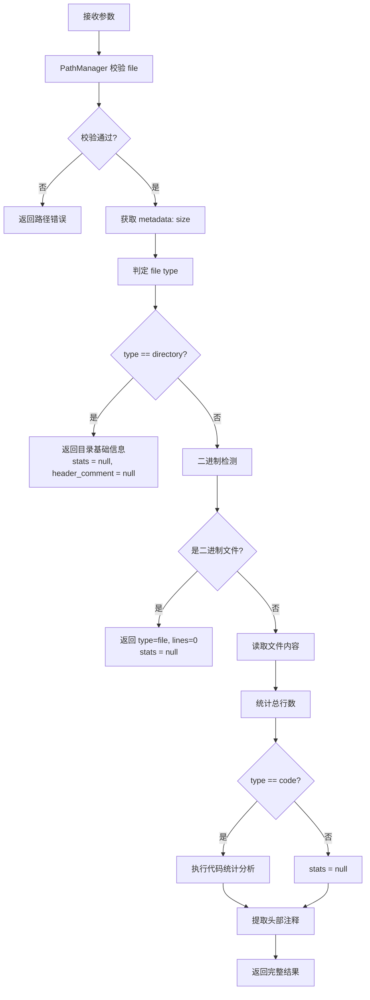

**代码统计分析算法**

代码统计基于逐行状态机分析，处理单行注释和多行注释：

- 维护一个 `in_multiline_comment` 状态标志
- 逐行扫描，每行判定为以下类型之一：blank（空白行）、comment（注释行）、code（代码行）
- 同时识别顶层声明（class、struct、enum、interface、trait、fn、def、function 等关键字开头的行）
- 识别导入语句（import、use、require、from...import、include 等）
- 函数计数通过匹配语言特定的函数声明模式实现

**支持的注释风格**

| 注释风格       | 适用语言                                | 单行标记  | 多行开始 | 多行结束 |
| :------------- | :-------------------------------------- | :-------- | :------- | :------- |
| C-style        | Java, C, C++, Go, Rust, JS, TS, Swift, Kotlin, Scala, C#, PHP | `//`      | `/*`     | `*/`     |
| Hash           | Python, Ruby, Shell, YAML, TOML         | `#`       | —        | —        |
| HTML/XML       | HTML, XML                               | —         | `<!--`   | `-->`    |

**头部注释提取规则**

- **Shebang 预处理**：若文件第 1 行以 `#!` 开头（shebang），将该行记录到 `shebang` 字段，并从第 2 行开始检测头部注释
- 从起始行（第 1 行或 shebang 之后）开始，连续的注释行（或多行注释块）视为头部注释
- 头部注释前允许存在空白行（跳过空白行继续检测）
- 遇到第一行非注释、非空白的内容时终止提取
- 最多提取前 **20 行**的注释内容
- shebang 行本身不计入 header_comment 的行数和内容

### 6.5 错误处理

| 场景           | 错误码            | 说明                                           |
| :------------- | :---------------- | :--------------------------------------------- |
| file 路径越界  | PATH_OUTSIDE_ROOT | 路径校验不通过                                 |
| file 不存在    | PATH_NOT_FOUND    | 目标路径不存在                                 |
| 文件无读取权限 | PERMISSION_DENIED | 无法读取文件 metadata 或内容                   |
| 文件编码异常   | —                 | lossy 解码后继续统计，metadata 标记 encoding_lossy |

---

## 7. execute_shell 详细设计

### 7.1 功能描述

兜底工具，允许执行**受限的只读 Shell 命令**。当前 5 个结构化工具无法满足探索需求时使用。通过三层安全机制（命令白名单、危险操作符拦截、执行环境隔离）保证安全性。

**核心命令执行逻辑使用 C 语言实现**，通过 Rust FFI 调用。选择 C 的理由：

- 需要直接操作系统级进程创建 API（`fork`/`exec` 或 `CreateProcess`）
- 需要精确控制子进程的执行环境（工作目录、环境变量、资源限制）
- 需要跨平台条件编译处理 Unix 与 Windows 差异

### 7.2 输入参数

| 参数          | 类型     | 必选 | 默认值 | 说明                                                                       |
| :------------ | :------- | :--- | :----- | :------------------------------------------------------------------------- |
| command       | String   | 是   | —      | 要执行的 Shell 命令                                                         |
| working_dir   | String   | 否   | `"."` | 命令执行目录，相对于 project_root                                           |
| exclude_paths | String[] | 否   | []     | 排除路径列表，支持 glob 模式。对支持排除参数的命令（grep、find）自动注入排除选项 |

**exclude_paths 的自动注入机制**

当 `exclude_paths` 不为空时，C 层在构造最终命令前，根据主命令类型自动追加排除参数：

| 主命令         | 注入方式                                                     | 示例                                         |
| :------------- | :----------------------------------------------------------- | :------------------------------------------- |
| `grep` / `egrep` / `fgrep` | 为每个 path 追加 `--exclude-dir=<path>` 参数                  | `grep --exclude-dir=vendor --exclude-dir=opensource -rn pattern src/` |
| `find`         | 为每个 path 追加 `-not -path './<path>'` 条件                 | `find src -not -path './vendor/*' -name '*.java'` |
| 其他命令       | 忽略 exclude_paths 参数，不做任何注入（记录 debug 日志）       | —                                            |

**设计考虑**

- 该机制使 AI 在使用 execute_shell 时具有与 search_content 一致的排除能力，无需学习每种 Shell 命令的排除语法
- 注入在安全检查之后、命令执行之前进行，注入后的完整命令仍需通过危险操作符检查
- Windows 平台上 `findstr` 不支持目录排除，此时 exclude_paths 被忽略（记录 warning 日志）

### 7.3 输出结构

| 字段    | 类型           | 说明                                     |
| :------ | :------------- | :--------------------------------------- |
| success | bool           | 命令是否成功执行（exit code == 0）        |
| output  | String         | 命令的标准输出内容。C 层截断至 50KB；Rust 层二次截断至 2000 行。取先到达者，超出丢弃 |
| truncated | bool         | 输出是否被截断 |
| error   | Option\<String> | 错误信息（安全拒绝时为拒绝原因，执行失败时为 stderr） |

### 7.4 三层安全机制

#### 第一层：命令白名单

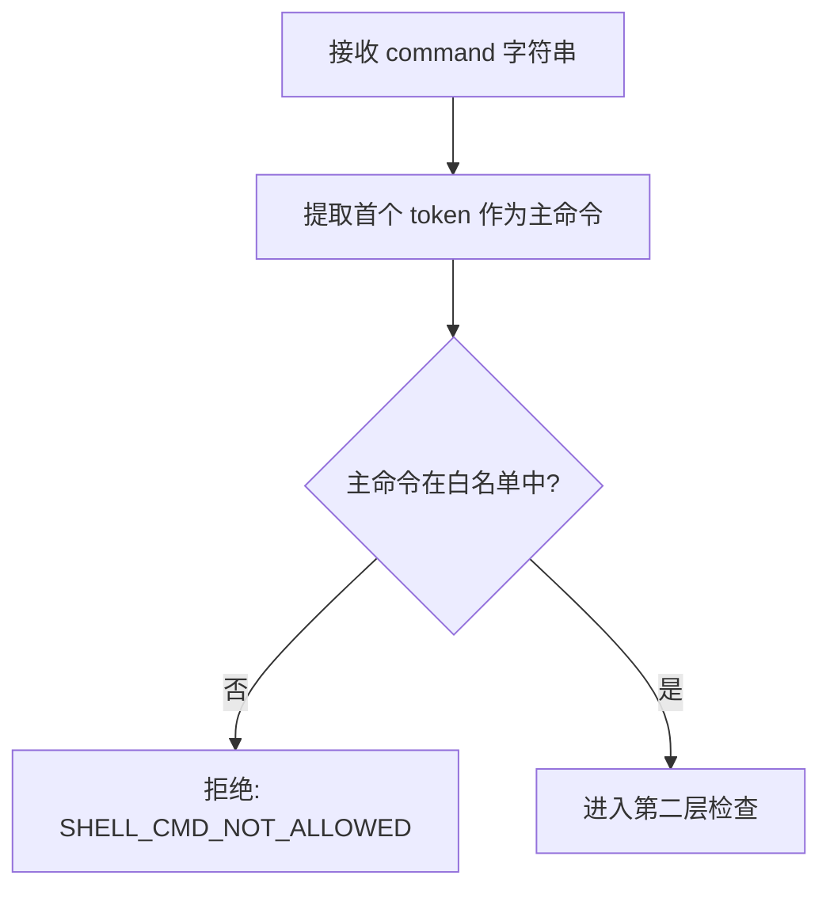

**白名单命令清单**

| 类别           | 允许的命令                         |
| :------------- | :--------------------------------- |
| 文件查看       | `cat`, `head`, `tail`, `less`      |
| 文件搜索       | `grep`, `egrep`, `fgrep`, `find`   |
| 目录浏览       | `ls`, `tree`                       |
| 统计与处理     | `wc`, `sort`, `uniq`, `cut`, `tr`  |
| 文本处理（只读）| `awk`, `sed`                       |
| 文件信息       | `file`, `stat`                     |

**sed 特殊处理**：当主命令为 `sed` 时，额外检查是否包含 `-i` 参数（原地修改），若包含则拒绝。

**Windows 平台命令映射**

| Unix 命令  | Windows 等效命令                     | 说明                       |
| :--------- | :----------------------------------- | :------------------------- |
| `cat`      | `type`                               | 文件内容查看               |
| `ls`       | `dir`                                | 目录列举                   |
| `grep`     | `findstr`                            | 文本搜索                   |
| `find`     | `dir /s /b` + 过滤                   | 文件查找                   |
| `head`     | `powershell -c "Get-Content -Head"`  | 取文件前 N 行              |
| `tail`     | `powershell -c "Get-Content -Tail"`  | 取文件后 N 行              |
| `wc`       | `powershell -c "Measure-Object"`     | 统计行数 / 字数             |
| `stat`     | `powershell -c "Get-Item"`           | 文件信息                   |
| `tree`     | `tree`                               | 原生支持                   |
| `sort`     | `sort`                               | 原生支持                   |

> **设计决策**：Windows 上不做自动命令翻译，而是将 Unix 命令和 Windows 等效命令分别加入白名单。AI 调用方根据平台选择正确的命令。若调用了当前平台不支持的命令，执行失败后由 AI 自行调整。

#### 第二层：危险操作符拦截

```mermaid
flowchart TD
    A[通过白名单检查的 command] --> B[扫描危险模式]
    B --> C{包含输出重定向?<br/>>, >>, tee}
    C -- 是 --> D[拒绝: SHELL_DANGEROUS_OPERATOR]
    C -- 否 --> E{包含命令替换?<br/>$(...) 或 反引号}
    E -- 是 --> D
    E -- 否 --> F{包含命令分隔符?<br/>; && || &}
    F -- 是 --> G{是管道 | ?}
    F -- 否 --> H[进入管道检查]
    G -- 否 --> D
    G -- 是 --> H
    H --> I{command 包含管道 | ?}
    I -- 否 --> J[通过 ✓ 进入第三层]
    I -- 是 --> K[提取管道后每段的主命令]
    K --> L{每段主命令均在白名单中?}
    L -- 否 --> D
    L -- 是 --> M[对每段重复危险操作符检查]
    M --> J
```

**危险模式完整清单**

| 模式              | 检测方式   | 说明                         |
| :---------------- | :--------- | :--------------------------- |
| `>`, `>>`         | 字符串扫描 | 输出重定向                   |
| `tee`             | token 匹配 | 可写入文件                   |
| `$(`...`)`        | 正则匹配   | 命令替换                     |
| 反引号 `` ` ``    | 字符扫描   | 命令替换（旧语法）           |
| `;`               | 字符扫描   | 命令分隔符                   |
| `&&`              | 字符串扫描 | 逻辑与链接                   |
| `\|\|`            | 字符串扫描 | 逻辑或链接                   |
| `&`（单独出现）    | 正则匹配   | 后台执行                     |
| `system(`, `exec(` | 字符串扫描 | awk 等工具中的系统调用       |

#### 第三层：执行环境隔离

| 隔离措施             | Unix 实现                              | Windows 实现                                 |
| :------------------- | :------------------------------------- | :------------------------------------------- |
| 工作目录锁定         | `chdir` 到校验后的 working_dir          | `SetCurrentDirectory` 或 `CreateProcess` 的 lpCurrentDirectory |
| 执行超时             | `alarm(30)` 或 `waitpid` + `WNOHANG` 轮询 | `WaitForSingleObject` 超时后 `TerminateProcess` |
| 输出截断             | 读取管道时计数，超过 50KB 停止读取（C 层）；Rust 层二次截断至 2000 行   | 同左                                          |
| 环境变量清理         | 仅保留 `PATH`、`HOME`、`LANG`          | 仅保留 `PATH`、`USERPROFILE`、`SystemRoot`    |

#### Shell 自动发现

**v1.3 更新**：Shell 自动发现，按能力排序，规则如下：

| 优先级 | 检测方式 | 说明 |
|:---|:---|:---|
| 1 | 硬编码 `C:\Program Files\Git\bin\bash.exe`、`C:\msys64\usr\bin\bash.exe` | Git Bash 完整安装，包含 grep/awk/sed 等完整 Unix 工具链 |
| 2 | 通过 `git.exe` 位置反推 `../bin/bash.exe` | 借鉴 OpenCode 的 gitbash() 逻辑，兼容非标准路径安装 |
| 3 | PATH 扫描：优先 `bin/bash`，跳过 `usr\bin\bash` | `usr\bin\bash` 不含 grep/awk，不纳入可用 bash |
| 4 | `pwsh.exe` → `powershell.exe` | PowerShell 备选 |
| 5 | `cmd.exe` / `/bin/sh` | 兜底 |

```mermaid
flowchart TD
    A[启动] --> B{平台?}
    B -- Windows --> C[硬编码路径检查]
    C -- 找到 --> D[使用 bash]
    C -- 未找到 --> E[通过 git.exe 推导]
    E -- 找到 --> D
    E -- 未找到 --> F[PATH 扫描: 跳过 usr\bin\bash]
    F -- 找到 bin/bash --> D
    F -- 未找到 --> G[尝试 pwsh]
    G -- 找到 --> H[使用 pwsh]
    G -- 未找到 --> I[使用 cmd.exe]
    B -- Unix --> J[/bin/bash → /bin/zsh → /bin/sh]
    J --> K[使用找到的 shell]
```

> **设计决策**：与 OpenCode 一致，bash 优先（代码探索依赖 Unix 工具链）。Shell 检测结果通过 `MainAgent::shell_info()` 和 `MainAgent::shell_commands()` 注入 Prompt，LLM 被告知当前 Shell 类型及可用命令白名单。`shell_info()` 和 `discover_shell()` 共用 `has_usable_bash()` 函数保证一致性。

### 7.5 C 层接口设计

**C 头文件定义的主要函数**

| 函数                 | 参数                                        | 返回值               | 说明                               |
| :------------------- | :------------------------------------------ | :------------------- | :--------------------------------- |
| `shell_execute`      | command (char\*), working_dir (char\*), timeout_sec (int), max_output_bytes (size_t), shell_path (char\*) | ShellResult 结构体   | 主入口：安全检查 + 管道非阻塞执行   |
| `whitelist_check`    | command (char\*)                             | int (0=通过, 非0=拒绝) | 白名单校验                         |
| `operator_check`     | command (char\*)                             | int (0=通过, 非0=拒绝) | **v1.3 引号感知**：跳过单/双引号内字符，仅检测引号外的危险操作符。Rust 层 `ShellSecurity::check_dangerous_operators` 同步实现。`system(` / `exec(` 全局拦截（即使在引号内，因其通过 awk system() 绕过白名单） |
| `shell_result_free`  | ShellResult\*                                | void                 | 释放 ShellResult 中的动态内存      |

**ShellResult 结构体**

| 字段           | 类型   | 说明                                          |
| :------------- | :----- | :-------------------------------------------- |
| success        | int    | 1=成功, 0=失败                                 |
| output         | char\* | 命令输出（堆分配，调用方需通过 shell_result_free 释放） |
| output_len     | size_t | output 的实际字节长度                           |
| output_truncated | int  | 1=输出因超过 max_output_bytes 被截断, 0=完整输出 |
| error          | char\* | 错误信息（堆分配）                              |
| error_code     | int    | 内部错误码：0=成功, 1=白名单拒绝, 2=操作符拒绝, 3=执行失败, 4=超时 |
| exit_code      | int    | 子进程退出码（仅 success=1 时有意义）            |

### 7.6 管道非阻塞读取与进程控制

`shell_execute` 内部**不使用** `popen()` 或 `system()`，而是通过底层进程 API 精确控制子进程的生命周期和输出读取。

**Unix 实现流程**

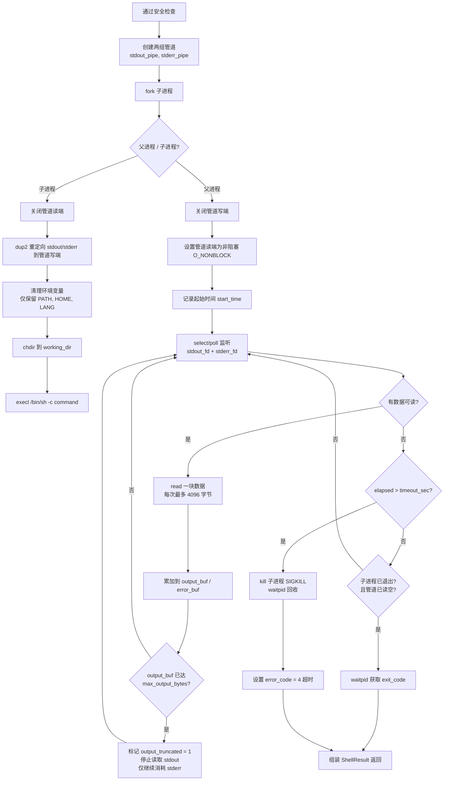

**关键实现要点**

- **管道非阻塞**：父进程通过 `fcntl(fd, F_SETFL, O_NONBLOCK)` 设置管道为非阻塞模式，避免 `read()` 永久阻塞
- **select/poll 超时控制**：每次 `select()` 的超时参数为 `timeout_sec - elapsed`（剩余时间），精确控制总耗时
- **输出截断在管道层面实施（C 层）**：当 `output_buf` 累计达到 `max_output_bytes`（50KB）时，停止追加数据，丢弃超出部分，但仍继续从管道中 `read()`（防止子进程因管道写满而阻塞）。2000 行截断由 Rust 层在 FFI 返回后按换行符计数二次裁剪。
- **子进程回收**：无论正常退出还是超时 kill，父进程必须调用 `waitpid()` 回收子进程，避免僵尸进程
- **SIGKILL 而非 SIGTERM**：超时终止时直接使用 `SIGKILL`，因为 Shell 命令可能忽略 `SIGTERM`

**Windows 实现流程**

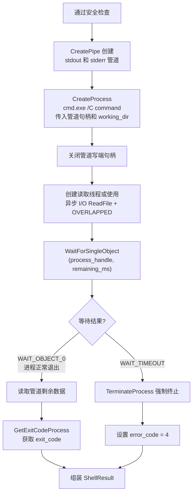

**Windows 关键差异**

- 使用 `CreatePipe` + `CreateProcess` 替代 `pipe` + `fork` + `exec`
- 管道读取使用异步 I/O（`OVERLAPPED` 结构 + `ReadFile`），或在独立线程中读取并主线程 `WaitForSingleObject` 超时控制
- 输出截断逻辑与 Unix 一致：累计读取量达到 `max_output_bytes` 后停止追加，继续消耗管道数据
- 超时后使用 `TerminateProcess` 强制终止（等价于 Unix 的 `SIGKILL`）

### 7.7 FFI 绑定设计

**Rust 侧 FFI 封装层职责**

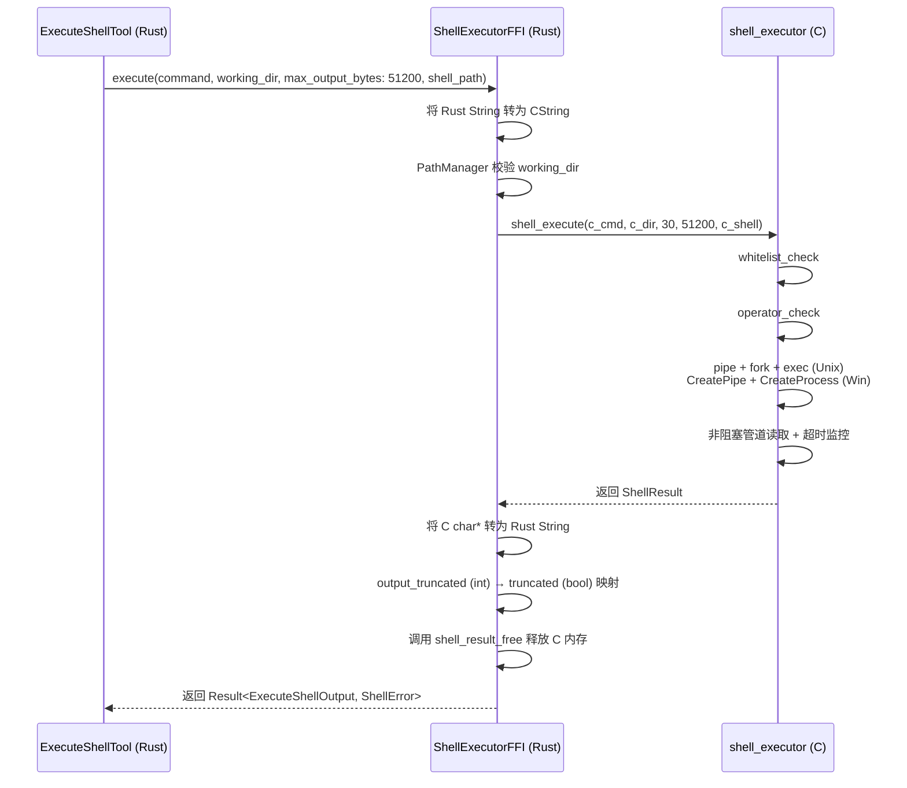

**内存安全保证**

- Rust 侧使用 CString 确保传入 C 的字符串以 NUL 结尾
- C 侧返回的 output 和 error 均为堆分配，Rust 侧读取后立即调用 `shell_result_free` 释放
- FFI 函数标记为 `unsafe`，封装在安全的 Rust 函数中，外部调用者无需接触 unsafe
- `max_output_bytes` 参数由 Rust 侧传入，确保 C 层的输出缓冲上限由调用方控制。Rust 侧将 C 层的 `output_truncated`（int）映射为 JSON 的 `truncated`（bool）

### 7.7 execute_shell 整体处理流程

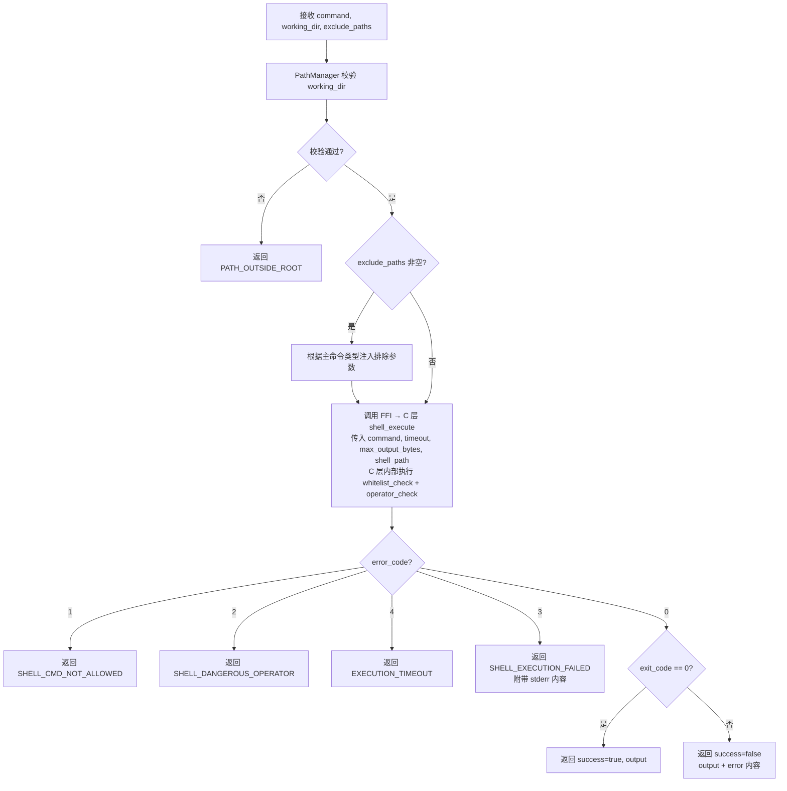

### 7.8 错误处理

| 场景                         | 错误码                   | 说明                           |
| :--------------------------- | :----------------------- | :----------------------------- |
| working_dir 路径越界         | PATH_OUTSIDE_ROOT        | 路径校验不通过                 |
| working_dir 不存在           | PATH_NOT_FOUND           | 工作目录不存在                 |
| 命令不在白名单               | SHELL_CMD_NOT_ALLOWED    | 第一层安全检查拒绝             |
| 命令包含危险操作符           | SHELL_DANGEROUS_OPERATOR | 第二层安全检查拒绝             |
| 命令执行超时                 | EXECUTION_TIMEOUT        | 超过 120 秒强制终止             |
| 命令执行失败（非零退出码）    | SHELL_EXECUTION_FAILED   | 子进程异常退出                 |

---

## 8. 自动化测试用例

> 所有自动化测试使用 Rust 内置测试框架（`#[cfg(test)]`）。测试前统一创建临时目录作为 project_root，测试后自动清理。

### 8.1 测试夹具（Test Fixture）设计

所有测试共享一套**标准测试文件集**，在每个测试模块的 setup 阶段自动生成于临时目录中。

**标准测试目录结构**

```
temp_project/
├── src/
│   ├── main.rs                     # Rust 代码文件，30 行
│   ├── lib.rs                      # Rust 代码文件，50 行，含头部注释
│   └── utils/
│       ├── helper.py               # Python 文件，20 行
│       └── config.yaml             # YAML 配置文件
├── tests/
│   ├── test_main.rs                # 测试文件
│   └── integration_test.java       # Java 测试文件
├── docs/
│   └── readme.md                   # 文档文件
├── .git/
│   └── config                      # 模拟 .git 目录
├── node_modules/
│   └── fake_module/
│       └── index.js                # 应被跳过的文件
├── empty_dir/                      # 空目录
├── binary_file.bin                 # 二进制文件（含 NUL 字节）
├── large_file.txt                  # 大文件（> 10 MB，由重复行填充）
├── gbk_file.txt                    # GBK 编码文件（仅 Windows 测试集）
├── special chars dir/              # 含空格的目录名
│   └── file with spaces.txt        # 含空格的文件名
└── .hidden_file                    # 隐藏文件
```

### 8.2 search_files 测试用例

| 用例编号 | 测试场景 | 输入参数 | 预期结果 |
| :------- | :------- | :------- | :------- |
| SF-001 | 基本 glob 匹配 | `pattern: "**/*.rs"`, `path: "."` | files 包含 `src/main.rs`, `src/lib.rs`；不包含 tests 下的 .rs 文件（默认排除测试） |
| SF-002 | 指定子目录搜索 | `pattern: "*.py"`, `path: "src/utils"` | files 包含 `src/utils/helper.py` |
| SF-003 | 排除测试文件（默认行为） | `pattern: "**/*.rs"`, `exclude_test_files: true` | files 不包含 `tests/test_main.rs` |
| SF-004 | 不排除测试文件 | `pattern: "**/*.rs"`, `exclude_test_files: false` | files 包含 `tests/test_main.rs` |
| SF-005 | 无匹配结果 | `pattern: "**/*.xyz"` | files 为空数组，success = true |
| SF-006 | 跳过 .git 目录 | `pattern: "**/*"` | files 不包含任何 `.git/` 下的文件 |
| SF-007 | 跳过 node_modules | `pattern: "**/*.js"` | files 不包含 `node_modules/` 下的文件 |
| SF-008 | 非法 glob 语法 | `pattern: "**/*.rs["` | 返回 INVALID_PATTERN 错误 |
| SF-009 | path 路径穿越 | `pattern: "*.rs"`, `path: "../../etc"` | 返回 PATH_OUTSIDE_ROOT 错误 |
| SF-010 | path 不存在 | `pattern: "*.rs"`, `path: "nonexistent"` | 返回 PATH_NOT_FOUND 错误 |
| SF-011 | path 是文件非目录 | `pattern: "*.rs"`, `path: "src/main.rs"` | 返回 PATH_NOT_DIRECTORY 错误 |
| SF-012 | 结果截断（超过 1000 条） | 生成 1200 个 .txt 文件，`pattern: "**/*.txt"` | files 长度 = 1000，truncated = true |
| SF-013 | 空目录搜索 | `pattern: "**/*"`, `path: "empty_dir"` | files 为空数组 |
| SF-014 | 含空格的路径 | `pattern: "*.txt"`, `path: "special chars dir"` | files 包含 `special chars dir/file with spaces.txt` |
| SF-015 | 默认 path 参数 | `pattern: "**/*.rs"`（不传 path） | 从 project_root 搜索，行为与 `path: "."` 一致 |

### 8.3 read_file 测试用例

| 用例编号 | 测试场景 | 输入参数 | 预期结果 |
| :------- | :------- | :------- | :------- |
| RF-001 | 读取完整文件 | `file: "src/main.rs"` | content 包含完整文件内容，lines = "all" |
| RF-002 | 读取指定行范围 | `file: "src/lib.rs"`, `lines: {"ranges": [[10, 20]]}` | content 为第 10-20 行，lines = "10-20" |
| RF-003 | 多个行范围 | `file: "src/lib.rs"`, `lines: {"ranges": [[1, 5], [10, 15]]}` | content 包含第 1-5 行和第 10-15 行，lines = "1-5,10-15" |
| RF-004 | 重叠行范围合并 | `file: "src/lib.rs"`, `lines: {"ranges": [[1, 10], [5, 15]]}` | 实际返回第 1-15 行，lines = "1-15" |
| RF-005 | 行范围超出文件实际行数 | `file: "src/main.rs"`(30行), `lines: {"ranges": [[25, 50]]}` | 返回第 25-30 行，不报错 |
| RF-006 | start > end | `file: "src/main.rs"`, `lines: {"ranges": [[20, 10]]}` | 返回 INVALID_LINE_RANGE 错误 |
| RF-007 | start ≤ 0 | `file: "src/main.rs"`, `lines: {"ranges": [[0, 5]]}` | 返回 INVALID_LINE_RANGE 错误 |
| RF-008 | 文件不存在 | `file: "nonexistent.rs"` | 返回 PATH_NOT_FOUND 错误 |
| RF-009 | 目标是目录 | `file: "src"` | 返回 PATH_NOT_FILE 错误 |
| RF-010 | 路径穿越 | `file: "../../../etc/passwd"` | 返回 PATH_OUTSIDE_ROOT 错误 |
| RF-011 | 二进制文件检测 | `file: "binary_file.bin"` | success = true，content 为提示信息（非实际二进制内容） |
| RF-012 | 大文件无行范围限制 | `file: "large_file.txt"`（不传 lines） | success = true，content 为提示信息建议指定行范围 |
| RF-013 | 大文件指定行范围 | `file: "large_file.txt"`, `lines: {"ranges": [[1, 100]]}` | 正常返回前 100 行 |
| RF-014 | 超过 2000 行截断 | 创建 3000 行文件，`file: "huge.txt"` | content 包含前 2000 行，truncated = true |
| RF-015 | 空文件 | 创建 0 字节文件，`file: "empty.txt"` | success = true，content = ""，lines = "all" |
| RF-016 | 含空格路径 | `file: "special chars dir/file with spaces.txt"` | 正常返回文件内容 |
| RF-017 | 非 UTF-8 编码（lossy） | `file: "gbk_file.txt"` | success = true，content 为 lossy 解码结果，metadata 含 encoding_lossy 标记 |
| RF-018 | lines 字符串格式 | `file: "src/lib.rs"`, `lines: "10-20"` | 等价于 `lines: {"ranges": [[10, 20]]}`，content 为第 10-20 行 |
| RF-019 | lines 字符串格式多范围 | `file: "src/lib.rs"`, `lines: "1-5,10-15"` | 等价于 `lines: {"ranges": [[1, 5], [10, 15]]}`，content 包含两段 |

### 8.4 search_content 测试用例

| 用例编号 | 测试场景 | 输入参数 | 预期结果 |
| :------- | :------- | :------- | :------- |
| SC-001 | 基本关键词搜索 | `pattern: "fn main"` | matches 包含 `src/main.rs` 中匹配行 |
| SC-002 | 正则表达式搜索 | `pattern: "fn\\s+\\w+"` | matches 匹配所有函数定义行 |
| SC-003 | 多关键词 OR 搜索 | `pattern: "import\|use\|require"` | matches 包含所有导入语句 |
| SC-004 | 指定 file_pattern | `pattern: "def"`, `file_pattern: "*.py"` | 仅在 .py 文件中搜索 |
| SC-005 | exclude_paths 排除 | `pattern: "config"`, `exclude_paths: ["docs/*"]` | matches 不包含 docs/ 下的匹配 |
| SC-006 | 排除测试文件 | `pattern: "assert"`, `exclude_test_files: true` | matches 不包含 tests/ 下的文件 |
| SC-007 | 不排除测试文件 | `pattern: "assert"`, `exclude_test_files: false` | matches 包含 tests/ 下的文件 |
| SC-008 | 无匹配结果 | `pattern: "zzz_nonexistent_pattern"` | matches 为空数组，success = true |
| SC-009 | 跳过二进制文件 | `pattern: ".*"` | matches 不包含 binary_file.bin |
| SC-010 | 跳过 .git 目录 | `pattern: ".*"` | matches 不包含 .git/ 下的文件 |
| SC-011 | 非法正则语法 | `pattern: "(unclosed"` | 返回 INVALID_PATTERN 错误 |
| SC-012 | 结果截断（超过 500 条） | 创建大量匹配文件 | matches 长度 = 500，truncated = true |
| SC-013 | 大小写敏感匹配 | `pattern: "Main"`（Linux）或 `pattern: "main"`（不区分大小写验证） | 仅匹配大小写完全一致的内容 |
| SC-014 | 跳过 > 5 MB 文件 | 确保 large_file.txt > 5 MB | matches 不包含 large_file.txt |
| SC-015 | 多 exclude_paths | `pattern: "config"`, `exclude_paths: ["docs/*", "node_modules/*"]` | 两个路径下的文件均被排除 |
| SC-016 | context_lines 基本功能 | `pattern: "fn main"`, `context_lines: 2` | 每条 match 包含 context_before（前 2 行）和 context_after（后 2 行） |
| SC-017 | context_lines = 0（默认） | `pattern: "fn main"` | match 中不包含 context_before 和 context_after 字段 |
| SC-018 | context_lines 超上限 | `pattern: "fn main"`, `context_lines: 10` | 自动截为 5，返回前后各 5 行上下文 |
| SC-019 | 文件首行匹配的上下文 | `pattern` 匹配文件第 1 行, `context_lines: 3` | context_before 为空数组或少于 3 行 |

### 8.5 list_dir 测试用例

| 用例编号 | 测试场景 | 输入参数 | 预期结果 |
| :------- | :------- | :------- | :------- |
| LD-001 | 列出根目录 | `path: "."` | items 包含 src, tests, docs 等，目录在前文件在后 |
| LD-002 | 列出子目录 | `path: "src"` | items 包含 main.rs, lib.rs, utils/ |
| LD-003 | 空目录 | `path: "empty_dir"` | items 为空数组，success = true |
| LD-004 | 排序验证：目录在前 | `path: "."` | items 中所有 is_dir=true 的条目排在 is_dir=false 之前 |
| LD-005 | 文件大小正确 | `path: "src"` | 各文件的 size 与实际字节数一致，目录的 size = 0 |
| LD-006 | 路径穿越 | `path: "../../"` | 返回 PATH_OUTSIDE_ROOT 错误 |
| LD-007 | 路径不存在 | `path: "nonexistent"` | 返回 PATH_NOT_FOUND 错误 |
| LD-008 | 路径是文件 | `path: "src/main.rs"` | 返回 PATH_NOT_DIRECTORY 错误 |
| LD-009 | 不递归（仅直接子项） | `path: "src"` | items 不包含 `src/utils/helper.py`（在子目录中） |
| LD-010 | 含空格路径 | `path: "special chars dir"` | 正常返回该目录下的文件列表 |
| LD-011 | 隐藏文件包含在结果中 | `path: "."` | items 包含 `.hidden_file` |
| LD-012 | 截断测试 | 创建含 1200 条目的目录 | items 长度 = 1000，truncated = true |
| LD-013 | 默认 path 参数 | 不传 path | 等价于 `path: "."`，列出 project_root |

### 8.6 file_info 测试用例

| 用例编号 | 测试场景 | 输入参数 | 预期结果 |
| :------- | :------- | :------- | :------- |
| FI-001 | 代码文件基本信息 | `file: "src/main.rs"` | type = "code"，size > 0，lines = 30 |
| FI-002 | 代码统计准确性 | `file: "src/lib.rs"`（预设内容：含 5 空行、3 注释行、42 代码行） | stats.blank_lines = 5, stats.comment_lines = 3, stats.lines_of_code = 42 |
| FI-003 | 配置文件识别 | `file: "src/utils/config.yaml"` | type = "config"，stats = null |
| FI-004 | 文本文件识别 | `file: "docs/readme.md"` | type = "text"，stats = null |
| FI-005 | 目录类型 | `file: "src"` | type = "directory"，stats = null，header_comment = null |
| FI-006 | 二进制文件 | `file: "binary_file.bin"` | type = "file"，lines = 0，stats = null |
| FI-007 | 头部注释提取（存在） | `file: "src/lib.rs"`（预设前 5 行为 `//` 注释） | header_comment.present = true，header_comment.lines = 5 |
| FI-008 | 头部注释提取（不存在） | `file: "src/main.rs"`（预设第 1 行直接是代码） | header_comment.present = false |
| FI-009 | Python 注释风格 | `file: "src/utils/helper.py"`（预设 `#` 注释） | stats.comment_lines 正确统计 `#` 注释 |
| FI-010 | import 语句计数 | `file: "src/lib.rs"`（预设含 use 语句） | stats.imports 数量正确 |
| FI-011 | 函数计数 | `file: "src/main.rs"`（预设含 fn 声明） | stats.functions 数量正确 |
| FI-012 | 文件不存在 | `file: "nonexistent.rs"` | 返回 PATH_NOT_FOUND 错误 |
| FI-013 | 路径穿越 | `file: "../../../etc/passwd"` | 返回 PATH_OUTSIDE_ROOT 错误 |
| FI-014 | 未知扩展名文件 | `file: ".hidden_file"` | type = "file" |
| FI-015 | 头部注释截取上限 | 创建前 30 行均为注释的文件 | header_comment.lines = 20（截取前 20 行） |
| FI-016 | 多行注释块 | 创建含 `/* ... */` 的 Java 文件 | stats.comment_lines 正确统计多行注释 |
| FI-017 | Shebang 文件头部注释 | 创建 Python 文件：第 1 行 `#!/usr/bin/env python3`，第 2-4 行 `#` 注释 | shebang = `"#!/usr/bin/env python3"`，header_comment.present = true，header_comment.lines = 3（不含 shebang） |
| FI-018 | Shebang 无后续注释 | 创建 Shell 文件：第 1 行 `#!/bin/bash`，第 2 行直接是代码 | shebang = `"#!/bin/bash"`，header_comment.present = false |
| FI-019 | 非脚本文件无 shebang | `file: "src/main.rs"` | shebang = null |

### 8.7 execute_shell 测试用例

#### 8.7.1 白名单测试

| 用例编号 | 测试场景 | 输入参数 | 预期结果 |
| :------- | :------- | :------- | :------- |
| ES-001 | 白名单命令 - grep | `command: "grep -rn main src/"` | success = true，output 包含匹配行 |
| ES-002 | 白名单命令 - cat | `command: "cat src/main.rs"` | success = true，output 为文件内容 |
| ES-003 | 白名单命令 - find | `command: "find src -name '*.rs'"` | success = true，output 为文件列表 |
| ES-004 | 白名单命令 - wc | `command: "wc -l src/main.rs"` | success = true，output 含行数 |
| ES-005 | 白名单命令 - ls | `command: "ls src"` | success = true，output 为目录列表 |
| ES-006 | 白名单命令 - head | `command: "head -5 src/main.rs"` | success = true，output 为前 5 行 |
| ES-007 | 白名单命令 - tail | `command: "tail -5 src/main.rs"` | success = true，output 为后 5 行 |
| ES-008 | 白名单命令 - sort | `command: "sort src/main.rs"` | success = true，output 为排序后内容 |
| ES-009 | 白名单命令 - awk | `command: "awk '{print NR}' src/main.rs"` | success = true，output 为行号列表 |
| ES-010 | 白名单命令 - sed（只读） | `command: "sed -n '1,5p' src/main.rs"` | success = true，output 为前 5 行 |
| ES-011 | 非白名单命令 - rm | `command: "rm src/main.rs"` | 返回 SHELL_CMD_NOT_ALLOWED |
| ES-012 | 非白名单命令 - mv | `command: "mv src/main.rs src/old.rs"` | 返回 SHELL_CMD_NOT_ALLOWED |
| ES-013 | 非白名单命令 - curl | `command: "curl https://example.com"` | 返回 SHELL_CMD_NOT_ALLOWED |
| ES-014 | 非白名单命令 - python | `command: "python -c 'print(1)'"` | 返回 SHELL_CMD_NOT_ALLOWED |
| ES-015 | sed -i 拦截 | `command: "sed -i 's/old/new/' src/main.rs"` | 返回 SHELL_CMD_NOT_ALLOWED |

#### 8.7.2 危险操作符测试

| 用例编号 | 测试场景 | 输入参数 | 预期结果 |
| :------- | :------- | :------- | :------- |
| ES-020 | 输出重定向 > | `command: "ls > output.txt"` | 返回 SHELL_DANGEROUS_OPERATOR |
| ES-021 | 追加重定向 >> | `command: "ls >> output.txt"` | 返回 SHELL_DANGEROUS_OPERATOR |
| ES-022 | 命令替换 $() | `command: "echo $(rm -rf /)"` | 返回 SHELL_DANGEROUS_OPERATOR |
| ES-023 | 命令替换反引号 | `` command: "echo `whoami`" `` | 返回 SHELL_DANGEROUS_OPERATOR |
| ES-024 | 命令分隔符 ; | `command: "ls; rm -rf /"` | 返回 SHELL_DANGEROUS_OPERATOR |
| ES-025 | 逻辑与 && | `command: "ls && rm -rf /"` | 返回 SHELL_DANGEROUS_OPERATOR |
| ES-026 | 逻辑或 \|\| | `command: "ls \|\| rm -rf /"` | 返回 SHELL_DANGEROUS_OPERATOR |
| ES-027 | 后台执行 & | `command: "sleep 100 &"` | 返回 SHELL_DANGEROUS_OPERATOR |
| ES-028 | tee 命令 | `command: "ls \| tee output.txt"` | 返回 SHELL_DANGEROUS_OPERATOR |
| ES-029 | awk 中 system() | `command: "awk '{system(\"rm -rf /\")}' file"` | 返回 SHELL_DANGEROUS_OPERATOR |
| ES-030 | 合法管道 | `command: "grep main src/main.rs \| wc -l"` | success = true，output 为匹配行数 |
| ES-031 | 管道后非白名单 | `command: "ls \| python -c 'import sys'"` | 返回 SHELL_CMD_NOT_ALLOWED |

#### 8.7.3 执行环境测试

| 用例编号 | 测试场景 | 输入参数 | 预期结果 |
| :------- | :------- | :------- | :------- |
| ES-040 | 指定 working_dir | `command: "ls"`, `working_dir: "src"` | output 列出 src 目录内容 |
| ES-041 | working_dir 路径穿越 | `command: "ls"`, `working_dir: "../../"` | 返回 PATH_OUTSIDE_ROOT |
| ES-042 | working_dir 不存在 | `command: "ls"`, `working_dir: "nonexistent"` | 返回 PATH_NOT_FOUND |
| ES-043 | 输出截断 (> 50KB 或 2000 行（取先到达者）) | `command: "cat large_file.txt"` | output 被截断至约 50KB 或 2000 行（取先到达者），truncated = true，success = true |
| ES-044 | 命令不存在 | `command: "grep"` 搜索不存在的模式 | exit_code ≠ 0，success = false |
| ES-045 | 默认 working_dir | 不传 working_dir | 在 project_root 执行 |

#### 8.7.4 exclude_paths 注入测试

| 用例编号 | 测试场景 | 输入参数 | 预期结果 |
| :------- | :------- | :------- | :------- |
| ES-050 | grep 排除单个路径 | `command: "grep -rn config src/"`, `exclude_paths: ["vendor/*"]` | 实际执行的命令包含 `--exclude-dir=vendor`，output 不含 vendor 目录内容 |
| ES-051 | grep 排除多个路径 | `command: "grep -rn TODO ."`, `exclude_paths: ["vendor/*", "opensource/*"]` | output 不含 vendor 和 opensource 目录内容 |
| ES-052 | find 排除路径 | `command: "find . -name '*.java'"`, `exclude_paths: ["test/*"]` | output 不含 test 目录下的文件 |
| ES-053 | 非遍历命令忽略 exclude_paths | `command: "cat src/main.rs"`, `exclude_paths: ["vendor/*"]` | 正常执行 cat，exclude_paths 被忽略 |
| ES-054 | 空 exclude_paths | `command: "grep -rn main src/"`, `exclude_paths: []` | 等价于未传 exclude_paths |
| ES-055 | 注入后仍通过安全检查 | `command: "grep -rn main src/"`, `exclude_paths: ["vendor/*"]` | 注入 `--exclude-dir` 后的完整命令通过危险操作符检查 |

#### 8.7.5 v1.2 新增: 输出截断

| 用例编号 | 测试场景 | 输入参数 | 预期结果 |
|:---|:---|:---|:---|
| ES-062 | 50KB 或 2000 行（取先到达者） 截断 | `command: "cat large_file.log"`，文件 8000 chars（纯 ASCII） | output ≈ 50KB 或 2000 行（取先到达者），truncated = true |
| ES-063 | 小输出不截断 | `command: "echo hello"` | output = "hello"，truncated = false |
| ES-064 | 截断边界（恰好 50KB 或 2000 行（取先到达者）） | 构造恰好 50KB 或 2000 行（取先到达者）纯 ASCII 输出 | output 完整保留（50KB 或 2000 行（取先到达者）），truncated = false |
| ES-065 | 多字节字符处理 | 构造含 1000 个中文字符（≈3000 bytes）的输出 | output = 1000 chars，未触发 50KB 或 2000 行阈值，truncated = false |
| ES-066 | 2000 行截断（Rust 层） | 构造 2500 行输出（每行短文本，总字节 < 50KB） | C 层不截断（未达 50KB），Rust 层截断至 2000 行，truncated = true |

### 8.8 PathManager 测试用例

| 用例编号 | 测试场景 | 输入参数 | 预期结果 |
| :------- | :------- | :------- | :------- |
| PM-001 | 正常相对路径 | `"src/main.rs"` | 返回 project_root/src/main.rs 的绝对路径 |
| PM-002 | 当前目录 "." | `"."` | 返回 project_root |
| PM-003 | 空字符串 | `""` | 返回 project_root |
| PM-004 | 单层 .. 穿越 | `"src/../../etc"` | 返回 PATH_OUTSIDE_ROOT |
| PM-005 | 多层 .. 穿越 | `"../../../etc/passwd"` | 返回 PATH_OUTSIDE_ROOT |
| PM-006 | 混合 . 和 .. | `"src/./utils/../main.rs"` | 正确解析为 project_root/src/main.rs |
| PM-007 | 绝对路径输入 | `"/etc/passwd"` 或 `"C:\Windows"` | 返回 PATH_OUTSIDE_ROOT |
| PM-008 | 路径中含空格 | `"special chars dir/file with spaces.txt"` | 正确解析 |
| PM-009 | 不存在的路径 | `"nonexistent/path"` | 返回 PATH_NOT_FOUND |

### 8.9 Agent 集成测试用例

> 以下用例从"AI Agent 如何使用这些工具"的视角验证工具间的数据传递兼容性、错误恢复能力和典型探索链路的端到端正确性。

| 用例编号 | 测试场景 | 步骤 | 预期结果 |
| :------- | :------- | :--- | :------- |
| AT-001 | 快速探索链路：搜索 → 读取 | 1. 调用 `search_content`，pattern = `"fn main"`，获取 matches[0].file 和 matches[0].line<br/>2. 用 matches[0].file 和 line ± 10 调用 `read_file` | 步骤 2 成功返回包含匹配行的代码片段，file 路径格式兼容，行号可直接用于构造 ranges |
| AT-002 | 深度探索链路：搜索文件 → 获取信息 → 读取 | 1. 调用 `search_files`，pattern = `"**/*.rs"`<br/>2. 取 files[0] 调用 `file_info` 获取 lines 总数<br/>3. 用同一路径调用 `read_file`，lines = `"1-50"` | 三个工具的路径格式完全兼容，file_info 返回的行数与 read_file 实际读取行数一致 |
| AT-003 | 错误恢复：PATH_NOT_FOUND 后重试 | 1. 调用 `read_file`，file = `"src/nonexistent.rs"`，获取错误<br/>2. 解析返回的 error code 确认为 `PATH_NOT_FOUND`<br/>3. 调用 `search_files` 搜索正确文件名<br/>4. 用搜索结果重试 `read_file` | 步骤 2：code 字段可被程序直接 match（字符串精确匹配）<br/>步骤 4：成功读取文件 |
| AT-004 | 错误码机器可读性验证 | 对每种错误码触发对应错误场景，收集所有返回的 ToolError | 每个 ToolError 的 code 字段为 1.5 节错误码表中定义的精确字符串之一，可用 enum 直接反序列化 |
| AT-005 | 工具输出 JSON 序列化一致性 | 对每个工具调用一次正常场景，将输出 JSON 反序列化为对应的 Rust 结构体 | 所有工具输出均可被 serde_json 无损反序列化，不存在字段名拼写差异或类型不匹配 |

---

## 9. 手工测试用例

> 以下场景因涉及操作系统特定行为、硬件限制、真实权限配置或不可控的外部环境，自动化测试难以稳定覆盖，需要手工验证。

### 9.1 自动化无法覆盖的场景分析

| 场景类别         | 自动化困难原因                                                                    |
| :--------------- | :-------------------------------------------------------------------------------- |
| 文件权限拒绝     | 自动化测试通常以当前用户运行，难以稳定构造"有文件但无权限"的场景（尤其 Windows ACL） |
| 符号链接穿越     | Windows 创建符号链接需要管理员权限或开发者模式，CI 环境不一定具备                  |
| 超大目录性能     | 需要真实磁盘 I/O 场景（含 10 万+ 文件的目录），临时文件创建耗时过长                |
| 并发安全         | 多个工具同时操作同一目录/文件时的竞态条件，时序难以在测试中精确复现                |
| 真实编码文件     | GBK / Shift-JIS / EUC-KR 等编码的真实源码文件，生成 fixture 无法保证真实性        |
| Shell 超时终止   | 需要真正的慢命令（如 `find /` 搜索整个文件系统），mock 无法验证进程真正被 kill       |
| 磁盘空间不足     | 需要真实磁盘满的状态，CI 环境无法安全模拟                                          |
| 跨平台行为差异   | 同一用例需要在 3 个 OS 上分别验证，自动化可覆盖但人工复核可发现细微差异             |

### 9.2 手工测试用例

#### MT-001：文件权限拒绝处理

| 项目       | 内容                                                                                       |
| :--------- | :----------------------------------------------------------------------------------------- |
| 测试目标   | 验证工具在遇到无权限文件/目录时的容错行为                                                  |
| 前提条件   | Linux/macOS 环境；在 project_root 下创建文件 `no_read.txt`，执行 `chmod 000 no_read.txt`；在 project_root 下创建目录 `no_access_dir/`，执行 `chmod 000 no_access_dir/` |
| 步骤       | 1. 调用 `read_file`，file = `"no_read.txt"` |
|            | 2. 调用 `list_dir`，path = `"no_access_dir"` |
|            | 3. 调用 `search_content`，pattern = `"test"`（项目根目录搜索，包含有权限和无权限文件） |
|            | 4. 调用 `file_info`，file = `"no_read.txt"` |
| 预期结果   | 步骤 1：返回 PERMISSION_DENIED 错误 |
|            | 步骤 2：返回 PERMISSION_DENIED 错误 |
|            | 步骤 3：search_content 跳过无权限文件，正常返回其他文件的匹配结果，success = true |
|            | 步骤 4：file_info 可返回基础 metadata（size、type），如内容不可读则 stats = null |
| 清理       | 执行 `chmod 644 no_read.txt` 和 `chmod 755 no_access_dir/` 恢复权限                       |

#### MT-002：符号链接穿越拦截

| 项目       | 内容                                                                                       |
| :--------- | :----------------------------------------------------------------------------------------- |
| 测试目标   | 验证符号链接指向 project_root 之外时被正确拦截                                             |
| 前提条件   | Linux/macOS 环境（或 Windows 开发者模式）；在 project_root 下创建符号链接 `evil_link -> /etc/passwd`；创建目录符号链接 `evil_dir -> /etc/` |
| 步骤       | 1. 调用 `read_file`，file = `"evil_link"` |
|            | 2. 调用 `list_dir`，path = `"evil_dir"` |
|            | 3. 调用 `search_files`，pattern = `"**/*"`（验证不会跟随链接搜索到外部文件） |
|            | 4. 调用 `file_info`，file = `"evil_link"` |
| 预期结果   | 步骤 1-4：均返回 PATH_OUTSIDE_ROOT 错误（canonicalize 解析后实际路径不在 project_root 内）  |
| 清理       | 删除测试符号链接                                                                           |

#### MT-003：超大目录性能验证

| 项目       | 内容                                                                                       |
| :--------- | :----------------------------------------------------------------------------------------- |
| 测试目标   | 验证工具在真实大型代码库（10 万+ 文件）下的响应时间                                        |
| 前提条件   | 准备一个包含 10 万+ 文件的真实代码库（如 Linux kernel 源码或大型 monorepo）作为 project_root |
| 步骤       | 1. 调用 `search_files`，pattern = `"**/*.c"`，记录执行时间 |
|            | 2. 调用 `search_content`，pattern = `"TODO"`, file_pattern = `"*.c"`，记录执行时间 |
|            | 3. 调用 `list_dir`，path = 一个含 5000+ 文件的目录，记录执行时间 |
| 预期结果   | 步骤 1：在 120 秒内完成（含截断），不发生 OOM |
|            | 步骤 2：在 120 秒内完成（含截断），不发生 OOM |
|            | 步骤 3：在 5 秒内完成 |

#### MT-004：Shell 命令超时强制终止与无限输出防护

| 项目       | 内容                                                                                       |
| :--------- | :----------------------------------------------------------------------------------------- |
| 测试目标   | 验证 execute_shell 在命令超时或产生无限输出时能正确终止子进程且不发生 OOM                    |
| 前提条件   | Linux/macOS 环境                                                                           |
| 步骤       | 1. 调用 `execute_shell`，command = `"find / -name '*.conf'"`（搜索整个文件系统，预期耗时远超 120 秒） |
|            | 2. 等待返回结果，记录实际等待时间 |
|            | 3. 执行 `ps aux \| grep find`，检查是否有残留子进程 |
|            | 4. 调用 `execute_shell`，command = `"cat /dev/zero"`（无限输出场景） |
|            | 5. 等待返回结果，检查进程内存占用是否保持稳定（不超过基准值 + 20 MB） |
|            | 6. 检查返回的 output 长度是否约为 50KB 或 2000 行（取先到达者），truncated 是否为 true |
| 预期结果   | 步骤 1：在约 30-35 秒内返回 EXECUTION_TIMEOUT 错误 |
|            | 步骤 2：实际等待时间不超过 35 秒 |
|            | 步骤 3：无残留的 find 子进程 |
|            | 步骤 4：不发生 OOM，进程正常返回 |
|            | 步骤 5：内存占用稳定 |
|            | 步骤 6：output 被截断至 50KB 或 2000 行（取先到达者），truncated = true |

#### MT-005：并发调用安全性

| 项目       | 内容                                                                                       |
| :--------- | :----------------------------------------------------------------------------------------- |
| 测试目标   | 验证多个工具并发调用同一目录时不会产生竞态问题                                             |
| 前提条件   | 准备一个含 1000+ 文件的 project_root                                                       |
| 步骤       | 1. 并发发起 10 个 `search_files` 调用（不同 pattern） |
|            | 2. 并发发起 5 个 `read_file` + 5 个 `search_content`（读取同一文件 / 搜索同一目录） |
|            | 3. 并发发起 3 个 `execute_shell`（不同命令） |
| 预期结果   | 所有调用均正常返回，无 panic、无死锁、无数据串扰（各调用结果独立正确）                     |

#### MT-006：真实编码文件处理

| 项目       | 内容                                                                                       |
| :--------- | :----------------------------------------------------------------------------------------- |
| 测试目标   | 验证非 UTF-8 编码的真实源码文件能被正确处理                                                |
| 前提条件   | 准备以下编码的真实文件放入 project_root：GBK 编码的中文 Java 文件；Shift-JIS 编码的日文文件；UTF-16 LE with BOM 的文件 |
| 步骤       | 1. 对每个文件调用 `read_file`，检查 content 和 metadata |
|            | 2. 调用 `search_content` 搜索文件中已知存在的中文 / 日文关键词 |
|            | 3. 调用 `file_info` 检查行数统计 |
| 预期结果   | 步骤 1：content 为 lossy 解码结果（非 UTF-8 字符以 U+FFFD 替代），metadata 含 encoding_lossy 标记 |
|            | 步骤 2：lossy 解码后的内容可能无法精确匹配非 ASCII 关键词，应不崩溃，返回空结果或部分结果 |
|            | 步骤 3：行数统计基于换行符计数，结果合理（不为 0，不为异常大数） |

#### MT-007：Windows 特定行为验证

| 项目       | 内容                                                                                       |
| :--------- | :----------------------------------------------------------------------------------------- |
| 测试目标   | 验证 Windows 平台特有的行为差异                                                            |
| 前提条件   | Windows 10/11 环境                                                                         |
| 步骤       | 1. 调用 `search_files`，pattern = `"**/*.RS"`（大写扩展名）—— 验证大小写不敏感匹配 |
|            | 2. 创建带 `\r\n` 换行的文件，调用 `read_file` —— 验证行号计算正确 |
|            | 3. 调用 `execute_shell`，command = `"dir src"` —— 验证 Windows 命令可正常执行 |
|            | 4. 调用 `execute_shell`，command = `"ls src"` —— 验证 Unix 命令在 Windows 上的行为 |
|            | 5. 调用 `file_info` —— 验证 mode 字段返回 null |
|            | 6. 调用 `list_dir`，检查具有 HIDDEN 属性的文件是否被列出 |
| 预期结果   | 步骤 1：匹配到 .rs 文件（Windows 大小写不敏感） |
|            | 步骤 2：行号与 `\n` 换行时一致，不因 `\r` 产生多余空行 |
|            | 步骤 3：success = true，正常返回目录列表 |
|            | 步骤 4：若系统未安装 Unix 工具链则 SHELL_EXECUTION_FAILED；若已安装（如 Git Bash）则正常返回 |
|            | 步骤 5：stats 中无 Unix 权限信息 |
|            | 步骤 6：隐藏文件包含在结果中 |

#### MT-008：磁盘异常场景

| 项目       | 内容                                                                                       |
| :--------- | :----------------------------------------------------------------------------------------- |
| 测试目标   | 验证磁盘空间不足或 I/O 错误时的容错行为                                                   |
| 前提条件   | Linux 环境；创建一个 tmpfs 或小容量 loop 设备并填满，将其作为 project_root 的子目录挂载     |
| 步骤       | 1. 在满磁盘子目录中调用 `list_dir` |
|            | 2. 在满磁盘子目录中调用 `read_file`（读取已存在的文件） |
|            | 3. 在满磁盘子目录中调用 `search_content` |
| 预期结果   | 所有读取操作正常完成（只读操作不受磁盘满影响）。工具不应崩溃或产生未处理的 panic            |

#### MT-009：Shell 自动发现验证（v1.2 新增）

| 项目       | 内容                                                                                       |
| :--------- | :----------------------------------------------------------------------------------------- |
| 测试目标   | 验证 Shell 自动发现在不同环境下正确降级                                                   |
| 前提条件   | 多台不同 Shell 环境的机器（bash+pwsh、仅 pwsh、仅 cmd）                                    |
| 步骤       | 1. 在安装 bash 的 Windows 机器上启动系统，检查日志中 Shell 发现结果 |
|            | 2. 在仅安装 pwsh 的 Windows 机器上启动，检查降级行为 |
|            | 3. 在纯净 Windows（仅 cmd）上启动，检查兜底行为 |
|            | 4. 在 Unix 机器上启动（bash 标准安装），检查选择行为 |
| 预期结果   | 优先 bash → pwsh → cmd（Windows），bash → sh（Unix）。每次启动日志输出选定的 Shell 路径 |

---

## 10. 附录

### 10.1 默认跳过目录清单

以下目录在 search_files 和 search_content 的递归遍历中自动跳过：

- `.git/`
- `.svn/`
- `.hg/`
- `node_modules/`
- `target/` (Rust build)
- `build/`
- `dist/`
- `.idea/`
- `.vscode/`（仅跳过，不影响其他 . 开头目录）
- `__pycache__/`
- `.tox/`
- `vendor/`（Go vendor）

### 10.2 已知编程语言扩展名清单

用于 file_info 的 type = "code" 判定：

| 语言       | 扩展名                          |
| :--------- | :------------------------------ |
| Rust       | .rs                             |
| Java       | .java                           |
| Python     | .py                             |
| Go         | .go                             |
| JavaScript | .js, .jsx, .mjs, .cjs           |
| TypeScript | .ts, .tsx                       |
| C          | .c, .h                          |
| C++        | .cpp, .cc, .cxx, .hpp, .hh, .hxx |
| C#         | .cs                             |
| Ruby       | .rb                             |
| PHP        | .php                            |
| Swift      | .swift                          |
| Kotlin     | .kt, .kts                       |
| Scala      | .scala                          |
| Shell      | .sh, .bash, .zsh                |
| Lua        | .lua                            |
| Perl       | .pl, .pm                        |
| R          | .r, .R                          |
| Dart       | .dart                           |
| Elixir     | .ex, .exs                       |
| Haskell    | .hs                             |
| OCaml      | .ml, .mli                       |

### 10.3 测试用例覆盖矩阵

| 工具 / 维度        | 正常路径 | 边界条件 | 错误处理 | 安全校验 | 截断行为 | 跨平台 | Agent 集成 |
| :----------------- | :------: | :------: | :------: | :------: | :------: | :----: | :--------: |
| search_files       | SF-001~002 | SF-005,012~014 | SF-008~011 | SF-009 | SF-012 | MT-007 | AT-002 |
| read_file          | RF-001~003,018~019 | RF-004~005,014~015 | RF-006~010 | RF-010 | RF-014 | MT-006,007 | AT-001,002 |
| search_content     | SC-001~004,016 | SC-008,012,014,018~019 | SC-011 | SC-005~006 | SC-012 | MT-006 | AT-001 |
| list_dir           | LD-001~003 | LD-003,012 | LD-006~008 | LD-006 | LD-012 | MT-007 | — |
| file_info          | FI-001~005,017~019 | FI-006,014~016 | FI-012~013 | FI-013 | — | MT-007 | AT-002 |
| execute_shell      | ES-001~010,050~055,062~066 | ES-043~044 | ES-011~015 | ES-020~031 | ES-043 | MT-004,007,009 | — |
| PathManager        | PM-001~003 | PM-006~008 | PM-004~005,009 | PM-004~007 | — | MT-002 | AT-003 |
| 跨工具集成         | — | — | AT-003~004 | — | — | — | AT-001~005 |

---

## 修订记录

| 版本 | 日期 | 修订人 | 变更说明 |
|:---|:---|:---|:---|
| v1.0 | 2026-04-25 | sdfang1053 | 初版：6 个底层只读工具（search_content、search_files、read_file、list_dir、file_info、execute_shell） |
| v1.1 | 2026-04-26 | sdfang1053 | 增加路径安全控制、正则转义、超时机制 |
| v1.2 | 2026-05-09 | sdfang1053 | Shell 自动发现（bash→pwsh→cmd/sh 降级）、输出截断 50KB/2000 行、新增 truncated 字段 |
| v1.3 | 2026-05-09 | sdfang1053 | 超时 30→120s；Shell 发现优化（git 推导 + 跳过 usr\bin\bash）；operator_check 引号感知；Rust/C 双层安全检查 |
