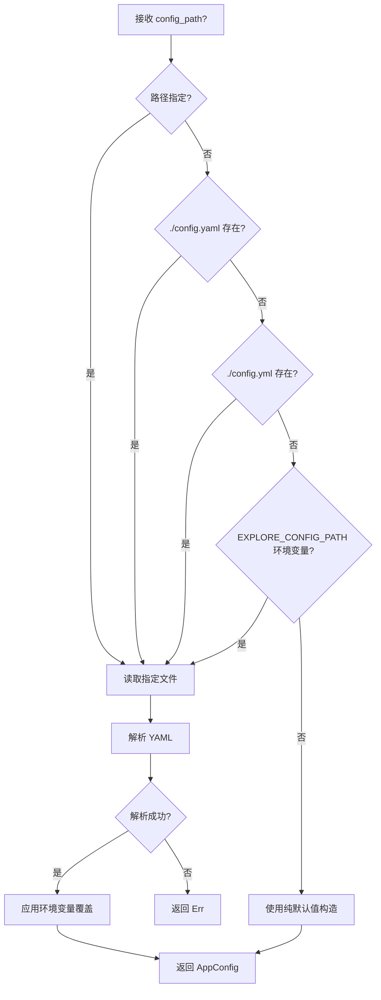

# Explore AI Agent - 配置管理模块详细设计文档 v1.0

| 属性     | 值                                                                 |
| :------- | :----------------------------------------------------------------- |
| 文档版本 | v1.0                                                               |
| 创建日期 | 2026-04-30                                                         |
| 涉及模块 | common/config                                                       |
| 技术栈   | Rust + serde + serde_yaml                                           |
| 关联文档 | 全部 Agent 详细设计文档；[架构设计文档 v1.1](Explore%20AI%20Agent架构设计文档v1.1.md) |

---

## 目录

- [1. 总体设计](#1-总体设计)
  - [1.1 模块定位](#11-模块定位)
  - [1.2 核心原则](#12-核心原则)
  - [1.3 配置来源优先级](#13-配置来源优先级)
- [2. 数据结构](#2-数据结构)
  - [2.1 顶层配置结构](#21-顶层配置结构)
  - [2.2 LLM 配置](#22-llm-配置)
  - [2.3 探索配置](#23-探索配置)
  - [2.4 深度探索配置](#24-深度探索配置)
  - [2.5 对话配置](#25-对话配置)
  - [2.6 工作目录配置](#26-工作目录配置)
  - [2.7 日志配置](#27-日志配置)
  - [2.8 工具配置](#28-工具配置)
  - [2.9 上下文配置](#29-上下文配置)
- [3. 方法详细设计](#3-方法详细设计)
  - [3.1 load — 加载配置](#31-load--加载配置)
  - [3.2 环境变量覆盖](#32-环境变量覆盖)
  - [3.3 默认值策略](#33-默认值策略)
- [4. 配置文件格式](#4-配置文件格式)
- [5. 与各模块的对接](#5-与各模块的对接)
- [6. 测试用例](#6-测试用例)
- [7. 附录](#7-附录)

---

## 1. 总体设计

### 1.1 模块定位

配置管理模块是系统的**基础设施层组件**，负责加载、解析和分发系统运行所需的全部配置参数。它是系统启动的第一个环节——在 Orchestrator 初始化之前完成配置加载，所有模块通过它获取运行参数，不直接接触配置文件或环境变量。

**核心职责**：

1. 从 YAML 配置文件加载所有配置
2. 用环境变量覆盖配置文件中的值（`EXPLORE_` 前缀）
3. 对未配置的项提供合理默认值
4. 以不可变引用的方式分发给各下游模块

### 1.2 核心原则

| 原则 | 说明 |
|:---|:---|
| **单一来源** | 所有模块通过 Config 结构体获取配置，不各自解析 |
| **环境变量优先** | 环境变量覆盖配置文件，敏感信息（api_key）可通过环境变量注入 |
| **默认值覆盖** | 每个配置项都有合理默认值，最小配置文件仅需包含 `llm.api_key` |
| **不可变分发** | 配置加载后不可变，通过 `Arc<Config>` 或 `&Config` 共享 |

### 1.3 配置来源优先级

```
环境变量 > 配置文件 > 默认值
```

| 优先级 | 来源 | 示例 |
|:---|:---|:---|
| 1（最高） | 环境变量 | `EXPLORE_LLM__API_KEY=sk-xxx` |
| 2 | 配置文件 | `config.yaml` 中的 `llm.api_key: sk-xxx` |
| 3（最低） | 默认值 | 代码中定义的常量，如 `token_threshold: 12000` |

---

## 2. 数据结构

### 2.1 顶层配置结构

```rust
#[derive(Debug, Clone, Deserialize)]
pub struct AppConfig {
    /// LLM 服务配置
    #[serde(default)]
    pub llm: LlmConfig,

    /// 探索相关配置
    #[serde(default)]
    pub exploration: ExplorationConfig,

    /// 深度探索配置
    #[serde(default)]
    pub deep_explorer: DeepExplorerConfig,

    /// 对话相关配置
    #[serde(default)]
    pub conversation: ConversationConfig,

    /// 工作目录配置
    #[serde(default)]
    pub workspace: WorkspaceConfig,

    /// 日志配置
    #[serde(default)]
    pub logging: LoggingConfig,

    /// 工具相关配置
    #[serde(default)]
    pub tools: ToolsConfig,

    /// 上下文管理配置
    #[serde(default)]
    pub context: ContextConfig,
}
```

### 2.2 LLM 配置

```rust
#[derive(Debug, Clone, Deserialize)]
pub struct LlmConfig {
    /// API 模式：chat 或 responses
    #[serde(default = "default_api_mode")]
    pub api_mode: String,

    /// LLM 服务地址
    #[serde(default = "default_base_url")]
    pub base_url: String,

    /// API Key
    #[serde(default)]
    pub api_key: String,

    /// 模型名称
    #[serde(default = "default_model")]
    pub model: String,

    /// 最大重试次数
    #[serde(default = "default_max_retries")]
    pub max_retries: usize,
}

fn default_api_mode() -> String { "chat".to_string() }
fn default_base_url() -> String { "https://api.deepseek.com/v1".to_string() }
fn default_model() -> String { "deepseek-chat".to_string() }
fn default_max_retries() -> usize { 3 }
```

| 配置项 | 类型 | 默认值 | 说明 |
|:---|:---|:---|:---|
| `llm.api_mode` | String | `"chat"` | API 模式：`chat` 或 `responses` |
| `llm.base_url` | String | `"https://api.deepseek.com/v1"` | LLM 服务地址 |
| `llm.api_key` | String | `""` | API Key（敏感信息，建议通过环境变量设置） |
| `llm.model` | String | `"deepseek-chat"` | 模型名称 |
| `llm.max_retries` | usize | `3` | LLM 调用最大重试次数 |

### 2.3 探索配置

```rust
#[derive(Debug, Clone, Deserialize)]
pub struct ExplorationConfig {
    /// 探索上下文 token 阈值，超过后触发分层压缩
    #[serde(default = "default_token_threshold")]
    pub token_threshold: usize,

    /// 两层压缩的统一目标比例
    #[serde(default = "default_token_target_ratio")]
    pub token_target_ratio: f64,

    /// LLM 精炼摘要自身的 token 占比
    #[serde(default = "default_refiner_summary_ratio")]
    pub refiner_summary_token_ratio: f64,

    /// 快速探索最大轮次
    #[serde(default = "default_max_rounds")]
    pub max_fast_explore_rounds: usize,

    /// 快速探索提前终止的置信度阈值
    #[serde(default = "default_early_termination_confidence")]
    pub early_termination_confidence: f64,
}

fn default_token_threshold() -> usize { 12000 }
fn default_token_target_ratio() -> f64 { 0.40 }
fn default_refiner_summary_ratio() -> f64 { 0.10 }
fn default_max_rounds() -> usize { 5 }
fn default_early_termination_confidence() -> f64 { 0.9 }
```

### 2.4 深度探索配置

```rust
#[derive(Debug, Clone, Deserialize)]
pub struct DeepExplorerConfig {
    /// 工具调用总上限
    #[serde(default = "default_max_tool_calls")]
    pub max_tool_calls: usize,

    /// 连续重复调用多少次后触发循环警告
    #[serde(default = "default_loop_warning_threshold")]
    pub loop_warning_threshold: usize,
}

fn default_max_tool_calls() -> usize { 75 }
fn default_loop_warning_threshold() -> usize { 3 }
```

### 2.5 对话配置

```rust
#[derive(Debug, Clone, Deserialize)]
pub struct ConversationConfig {
    /// 对话精炼触发的轮次阈值
    #[serde(default = "default_round_threshold")]
    pub round_threshold: usize,

    /// 对话精炼触发的 token 阈值
    #[serde(default = "default_conv_token_threshold")]
    pub token_threshold: usize,
}

fn default_round_threshold() -> usize { 10 }
fn default_conv_token_threshold() -> usize { 2000 }
```

### 2.6 工作目录配置

直接复用 WorkDirInitializer 详细设计中定义的 `WorkspaceConfig`（含 `path` 和可选的 `init_script`）。

### 2.7 日志配置

```rust
#[derive(Debug, Clone, Deserialize)]
pub struct LoggingConfig {
    /// 日志级别：trace, debug, info, warn, error
    #[serde(default = "default_log_level")]
    pub level: String,
}

fn default_log_level() -> String { "info".to_string() }

### 2.8 工具配置

```rust
#[derive(Debug, Clone, Deserialize)]
pub struct ToolsConfig {
    /// Shell 命令执行超时（秒）
    #[serde(default = "default_shell_timeout")]
    pub shell_timeout_secs: u32,

    /// Shell 命令输出最大字节数
    #[serde(default = "default_shell_max_output")]
    pub shell_max_output_bytes: usize,
}

fn default_shell_timeout() -> u32 { 30 }
fn default_shell_max_output() -> usize { 10240 }
```

| 配置项 | 类型 | 默认值 | 说明 |
|:---|:---|:---|:---|
| `tools.shell_timeout_secs` | u32 | `30` | Shell 命令执行超时，超时后子进程被强制终止 |
| `tools.shell_max_output_bytes` | usize | `10240` | Shell 命令输出截断上限（10KB） |

### 2.9 上下文配置

```rust
#[derive(Debug, Clone, Deserialize)]
pub struct ContextConfig {
    /// 单条探索记录最大字符数（序列化后超过此值则截断）
    #[serde(default = "default_record_max_chars")]
    pub record_max_chars: usize,

    /// 代码层压缩后最少保留的非保护记录数
    #[serde(default = "default_min_remaining")]
    pub min_remaining_records: usize,
}

fn default_record_max_chars() -> usize { 8000 }
fn default_min_remaining() -> usize { 5 }
```

| 配置项 | 类型 | 默认值 | 说明 |
|:---|:---|:---|:---|
| `context.record_max_chars` | usize | `8000` | ECT 单条记录写入前的截断阈值 |
| `context.min_remaining_records` | usize | `5` | `compress_by_confidence` 的最少保留记录数 |
```

---

## 3. 方法详细设计

### 3.1 load — 加载配置

```rust
pub fn load(config_path: Option<&str>) -> Result<AppConfig, String>
```

| 参数 | 说明 |
|:---|:---|
| config_path | 配置文件路径。`None` 时按以下顺序查找：`./config.yaml` → `./config.yml` → 环境变量 `EXPLORE_CONFIG_PATH` |

**加载流程**：



### 3.2 环境变量覆盖

环境变量命名规则：`EXPLORE_<SECTION>__<KEY>`（双下划线分隔层级）。

| 环境变量 | 覆盖的配置项 | 示例 |
|:---|:---|:---|
| `EXPLORE_LLM__API_KEY` | `llm.api_key` | `sk-xxx` |
| `EXPLORE_LLM__BASE_URL` | `llm.base_url` | `https://api.deepseek.com/v1` |
| `EXPLORE_LLM__MODEL` | `llm.model` | `deepseek-chat` |
| `EXPLORE_LLM__API_MODE` | `llm.api_mode` | `chat` |
| `EXPLORE_EXPLORATION__TOKEN_THRESHOLD` | `exploration.token_threshold` | `15000` |
| `EXPLORE_DEEP_EXPLORER__MAX_TOOL_CALLS` | `deep_explorer.max_tool_calls` | `50` |
| `EXPLORE_DEEP_EXPLORER__LOOP_WARNING_THRESHOLD` | `deep_explorer.loop_warning_threshold` | `5` |
| `EXPLORE_TOOLS__SHELL_TIMEOUT_SECS` | `tools.shell_timeout_secs` | `60` |
| `EXPLORE_CONTEXT__RECORD_MAX_CHARS` | `context.record_max_chars` | `16000` |
| `EXPLORE_WORKSPACE__PATH` | `workspace.path` | `./my_project` |

环境变量覆盖在 YAML 解析之后、默认值填充之前执行。若环境变量存在，覆盖 YAML 中的对应值；若 YAML 中未配置该项，使用环境变量值。

### 3.3 默认值策略

| 策略 | 说明 |
|:---|:---|
| **最小配置原则** | 仅 `llm.api_key` 通常需要用户显式配置，其余均有合理默认值 |
| **serde default** | 每个字段通过 `#[serde(default = "...")]` 指定默认值函数 |
| **零配置启动** | 若无配置文件且关键项通过环境变量提供，系统可直接启动 |

---

## 4. 配置文件格式

### 4.1 最小配置

```yaml
# config.yaml — 最小可运行配置
llm:
  api_key: "sk-your-api-key"
```

所有其他项使用默认值：DeepSeek API、12000 token 阈值、75 次工具调用上限等。

### 4.2 完整配置

```yaml
# config.yaml — 完整配置示例
llm:
  api_mode: "chat"
  base_url: "https://api.deepseek.com/v1"
  api_key: "sk-your-api-key"
  model: "deepseek-chat"
  max_retries: 3

exploration:
  token_threshold: 12000
  token_target_ratio: 0.400
  refiner_summary_token_ratio: 0.10
  max_fast_explore_rounds: 5
  early_termination_confidence: 0.9

deep_explorer:
  max_tool_calls: 75
  loop_warning_threshold: 3

conversation:
  round_threshold: 10
  token_threshold: 2000

workspace:
  path: "./workspace"
  init_script:
    enabled: false
    script_path: "./scripts/init_workspace.sh"
    timeout_sec: 120

tools:
  shell_timeout_secs: 30
  shell_max_output_bytes: 10240

context:
  record_max_chars: 8000
  min_remaining_records: 5

logging:
  level: "info"
```

---

## 5. 与各模块的对接

配置加载后，各模块通过以下方式获取配置：

| 模块 | 需要的配置 | 接入方式 |
|:---|:---|:---|
| ApiAdapter | `llm.api_key`, `llm.base_url`, `llm.model`, `llm.api_mode`, `llm.max_retries` | 构造函数注入 `&LlmConfig` |
| ExplorationRefinerAgent | `exploration.token_threshold`, `exploration.token_target_ratio`, `exploration.refiner_summary_token_ratio` | `refine()` 参数由 Orchestrator 根据配置计算后传入 |
| DeepExplorer | `deep_explorer.max_tool_calls` | 构造函数参数 |
| Orchestrator | `exploration.max_fast_explore_rounds`, `exploration.early_termination_confidence` | 构造函数注入 `&ExplorationConfig` |
| ConversationManager | `conversation.round_threshold`, `conversation.token_threshold` | 构造函数注入 `&ConversationConfig` |
| WorkDirInitializer | `workspace` | 构造函数注入 `&WorkspaceConfig` |

**设计中不需要变更的部分**：各 Agent 的方法签名已预留配置传递路径（如 `target_token_limit: usize`、`max_tool_calls: usize`），仅需将硬编码常量替换为配置读取。

---

## 6. 测试用例

### 6.1 配置加载测试

| 用例编号 | 测试场景 | 输入 | 预期结果 |
|:---|:---|:---|:---|
| CF-001 | 加载最小配置 | YAML 仅含 `llm.api_key` | 其余字段均为默认值 |
| CF-002 | 加载完整配置 | 完整 YAML 文件 | 所有字段与 YAML 一致 |
| CF-003 | 无配置文件使用默认值 | 不提供配置文件 | 返回全默认 `AppConfig` |
| CF-004 | 环境变量覆盖 YAML 值 | YAML 含 `llm.model: "gpt-4"`，环境变量 `EXPLORE_LLM__MODEL=deepseek-chat` | `llm.model` = `"deepseek-chat"` |
| CF-005 | 环境变量补充缺失项 | YAML 不含 `llm.api_key`，环境变量设置 | `llm.api_key` = 环境变量值 |
| CF-006 | 配置文件不存在且无环境变量 | 无文件、无环境变量 | 返回全默认 `AppConfig` |
| CF-007 | 非法 YAML 格式 | 语法错误的 YAML | 返回 `Err` |

### 6.2 默认值测试

| 用例编号 | 测试场景 | 预期结果 |
|:---|:---|:---|
| CF-008 | 默认 token 阈值 | `exploration.token_threshold` = 12000 |
| CF-009 | 默认 token 目标比例 | `exploration.token_target_ratio` = 0.40 |
| CF-010 | 默认 LLM base_url | `llm.base_url` = `"https://api.deepseek.com/v1"` |
| CF-011 | 默认 API mode | `llm.api_mode` = `"chat"` |
| CF-012 | 默认 max_tool_calls | `deep_explorer.max_tool_calls` = 75 |
| CF-013 | 旧 SSA 配置项被忽略 | YAML 含 `max_fast_explore_rounds: 5`、`early_termination_confidence: 0.9`、`enable_fast_explore: false` | 配置加载成功（不报错），返回的 `AppConfig` 不含这些字段 |
| CF-014 | 精简后的 exploration 配置加载 | YAML 仅含 `exploration.token_threshold` 和 `exploration.token_target_ratio` | 加载成功，两个字段值正确 |
| CF-015 | exploration 段不存在 | YAML 不含 `exploration` 段 | 使用默认值，不 panic |

---

## 7. 附录

### 7.1 常量迁移表

以下硬编码常量将从各模块源码中移除，改为从 `AppConfig` 读取：

| 原位置 | 原常量/值 | 新配置路径 |
|:---|:---|:---|
| `orchestrator.rs` | `MAX_FAST_EXPLORE_ROUNDS = 5` | `exploration.max_fast_explore_rounds` |
| `orchestrator.rs` | `EARLY_TERMINATION_CONFIDENCE = 0.9` | `exploration.early_termination_confidence` |
| `deep_explorer.rs` | `MAX_TOOL_CALLS = 75` | `deep_explorer.max_tool_calls` |
| ExplorationRefinerAgent 设计 | `EXPLORATION_TOKEN_THRESHOLD = 12000` | `exploration.token_threshold` |
| ExplorationRefinerAgent 设计 | `EXPLORATION_TOKEN_TARGET_RATIO = 0.40` | `exploration.token_target_ratio` |
| ExplorationRefinerAgent 设计 | `REFINER_SUMMARY_TOKEN_RATIO = 0.10` | `exploration.refiner_summary_token_ratio` |
| ConversationManager | 轮次阈值 10、token 阈值 2000 | `conversation.round_threshold` / `conversation.token_threshold` |
| `api_adapter.rs` | `MAX_RETRIES = 3` | `llm.max_retries` |
| `api_adapter.rs` | 硬编码 `ApiMode` | `llm.api_mode` |
| `api_adapter.rs` | 无 api_key/base_url/model | `llm.*` |
| `deep_explorer.rs` | `consecutive_duplicates >= 3` | `deep_explorer.loop_warning_threshold` |
| `execute_shell.rs` | `SHELL_TIMEOUT_SECS = 30` | `tools.shell_timeout_secs` |
| `truncation.rs` | `MAX_SHELL_OUTPUT_BYTES = 10240` | `tools.shell_max_output_bytes` |
| `exploration.rs` | `RECORD_MAX_CHARS = 8000` | `context.record_max_chars` |
| `exploration.rs` | `MIN_REMAINING_RECORDS = 5` | `context.min_remaining_records` |
| WorkDirInitializer | 路径硬编码 | `workspace.*` |

### 7.2 不变式与约束

| 约束 | 说明 |
|:---|:---|
| **只读分发** | 配置加载后不可变，通过 `&Config` 或 `Arc<Config>` 共享 |
| **无全局状态** | 不使用 `lazy_static!` 或全局变量，配置通过参数传递 |
| **启动时加载** | 系统启动时一次性加载，运行期间不重载 |
| **最小配置** | 仅 `llm.api_key` 需要用户显式提供 |

---

## 修订记录

| 版本 | 日期 | 修订人 | 变更说明 |
|:---|:---|:---|:---|
| v1.0 | 2026-04-30 | sdfang1053 | 初版：分层配置加载、环境变量覆盖、字段级默认值 |